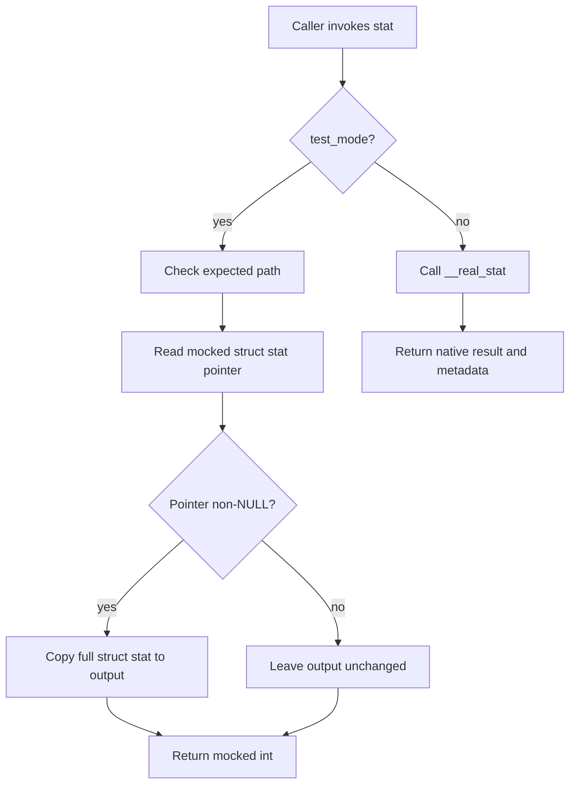
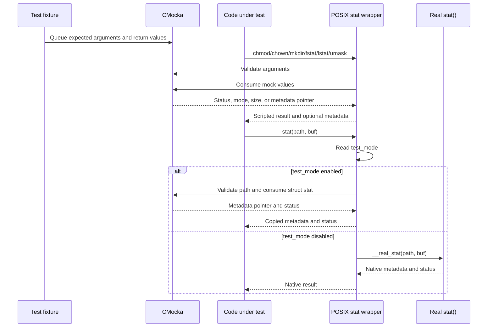
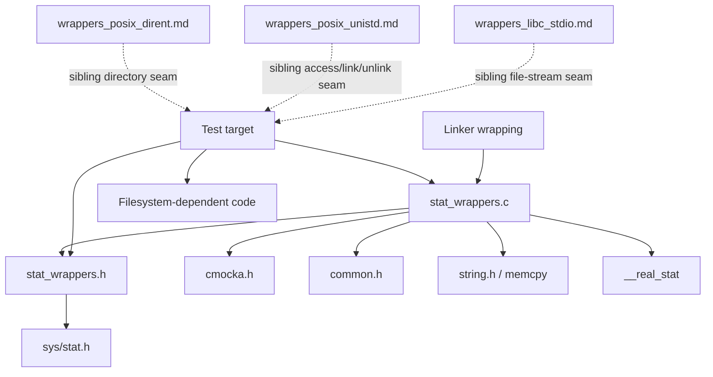
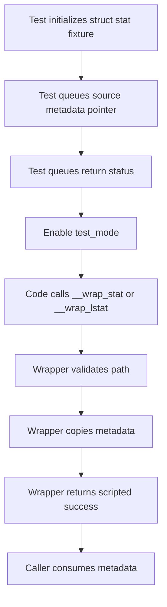
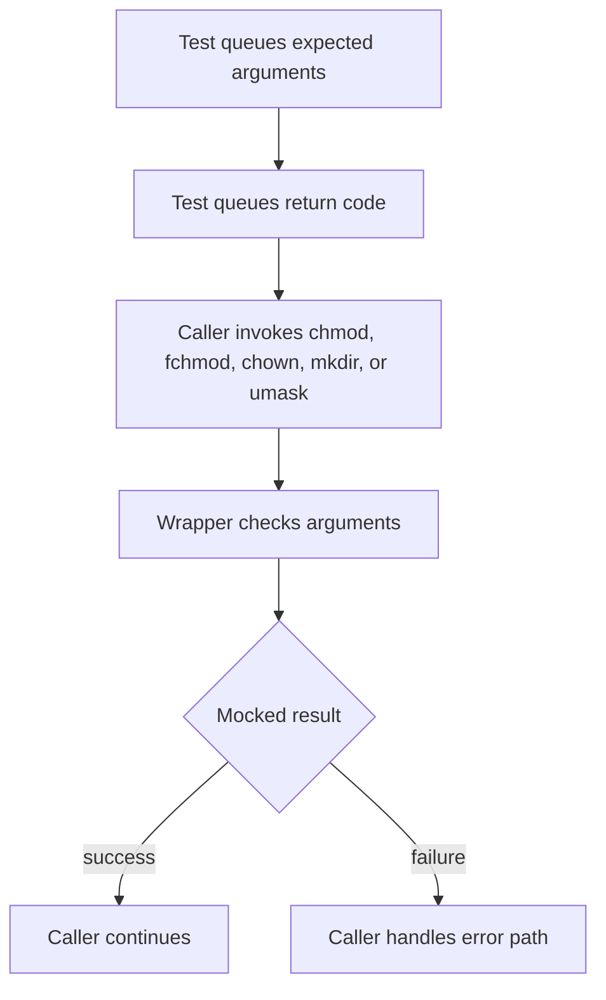
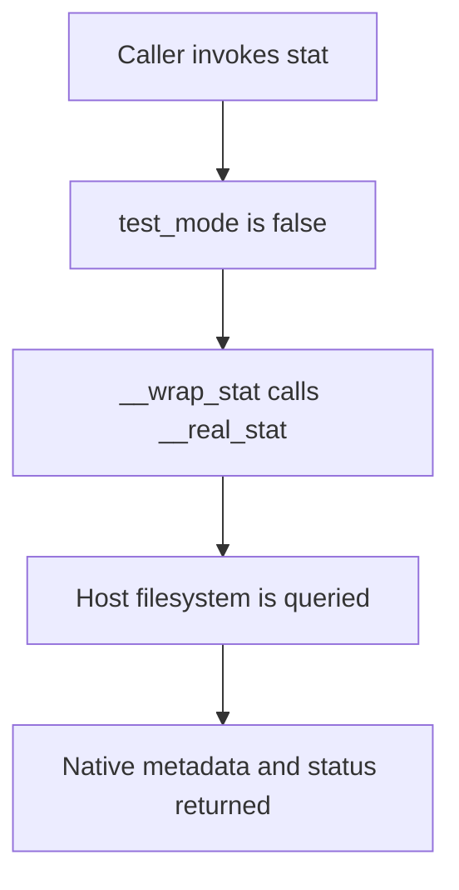

# `wrappers_posix_stat`

## Introduction

`wrappers_posix_stat` is Wazuh unit-test infrastructure for replacing POSIX filesystem metadata and permission operations with deterministic CMocka-controlled functions. It lets tests drive success, failure, and filesystem-state branches without changing files on the host system.

The module is test-only: it has no production filesystem policy, persistent state, or standalone executable. It is linked into unit-test targets that need to control `stat`, `lstat`, `fstat`, directory creation, ownership, permissions, or the process file-mode mask. It complements the broader wrapper layer described in [wrappers_common.md](wrappers_common.md) and can be combined with [wrappers_posix_dirent.md](wrappers_posix_dirent.md) and [wrappers_posix_unistd.md](wrappers_posix_unistd.md) for larger filesystem scenarios.

## Scope and responsibilities

| Component | Location | Responsibility |
|---|---|---|
| Wrapper implementation | `src/unit_tests/wrappers/posix/stat_wrappers.c` | Provides CMocka-backed replacements for POSIX `stat`-family, permission, ownership, and directory-creation calls. |
| Wrapper interface | `src/unit_tests/wrappers/posix/stat_wrappers.h` | Includes `<sys/stat.h>` and exposes the wrapper and `expect_mkdir` declarations. |
| Native metadata types | `<sys/stat.h>` | Supplies `struct stat`, `mode_t`, and platform-related declarations. |
| Mock controller | `<cmocka.h>` | Supplies argument assertions and scripted return values through `check_expected*`, `mock`, and `mock_type`. |
| Shared test mode | `../common.h` | Supplies `test_mode`, which determines whether `__wrap_stat` mocks the call or delegates to the real `stat`. |

The module covers these operations:

- Permissions: `__wrap_chmod`, `__wrap_fchmod`, and `__wrap_umask`.
- Ownership: `__wrap_chown`.
- Metadata by path or descriptor: `__wrap_stat`, `__wrap_lstat`, and `__wrap_fstat`.
- Directory creation: platform-specific `__wrap_mkdir` plus the `expect_mkdir` helper.

## Architecture

```mermaid
flowchart LR
    Test[Test case / fixture] -->|configure expectations and returns| CMocka[CMocka mock state]
    Test --> SUT[Code under test]
    SUT -->|wrapped POSIX symbols| W[stat_wrappers.c]
    W -->|check_expected / mock| CMocka
    W --> Types[struct stat, mode_t, POSIX signatures]
    W -->|when test_mode is false| Real[real stat()]
    H[stat_wrappers.h] --> Types
    Build[Test linker / symbol wrapping] -->|redirects calls| W
```

Most wrappers are pure injection points: they validate selected arguments and return values supplied by CMocka. `__wrap_stat` is the exception. It has a shared `test_mode` switch: in test mode it copies a mocked `struct stat` and returns a mocked status; otherwise it calls `__real_stat`.

The wrapper does not allocate resources, maintain a metadata cache, set `errno`, or emulate a filesystem. Any state that the system under test observes must be supplied by the test fixture or by the real call path.

## Public interface

The header exposes the following test symbols:

```c
int __wrap_chmod(const char *path);
int __wrap_fchmod(int fd, mode_t mode);
int __wrap_chown(const char *file, int owner, int group);
int __wrap_lstat(const char *filename, struct stat *buf);
int __wrap_fstat(int fd, struct stat *buf);
int __wrap_mkdir(/* platform-specific arguments */);
void expect_mkdir(/* platform-specific arguments */);
int __wrap_stat(const char *file, struct stat *buf);
mode_t __wrap_umask(mode_t mode);
```

The build system supplies the symbol redirection, typically through linker wrapping. The header does not redefine the native functions with preprocessor macros.

### Platform-specific `mkdir` contract

`mkdir` is declared differently to follow the target platform’s ABI:

| Platform | Wrapper signature | Helper signature |
|---|---|---|
| `WIN32` | `__wrap_mkdir(const char *path)` | `expect_mkdir(path, ret)` |
| `__MACH__` | `__wrap_mkdir(const char *path, mode_t mode)` | `expect_mkdir(path, mode, ret)` |
| Other POSIX targets | `__wrap_mkdir(const char *path, __mode_t mode)` | `expect_mkdir(path, mode, ret)` |

The implementation checks the path and, where applicable, the mode before returning the scripted result.

## Component behavior

### `__wrap_chmod`

`__wrap_chmod` checks the expected path and returns `mock()`.

```c
int __wrap_chmod(const char *path) {
    check_expected_ptr(path);
    return mock();
}
```

The current wrapper interface accepts only the path. It does not inspect a mode argument, so callers and test targets must use the existing wrapper contract. It does not call native `chmod`, modify permissions, or set `errno`.

### `__wrap_fchmod`

The wrapper validates both the file descriptor and mode with `check_expected`, then returns the next CMocka value. It does not touch the descriptor or apply permissions.

### `__wrap_chown`

The wrapper validates the file path, owner, and group independently, then returns `mock()`. Ownership is never changed on the host.

### `__wrap_lstat`

The wrapper checks the filename and consumes a typed `struct stat *` mock value. When that pointer is non-NULL, it copies the complete structure into the caller-provided buffer with `memcpy`; it then returns a separately scripted integer result.

This two-part contract allows a test to model both successful metadata retrieval and a return status that causes the caller to take an error path. The destination buffer must be valid because the wrapper writes to it whenever the mocked source pointer is non-NULL.

### `__wrap_fstat`

The wrapper checks the descriptor, assigns two fields from CMocka values, and returns a third mocked value:

1. `st_mode = mock()`
2. `st_size = mock()`
3. `return mock()`

Only `st_mode` and `st_size` are populated by this wrapper. Other `struct stat` fields retain their prior contents, so tests that inspect them must initialize the destination structure themselves.

### `__wrap_mkdir` and `expect_mkdir`

`__wrap_mkdir` checks the path and, on non-Windows builds, the requested mode before returning `mock()`.

`expect_mkdir` packages the standard expectation setup:

```c
expect_string(__wrap_mkdir, __path, __path);
expect_value(__wrap_mkdir, __mode, __mode); /* non-Windows */
will_return(__wrap_mkdir, ret);
```

On Windows there is no mode parameter and the helper configures only the path and return value. The helper does not create a directory; it only prepares CMocka expectations.

### `__wrap_stat`

`__wrap_stat` has two execution modes:



In test mode, the path is checked, a `struct stat *` is consumed with `mock_type`, the structure is copied if present, and an integer is consumed with `mock_type(int)`. In normal/shared test mode, the wrapper delegates to `__real_stat`, preserving real filesystem behavior. This fallback makes the wrapper usable in tests that mix controlled calls with ordinary metadata checks.

### `__wrap_umask`

The wrapper checks the requested mode and returns a mocked `mode_t`. It does not alter the process umask. As with native `umask`, the returned value represents the previous mask from the caller’s perspective, but the test must explicitly provide that value.

## Data flow and component interaction



The important state is the CMocka queue plus the caller-owned `struct stat` buffer. The wrapper itself keeps no state between calls. A `mock()` or `mock_type()` call consumes one queued value, so the order of `will_return` setup is significant.

## Dependency relationships



Direct dependencies are deliberately limited to CMocka, the shared `test_mode` declaration, standard POSIX metadata types, and `memcpy`. There is no dependency on Wazuh DB, agents, sockets, or daemon lifecycle code. Production modules that use these filesystem calls are the consumers; this module only supplies their test-time boundary.

## Process flows

### Metadata success path



### Permission or ownership operation



### Real `stat` fallback



## Test design guidance

- Queue CMocka values in the exact order consumed by the wrapper. For `fstat`, that order is mode, size, then return code.
- For `lstat` and test-mode `stat`, queue a `struct stat *` source followed by the integer status. A NULL source leaves the destination unchanged.
- Initialize caller-owned output buffers when the test may inspect fields that the wrapper does not populate.
- Set `test_mode` deliberately. Use test mode for deterministic metadata and disable it when the test is intentionally validating behavior against a real temporary path.
- Configure `errno` separately when exercising error handling that depends on it; these wrappers return statuses but do not set `errno`.
- Use `expect_mkdir` for portable directory-creation expectations, allowing the helper to apply the correct mode signature for the target platform.
- Do not expect `chmod`, `chown`, `mkdir`, or `umask` to change host state. Their return values are the only observable effect.
- Keep fake `struct stat` objects alive until the wrapped call completes; the wrapper copies from the pointer synchronously and does not retain it.
- Pair this module with [wrappers_posix_dirent.md](wrappers_posix_dirent.md) when the code both creates/stat()s directories and enumerates them.

## Maintainer notes

The platform branches around `mkdir` are intentional because the native signature differs across Windows, macOS, and other POSIX systems. Any change to those declarations must be made in both the header and implementation and checked against linker wrapping on every supported platform.

The `__wrap_stat` fallback requires a matching `__real_stat` symbol from the test link. Targets that do not provide linker wrapping or the real symbol should use test mode consistently or adjust their build configuration.

The current `__wrap_chmod` declaration accepts only a path, unlike the usual POSIX `chmod(path, mode)` signature. This is part of the existing test seam and should not be “corrected” in isolation: update all consumers, build wrapping, and expectations together if signature alignment is required.

The wrappers intentionally model only the values needed by current tests. Filesystem emulation, richer metadata generation, or cross-call state should be added as a separate abstraction rather than silently expanding these globally shared mocks.

## References

- [Common wrapper support](wrappers_common.md)
- [POSIX directory wrappers](wrappers_posix_dirent.md)
- [POSIX group wrappers](wrappers_posix_grp.md)
- [POSIX pthread wrappers](wrappers_posix_pthread.md)
- [POSIX password wrappers](wrappers_posix_pwd.md)
- [POSIX select wrappers](wrappers_posix_select.md)
- [POSIX signal wrappers](wrappers_posix_signal.md)
- [POSIX time wrappers](wrappers_posix_time.md)
- [POSIX unistd wrappers](wrappers_posix_unistd.md)
- [libc stdio wrappers](wrappers_libc_stdio.md)
