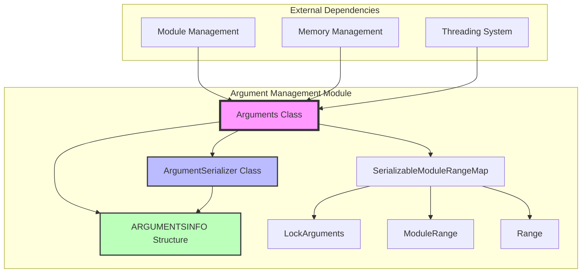
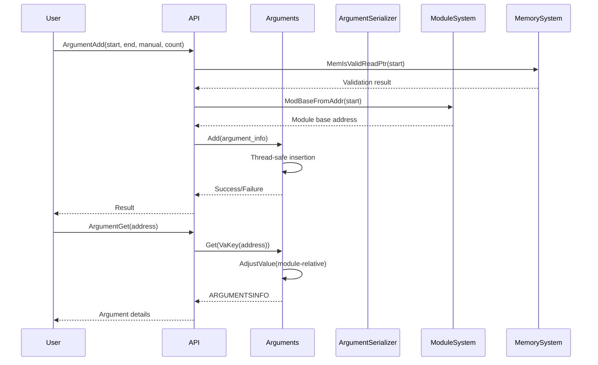
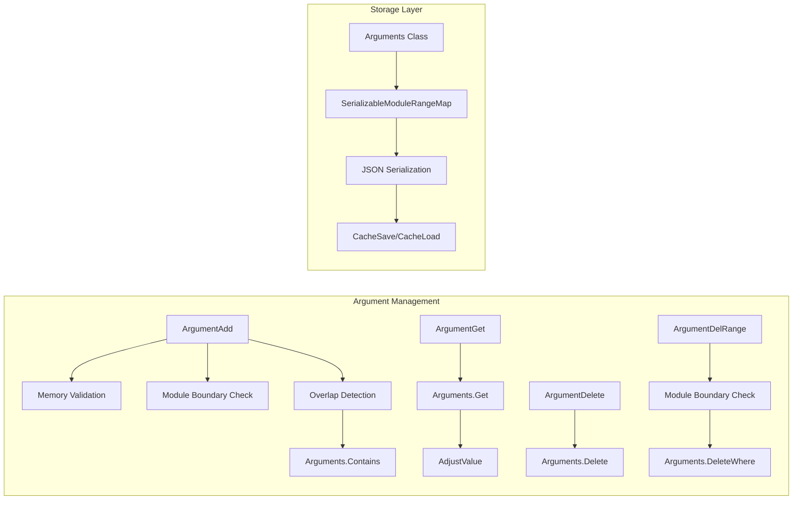
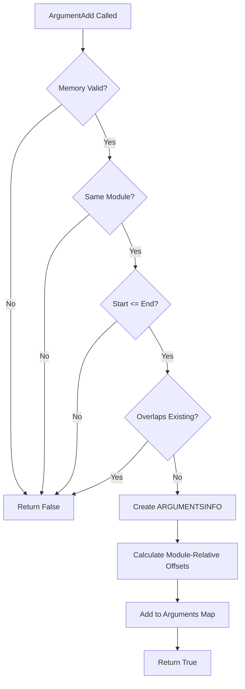
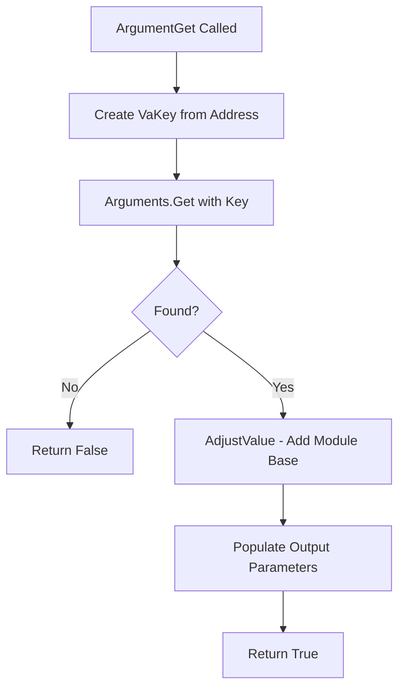

# Argument Management Module

## Introduction

The Argument Management module is a core component of the x64dbg debugging framework that provides functionality for tracking and managing function arguments within the debugging session. This module enables debuggers to identify, store, and retrieve argument boundaries for functions, supporting both automatic detection and manual annotation of argument regions in memory.

## Architecture Overview

The Argument Management module implements a sophisticated system for managing function argument information with the following key architectural components:



## Core Components

### Arguments Class

The `Arguments` class is the primary interface for argument management, inheriting from `SerializableModuleRangeMap<LockArguments, ARGUMENTSINFO, ArgumentSerializer>`. This class provides thread-safe operations for adding, retrieving, deleting, and enumerating argument information.

**Key Features:**
- Thread-safe argument management using `LockArguments`
- Module-relative addressing for position-independent storage
- Range-based argument storage and retrieval
- Serialization support for persistence

### ArgumentSerializer Class

The `ArgumentSerializer` class handles the conversion between `ARGUMENTSINFO` structures and JSON format for persistence. It implements the `JSONWrapper<ARGUMENTSINFO>` interface to provide save and load functionality.

**Serialization Format:**
```json
{
    "module": "module_name",
    "start": "0x12345678",
    "end": "0x12345690",
    "icount": "0x5",
    "manual": true
}
```

### ARGUMENTSINFO Structure

The core data structure that stores argument information:
- `modhash`: Hash of the module name for efficient lookup
- `start`: Start address (module-relative)
- `end`: End address (module-relative)
- `manual`: Flag indicating if manually defined
- `instructioncount`: Number of instructions in the argument range

## Data Flow Architecture



## Component Interactions



## API Functions

### Argument Management Functions

| Function | Purpose | Parameters | Return Value |
|----------|---------|------------|--------------|
| `ArgumentAdd` | Add new argument range | Start, End, Manual, InstrCount | bool (success) |
| `ArgumentGet` | Retrieve argument info for address | Address, [Start, End, InstrCount] | bool (found) |
| `ArgumentOverlaps` | Check if range overlaps existing arguments | Start, End | bool (overlaps) |
| `ArgumentDelete` | Delete argument at address | Address | bool (success) |
| `ArgumentDelRange` | Delete arguments in range | Start, End, DeleteManual | void |
| `ArgumentClear` | Clear all arguments | None | void |

### Serialization Functions

| Function | Purpose | Parameters |
|----------|---------|------------|
| `ArgumentCacheSave` | Save arguments to JSON cache | JSON Root |
| `ArgumentCacheLoad` | Load arguments from JSON cache | JSON Root |

### Enumeration Functions

| Function | Purpose | Parameters | Return Value |
|----------|---------|------------|--------------|
| `ArgumentGetList` | Get all arguments as vector | vector<ARGUMENTSINFO>& | void |
| `ArgumentGetInfo` | Get specific argument info | Address, ARGUMENTSINFO& | bool (found) |
| `ArgumentEnum` | Enumerate arguments | ARGUMENTSINFO*, size_t* | bool (success) |

## Process Flow

### Adding Arguments



### Retrieving Arguments



## Dependencies

The Argument Management module has several key dependencies on other system modules:

### [Module Management](Module Management.md)
- **Purpose**: Provides module base address resolution and module hash calculations
- **Functions Used**: `ModBaseFromAddr()`, `ModBaseFromName()`, `ModHashFromName()`, `ModHashFromAddr()`
- **Dependency Type**: Critical - Argument ranges are module-relative

### [Memory Management](Memory Management.md)
- **Purpose**: Validates memory accessibility for argument ranges
- **Functions Used**: `MemIsValidReadPtr()`
- **Dependency Type**: Validation - Ensures argument memory is readable

### Threading System
- **Purpose**: Provides thread-safe operations through `LockArguments`
- **Dependency Type**: Infrastructure - Ensures concurrent access safety

## Integration with Debugger Workflow

The Argument Management module integrates with the overall debugging workflow in several ways:

1. **Function Analysis**: When analyzing functions, the debugger can automatically detect argument boundaries and store them using `ArgumentAdd`

2. **Manual Annotation**: Users can manually define argument regions for functions that aren't automatically analyzed

3. **Cross-Reference Integration**: Argument information can be used by the [Reference Management](Reference Management.md) system to provide enhanced cross-reference information

4. **Symbol Resolution**: Works in conjunction with [Symbol Resolution](Symbol Resolution.md) to provide context-aware argument information

## Storage and Persistence

Arguments are stored using a module-relative addressing scheme, which provides several benefits:

- **Position Independence**: Arguments remain valid even if modules are relocated
- **Efficient Lookup**: Range-based storage enables fast overlap detection
- **Serialization Support**: Complete save/load functionality for debugging session persistence

The storage system uses `ModuleRange` as keys, combining module hash and address range for efficient retrieval and overlap detection.

## Error Handling

The module implements comprehensive error handling for various scenarios:

- **Invalid Memory**: Returns false if argument memory is not readable
- **Module Boundary Violations**: Ensures start and end addresses are in the same module
- **Range Validation**: Prevents invalid ranges where start > end
- **Overlap Detection**: Prevents duplicate or overlapping argument definitions

## Performance Considerations

- **Thread Safety**: All operations are protected by `LockArguments` for concurrent access
- **Efficient Lookup**: Uses range-based maps for O(log n) lookup performance
- **Memory Efficiency**: Stores module-relative addresses to minimize storage overhead
- **Batch Operations**: Supports range-based deletion for efficient cleanup operations