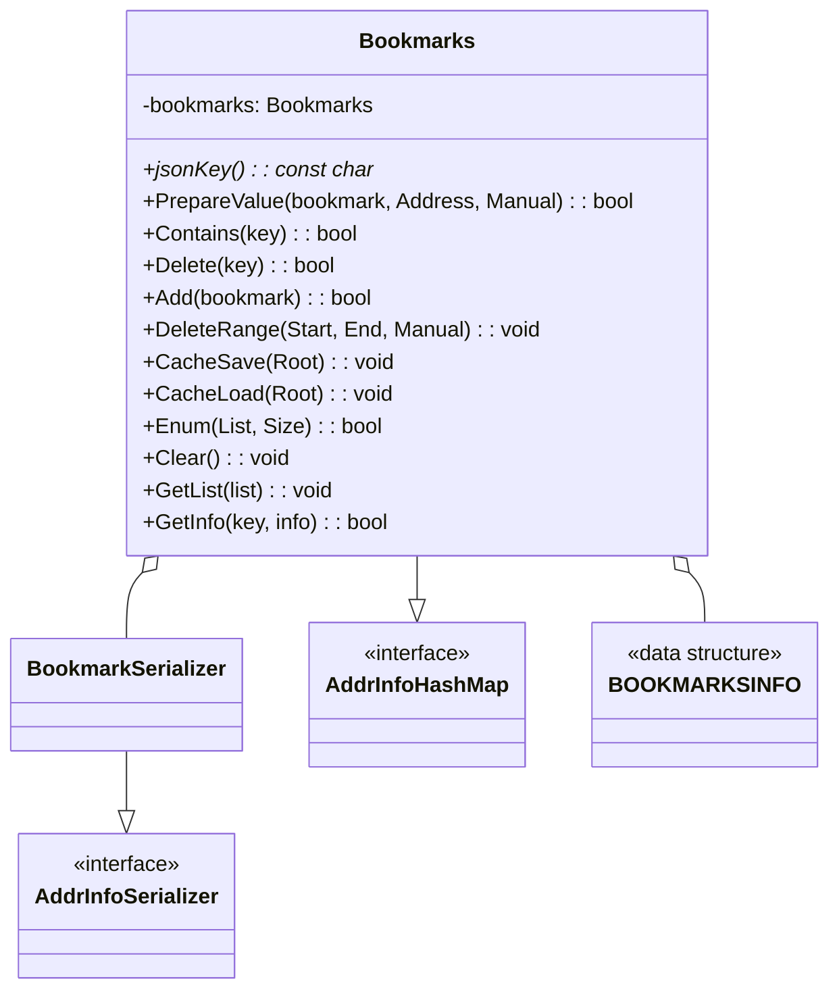
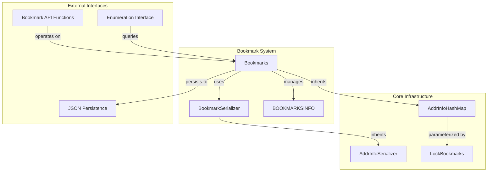
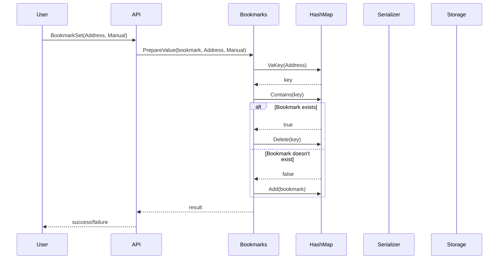
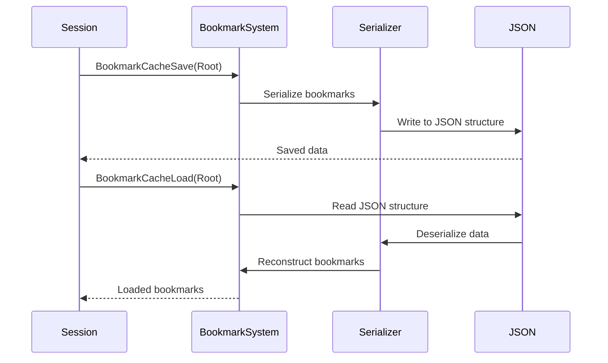

# Bookmark System

The Bookmark System module provides functionality for managing and persisting bookmarks in the debugger. It allows users to mark specific memory addresses for quick navigation and reference during debugging sessions.

## Overview

The Bookmark System is built around a hash map-based storage mechanism that maintains bookmark information for memory addresses. It provides both manual bookmark management and automatic bookmark handling, with full serialization support for persistence across debugging sessions.

## Architecture

### Core Components

### System Integration

## Data Flow

### Bookmark Operations

### Persistence Flow

## Component Details

### Bookmarks Class
The main class that manages bookmark storage and operations. It inherits from `AddrInfoHashMap` with specific template parameters:
- `LockBookmarks`: Thread synchronization primitive
- `BOOKMARKSINFO`: Data structure holding bookmark information
- `BookmarkSerializer`: Serialization handler

Key methods:
- `jsonKey()`: Returns "bookmarks" for JSON identification
- Inherits all hash map operations for add, delete, query, and enumeration

### BookmarkSerializer
A specialized serializer that inherits from `AddrInfoSerializer<BOOKMARKSINFO>`. It provides the serialization logic needed for persisting bookmark data to and from JSON format.

### API Functions
The module exposes a clean C-style API for bookmark management:

- `BookmarkSet()`: Toggle bookmark at specified address
- `BookmarkGet()`: Check if address is bookmarked
- `BookmarkDelete()`: Remove bookmark from address
- `BookmarkDelRange()`: Remove bookmarks within address range
- `BookmarkEnum()`: Enumerate all bookmarks
- `BookmarkClear()`: Remove all bookmarks
- `BookmarkGetInfo()`: Retrieve bookmark information
- `BookmarkCacheSave/Load()`: Persistence operations

## Dependencies

The Bookmark System relies on several infrastructure components:

- **[Address Info System](Address%20Info%20System.md)**: Provides the base `AddrInfoHashMap` and `AddrInfoSerializer` templates
- **[Threading](Threading.md)**: Uses `LockBookmarks` for thread-safe operations
- **[JSON Persistence](JSON%20Persistence.md)**: Integrates with JSON-based configuration and state management
- **[Memory Management](Memory%20Management.md)**: Shares address handling mechanisms

## Usage Patterns

### Manual Bookmarks
Users can manually set bookmarks at specific addresses for important locations in the code or data sections they want to revisit quickly.

### Automatic Bookmarks
The system supports automatic bookmark creation, likely used by other debugger components to mark significant addresses discovered during analysis.

### Range Operations
The system efficiently handles bulk operations on bookmark ranges, useful for clearing bookmarks within function boundaries or memory regions.

## Persistence and State Management

Bookmarks are automatically saved and restored across debugging sessions through the cache mechanism. The system supports legacy bookmark formats for backward compatibility, loading both current and legacy "auto" bookmark categories.

## Thread Safety

All bookmark operations are thread-safe through the `LockBookmarks` synchronization primitive, ensuring consistent state when multiple threads access the bookmark system simultaneously.

## Integration with Debugger Workflow

The Bookmark System integrates seamlessly with the debugger's navigation and analysis features:

- Quick navigation to bookmarked addresses
- Visual indicators in the disassembly and memory views
- Integration with the symbol system for named locations
- Export/import capabilities for sharing bookmark sets

This system serves as a fundamental component for user workflow optimization, allowing efficient marking and revisiting of important locations during complex debugging sessions.