# Breakpoints View Module

## Introduction

The Breakpoints View module is a critical GUI component in the x64dbg debugger that provides a comprehensive interface for managing and monitoring breakpoints during debugging sessions. It serves as the primary visualization and control center for all breakpoint types, enabling developers to efficiently track, modify, and analyze breakpoints throughout their debugging workflow.

This module integrates deeply with the debugger's core breakpoint system, providing real-time updates, rich visual feedback, and advanced breakpoint management capabilities that are essential for effective reverse engineering and debugging tasks.

## Architecture Overview

## Core Components

### BreakpointsView Class
The main widget class that inherits from `StdTable` and implements the complete breakpoint management interface. It handles:

- **Table Display**: Multi-column table showing breakpoint properties
- **Real-time Updates**: Dynamic refresh based on debugger state changes
- **User Interactions**: Mouse clicks, keyboard shortcuts, and context menu actions
- **Visual Styling**: Color-coded display based on breakpoint states and types

### Data Model Integration
The module works with `Breakpoints::Data` objects that contain comprehensive breakpoint information:

## Column Structure and Data Display

The view implements a 7-column structure optimized for breakpoint information:

### Column Details

1. **Type Column**: Displays breakpoint type (normal, hardware, memory, DLL, exception)
2. **Address Column**: Shows memory address with current instruction pointer highlighting
3. **Module/Label Column**: Module name, label information, or exception names
4. **State Column**: Breakpoint status (Enabled, Disabled, One-time, Inactive)
5. **Disassembly Column**: Disassembled instruction at breakpoint address
6. **Hits Column**: Number of times breakpoint was triggered
7. **Summary Column**: Rich text summary of breakpoint conditions and properties

## Breakpoint Type Support

The module supports five distinct breakpoint types, each with specialized handling:

## Context Menu System

The module implements a sophisticated context menu with dynamic action availability:

## Data Flow Architecture

## Rich Text Rendering System

The module implements advanced rich text rendering for disassembly and summary information:

### Disassembly Rendering
- Uses `QZydis` disassembler for instruction decoding
- Applies syntax highlighting based on configuration
- Handles memory read failures gracefully
- Supports architecture-specific instruction sets

### Summary Rendering
The summary column provides comprehensive breakpoint information using color-coded tokens:

## Exception Handling Integration

The module integrates with the debugger's exception system:

```mermaid
graph TD
    EX[Exception System]
    
    EX --> ENUM[EnumExceptions<br/>Build Exception Map]
    EX --> MAP[Exception Map<br/>Code → Name]
    EX --> LIST[Sorted List<br/>For Selection]
    EX --> DIALOG[Exception Dialog<br/>User Selection]
    EX --> BP[Create Exception BP<br/>SetExceptionBPX]
    
    style EX fill:#ffebee
    style MAP fill:#f3e5f5
    style DIALOG fill:#e8f5e8
```

## Sorting and Organization

The module implements intelligent sorting that prioritizes breakpoint types:

1. **Primary Sort**: By breakpoint type (normal, hardware, memory, DLL, exception)
2. **Secondary Sort**: By header rows vs. actual breakpoints
3. **Tertiary Sort**: By column content (address, module, state, etc.)
4. **Direction**: Ascending/descending based on user selection

## Integration Points

### Bridge Communication
The module connects to the Bridge system for real-time updates:

- `updateBreakpoints()`: Refresh breakpoint list
- `disassembleAt()`: Update current instruction pointer
- `tokenizerConfigUpdated()`: Reapply syntax highlighting

### Configuration Management
Integrates with the configuration system for:

- Column widths and visibility
- Color schemes and themes
- Disassembler settings
- Keyboard shortcuts

### Command Execution
Executes debugger commands through the command system:

## Performance Optimizations

The module implements several performance optimizations:

1. **Lazy Exception Map Building**: Exception map is built only when needed
2. **Efficient Sorting**: Uses stable sort with multi-level comparison
3. **Rich Text Caching**: Pre-computes rich text for quick rendering
4. **Selective Updates**: Only refreshes when necessary via Bridge signals
5. **Memory Management**: Pre-allocates vectors for breakpoint data

## Error Handling

The module includes comprehensive error handling:

- **Memory Access Failures**: Graceful handling when disassembly memory is unreadable
- **Invalid Breakpoints**: Validation before executing breakpoint operations
- **Command Failures**: Safe execution of debugger commands
- **Clipboard Operations**: Validation for copy/paste operations

## Dependencies

The Breakpoints View module depends on several other system components:

- **[Breakpoints System](Breakpoints.md)**: Core breakpoint management
- **[Bridge System](Bridge.md)**: Communication layer with debugger
- **[Configuration System](Configuration.md)**: Settings and preferences
- **[Disassembly Engine](Disassembly.md)**: Instruction decoding
- **[Rich Text Painter](RichTextPainter.md)**: Advanced text rendering

## Usage Patterns

### Common Workflows

1. **Breakpoint Management**: View, enable/disable, remove breakpoints
2. **Conditional Breakpoints**: Set complex break conditions with logging
3. **Exception Handling**: Monitor and break on specific exceptions
4. **DLL Analysis**: Break on module load/unload events
5. **Memory Access Tracking**: Monitor read/write/execute operations

### Keyboard Shortcuts

- **Enter/Follow**: Navigate to breakpoint address
- **Delete**: Remove selected breakpoints
- **Space**: Toggle enable/disable state
- **Edit**: Open breakpoint editor dialog

## Extensibility

The module is designed for extensibility:

- **Plugin Integration**: Can be extended via plugin system
- **Custom Actions**: Context menu can be extended with custom actions
- **Color Schemes**: Fully customizable color configuration
- **Column Management**: Configurable column visibility and order

This comprehensive design makes the Breakpoints View module a powerful and flexible tool for breakpoint management in the x64dbg debugger ecosystem.