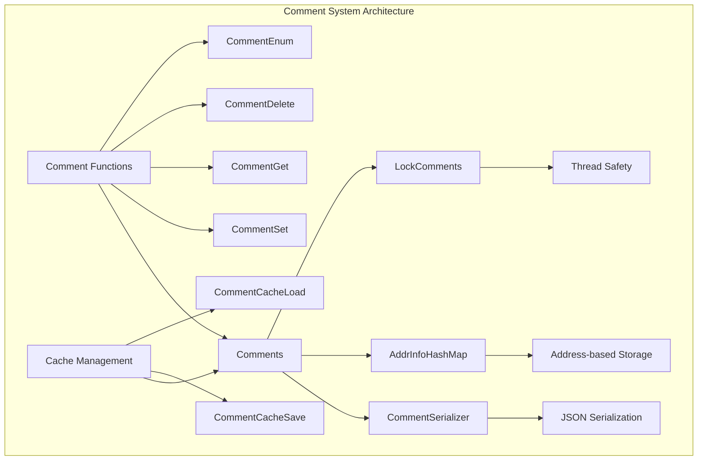
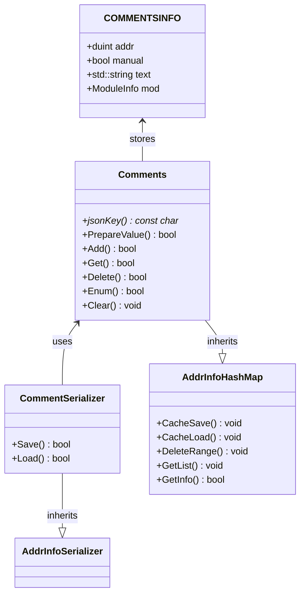
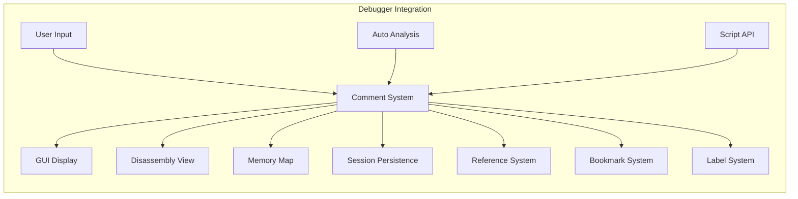

# Comment System Module Documentation

## Introduction

The Comment System module provides functionality for managing user-defined and automatic comments associated with specific memory addresses in the debugger. It serves as a critical annotation system that allows users to document their analysis, mark important locations, and store contextual information about code execution points. Comments are persistent across debugging sessions and can be both manually created by users and automatically generated by the debugger.

## Architecture Overview

The Comment System is built around a hash map-based storage mechanism that associates memory addresses with comment information. The system differentiates between manual user comments and automatic comments, providing flexibility in how annotations are managed and displayed.

## Core Components

### Comments Class
The `Comments` class is the main interface for comment management, inheriting from `AddrInfoHashMap` with thread-safe operations through `LockComments`. It provides a unified API for all comment operations and handles the storage and retrieval of comment data.

**Key Characteristics:**
- Thread-safe operations using `LockComments` mutex
- Address-based hash map storage
- JSON serialization support for persistence
- Support for both manual and automatic comments

### CommentSerializer Class
The `CommentSerializer` handles the conversion between `COMMENTSINFO` structures and JSON format for persistent storage. It extends `AddrInfoSerializer` to provide comment-specific serialization logic.

**Serialization Features:**
- Saves comment text along with address information
- Loads comment data from JSON format
- Maintains compatibility with legacy auto-comment format
- Handles string validation and truncation

## Data Structures

## API Functions

### Comment Management Functions

#### `CommentSet(duint Address, const char* Text, bool Manual)`
Sets or updates a comment at the specified address.
- **Parameters:** Memory address, comment text, manual/automatic flag
- **Validation:** Checks for null text, special delimiters, and size limits
- **Behavior:** Deletes existing comment if empty text is provided
- **Returns:** Boolean success status

#### `CommentGet(duint Address, char* Text)`
Retrieves the comment text for a given address.
- **Parameters:** Memory address, output buffer
- **Formatting:** Prepends `\1` for automatic comments
- **Safety:** Uses safe string copying with truncation
- **Returns:** Boolean success status

#### `CommentDelete(duint Address)`
Removes the comment associated with the specified address.
- **Parameters:** Memory address
- **Returns:** Boolean success status

### Bulk Operations

#### `CommentDelRange(duint Start, duint End, bool Manual)`
Deletes comments within a specified address range.
- **Parameters:** Start address, end address, manual/automatic filter
- **Behavior:** Can target specific comment types

#### `CommentEnum(COMMENTSINFO* List, size_t* Size)`
Enumerates all comments in the system.
- **Parameters:** Output array pointer, size pointer
- **Returns:** Boolean success status
- **Usage:** Provides complete comment listing for UI display

### Persistence Operations

#### `CommentCacheSave(JSON Root)`
Saves all comments to JSON format for session persistence.
- **Parameters:** JSON root object
- **Integration:** Part of overall debugger state saving

#### `CommentCacheLoad(JSON Root)`
Loads comments from JSON format, including legacy support.
- **Parameters:** JSON root object
- **Legacy Support:** Also loads from "auto" key for backward compatibility

## Integration with Other Systems

### Related Module Dependencies

The Comment System interacts with several other debugger modules:

- **[Reference System](Reference System.md)**: Shares address-based storage patterns and serialization mechanisms
- **[Bookmark System](Bookmark System.md)**: Similar address-annotation functionality with different use cases
- **[Label System](Label System.md)**: Complementary address naming system
- **[Module Management](Module Management.md)**: Associates comments with loaded modules for context

## Thread Safety and Performance

The Comment System implements thread safety through `LockComments` mutex protection:

- **Concurrent Access**: All operations are protected against race conditions
- **Performance**: Hash map implementation provides O(1) average case for lookups
- **Memory Management**: Automatic cleanup and range-based deletion support
- **Scalability**: Efficient handling of large numbers of comments

## Usage Patterns

### Typical Use Cases

1. **Manual Analysis**: Users add comments to document reverse engineering findings
2. **Automated Annotation**: Debugger automatically adds comments for identified functions
3. **Collaborative Work**: Comments persist across sessions for team analysis
4. **Script Integration**: Automated comment generation through scripting APIs

### Best Practices

- Use descriptive, concise comment text
- Leverage both manual and automatic comments appropriately
- Regular cleanup of obsolete comments
- Utilize range operations for bulk management

## Error Handling

The Comment System implements comprehensive validation:

- **Input Validation**: Null pointer checks, delimiter validation, size limits
- **Storage Validation**: Address range checking, duplicate handling
- **Serialization Validation**: JSON format validation, legacy compatibility
- **Thread Safety**: Mutex protection for all operations

## Extension Points

The modular design allows for future enhancements:

- **Custom Comment Types**: Extension of `COMMENTSINFO` structure
- **Advanced Filtering**: Enhanced enumeration with filtering capabilities
- **Rich Text Support**: Extended formatting options
- **Collaboration Features**: Multi-user comment management
- **Integration APIs**: Enhanced scripting and plugin support