# Common Actions Module

## Introduction

The Common Actions module serves as the central command dispatch and user interaction hub within the x64dbg debugger interface. It provides a unified framework for creating, managing, and executing context-sensitive actions across various debugger views including disassembly, dump, stack, and memory map views. This module implements the core action system that enables users to perform essential debugging operations through context menus, keyboard shortcuts, and toolbar actions.

## Architecture Overview

The Common Actions module follows a sophisticated action-based architecture that separates action definition from execution logic, enabling dynamic menu generation and context-sensitive behavior.

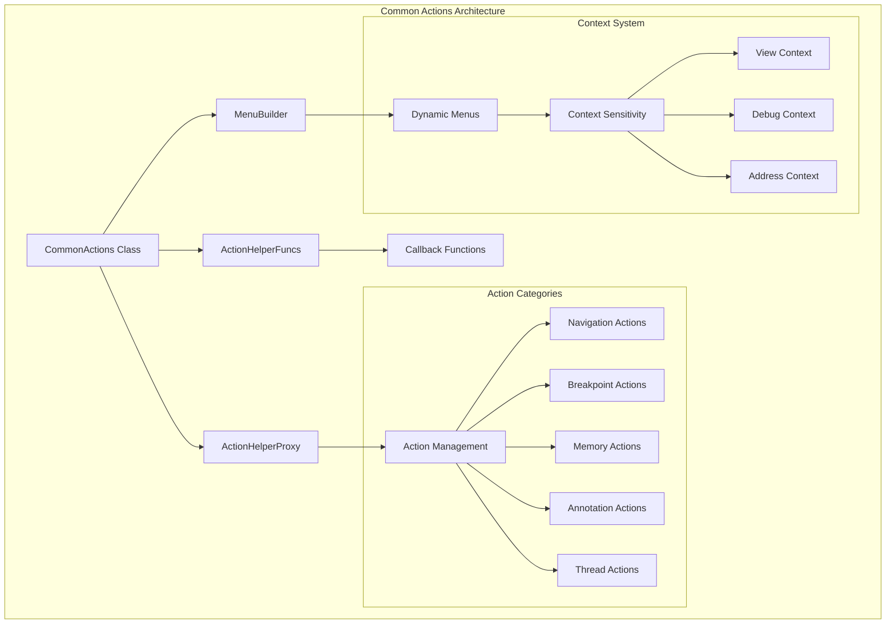

## Core Components

### ActionHolder Structure

The `ActionHolder` structure serves as a container for breakpoint-related actions, providing organized access to hardware and software breakpoint operations.

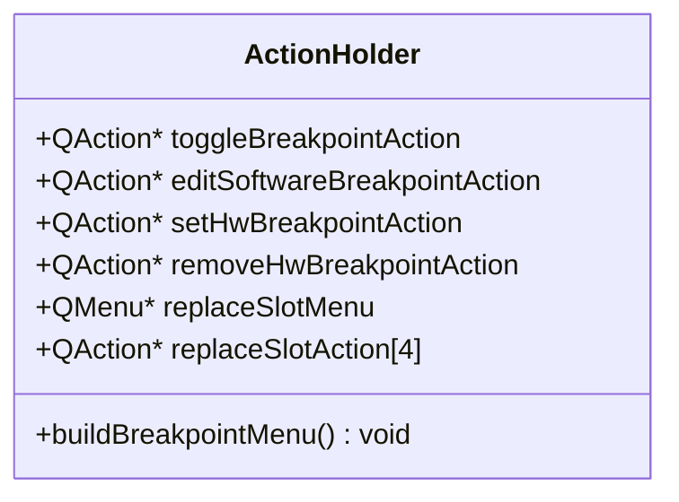

### CommonActions Class

The main class that orchestrates all common debugging actions through a unified interface.

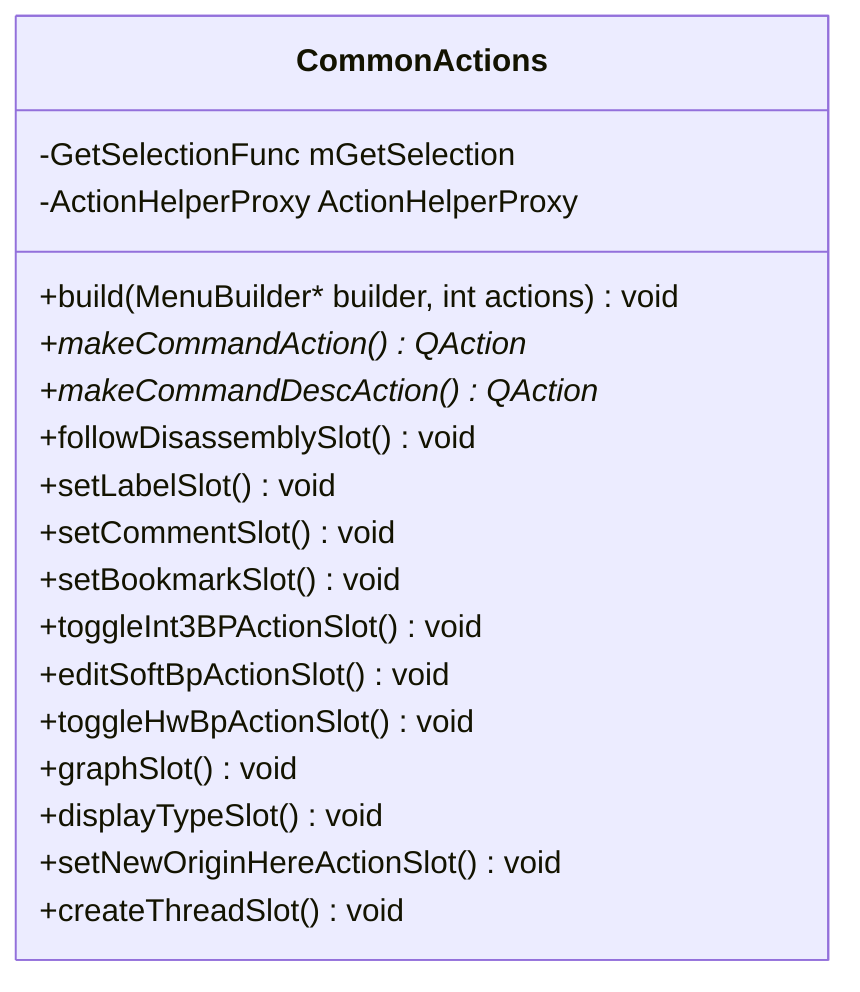

## Action Categories

### Navigation Actions

Navigation actions provide seamless movement between different debugger views and memory locations.

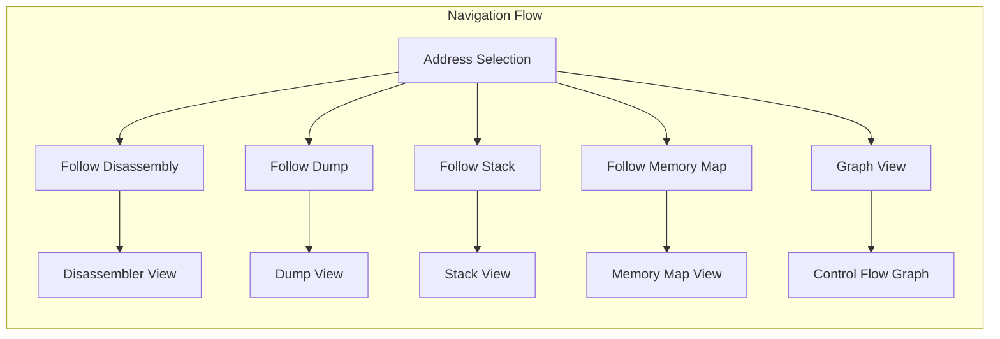

**Key Navigation Actions:**
- **ActionDisasm**: Follow address in disassembler view
- **ActionDump**: Follow address in dump view
- **ActionStackDump**: Follow address in stack view
- **ActionMemoryMap**: Follow address in memory map view
- **ActionGraph**: Display control flow graph

### Breakpoint Management

The breakpoint system provides comprehensive hardware and software breakpoint management with intelligent slot allocation.

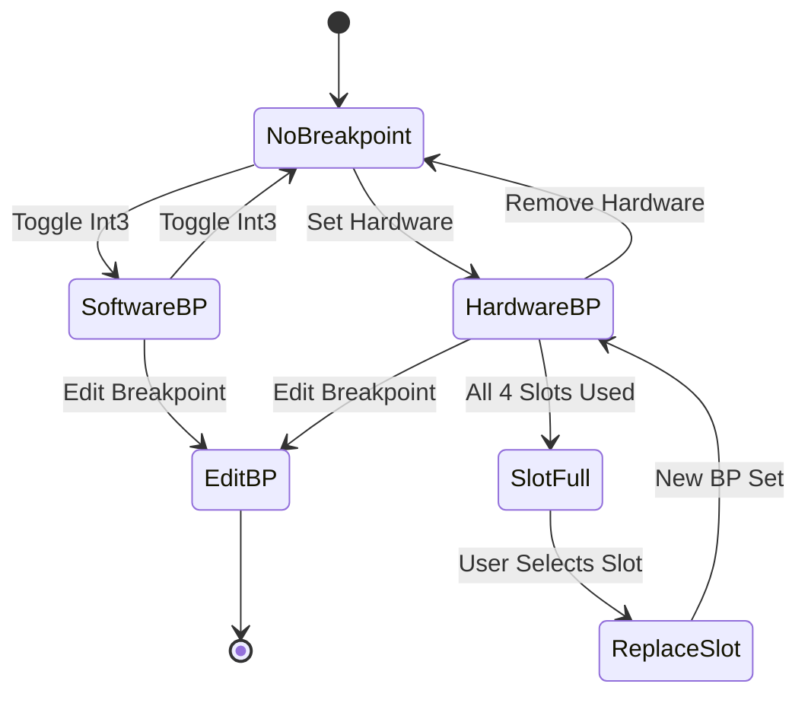

**Breakpoint Actions:**
- **ActionBreakpoint**: Toggle software breakpoints
- **Hardware Breakpoint Management**: Set/remove hardware breakpoints with slot replacement
- **Conditional Breakpoints**: Edit breakpoint conditions and properties

### Annotation System

The annotation system enables users to add contextual information to memory addresses.

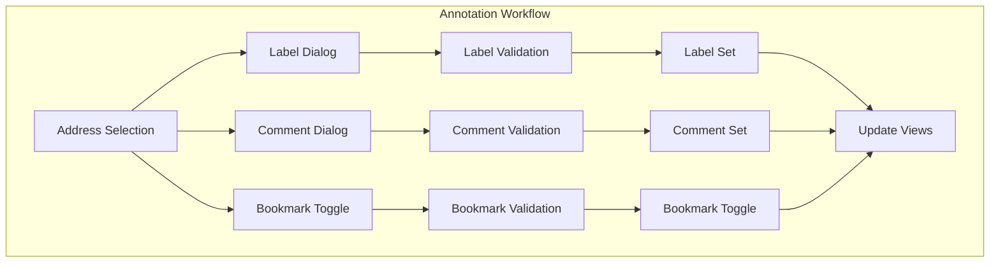

**Annotation Actions:**
- **ActionLabel**: Set/clear labels at addresses
- **ActionComment**: Add/edit comments
- **ActionBookmark**: Toggle bookmarks for quick navigation

### Memory and Type Operations

Advanced memory operations and type visualization capabilities.

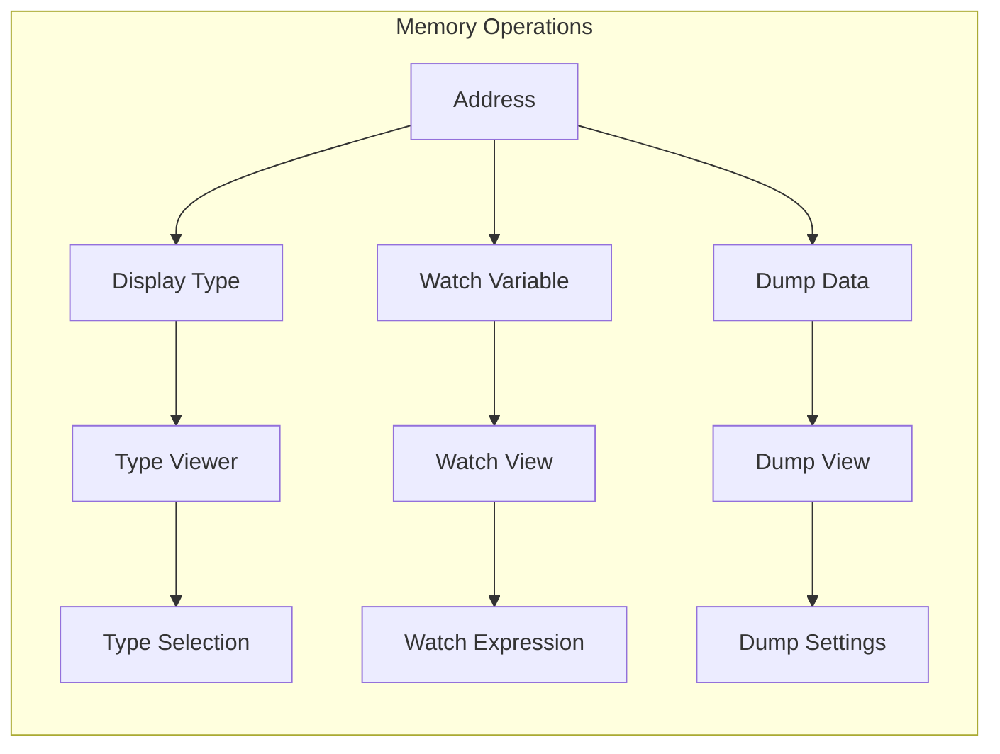

**Memory Actions:**
- **ActionDisplayType**: Display structured types at addresses
- **ActionWatch**: Add variables to watch view
- **ActionDumpData**: Follow pointer data in dump views

### Thread Control

Thread management operations for advanced debugging scenarios.

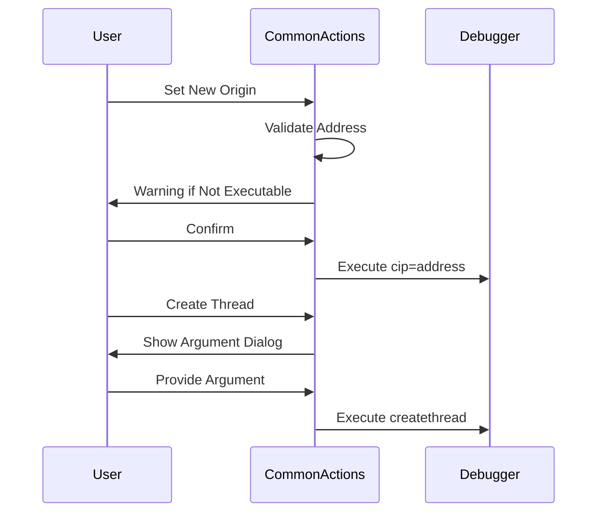

**Thread Actions:**
- **ActionNewOrigin**: Set instruction pointer to new location
- **ActionNewThread**: Create new thread at specified address

## Context Sensitivity System

The module implements sophisticated context sensitivity to ensure actions are only available when appropriate.

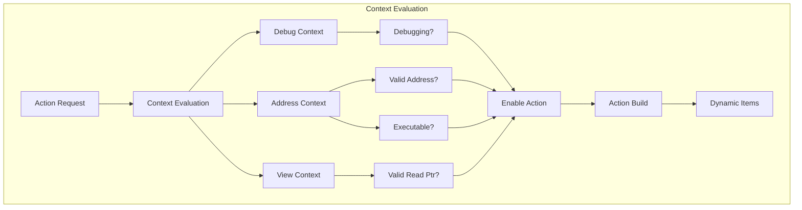

### Context Conditions

- **isDebugging**: Validates active debugging session
- **isValidReadPtr**: Checks memory readability
- **WarningBoxNotExecutable**: Warns about non-executable addresses

## Integration with Other Modules

The Common Actions module serves as a central hub that integrates with multiple debugger subsystems.

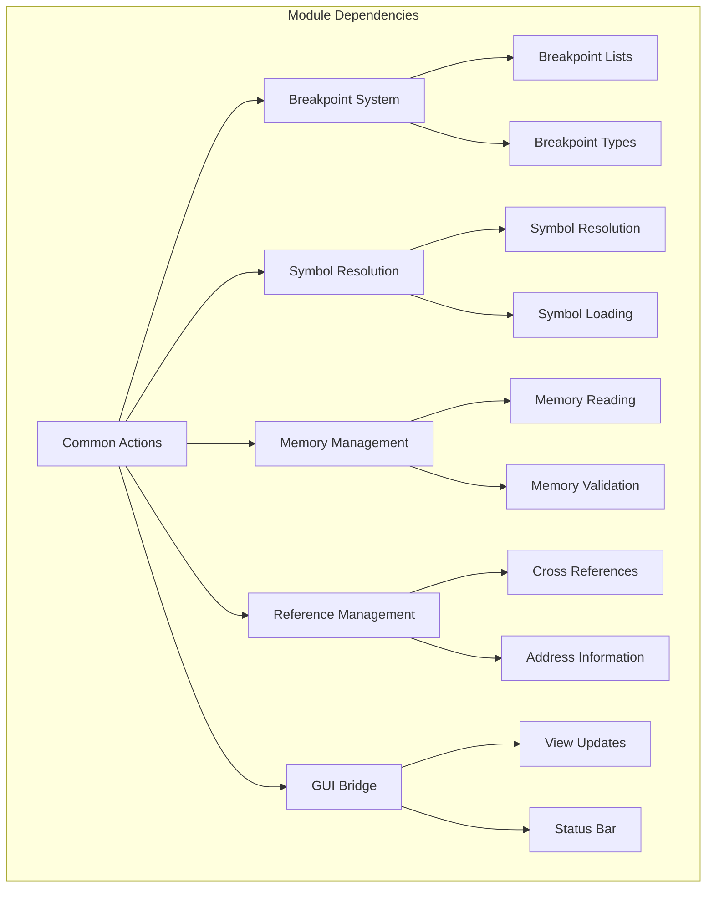

### Key Dependencies

- **[Breakpoint System](Breakpoint%20System.md)**: Hardware/software breakpoint management
- **[Symbol Resolution](Symbol%20Resolution.md)**: Address-to-symbol translation
- **[Memory Management](Memory%20Management.md)**: Memory validation and reading
- **[Reference Management](Reference%20Management.md)**: Cross-reference information
- **[GUI Bridge](GUI%20Bridge.md)**: View updates and user interface integration

## Action Creation Framework

The module provides a comprehensive framework for creating different types of actions with consistent behavior.

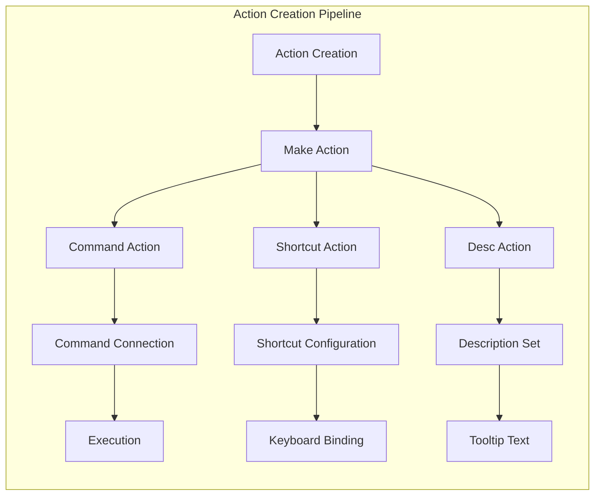

### Action Factory Methods

- **makeCommandAction**: Creates actions that execute debugger commands
- **makeCommandDescAction**: Creates command actions with descriptions
- **makeShortcutAction**: Creates keyboard-shortcut enabled actions
- **makeShortcutDescAction**: Creates shortcut actions with descriptions

## Error Handling and Validation

The module implements comprehensive error handling and user feedback mechanisms.

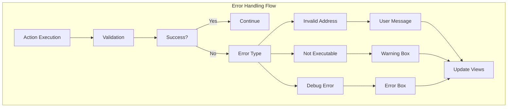

### Validation Checks

- **Address Validation**: Ensures selected addresses are valid
- **Memory Validation**: Verifies memory accessibility
- **Executable Validation**: Warns about non-executable addresses
- **Debug State Validation**: Confirms appropriate debugging state

## Configuration and Customization

The module supports extensive configuration through the action helper system and menu builder framework.

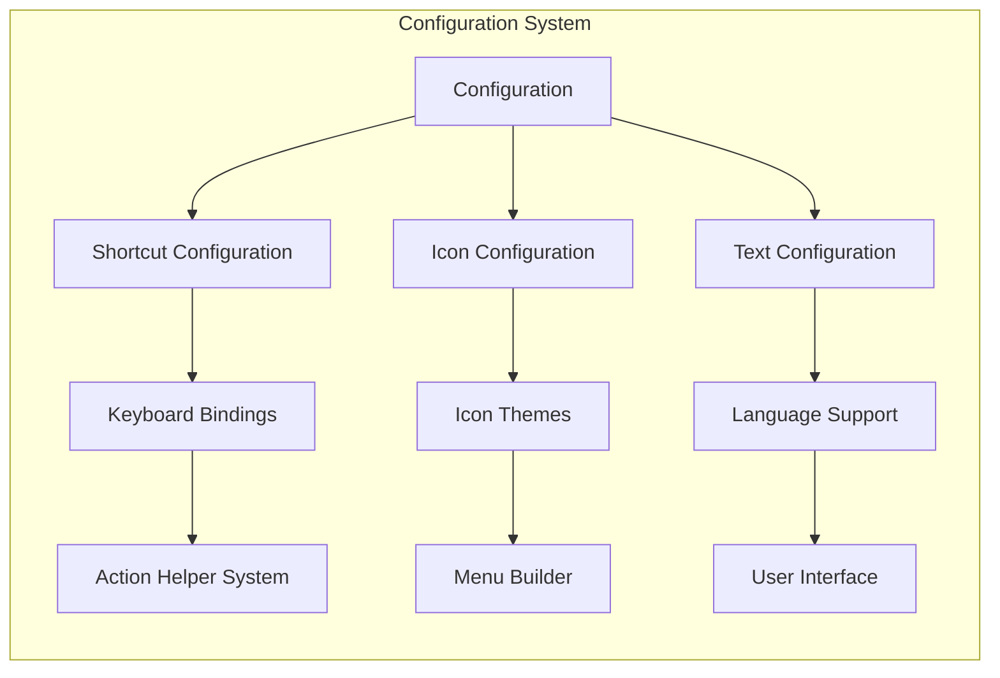

## Performance Considerations

The module is designed for optimal performance in debugging scenarios:

- **Lazy Evaluation**: Context conditions evaluated only when needed
- **Action Caching**: Reusable action objects to minimize allocation
- **Efficient Lookups**: Direct command execution without intermediate layers
- **Minimal Overhead**: Lightweight action creation and management

## Usage Examples

### Basic Action Creation
```cpp
// Create a simple command action
auto* action = makeCommandAction(DIcon("icon"), "Action Text", "command $", "Shortcut");

// Create a context-sensitive action
builder->addAction(action, [this](QMenu*) {
    return DbgIsDebugging() && mGetSelection() != 0;
});
```

### Complex Menu Building
```cpp
// Build breakpoint submenu with dynamic content
builder->addMenu(makeMenu(DIcon("breakpoint"), tr("Breakpoint")), 
    [this](QMenu* menu) {
        // Dynamic content based on current breakpoint state
        return buildBreakpointMenu(menu);
    });
```

## Future Enhancements

The module architecture supports extensibility for future debugging features:

- **Plugin Integration**: Action registration from plugins
- **Custom Action Types**: User-defined action categories
- **Advanced Scripting**: Scriptable action sequences
- **Workflow Automation**: Complex debugging workflow support

## Summary

The Common Actions module represents a critical component of the x64dbg debugger, providing the essential user interaction layer that connects user intentions with debugger functionality. Its sophisticated architecture enables context-sensitive operations, comprehensive breakpoint management, and seamless navigation across different debugger views while maintaining extensibility for future enhancements.