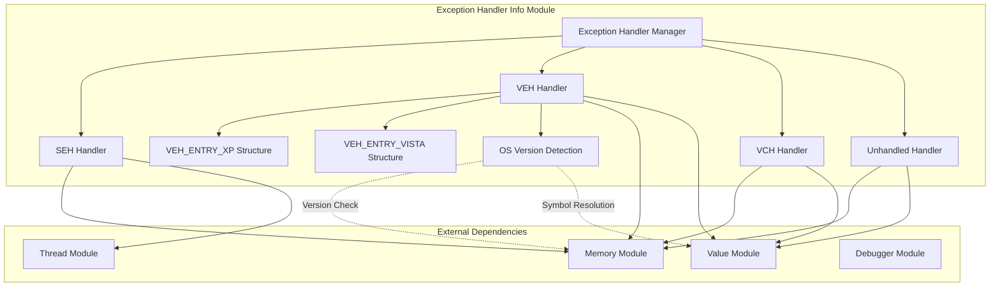
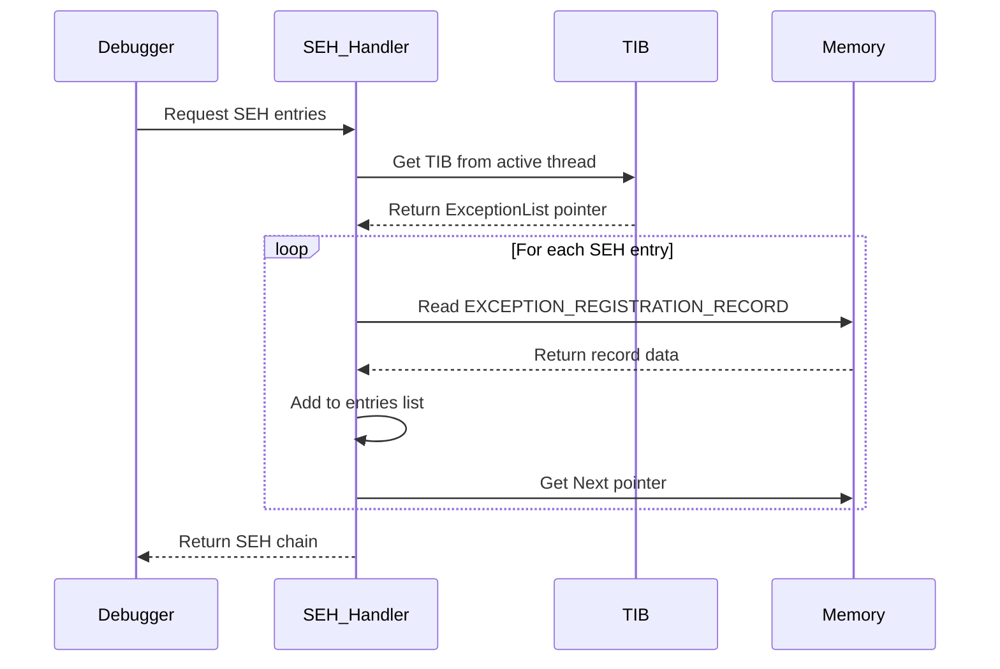
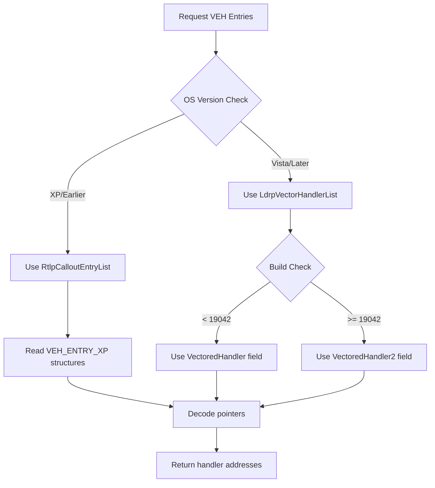
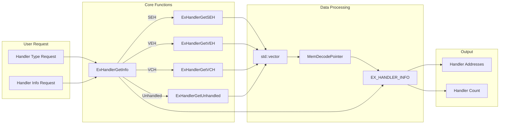
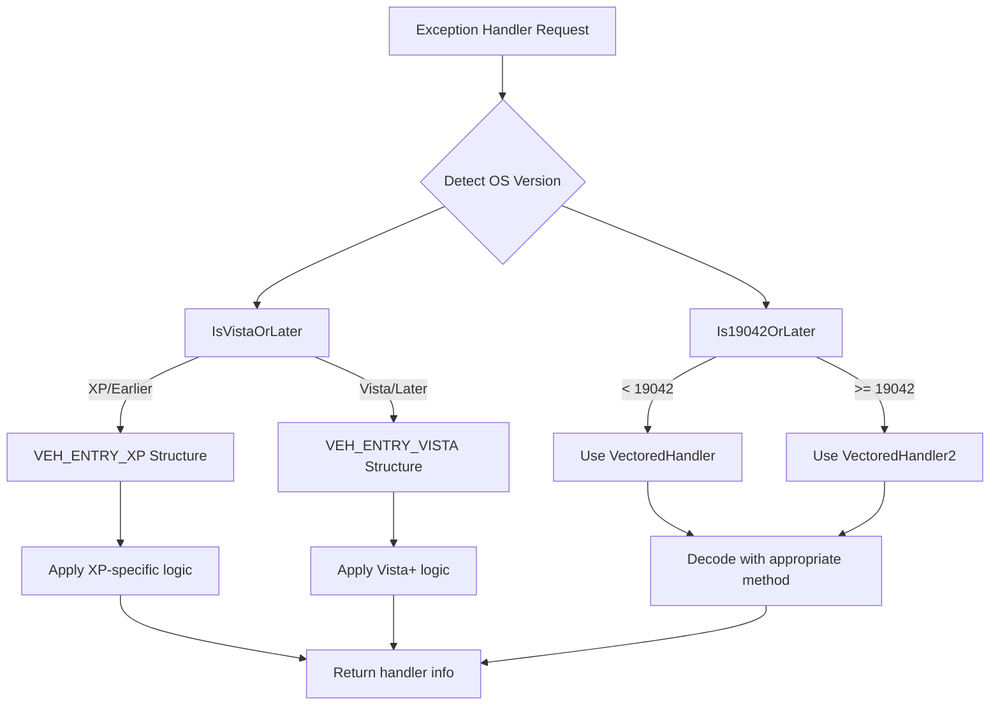

# Exception Handler Info Module

## Introduction

The Exception Handler Info module is a critical component of the x64dbg debugging framework that provides comprehensive functionality for analyzing and retrieving Windows exception handler information. This module enables debuggers to inspect various types of exception handlers including Structured Exception Handlers (SEH), Vectored Exception Handlers (VEH), Vectored Continue Handlers (VCH), and Unhandled Exception Filters within target processes.

## Architecture Overview



## Core Components

### VEH_ENTRY_XP Structure

The `VEH_ENTRY_XP` structure represents the Vectored Exception Handler entry format used in Windows XP and earlier versions:

```cpp
struct VEH_ENTRY_XP
{
    duint Flink;           // Forward link to next entry
    duint Blink;           // Backward link to previous entry
    duint VectoredHandler; // Pointer to the handler function
};
```

### VEH_ENTRY_VISTA Structure

The `VEH_ENTRY_VISTA` structure represents the enhanced Vectored Exception Handler entry format introduced in Windows Vista and later:

```cpp
struct VEH_ENTRY_VISTA
{
    duint Flink;            // Forward link to next entry
    duint Blink;            // Backward link to previous entry
    duint PtrRefCount;      // Reference count for the handler
    duint VectoredHandler;  // Primary handler pointer (legacy)
    duint VectoredHandler2; // Secondary handler pointer (Windows 10 19042+)
};
```

## Exception Handler Types

### 1. Structured Exception Handlers (SEH)

SEH is the traditional Windows exception handling mechanism that uses a linked list of exception registration records stored in the Thread Information Block (TIB).

**Process Flow:**


### 2. Vectored Exception Handlers (VEH)

VEH provides a more flexible exception handling mechanism that allows handlers to be chained globally across the process.

**Process Flow:**


### 3. Vectored Continue Handlers (VCH)

VCH are similar to VEH but are called after exception handling to determine if execution should continue.

### 4. Unhandled Exception Filters

These handlers are invoked when no other exception handler processes the exception.

## Data Flow Architecture



## OS Version Compatibility

The module implements sophisticated OS version detection to handle differences in exception handler structures across Windows versions:



## Dependencies

### Internal Dependencies
- **Memory Module**: Provides memory reading and pointer decoding capabilities
- **Thread Module**: Supplies thread information for SEH chain traversal
- **Value Module**: Handles symbol resolution for finding handler list addresses
- **Debugger Module**: Provides active thread information

### External Dependencies
- Windows API functions for OS version detection
- Process memory access for reading handler structures
- Symbol resolution for locating internal Windows structures

## Security Considerations

1. **Pointer Decoding**: The module uses `MemDecodePointer` to properly decode protected pointers in the target process
2. **Depth Limiting**: All handler enumeration functions implement `MAX_HANDLER_DEPTH` (10) to prevent infinite loops
3. **Memory Validation**: Each memory read operation is validated to prevent crashes from invalid addresses
4. **Process Isolation**: Handler information is retrieved from the target process without affecting its execution

## Usage Examples

### Retrieving SEH Chain
```cpp
std::vector<duint> sehEntries;
if(ExHandlerGetInfo(EX_HANDLER_SEH, sehEntries)) {
    // Process SEH chain entries
    for(auto entry : sehEntries) {
        // Each entry points to an EXCEPTION_REGISTRATION_RECORD
    }
}
```

### Getting VEH Handlers
```cpp
EX_HANDLER_INFO vehInfo;
if(ExHandlerGetInfo(EX_HANDLER_VEH, &vehInfo)) {
    // vehInfo.count contains number of VEH handlers
    // vehInfo.addresses contains array of handler addresses
}
```

## Integration with Debugger

The Exception Handler Info module integrates seamlessly with the x64dbg debugging framework:

- Provides real-time exception handler information during debugging sessions
- Supports both 32-bit and 64-bit processes (with 64-bit SEH support marked as TODO)
- Enables analysis of exception handling behavior in target applications
- Assists in reverse engineering and malware analysis by revealing exception-based anti-debugging techniques

## Future Enhancements

- **64-bit SEH Support**: Implementation of SEH chain traversal for 64-bit processes
- **Additional Handler Types**: Support for newer Windows exception handling mechanisms
- **Performance Optimization**: Caching of symbol addresses to reduce lookup overhead
- **Enhanced Error Handling**: More detailed error reporting for failed memory operations

## Related Modules

- [Memory Management](Memory%20Management.md) - Provides memory reading and pointer decoding
- [Thread Management](Thread%20Management.md) - Supplies thread information for SEH analysis
- [Symbol Resolution](Symbol%20Resolution.md) - Handles symbol lookup for internal structures
- [Debugger Core](Debugger%20Core.md) - Main debugging framework integration