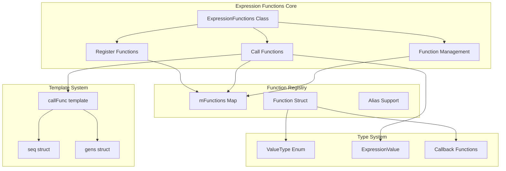
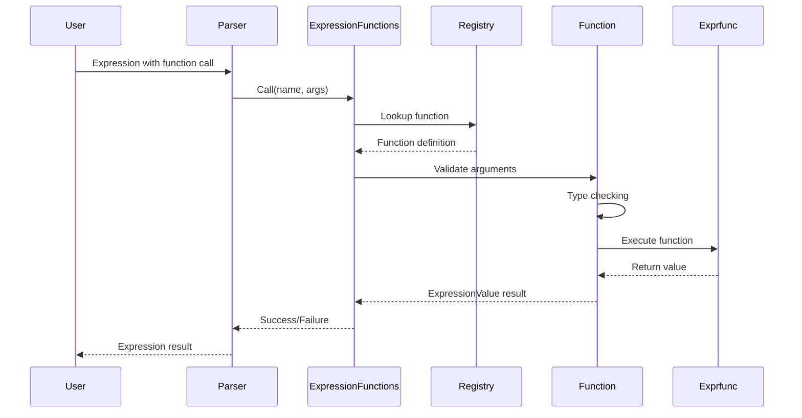

# Expression Functions Module

## Introduction

The Expression Functions module is a core component of the x64dbg debugging framework that provides a comprehensive expression evaluation system. It enables users to execute custom functions within expressions, allowing for dynamic data retrieval, memory analysis, disassembly inspection, and various debugging operations. This module serves as the bridge between user-defined expressions and the debugger's internal functionality, offering both built-in functions and extensibility for custom function registration.

## Architecture Overview

The Expression Functions module implements a function registry pattern with template-based argument handling and type safety mechanisms. It provides a unified interface for registering, managing, and executing expression functions with support for multiple data types and argument validation.

## Core Components

### ExpressionFunctions Class

The central class that manages all expression functions within the debugger. It provides static methods for function registration, execution, and management while maintaining thread safety through exclusive locking mechanisms.

**Key Responsibilities:**
- Function registration and validation
- Alias management for function names
- Type checking and argument validation
- Thread-safe function execution
- Function unregistration and cleanup

### Template Metaprogramming System

The module utilizes advanced C++ template metaprogramming to handle variable argument functions:

- **`seq<...>`**: Template sequence for argument indexing
- **`gens<N, ...>`**: Template generator for creating parameter packs
- **`callFunc`**: Template function for type-safe argument extraction and function invocation

This system enables the module to handle functions with varying numbers and types of arguments while maintaining type safety and performance.

### Function Registry

Maintains an unordered map of function names to function definitions, supporting:

- Primary function names and aliases
- Return type validation
- Argument type sequences
- User data association
- Thread-safe access patterns

## Function Categories

### GUI Interaction Functions

Functions that interact with the debugger's graphical interface:

- **`disasm.sel` / `dis.sel`**: Returns the currently selected address in the disassembly view
- **`dump.sel`**: Returns the currently selected address in the dump view
- **`stack.sel`**: Returns the currently selected address in the stack view

### Source Code Functions

Functions for source code debugging and display:

- **`src.line`**: Retrieves source line information
- **`src.disp`**: Handles source display operations

### Module Information Functions

Comprehensive module analysis functions:

- **`mod.party`**: Determines module party (system/user)
- **`mod.base`**: Gets module base address
- **`mod.size`**: Retrieves module size
- **`mod.hash`**: Computes module hash
- **`mod.entry`**: Finds module entry point
- **`mod.system` / `mod.issystem`**: Checks if module is system
- **`mod.user` / `mod.isuser`**: Checks if module is user module
- **`mod.main` / `mod.mainbase`**: Gets main module base
- **`mod.rva`**: Converts to relative virtual address
- **`mod.offset` / `mod.fileoffset`**: Converts to file offset
- **`mod.headerva`**: Gets header virtual address
- **`mod.isexport`**: Checks if address is an export
- **`mod.fromname`**: Gets module base from name

### Process Information Functions

Process and system information retrieval:

- **`peb` / `PEB`**: Gets Process Environment Block address
- **`teb` / `TEB`**: Gets Thread Environment Block address
- **`tid` / `TID` / `ThreadId`**: Gets current thread ID
- **`kusd` / `KUSD` / `KUSER_SHARED_DATA`**: Gets kernel user shared data address

### Memory Analysis Functions

Memory validation and analysis capabilities:

- **`mem.valid` / `mem.isvalid`**: Validates memory address
- **`mem.base`**: Gets memory region base
- **`mem.size`**: Gets memory region size
- **`mem.iscode`**: Checks if memory contains code
- **`mem.isstring`**: Checks if memory contains string data
- **`mem.decodepointer`**: Decodes encoded pointer
- **`mem.match`**: Matches memory pattern

### Disassembly Analysis Functions

Comprehensive disassembly inspection functions:

- **`dis.len` / `dis.size`**: Gets instruction length
- **`dis.iscond`**: Checks if instruction is conditional
- **`dis.isbranch`**: Checks if instruction is branch
- **`dis.isret`**: Checks if instruction is return
- **`dis.iscall`**: Checks if instruction is call
- **`dis.ismem`**: Checks if instruction accesses memory
- **`dis.isnop`**: Checks if instruction is NOP
- **`dis.isunusual`**: Checks if instruction is unusual
- **`dis.branchdest`**: Gets branch destination
- **`dis.branchexec`**: Checks branch execution
- **`dis.imm`**: Gets immediate value
- **`dis.brtrue` / `dis.brfalse`**: Branch condition evaluation
- **`dis.next` / `dis.prev`**: Navigation functions
- **`dis.iscallsystem`**: Checks if call is to system
- **`dis.mnemonic`**: Gets instruction mnemonic
- **`dis.text`**: Gets instruction text
- **`dis.match`**: Matches instruction pattern

### Data Reading Functions

Memory data access functions:

- **`ReadByte` / `Byte` / `byte`**: Reads 8-bit value
- **`ReadWord` / `Word` / `word`**: Reads 16-bit value
- **`ReadDword` / `Dword` / `dword`**: Reads 32-bit value
- **`ReadQword` / `Qword` / `qword`**: Reads 64-bit value (x64 only)
- **`ReadPtr` / `ReadPointer` / `ptr` / `Pointer` / `pointer`**: Reads pointer-sized value

### String Manipulation Functions

Comprehensive string processing capabilities:

- **`ansi` / `ansi.strict`**: Reads ANSI strings
- **`utf8` / `utf8.strict`**: Reads UTF-8 strings
- **`utf16` / `utf16.strict`**: Reads UTF-16 strings
- **`strstr` / `strcontains`**: String search
- **`stristr` / `stricontains`**: Case-insensitive search
- **`streq` / `strieq`**: String equality checks
- **`strlen`**: String length
- **`strlower` / `strupper`**: Case conversion
- **`strcat`**: String concatenation
- **`substr`**: Substring extraction
- **`strchr` / `strrchr`**: Character search
- **`strreplace` / `strreplace_first` / `strreplace_last`**: String replacement
- **`streval`**: String evaluation
- **`strtrim`**: String trimming

## Data Flow Architecture

## Dependencies

The Expression Functions module has dependencies on several other system components:

### Direct Dependencies

- **[Threading System](Threading.md)**: Provides thread synchronization through `EXCLUSIVE_ACQUIRE` and `SHARED_ACQUIRE` macros
- **[Expression Parser](Expression Parser.md)**: Integrates with the expression evaluation system
- **[Value System](Value System.md)**: Uses `ExpressionValue` and `ValueType` enumerations
- **[Module Management](Module Management.md)**: Provides module information functions
- **[Debugger Core](Debugger Core.md)**: Accesses debugger state and information

### Indirect Dependencies

- **[Memory Management](Memory Management.md)**: Memory analysis functions interact with memory management
- **[Disassembly Engine](Disassembly Engine.md)**: Disassembly functions require disassembly capabilities
- **[Symbol Resolution](Symbol Resolution.md)**: Symbol-related functions depend on symbol resolution
- **[Reference Management](Reference Management.md)**: Reference functions use the reference system

## Function Registration Process

## Type System

The module implements a comprehensive type system supporting:

### Value Types
- **`ValueTypeNumber`**: Numeric values (addresses, integers)
- **`ValueTypeString`**: String values
- **`ValueTypeAny`**: Any type (for flexible functions)
- **`ValueTypeOptionalNumber`**: Optional numeric arguments
- **`ValueTypeOptionalString`**: Optional string arguments
- **`ValueTypeOptionalAny`**: Optional any-type arguments

### Type Validation
- Return type cannot be optional
- Optional arguments must be at the end of argument list
- Function names must follow identifier rules
- Type checking occurs at registration and call time

## Thread Safety

The module implements thread-safe operations through:

- **Exclusive Locks**: Used during registration and modification operations
- **Shared Locks**: Used during function lookup and execution
- **Atomic Operations**: Map operations are protected by locking mechanisms
- **Reentrant Design**: Function execution can occur concurrently

## Extension Mechanisms

### Custom Function Registration

Users can register custom functions through:

1. **Easy Registration**: `RegisterEasy` for simple numeric functions
2. **Full Registration**: `Register` for complex functions with custom types
3. **Alias Registration**: `RegisterAlias` for function name alternatives

### Function Signature Requirements

- Functions must accept `ExpressionValue*` for result
- Functions must handle `argc` and `argv` parameters
- Functions must return boolean success status
- Functions can accept optional user data

## Error Handling

The module implements comprehensive error handling:

- **Name Validation**: Ensures function names follow identifier rules
- **Type Validation**: Validates argument and return types
- **Duplicate Detection**: Prevents function name conflicts
- **Optional Argument Rules**: Enforces optional argument placement
- **Execution Errors**: Handles runtime function failures gracefully

## Performance Considerations

- **Template Metaprogramming**: Compile-time optimization for argument handling
- **Unordered Map**: O(1) average case for function lookup
- **Type Safety**: Compile-time type checking reduces runtime overhead
- **Memory Efficiency**: Minimal overhead for function storage
- **Lock Granularity**: Fine-grained locking for concurrent access

## Integration Points

The Expression Functions module integrates with the broader debugging framework through:

- **Expression Parser**: Provides function execution capabilities
- **Script Engine**: Enables function calls in scripts
- **Command System**: Supports function calls in debugger commands
- **Plugin System**: Allows plugins to register custom functions
- **GUI Components**: Provides data for display components

This comprehensive expression function system forms the backbone of dynamic data retrieval and analysis within the x64dbg debugging environment, enabling powerful and flexible debugging workflows.