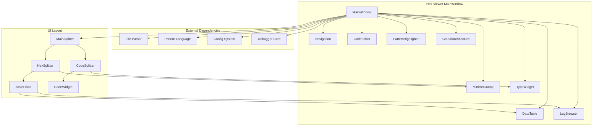
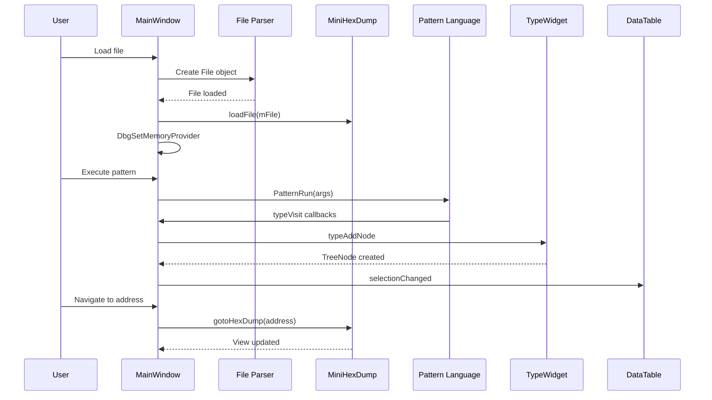
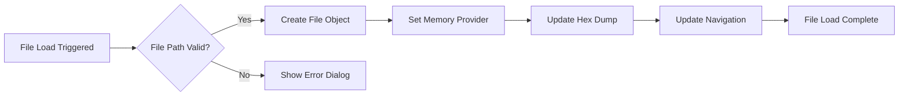
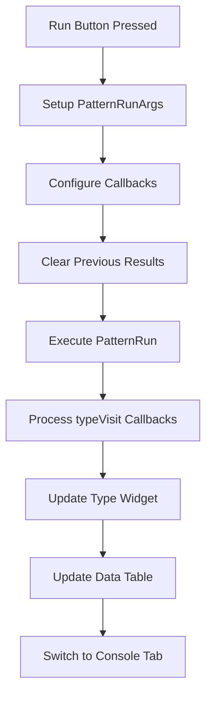
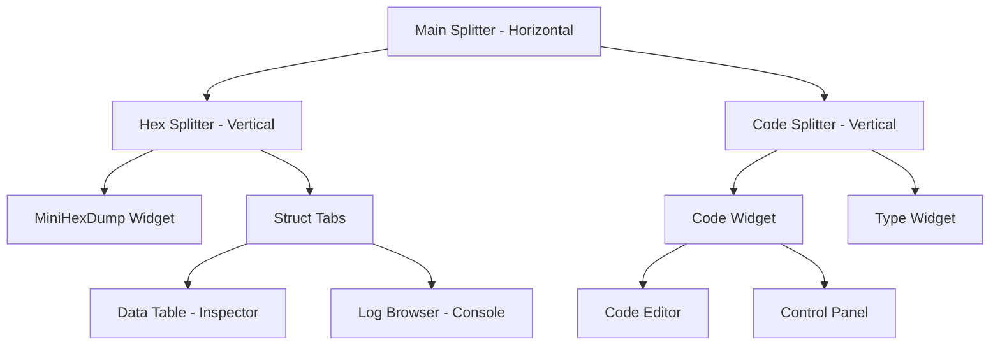

# Hex Viewer MainWindow Module Documentation

## Introduction

The Hex Viewer MainWindow module serves as the primary user interface for the hex viewer component in the x64dbg debugging framework. This module provides a comprehensive graphical interface for viewing, analyzing, and interacting with binary data through pattern matching and type inspection capabilities. It integrates multiple subsystems including hex dump visualization, pattern language execution, type inspection, and navigation controls.

## Architecture Overview

The MainWindow module follows a modular architecture design with clear separation of concerns:



## Core Components

### MainWindow Class

The `MainWindow` class serves as the central coordinator for the hex viewer interface. It manages the lifecycle of all child widgets, handles file loading, coordinates pattern execution, and manages the overall application state.

**Key Responsibilities:**
- File loading and memory provider management
- Widget initialization and layout management
- Pattern language execution coordination
- Error handling and logging
- Navigation and address management

### DefaultArchitecture

The `DefaultArchitecture` struct implements the `Architecture` interface and provides system architecture information to the hex viewer components.

```cpp
struct DefaultArchitecture : Architecture
{
    bool disasm64() const override { return true; }
    bool addr64() const override { return true; }
};
```

This component ensures that the hex viewer operates with 64-bit addressing and disassembly capabilities by default.

## Data Flow Architecture



## Component Interactions

### File Loading Process



### Pattern Execution Flow



## UI Layout Structure

The MainWindow implements a sophisticated splitter-based layout that provides flexible arrangement of interface components:



## Integration with Other Modules

### Pattern Language Integration

The MainWindow module heavily integrates with the [Pattern Language](Pattern Language.md) module for executing pattern matching scripts. It provides:

- **Code Editor**: Syntax highlighting and error line indication
- **Pattern Execution**: Runtime compilation and execution of pattern scripts
- **Error Handling**: Compile-time and runtime error reporting
- **Type Inspection**: Dynamic type tree construction and visualization

### Memory Management Integration

Through the `DbgSetMemoryProvider` interface, the MainWindow connects to the [Memory Management](Memory Management.md) system, enabling:

- **Memory Access**: Reading from loaded files or live debugging sessions
- **Address Translation**: Virtual to physical address mapping
- **Memory Caching**: Efficient memory access patterns

### Navigation System

The Navigation widget provides integration with the overall debugger navigation system, supporting:

- **Address Jumping**: Direct navigation to specific addresses
- **Window Focus Management**: Coordination between different debugger views
- **History Management**: Tracking navigation history across sessions

## Key Features

### 1. File Loading and Memory Management

The module supports loading various file formats through the integrated file parser system. Once loaded, files become memory providers that can be accessed by the pattern language and hex dump components.

### 2. Pattern Language Execution

Users can write and execute pattern matching scripts that:
- Define data structures and types
- Parse binary data according to defined patterns
- Generate interactive type trees for inspection
- Provide real-time feedback through the console

### 3. Interactive Type Inspection

The type widget displays parsed data structures in an expandable tree format, allowing users to:
- Navigate through complex data structures
- View field values and offsets
- Jump to specific addresses in the hex dump
- Monitor data changes in real-time

### 4. Hex Dump Visualization

The MiniHexDump component provides:
- Traditional hex and ASCII display
- Selection highlighting and expansion
- Address navigation and bookmarking
- Synchronization with type inspection

### 5. Error Handling and Logging

Comprehensive error handling system that:
- Catches and displays file loading errors
- Reports pattern compilation errors with line numbers
- Provides runtime error feedback
- Maintains execution logs in the console

## Configuration and Customization

The module integrates with the global configuration system to provide:

- **Font Settings**: Monospace font configuration for code and hex display
- **Layout Persistence**: Splitter position and window state management
- **Include Paths**: Pattern language include directory configuration

## Error Handling

The MainWindow implements multiple layers of error handling:

1. **File Loading Errors**: Caught exceptions during file operations
2. **Pattern Compilation Errors**: Line-specific error reporting in the code editor
3. **Runtime Errors**: Evaluation errors with location information
4. **Memory Access Errors**: Handled through the memory provider interface

## Performance Considerations

The module is designed with performance in mind:

- **Lazy Loading**: Components are initialized only when needed
- **Efficient Updates**: Selective widget updates to minimize redraws
- **Memory Management**: Proper cleanup of file objects and memory providers
- **Caching**: Potential for memory access caching (noted in TODO comments)

## Future Enhancements

Based on TODO comments in the code, planned improvements include:

- **Page Caching**: Implementation of memory access caching
- **Directory Memory**: Remembering previous browse directories
- **Error Highlighting**: Enhanced pattern compilation error visualization
- **Type Node Removal**: Support for dynamic type tree modification

## Dependencies

The MainWindow module depends on several other system components:

- **Pattern Language**: For script execution and type parsing
- **File Parser**: For loading and parsing binary files
- **Configuration System**: For user preferences and settings
- **Debugger Core**: For memory access and symbol resolution
- **GUI Framework**: Qt-based widgets and layout management

This comprehensive integration makes the Hex Viewer MainWindow a central component for binary analysis and pattern matching within the x64dbg debugging framework.