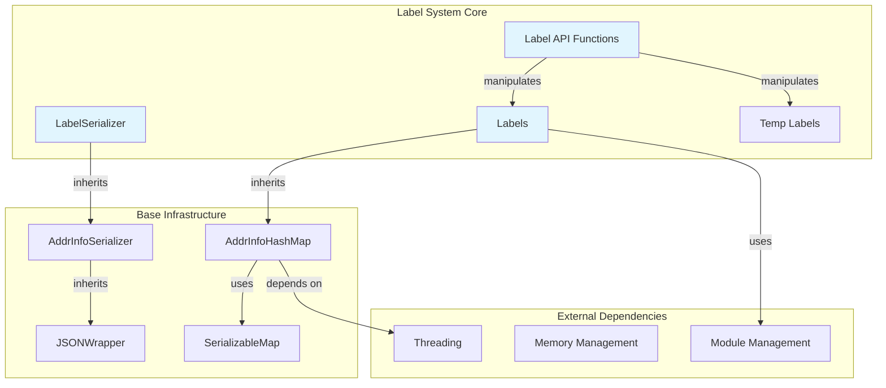
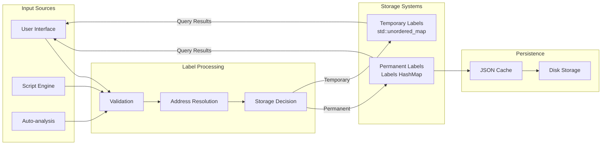
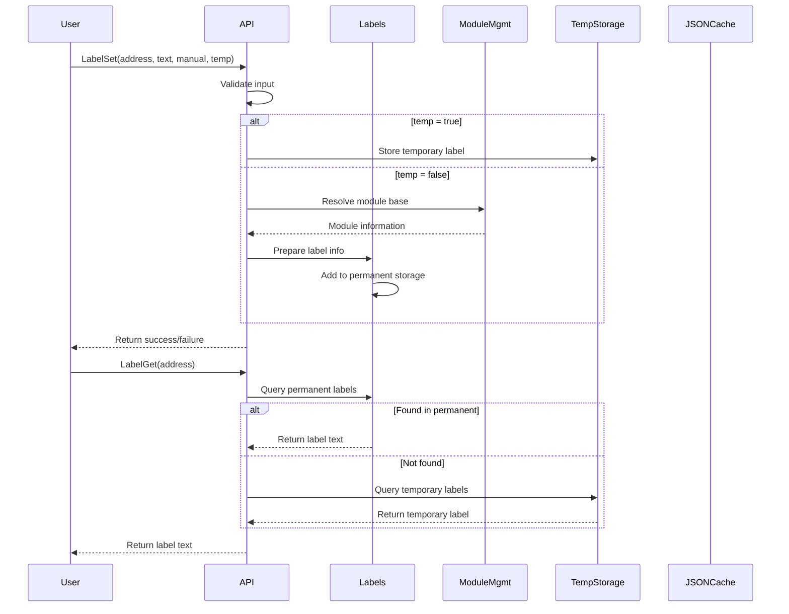
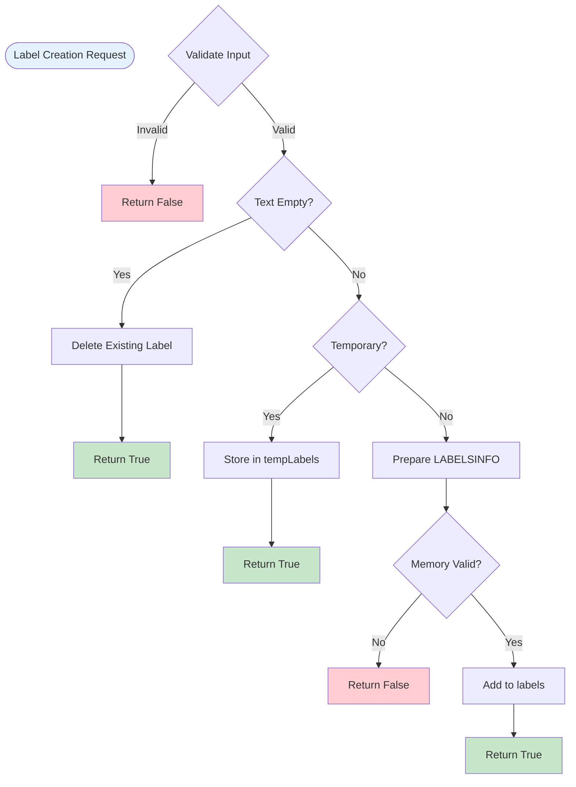
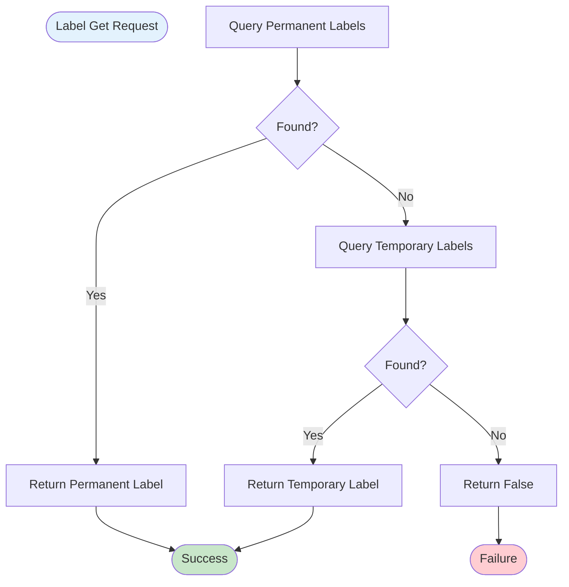

# Label System

## Introduction

The Label System module provides a comprehensive labeling mechanism for the x64dbg debugger, allowing users to assign human-readable names to memory addresses. This system serves as a critical component for code navigation, analysis, and documentation within the debugging environment. Labels can be either permanent (persistent across debugging sessions) or temporary (session-specific), providing flexibility for different debugging scenarios.

The module integrates seamlessly with other debugger components such as the [Module Management](Module%20Management.md) system for address resolution, the [Reference Management](Reference%20Management.md) system for cross-references, and the [Comment System](Comment%20System.md) for comprehensive code documentation.

## Architecture

### Core Components

The Label System is built around two primary components that work together to provide efficient label storage and retrieval:

#### LabelSerializer
- **Purpose**: Handles JSON serialization and deserialization of label information
- **Inheritance**: Derived from `AddrInfoSerializer<LABELSINFO>`
- **Key Methods**:
  - `Save()`: Serializes label data to JSON format
  - `Load()`: Deserializes JSON data back into label structures
- **Features**: Extends base serialization with label-specific text field handling

#### Labels
- **Purpose**: Main container for managing all label data
- **Inheritance**: Derived from `AddrInfoHashMap<LockLabels, LABELSINFO, LabelSerializer>`
- **Key Methods**:
  - `jsonKey()`: Returns "labels" as the JSON storage key
- **Features**: Thread-safe hash map implementation with automatic address-to-module resolution

### Data Structure Hierarchy

```
AddrInfo (Base Structure)
├── modhash: Module hash identifier
├── addr: Relative address within module
└── manual: Boolean flag for manual/automatic creation

LABELSINFO (Label-specific extension)
├── Inherits from AddrInfo
└── text: Human-readable label string
```

## System Architecture



## Data Flow Architecture



## Component Interactions



## Process Flow

### Label Creation Process



### Label Retrieval Process



## Key Features

### Dual Storage System
The Label System implements a sophisticated dual-storage approach:

1. **Permanent Labels**: Stored in the main `Labels` hash map with full persistence support
2. **Temporary Labels**: Stored in a separate `std::unordered_map` for session-specific labels

This design allows for:
- Quick identification of temporary vs. permanent labels
- Efficient cleanup of temporary labels
- Separate management strategies for different label types

### Thread Safety
The system employs section locks (`LockLabels`) to ensure thread-safe operations across multiple concurrent access patterns, critical for debugger stability during multi-threaded analysis.

### Module Integration
Labels are tightly integrated with the module system through:
- Module hash-based storage for efficient lookup
- Automatic address-to-module resolution
- Support for module-relative addressing

### Serialization Support
Full JSON serialization capabilities enable:
- Session persistence across debugger restarts
- Import/export functionality for label databases
- Integration with project management systems

## API Functions

### Core Management Functions
- `LabelSet()`: Create or update a label
- `LabelGet()`: Retrieve label text by address
- `LabelDelete()`: Remove a label
- `LabelFromString()`: Find address by label text

### Utility Functions
- `LabelIsTemporary()`: Check if a label is temporary
- `LabelDelRange()`: Delete labels within an address range
- `LabelFindPrefix()`: Find labels by text prefix
- `LabelGetList()`: Retrieve all labels

### Persistence Functions
- `LabelCacheSave()`: Save labels to JSON cache
- `LabelCacheLoad()`: Load labels from JSON cache
- `LabelClear()`: Clear all labels

## Integration with Other Systems

### Module Management
The Label System depends on [Module Management](Module%20Management.md) for:
- Address-to-module resolution
- Module hash generation
- Base address calculations

### Memory Management
Integration with [Memory Management](Memory%20Management.md) ensures:
- Memory address validation before label creation
- Protection against invalid memory references
- Consistent address space handling

### Reference Management
Coordination with [Reference Management](Reference%20Management.md) enables:
- Cross-reference tracking for labeled addresses
- Label-based navigation in reference views
- Integrated search capabilities

## Performance Considerations

### Storage Efficiency
- Hash-based storage provides O(1) average case lookup performance
- Module-relative addressing reduces storage overhead
- Efficient string handling with size limits (MAX_LABEL_SIZE)

### Memory Management
- Automatic cleanup of temporary labels
- Range-based deletion for efficient bulk operations
- Memory validation before label creation

### Search Optimization
- Prefix-based search with case sensitivity options
- Configurable result limits for performance
- Efficient iteration patterns for large label sets

## Error Handling

The system implements comprehensive error handling for:
- Invalid memory addresses
- Malformed label text
- Storage failures
- Module resolution errors

All API functions return boolean success indicators, allowing calling code to handle failures appropriately.

## Usage Examples

### Creating a Permanent Label
```cpp
// Set a permanent label at address 0x401000
bool success = LabelSet(0x401000, "main_function", true, false);
```

### Creating a Temporary Label
```cpp
// Set a temporary label for session-only use
bool success = LabelSet(0x401000, "temp_analysis_point", true, true);
```

### Retrieving Label Information
```cpp
char labelText[MAX_LABEL_SIZE];
if(LabelGet(0x401000, labelText))
{
    // Use the retrieved label text
}
```

### Finding Labels by Prefix
```cpp
std::vector<std::string> results = LabelFindPrefix("sub_", 10, true);
// Returns up to 10 labels starting with "sub_" (case-sensitive)
```

## Future Enhancements

The Label System architecture supports potential extensions such as:
- Label categories and tagging
- Advanced search and filtering capabilities
- Integration with symbol servers
- Collaborative label sharing
- Machine learning-based label suggestions

This comprehensive labeling infrastructure provides a solid foundation for code analysis and navigation within the x64dbg debugger environment.