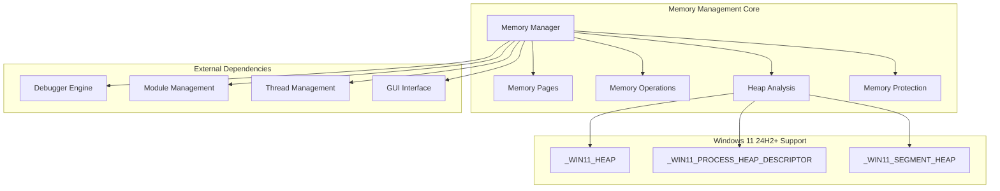
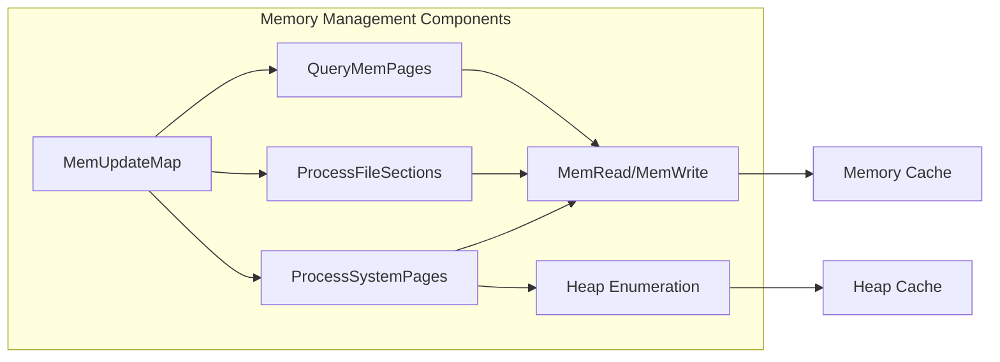
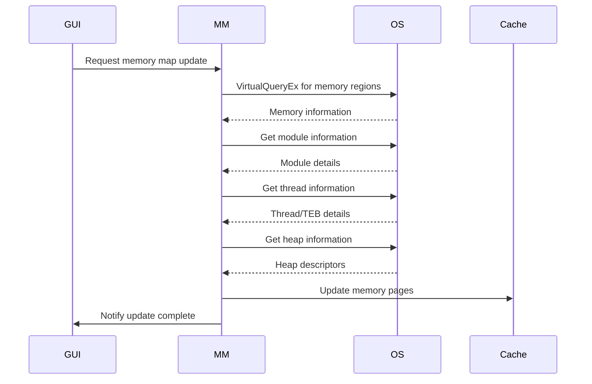
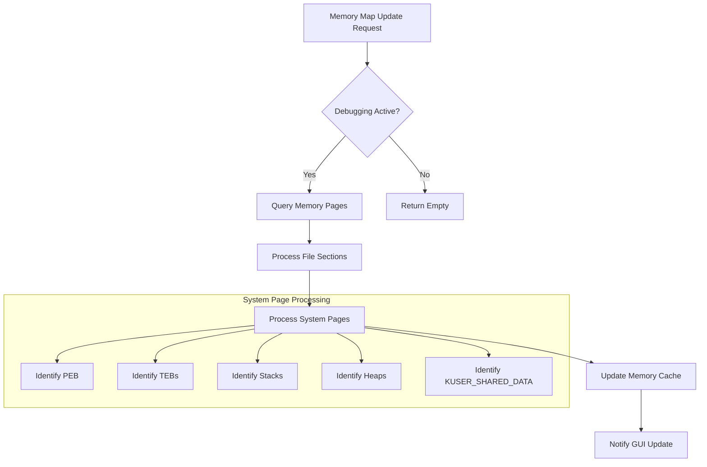
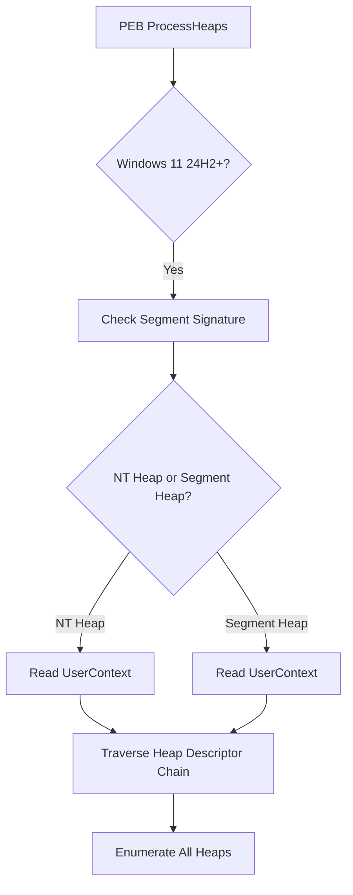

# Memory Management Module

## Introduction

The Memory Management module is a core component of the x64dbg debugger that provides comprehensive memory analysis and manipulation capabilities for Windows processes. It handles memory page enumeration, memory reading/writing operations, heap analysis, and memory protection management. The module is specifically designed to work with modern Windows versions, including Windows 11 24H2+ with its updated heap structures.

## Core Functionality

### Memory Page Management
The module maintains a comprehensive map of all memory pages in the target process, providing detailed information about memory regions, their protection attributes, and associated modules or system structures.

### Memory Operations
Provides safe and unsafe memory read/write operations with automatic page boundary handling and error recovery mechanisms.

### Heap Analysis
Advanced heap enumeration capabilities, including support for Windows 11 24H2+ segment heap structures and process heap descriptors.

### Memory Protection
Comprehensive memory protection management with string-based rights conversion and validation.

## Architecture



## Component Relationships



## Data Flow



## Key Components

### Memory Page Enumeration
- **QueryMemPages()**: Enumerates all memory pages in the process address space
- **ProcessFileSections()**: Breaks down module pages into individual sections
- **ProcessSystemPages()**: Identifies system structures (PEB, TEB, heaps, stacks)

### Memory Operations
- **MemRead()**: Safe memory reading with caching and validation
- **MemWrite()**: Memory writing with page boundary handling
- **MemReadUnsafe()**: Direct memory access without safety checks
- **MemoryReadSafePage()**: Page-aligned safe reading with working set validation

### Heap Analysis (Windows 11 24H2+)
- **_WIN11_HEAP**: Structure for Windows 11 NT heap format
- **_WIN11_SEGMENT_HEAP**: Structure for Windows 11 segment heap format
- **_WIN11_PROCESS_HEAP_DESCRIPTOR**: Process heap descriptor chain

### Memory Protection
- **MemGetProtect()**: Retrieves memory protection attributes
- **MemSetProtect()**: Modifies memory protection
- **MemPageRightsToString()**: Converts protection flags to string format
- **MemPageRightsFromString()**: Parses string protection format

## Process Flow



## Windows 11 24H2+ Heap Support

The module includes specialized support for Windows 11 24H2+ enhanced heap structures:



## Integration with Other Modules

### Module Management Integration
- Uses [Module Management](Module%20Management.md) for section information
- Retrieves module base addresses and sizes
- Processes PE header information for proper section alignment

### Thread Management Integration
- Uses [Thread Management](Thread%20Management.md) for TEB and stack identification
- Correlates thread IDs with memory regions
- Handles both 32-bit and 64-bit thread contexts

### GUI Integration
- Notifies GUI components of memory map updates
- Provides progress information during memory searches
- Updates memory view displays

## Memory Safety Features

### Page Boundary Handling
All memory operations automatically handle page boundaries, ensuring that reads and writes don't cross page boundaries which could cause partial operations or errors.

### Working Set Validation
The module can validate memory pages against the working set to avoid accessing pages that are not currently resident in memory.

### Canonical Address Validation
Ensures that addresses are valid canonical addresses, particularly important for 64-bit processes.

### Error Recovery
Implements comprehensive error handling and recovery mechanisms, including fallback strategies for memory operations.

## Performance Optimizations

### Caching System
Maintains a comprehensive cache of memory page information to avoid repeated system calls and improve performance.

### Asynchronous Updates
Memory map updates can be performed asynchronously to avoid blocking the debugger interface.

### Section-Aware Processing
Processes memory at the section level for modules, providing more detailed and useful information while reducing overhead.

## Security Considerations

### Process Cookie Support
Implements pointer decoding using process cookies, essential for analyzing encoded pointers in modern Windows versions.

### Safe Memory Access
Provides both safe and unsafe memory access methods, allowing users to choose the appropriate level of safety for their use case.

### Protection Validation
Validates memory protection attributes before performing operations to ensure compliance with system security policies.

## Usage Examples

### Basic Memory Reading
```cpp
duint address = 0x00400000;
byte buffer[256];
duint bytesRead;
if(MemRead(address, buffer, sizeof(buffer), &bytesRead))
{
    // Process memory data
}
```

### Memory Page Information
```cpp
MEMPAGE pageInfo;
if(MemGetPageInfo(address, &pageInfo))
{
    // Access page protection, size, and other information
}
```

### Heap Enumeration
```cpp
// Heap information is automatically populated during memory map updates
// Access through the memory pages map
```

## Related Documentation

- [Module Management](Module%20Management.md) - For module and section information
- [Thread Management](Thread%20Management.md) - For thread and TEB information
- [Breakpoint System](Breakpoint%20System.md) - For memory breakpoint functionality
- [Symbol Resolution](Symbol%20Resolution.md) - For symbol information in memory regions