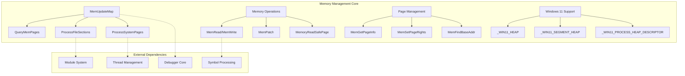
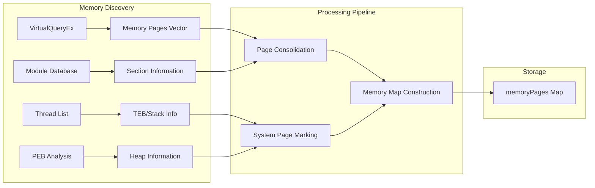
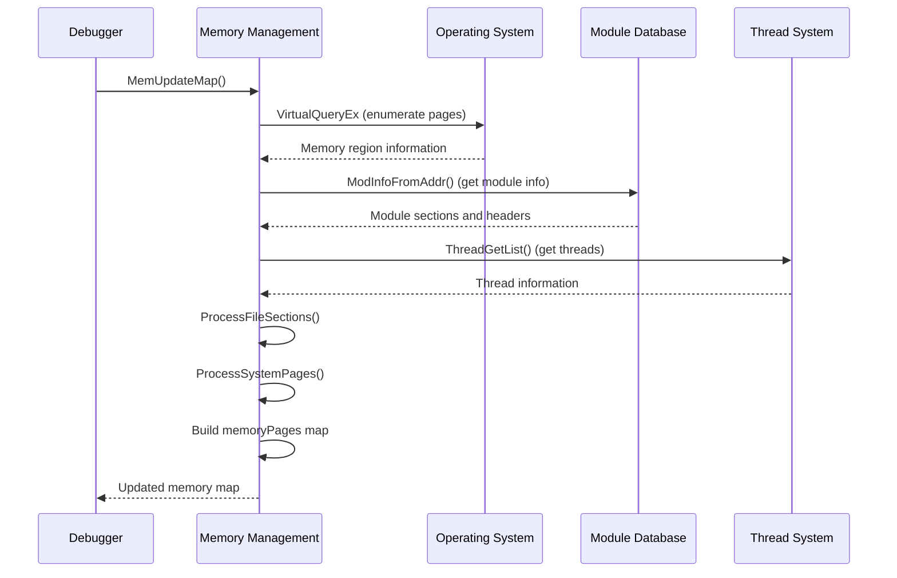
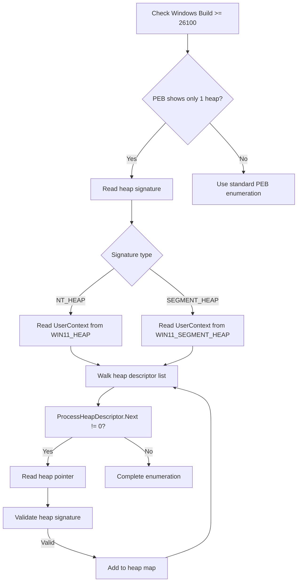

# Memory Management Module

## Introduction

The Memory Management module is a core component of the x64dbg debugging framework that provides comprehensive memory analysis and manipulation capabilities for Windows processes. This module handles memory mapping, page information retrieval, memory reading/writing operations, and specialized Windows 11 24H2+ heap management features.

## Core Functionality

The module serves as the primary interface for all memory-related operations within the debugger, offering:

- **Memory Mapping**: Dynamic construction and maintenance of process memory maps
- **Page Analysis**: Detailed memory page information including protection attributes and state
- **Memory Access**: Safe and unsafe memory read/write operations with cross-page boundary handling
- **Windows 11 Support**: Specialized heap enumeration for Windows 11 24H2+ systems
- **Module Integration**: Integration with PE file sections and module information

## Architecture

### Component Overview


```mermaid
graph TB
    subgraph "Memory Management Core"
        A[MemUpdateMap] --> B[QueryMemPages]
        A --> C[ProcessFileSections]
        A --> D[ProcessSystemPages]
        
        E[Memory Operations] --> F[MemRead/MemWrite]
        E --> G[MemPatch]
        E --> H[MemoryReadSafePage]
        
        I[Page Management] --> J[MemGetPageInfo]
        I --> K[MemSetPageRights]
        I --> L[MemFindBaseAddr]
        
        M[Windows 11 Support] --> N[_WIN11_HEAP]
        M --> O[_WIN11_SEGMENT_HEAP]
        M --> P[_WIN11_PROCESS_HEAP_DESCRIPTOR]
    end
    
    subgraph "External Dependencies"
        Q[Debugger Core]
        R[Module System]
        S[Thread Management]
        T[Symbol Processing]
    end
    
    A -.-> Q
    C -.-> R
    D -.-> S
    F -.-> T
```

### Data Flow Architecture


```mermaid
graph LR
    subgraph "Memory Discovery"
        A[VirtualQueryEx] --> B[Memory Pages Vector]
        C[Module Database] --> D[Section Information]
        E[Thread List] --> F[TEB/Stack Info]
        G[PEB Analysis] --> H[Heap Information]
    end
    
    subgraph "Processing Pipeline"
        B --> I[Page Consolidation]
        D --> I
        F --> J[System Page Marking]
        H --> J
        I --> K[Memory Map Construction]
        J --> K
    end
    
    subgraph "Storage"
        K --> L[memoryPages Map]
    end
```

## Core Components

### Windows 11 Heap Structures

The module includes specialized support for Windows 11 24H2+ heap management:

#### `_WIN11_HEAP`
```cpp
typedef struct _WIN11_HEAP
{
    UCHAR Reserved0[0x10];   // 0x0   ~ 0x10  Skip unused members
    ULONG SegmentSignature;  // 0x10  ~ 0x14
    UCHAR Reserved1[0x174];  // 0x14  ~ 0x188 Skip unused members
    PVOID UserContext;       // 0x188 ~ 0x190
    UCHAR Reserved2[0x130];  // 0x190 ~ 0x2C0 Skip unused members
} WIN11_HEAP, * PWIN11_HEAP;
```

#### `_WIN11_SEGMENT_HEAP`
```cpp
typedef struct _WIN11_SEGMENT_HEAP
{
    UCHAR Reserved0[0x10];  // 0x0  ~ 0x10  Skip unused members
    ULONG Signature;        // 0x10 ~ 0x14
    UCHAR Reserved1[0x24];  // 0x14 ~ 0x38  Skip unused members
    PVOID UserContext;      // 0x38 ~ 0x40
} WIN11_SEGMENT_HEAP, *PWIN11_SEGMENT_HEAP;
```

#### `_WIN11_PROCESS_HEAP_DESCRIPTOR`
```cpp
typedef struct _WIN11_PROCESS_HEAP_DESCRIPTOR
{
    PVOID Next;
    PVOID Prev;
    PWIN11_HEAP Heap;
} WIN11_PROCESS_HEAP_DESCRIPTOR, *PWIN11_PROCESS_HEAP_DESCRIPTOR;
```

### Memory Mapping System

The memory mapping system constructs a comprehensive view of process memory through several key functions:

#### `MemUpdateMap()`
The primary function that orchestrates memory map construction:

1. **Page Discovery**: Uses `VirtualQueryEx` to enumerate all memory regions
2. **Module Integration**: Processes PE file sections and maps them to memory pages
3. **System Information**: Identifies special Windows structures (PEB, TEB, stacks, heaps)
4. **Map Construction**: Builds the final `memoryPages` map for efficient lookup

#### `QueryMemPages()`
Performs the initial memory page discovery:

```cpp
std::vector<MEMPAGE> QueryMemPages()
{
    // Iterates through process memory using VirtualQueryEx
    // Consolidates adjacent pages with same attributes
    // Identifies module mappings and file-backed sections
    // Returns vector of MEMPAGE structures
}
```

#### `ProcessFileSections()`
Integrates module section information:

- Retrieves module information from the module database
- Aligns sections according to PE header specifications
- Handles special cases like Windows 11 24H2+ hotpatching support
- Creates individual pages for each section when in detailed view mode

#### `ProcessSystemPages()`
Identifies and marks system-specific memory regions:

- **PEB Detection**: Marks Process Environment Block pages
- **TEB Identification**: Thread Environment Blocks for each thread
- **Stack Recognition**: Thread stack regions using TIB information
- **Heap Enumeration**: Windows 11 24H2+ extended heap discovery

### Memory Access Operations

The module provides multiple memory access methods with different safety levels:

#### Safe Memory Operations
```cpp
bool MemRead(duint BaseAddress, void* Buffer, duint Size, duint* NumberOfBytesRead, bool cache)
bool MemWrite(duint BaseAddress, const void* Buffer, duint Size, duint* NumberOfBytesWritten)
```

Features:
- Cross-page boundary handling
- Canonical address validation
- Cache integration for performance
- Working set optimization

#### Unsafe Memory Operations
```cpp
bool MemReadUnsafe(duint BaseAddress, void* Buffer, duint Size, duint* NumberOfBytesRead)
```

Used for:
- Direct memory access without safety checks
- Performance-critical operations
- Special debugging scenarios

#### Memory Patching
```cpp
bool MemPatch(duint BaseAddress, const void* Buffer, duint Size, duint* NumberOfBytesWritten)
```

Integrates with the [Patch System](Patch%20System.md) to:
- Track memory modifications
- Maintain patch history
- Enable undo functionality

## Process Flow

### Memory Map Update Process


```mermaid
sequenceDiagram
    participant D as Debugger
    participant MM as Memory Management
    participant OS as Operating System
    participant MD as Module Database
    participant TS as Thread System

    D->>MM: MemUpdateMap()
    MM->>OS: VirtualQueryEx (enumerate pages)
    OS-->>MM: Memory region information
    MM->>MD: ModInfoFromAddr() (get module info)
    MD-->>MM: Module sections and headers
    MM->>TS: ThreadGetList() (get threads)
    TS-->>MM: Thread information
    MM->>MM: ProcessFileSections()
    MM->>MM: ProcessSystemPages()
    MM->>MM: Build memoryPages map
    MM-->>D: Updated memory map
```

### Windows 11 Heap Enumeration


```mermaid
flowchart TD
    A[Check Windows Build >= 26100] --> B{PEB shows only 1 heap?}
    B -->|Yes| C[Read heap signature]
    B -->|No| D[Use standard PEB enumeration]
    
    C --> E{Signature type}
    E -->|NT_HEAP| F[Read UserContext from WIN11_HEAP]
    E -->|SEGMENT_HEAP| G[Read UserContext from WIN11_SEGMENT_HEAP]
    
    F --> H[Walk heap descriptor list]
    G --> H
    
    H --> I[ProcessHeapDescriptor.Next != 0?]
    I -->|Yes| J[Read heap pointer]
    I -->|No| K[Complete enumeration]
    
    J --> L[Validate heap signature]
    L -->|Valid| M[Add to heap map]
    M --> H
```

## Integration Points

### Module System Integration
The Memory Management module closely integrates with the [Module System](Module%20System.md) to:
- Retrieve module section information
- Map PE headers to memory pages
- Handle module loading/unloading events
- Process section alignment and protection

### Thread System Integration
Coordinates with the [Thread Management](Thread%20Management.md) system to:
- Identify thread stack regions
- Map TEB (Thread Environment Block) locations
- Track thread creation/destruction
- Update memory maps on thread changes

### Symbol Processing Integration
Works with the [Symbol Processing](Symbol%20Processing.md) module to:
- Resolve symbol addresses for memory regions
- Provide symbolic names for memory pages
- Handle symbol-based memory queries
- Support address-to-symbol resolution

### File Parsing Integration
Utilizes the [File Parsing](File%20Parsing.md) capabilities for:
- PE file section analysis
- Module header parsing
- Section protection determination
- Import/export table processing

## Key Features

### Advanced Memory Analysis
- **Cross-page Operations**: Seamless handling of memory operations spanning multiple pages
- **Working Set Optimization**: Intelligent use of working set information to avoid unnecessary reads
- **Canonical Address Validation**: Proper validation of 64-bit canonical addresses
- **Memory Protection Tracking**: Comprehensive protection attribute management

### Windows 11 24H2+ Support
- **Extended Heap Discovery**: Handles new Windows 11 heap enumeration mechanisms
- **Hotpatching Support**: Detects and properly handles hotpatching-enabled modules
- **Segment Heap Recognition**: Distinguishes between NT heap and segment heap types

### Performance Optimizations
- **Memory Caching**: Intelligent caching system for frequently accessed memory
- **Asynchronous Updates**: Background memory map updates to avoid blocking
- **Page Consolidation**: Efficient consolidation of adjacent pages with identical attributes
- **Working Set Integration**: Uses working set information to optimize memory access

## Error Handling

The module implements comprehensive error handling for various scenarios:

- **Invalid Memory Access**: Graceful handling of inaccessible memory regions
- **Module Information Errors**: Detection and reporting of malformed PE headers
- **System API Failures**: Proper handling of VirtualQueryEx and related API failures
- **Memory Alignment Issues**: Validation of page-aligned operations

Error reporting includes detailed information for debugging:
```cpp
auto summary = StringUtils::sprintf("Error replacing page: %p[%p] (%s)\n", 
    pageBase, pageSize, currentPage.info);
```

## Security Considerations

- **Address Space Layout Randomization (ASLR)**: Proper handling of ASLR-enabled modules
- **Data Execution Prevention (DEP)**: Accurate detection of executable memory regions
- **Process Isolation**: Safe cross-process memory operations
- **Privilege Validation**: Appropriate privilege checks for memory operations

## Performance Metrics

The module is designed for high-performance memory analysis:

- **Memory Map Construction**: Typically completes in milliseconds for large processes
- **Page Lookup**: O(log n) complexity using ordered map structure
- **Cross-page Operations**: Optimized for minimal system call overhead
- **Cache Hit Rates**: Achieves high cache hit rates for typical debugging patterns

This comprehensive memory management system provides the foundation for all memory-related debugging operations within the x64dbg framework, ensuring accurate, efficient, and reliable memory analysis across all supported Windows versions.