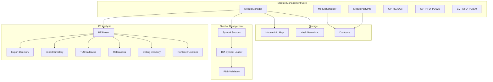
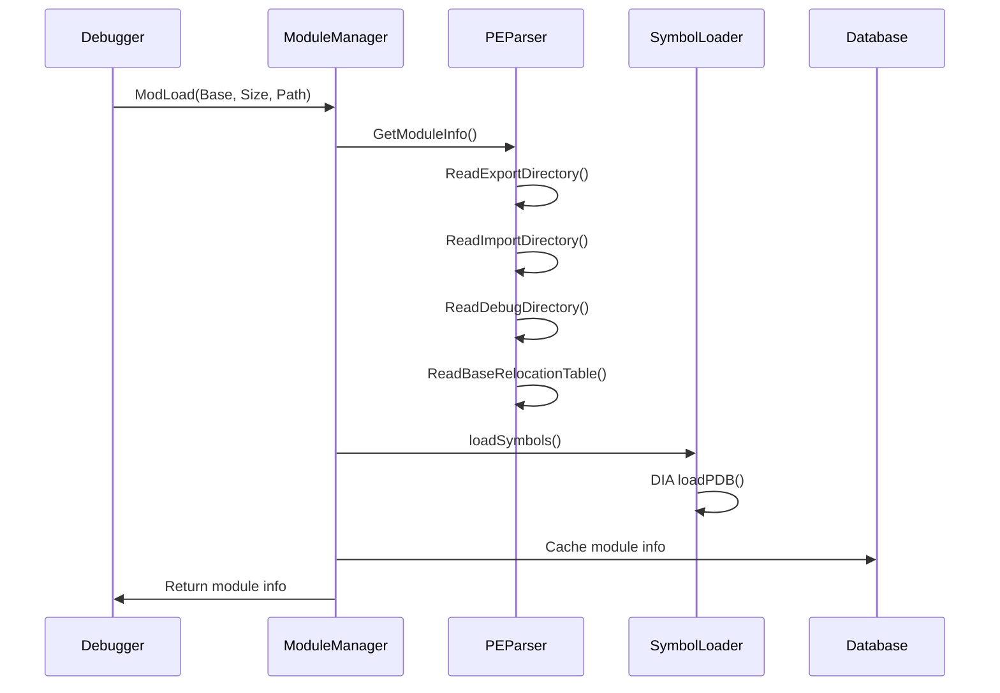
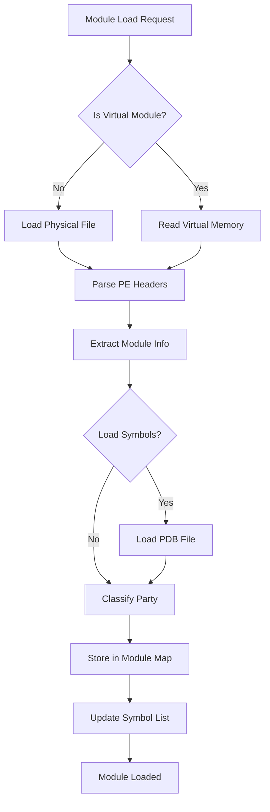

# Module Management

The Module Management module is a core component of the x64dbg debugger that handles the loading, analysis, and management of executable modules (DLLs and executables) within the debugging session. It provides comprehensive module information extraction, symbol loading, and module categorization capabilities.

## Overview

The Module Management module serves as the central hub for managing all loaded modules in the debugging session. It performs PE file parsing, extracts module metadata, manages symbol loading, and maintains module party information (user vs system modules). The module integrates with various other debugger components including symbol resolution, memory management, and the GUI.

## Architecture

## Core Components

### ModuleSerializer
- **Purpose**: Handles serialization and deserialization of module party information to/from the database
- **Key Methods**:
  - `Save()`: Serializes module party data to JSON
  - `Load()`: Deserializes module party data from JSON
- **Integration**: Works with the database system to persist module categorization

### CV_INFO_PDB20 & CV_INFO_PDB70
- **Purpose**: Structures for handling CodeView debug information formats
- **Usage**: Parse PDB (Program Database) information from PE files
- **Formats**: 
  - PDB20: Older NB10 format
  - PDB70: Newer RSDS format with GUID support

### CV_HEADER
- **Purpose**: Base header structure for CodeView information
- **Fields**: Signature and offset information
- **Usage**: Common header for both PDB20 and PDB70 formats

### MODULEPARTYINFO
- **Purpose**: Stores module party (user/system) classification information
- **Fields**: Module hash, party type, address information
- **Usage**: Determines whether a module is user or system code

### ModulePartyInfo
- **Purpose**: Hash map for managing module party information
- **Features**: Thread-safe access, database integration
- **Usage**: Provides fast lookup of module party classifications

## Data Flow

## Module Loading Process

## Key Functions

### ModLoad()
- **Purpose**: Loads a new module into the debugger
- **Parameters**: Base address, size, full path, symbol loading flag
- **Process**: 
  1. Creates MODINFO structure
  2. Determines if virtual or physical module
  3. Loads and parses PE file
  4. Extracts exports, imports, debug info
  5. Loads symbols if requested
  6. Adds to module map

### GetModuleInfo()
- **Purpose**: Extracts comprehensive information from PE files
- **Process**:
  1. Validates PE headers
  2. Reads export directory
  3. Reads import directory
  4. Reads TLS callbacks
  5. Reads base relocation table
  6. Reads debug directory
  7. Reads exception directory (x64)

### ReadExportDirectory()
- **Purpose**: Parses and validates export directory
- **Features**:
  - Handles forwarded exports
  - Creates sorted lookup tables
  - Demangles C++ symbols
  - Validates export data integrity

### ReadImportDirectory()
- **Purpose**: Parses import directory and IAT
- **Features**:
  - Supports both ordinal and name imports
  - Handles bounded imports
  - Creates sorted import tables
  - Demangles import names

## Integration with Other Modules

### [Symbol Resolution](Symbol%20Resolution.md)
- **Dependency**: Uses symbol resolution for loading PDB files
- **Integration**: SymbolSourceDIA for DIA-based symbol loading
- **Data Exchange**: Provides symbol information to symbol resolution system

### [Memory Management](Memory%20Management.md)
- **Dependency**: Uses memory management for virtual module reading
- **Integration**: MemRead() for reading virtual module data
- **Data Exchange**: Provides module boundaries to memory management

### [PDB Symbol Loading](PDB%20Symbol%20Loading.md)
- **Dependency**: Relies on PDB loading for symbol information
- **Integration**: Uses SymbolSourceDIA for PDB validation and loading
- **Data Exchange**: Provides PDB validation data and receives symbol information

## Module Party Classification

The module management system classifies modules into different parties:

- **User Modules**: Application and user-space DLLs
- **System Modules**: Windows system DLLs and drivers
- **Classification Method**: Based on file path (system directory check)
- **Persistence**: Stored in database for consistency across sessions

## Security Features

### PE Validation
- **Header Validation**: Strict PE header validation using RtlImageNtHeaderEx equivalent
- **Bounds Checking**: Comprehensive bounds checking for all PE structures
- **Overflow Protection**: Protection against integer overflow in size calculations
- **Anti-Debug Resistance**: Handles common anti-debugging techniques

### Safe Parsing
- **Exception Handling**: Structured exception handling for corrupt PE files
- **Size Validation**: Validates all sizes before memory allocation
- **Pointer Validation**: Ensures all pointers are within valid ranges
- **Wraparound Protection**: Protection against pointer wraparound

## Performance Optimizations

### Lookup Tables
- **Export by Name**: Sorted vector for fast export name lookup
- **Export by RVA**: Sorted vector for fast export address lookup
- **Import by RVA**: Sorted vector for fast import lookup
- **Relocation Table**: Sorted for fast relocation searches

### Caching
- **Module Hash Cache**: Caches module name hashes for fast lookup
- **Symbol Cache**: Supports symbol server cache paths
- **Database Caching**: Persists module party information

## Error Handling

### Validation Failures
- **Invalid PE Files**: Graceful handling of corrupt PE files
- **Missing Directories**: Handles missing export/import directories
- **Invalid RVAs**: Validates all RVAs before use
- **Memory Errors**: Handles memory allocation failures

### Recovery Mechanisms
- **Partial Loading**: Loads available information even if some sections fail
- **Fallback Paths**: Multiple PDB search paths for symbol loading
- **Default Values**: Provides sensible defaults for missing information

## Thread Safety

### Locking Strategy
- **Module List Lock**: Exclusive access for module list modifications
- **Hash Map Lock**: Separate lock for hash name map
- **Database Lock**: Database operations are thread-safe
- **Symbol Loading**: Symbol loading is synchronized

### Concurrent Access
- **Read Operations**: Multiple concurrent readers supported
- **Write Operations**: Exclusive access for modifications
- **Atomic Operations**: Critical sections are minimized

## Database Integration

### Storage Format
- **JSON Format**: Module party information stored as JSON
- **Hash-based Indexing**: Uses module hash as primary key
- **Manual Override**: Supports manual party classification

### Cache Management
- **Save/Load**: Complete save/load functionality for settings
- **Clear Operations**: Ability to clear cached information
- **Consistency**: Maintains consistency with runtime module list

This comprehensive module management system provides the foundation for reliable and efficient module handling within the x64dbg debugger, ensuring accurate analysis and debugging capabilities across all supported module types.