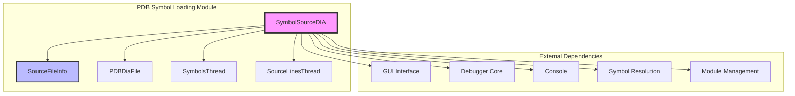
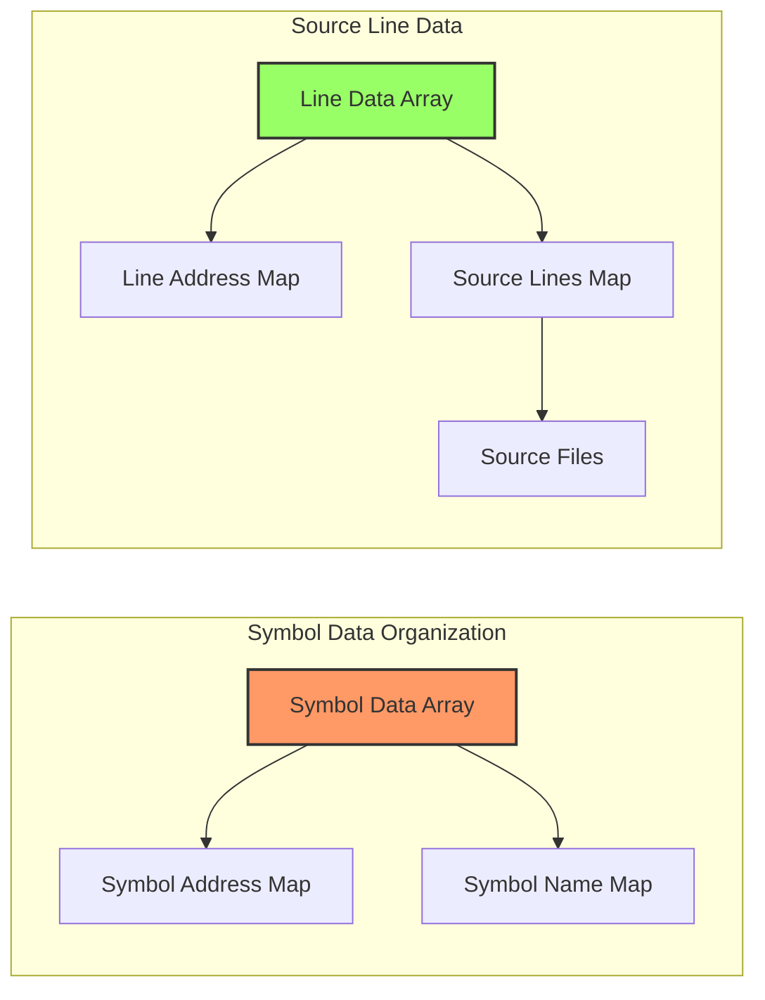
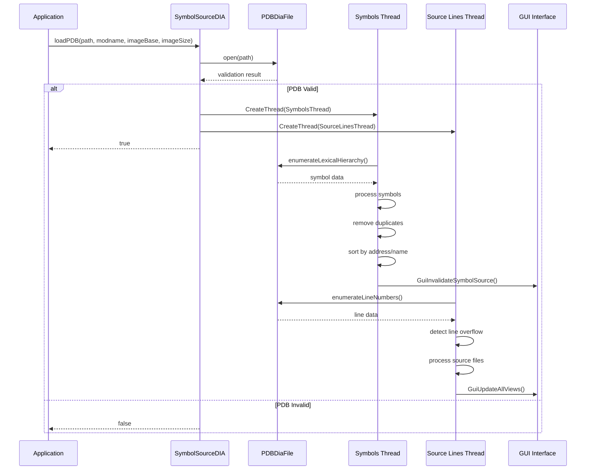
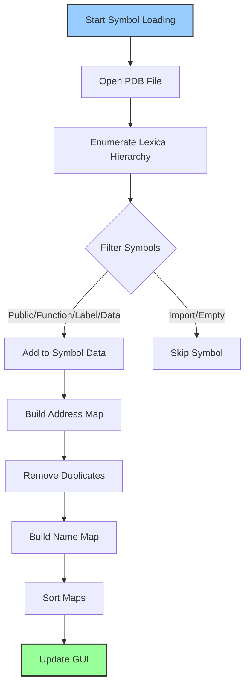
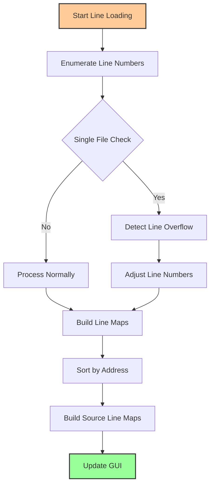

# PDB Symbol Loading Module

## Introduction

The PDB Symbol Loading module is a critical component of the x64dbg debugging framework responsible for loading, parsing, and managing Program Database (PDB) symbol files. PDB files contain debugging information for Windows executables, including symbol names, source line mappings, and type information. This module provides asynchronous loading capabilities, efficient symbol resolution, and comprehensive source code mapping functionality.

## Architecture Overview

The PDB Symbol Loading module implements a multi-threaded architecture that separates symbol loading from source line information processing, ensuring optimal performance and responsiveness during debugging sessions.



## Core Components

### SymbolSourceDIA Class

The `SymbolSourceDIA` class is the primary implementation of the PDB symbol loading functionality. It provides a comprehensive interface for loading and querying symbol information from Microsoft DIA (Debug Interface Access) SDK-compatible PDB files.

#### Key Features:
- **Asynchronous Loading**: Uses separate threads for symbols and source lines
- **Memory Efficient**: Implements optimized data structures for symbol storage
- **Duplicate Removal**: Automatically filters duplicate symbols
- **Line Overflow Detection**: Handles undocumented PDB line number limitations
- **Thread-Safe Operations**: Implements proper synchronization mechanisms

#### Data Structures:



### SourceFileInfo Structure

The `SourceFileInfo` structure provides metadata for source files extracted from PDB files:

```cpp
struct SourceFileInfo
{
    uint32_t sourceFileIndex;  // Index in the source files array
    uint32_t lineCount;        // Number of lines in this file
};
```

## Data Flow Architecture



## Symbol Processing Pipeline

### Symbol Loading Process



### Source Line Processing



## Integration with Other Modules

### Symbol Resolution Module
The PDB Symbol Loading module integrates closely with the [Symbol Resolution](Symbol Resolution.md) module to provide comprehensive symbol information:

- **Symbol Lookup**: Provides symbol information for address resolution
- **Name Resolution**: Supports both decorated and undecorated symbol names
- **Public vs Private**: Prioritizes public symbols over private ones

### Module Management Module
Integration with [Module Management](Module Management.md) for:

- **Module Association**: Links PDB files to loaded modules
- **Base Address Tracking**: Maintains image base and size information
- **Module Validation**: Validates PDB files against loaded modules

### Reference Management Module
Works with [Reference Management](Reference Management.md) to:

- **Cross-References**: Provides symbol information for reference tracking
- **Address Mapping**: Maps virtual addresses to symbol names
- **Symbol Enumeration**: Enumerates symbols within address ranges

## Key Algorithms

### Symbol Filtering
The module implements sophisticated filtering to exclude unwanted symbols:

```cpp
// Filter out import-related symbols
filter("__imp__");
filter("__imp_?");
filter("_imp___");
filter("__NULL_IMPORT_DESCRIPTOR");
filter("__IMPORT_DESCRIPTOR_");
```

### Duplicate Symbol Resolution
Implements intelligent duplicate removal with public symbol priority:

```cpp
// Public symbols have priority over private symbols
return !_symData[a.index].publicSymbol < !_symData[b.index].publicSymbol;
```

### Line Overflow Detection
Handles undocumented PDB limitation of 24-bit line numbers:

```cpp
// Detect overflow when line numbers reset
if((line.lineNumber & 0xfffff0) == 0 && 
   (maxLine & 0xfffffff0) == (overflowValue & 0xfffffff0))
{
    lineOverflows++;
}
```

## Performance Optimizations

### Memory Management
- **Pre-allocation**: Reserves memory for data structures based on expected size
- **String Optimization**: Uses move semantics for string operations
- **Index-Based Storage**: Uses indices instead of pointers for better cache locality

### Search Optimization
- **Binary Search**: Implements binary search for O(log n) lookup performance
- **Sorted Maps**: Maintains sorted maps for efficient range queries
- **Address Mapping**: Uses address-based indexing for symbol lookup

### Threading Model
- **Parallel Loading**: Loads symbols and source lines in parallel
- **Thread Safety**: Uses atomic operations and proper synchronization
- **Graceful Shutdown**: Implements proper thread cleanup mechanisms

## Error Handling

### PDB Validation
- **File Validation**: Validates PDB files before processing
- **Format Checking**: Ensures DIA compatibility
- **Error Logging**: Provides detailed error information

### Loading Failures
- **Graceful Degradation**: Continues operation even if symbol loading fails
- **Partial Loading**: Supports partial symbol loading
- **User Notification**: Notifies GUI of loading status

## Usage Examples

### Basic Symbol Loading
```cpp
SymbolSourceDIA symbolSource;
if(symbolSource.loadPDB("path/to/symbols.pdb", "module.dll", imageBase, imageSize))
{
    // Wait for loading to complete
    symbolSource.waitUntilLoaded();
    
    // Query symbols
    SymbolInfo symInfo;
    if(symbolSource.findSymbolExact(address, symInfo))
    {
        // Use symbol information
    }
}
```

### Source Line Resolution
```cpp
LineInfo lineInfo;
if(symbolSource.findSourceLineInfo(address, lineInfo))
{
    // Source file: lineInfo.sourceFile
    // Line number: lineInfo.lineNumber
}
```

## Future Enhancements

### Planned Features
- **Incremental Loading**: Support for incremental symbol updates
- **Network Symbol Servers**: Integration with Microsoft symbol servers
- **Compressed PDB Support**: Support for compressed PDB formats
- **Type Information**: Enhanced type information extraction

### Performance Improvements
- **Memory-Mapped Files**: Use memory mapping for large PDB files
- **Lazy Loading**: Implement on-demand symbol loading
- **Caching**: Add persistent symbol cache
- **Multi-Core Processing**: Utilize multiple cores for symbol processing

## Dependencies

### External Libraries
- **DIA SDK**: Microsoft Debug Interface Access SDK
- **Windows API**: Thread management and synchronization
- **Standard Library**: C++ standard library components

### Internal Dependencies
- [Console](Console.md): For logging and error reporting
- [Debugger Core](Debugger Core.md): For debugger integration
- [GUI Interface](GUI Interface.md): For user interface updates

## Conclusion

The PDB Symbol Loading module represents a sophisticated implementation of PDB symbol management, providing high-performance symbol resolution and source code mapping capabilities. Its multi-threaded architecture, efficient data structures, and comprehensive error handling make it a robust foundation for debugging operations within the x64dbg framework.