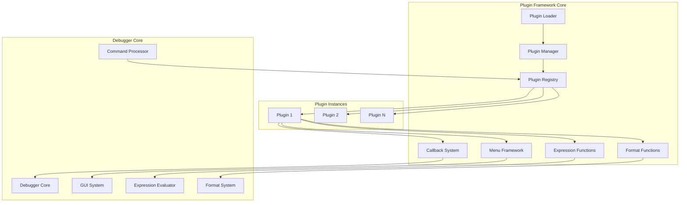
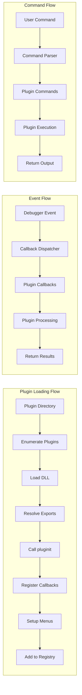
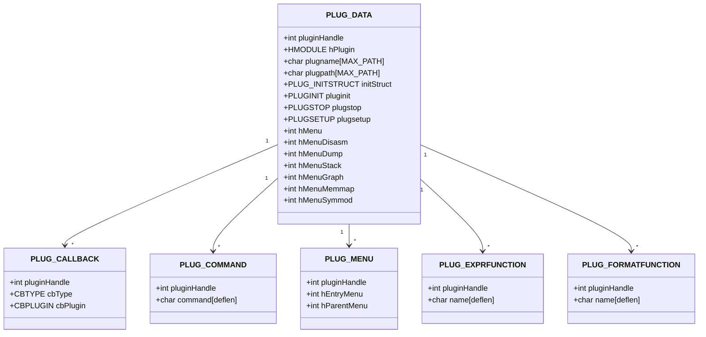
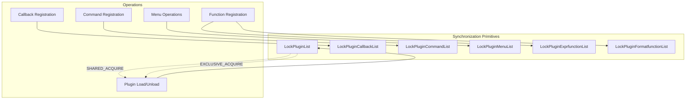
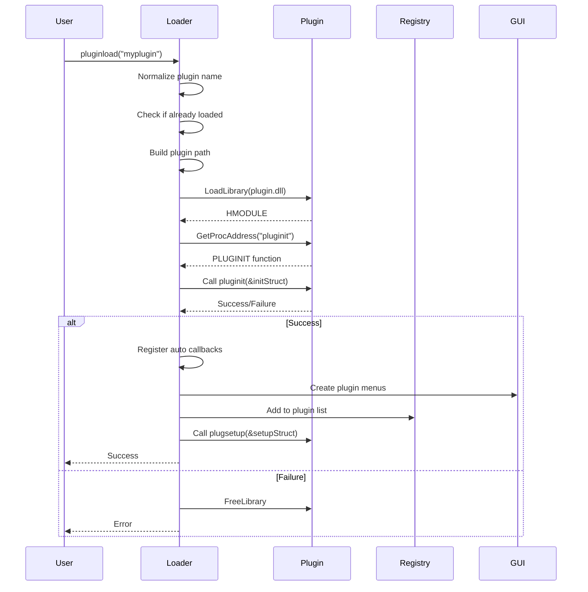
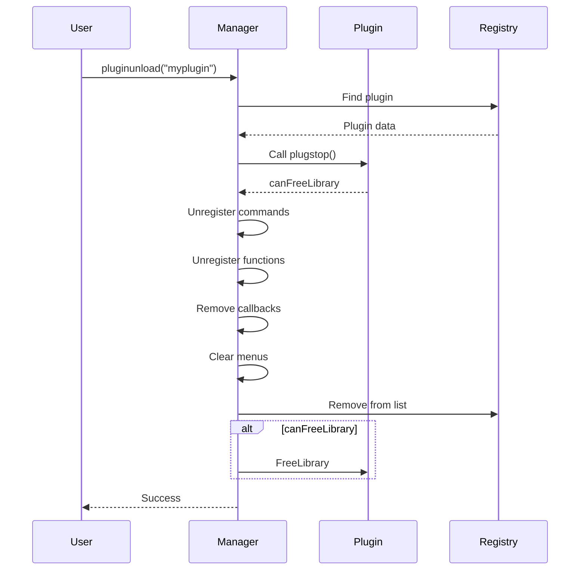

# Plugin Framework Module Documentation

## Introduction

The Plugin Framework module is a core component of the debugging system that provides dynamic plugin loading, management, and integration capabilities. It enables third-party developers to extend the debugger's functionality through a well-defined plugin architecture, supporting custom commands, expression functions, format functions, callbacks, and GUI menu integration.

## Core Purpose

The Plugin Framework serves as the central hub for:
- **Dynamic Plugin Loading**: Runtime loading and unloading of plugin DLLs
- **Plugin Lifecycle Management**: Initialization, setup, and cleanup of plugins
- **Extension Registration**: Registration of custom commands, functions, and callbacks
- **GUI Integration**: Seamless integration of plugin menus and menu entries into the main interface
- **Event Handling**: Plugin callback system for debugger events
- **Thread-Safe Operations**: Concurrent plugin management with proper synchronization

## Architecture Overview

### Component Structure

### Data Flow Architecture

## Core Components

### 1. Plugin Loader (`pluginload`)

The main plugin loading mechanism that handles:
- **Plugin Discovery**: Searches for plugins in specified directories
- **DLL Loading**: Loads plugin DLLs with proper dependency resolution
- **Export Resolution**: Resolves required plugin exports (`pluginit`, `plugstop`, `plugsetup`)
- **Validation**: Ensures plugin compatibility and prevents duplicate loading
- **Registration**: Automatically registers callbacks based on export names

**Key Features:**
- Supports both flat and subdirectory plugin structures
- Handles 32-bit (`.dp32`) and 64-bit (`.dp64`) plugin extensions
- Provides comprehensive error reporting and logging
- Implements thread-safe plugin registration

### 2. ChangeDirectory Utility Class

A RAII (Resource Acquisition Is Initialization) class for temporary directory changes:
- **Automatic Restoration**: Restores original directory on destruction
- **Exception Safety**: Guarantees directory restoration even in error conditions
- **Thread Safety**: Safe for use in multi-threaded environments

### 3. DllDirectory Management Class

Manages DLL directory contexts for proper dependency loading:
- **Dynamic Directory Addition**: Uses `AddDllDirectory` API when available
- **Fallback Support**: Graceful degradation on older Windows versions
- **Automatic Cleanup**: Removes directory contexts on destruction
- **Cookie Management**: Tracks directory cookies for proper cleanup

### 4. ExprFuncWrapper Adapter

Provides seamless integration between plugin expression functions and the debugger's expression system:
- **Type Conversion**: Converts between plugin and debugger expression value formats
- **Memory Management**: Manages argument vectors and user data
- **Callback Adaptation**: Adapts plugin callbacks to expression function signatures
- **Error Handling**: Provides robust error handling for expression evaluation

## Plugin Management System

### Plugin Data Structures

### Thread Safety Architecture

The framework implements comprehensive thread safety through:

## Plugin Integration Points

### 1. Command Integration

Plugins can register custom commands that integrate with the debugger's command system:
- **Command Registration**: `plugincmdregister()` adds commands to the debugger
- **Command Validation**: Ensures command uniqueness and valid syntax
- **Debug-Only Commands**: Support for commands that only work during debugging
- **Automatic Cleanup**: Commands are automatically unregistered on plugin unload

### 2. Expression Function Integration

Plugins can extend the expression evaluation system:
- **Function Registration**: Register custom expression functions
- **Type Support**: Support for various value types (numbers, strings, etc.)
- **Argument Handling**: Flexible argument count and type specifications
- **Wrapper Management**: Automatic wrapper creation and cleanup

### 3. Format Function Integration

Plugins can provide custom data formatting functions:
- **Type-Based Formatting**: Register formatters for specific data types
- **User Data Support**: Pass custom user data to format functions
- **Automatic Registration**: Integration with the debugger's format system

### 4. Menu System Integration

Comprehensive GUI integration through the menu system:
- **Menu Creation**: Create plugin-specific menus and submenus
- **Menu Entry Management**: Add entries with unique handles
- **Icon Support**: Set icons for menus and entries
- **State Management**: Control visibility, checked state, and hotkeys
- **Event Handling**: Automatic callback dispatching for menu events

### 5. Callback System

Extensive callback system for debugger events:
- **Event Types**: 25+ different callback types for various debugger events
- **Automatic Registration**: Callbacks registered based on export names
- **Bulk Registration**: Support for `CBALLEVENTS` export
- **Thread Safety**: Safe callback invocation with proper locking

## Plugin Lifecycle

### Loading Process

### Unloading Process

## Error Handling and Logging

The framework provides comprehensive error handling:

- **Loading Errors**: Detailed error messages for failed plugin loads
- **Registration Failures**: Specific error reporting for registration issues
- **Dependency Issues**: Clear messages for missing dependencies
- **Version Conflicts**: SDK version compatibility checking
- **Resource Cleanup**: Guaranteed cleanup even in error conditions

## Performance Considerations

### Optimization Strategies

1. **Lazy Loading**: Plugins loaded on-demand rather than at startup
2. **Efficient Lookups**: Hash-based lookups for plugin registration
3. **Minimal Locking**: Fine-grained locking to reduce contention
4. **Resource Pooling**: Reuse of plugin handles and data structures
5. **Batch Operations**: Support for loading/unloading multiple plugins

### Memory Management

- **Automatic Cleanup**: All plugin resources automatically cleaned up
- **Reference Counting**: Proper management of plugin references
- **Memory Pools**: Efficient allocation of plugin data structures
- **Leak Prevention**: RAII patterns prevent resource leaks

## Integration with Other Modules

### Symbol Processing Integration

The Plugin Framework integrates with the [Symbol Processing](Symbol%20Processing.md) module to:
- Provide plugin-specific symbol resolution
- Enable custom symbol filtering through callbacks
- Support plugin-defined symbol formats

### Memory Management Integration

Integration with the [Memory Management](Memory%20Management.md) module enables:
- Plugin-specific memory allocation tracking
- Custom memory providers through plugins
- Memory analysis extensions

### GUI Components Integration

The framework works closely with [GUI Components](GUI%20Components.md) to:
- Integrate plugin menus into the main interface
- Handle plugin-specific GUI events
- Manage plugin dialog windows

## Security Considerations

### Plugin Security

- **Code Signing**: Support for signed plugin verification
- **Sandboxing**: Limited plugin execution context
- **Permission System**: Granular permissions for plugin operations
- **Validation**: Comprehensive validation of plugin inputs

### Safe Loading

- **Path Validation**: Prevents directory traversal attacks
- **DLL Validation**: Verifies plugin DLL integrity
- **Export Validation**: Ensures required exports are present
- **Version Checking**: Prevents incompatible plugin loading

## Best Practices

### Plugin Development

1. **Export Requirements**: Implement `pluginit`, `plugstop`, and optionally `plugsetup`
2. **Error Handling**: Return appropriate error codes from plugin functions
3. **Resource Management**: Clean up all resources in `plugstop`
4. **Thread Safety**: Ensure plugin functions are thread-safe
5. **Version Compatibility**: Check SDK version in `pluginit`

### Performance Guidelines

1. **Minimal Initialization**: Keep `pluginit` fast and lightweight
2. **Lazy Registration**: Register features only when needed
3. **Efficient Callbacks**: Keep callback functions lightweight
4. **Resource Cleanup**: Always clean up in `plugstop`
5. **Memory Usage**: Minimize memory footprint

## Future Enhancements

### Planned Features

- **Hot Reloading**: Support for plugin updates without restart
- **Plugin Dependencies**: Automatic dependency resolution
- **Plugin Marketplace**: Integrated plugin discovery and installation
- **Advanced Sandboxing**: Enhanced security isolation
- **Performance Monitoring**: Built-in plugin performance metrics

### API Evolution

- **Extended Callbacks**: Additional callback types for new debugger features
- **Async Operations**: Support for asynchronous plugin operations
- **Plugin Communication**: Inter-plugin communication mechanisms
- **Configuration Management**: Centralized plugin configuration
- **Update Mechanism**: Automatic plugin update notifications

## Conclusion

The Plugin Framework provides a robust, extensible architecture for enhancing the debugger's capabilities through third-party plugins. Its comprehensive feature set, thread-safe design, and seamless integration with the debugger's core systems make it an essential component for building a powerful, customizable debugging environment. The framework's emphasis on security, performance, and ease of use ensures that both plugin developers and end users can benefit from a rich ecosystem of debugging extensions.