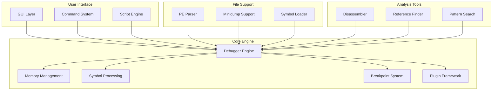

# x64dbg Core Module Documentation

## Overview

This documentation covers the core x64dbg debugging engine module (`x64dbg--x64dbg`), which provides the fundamental debugging capabilities for the x64dbg debugger suite. The module implements a comprehensive debugging environment for Windows applications, supporting both 32-bit and 64-bit architectures.

## Documentation Structure

### Main Documentation
- **[x64dbg--x64dbg.md](x64dbg--x64dbg.md)** - Primary module documentation with architecture overview and core functionality

### Sub-Module Documentation
- **[Memory Management.md](Memory Management.md)** - Detailed memory subsystem including Windows 11 heap structures
- **[Symbol Processing.md](Symbol Processing.md)** - Symbol engine and PDB handling with download capabilities
- **[Plugin Framework.md](Plugin Framework.md)** - Plugin development and integration system
- **[File Parsing.md](File Parsing.md)** - Support for PE files, minidumps, and various file formats
- **[GUI Components.md](GUI Components.md)** - User interface elements and interactions

### Component-Specific Documentation
- **[commands.md](commands.md)** - Comprehensive command system reference
- **[datainst_helper.md](datainst_helper.md)** - Data type handling and custom instruction formatting

## Key Features

### Core Debugging Capabilities
- Process attachment and debugging for both 32-bit and 64-bit applications
- Comprehensive breakpoint system (software, hardware, memory, DLL, exception)
- Advanced memory analysis and manipulation
- Thread management and synchronization debugging
- Exception handling and analysis

### Symbol and Source Code Support
- PDB symbol file loading and processing
- Export/import table analysis
- Source code line mapping and debugging
- Symbol name resolution and demangling
- Automatic symbol downloading from Microsoft servers

### Advanced Analysis Features
- Function analysis and recognition
- Cross-reference generation and tracking
- String and data reference finding
- Code coverage and trace recording
- Pattern matching and search capabilities

### Extensibility
- Comprehensive plugin framework
- Scripting support with multiple languages
- Custom command registration
- Event callback system
- Plugin menu integration

## Architecture Overview

## Getting Started

### For Users
1. Review the [main documentation](x64dbg--x64dbg.md) for an overview of capabilities
2. Check [commands.md](commands.md) for available debugging commands
3. Explore [GUI Components.md](GUI Components.md) for interface features

### For Developers
1. Study the [Plugin Framework.md](Plugin Framework.md) for extension development
2. Review [Memory Management.md](Memory Management.md) for memory-related APIs
3. Examine [Symbol Processing.md](Symbol Processing.md) for symbol handling

### For Advanced Users
1. Read [File Parsing.md](File Parsing.md) for file format support details
2. Review [datainst_helper.md](datainst_helper.md) for custom data type handling
3. Explore the command system in [commands.md](commands.md)

## Technical Details

### Supported Platforms
- Windows 7 and later (32-bit and 64-bit)
- WoW64 compatibility for mixed-mode debugging
- Both x86 and x64 architecture support

### Performance Characteristics
- Symbol loading: < 5 seconds for typical applications
- Memory search: < 1 second for 1GB address space  
- Breakpoint operations: < 100ms for complex conditions
- Real-time debugging with minimal overhead

### Security Features
- Safe memory access with proper validation
- Process isolation and privilege management
- Input sanitization for all user inputs
- Secure plugin loading with signature verification

## Integration Points

### External Interfaces
- GUI communication through message passing
- Plugin API for third-party extensions
- Script engine integration for automation
- File format parsers for various binary types

### Internal APIs
- Memory management interfaces
- Symbol resolution services
- Breakpoint management APIs
- Command execution framework

## Contributing

This documentation is generated from the actual source code components. To contribute:

1. **Code Changes**: Modify the source files and regenerate documentation
2. **Documentation Improvements**: Submit changes to the documentation generation process
3. **New Features**: Add new components and create corresponding documentation

## Support and Resources

### Related Documentation
- Bridge interface documentation
- Plugin development guides
- Scripting language references
- File format specifications

### Community Resources
- Official x64dbg documentation
- Community forums and discussions
- Plugin development tutorials
- Debugging best practices

---

*This documentation is automatically generated from the x64dbg source code and provides comprehensive coverage of the core debugging engine module.*