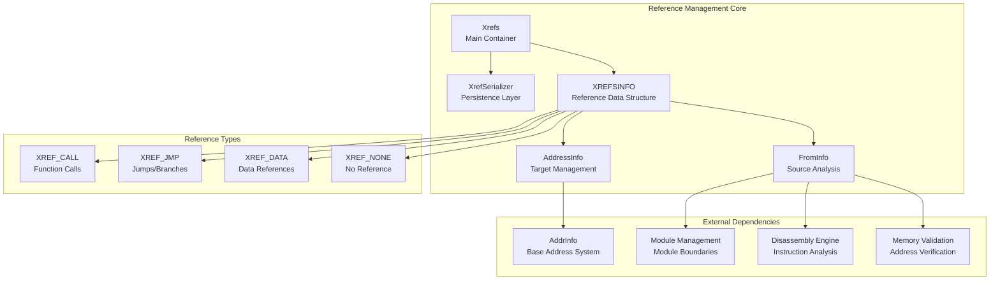
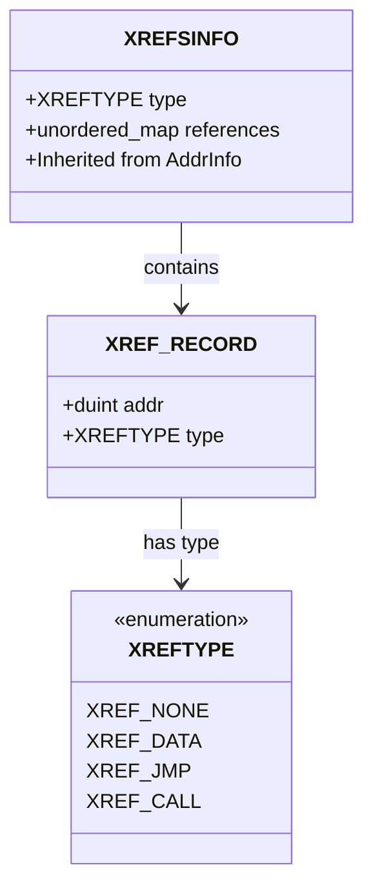
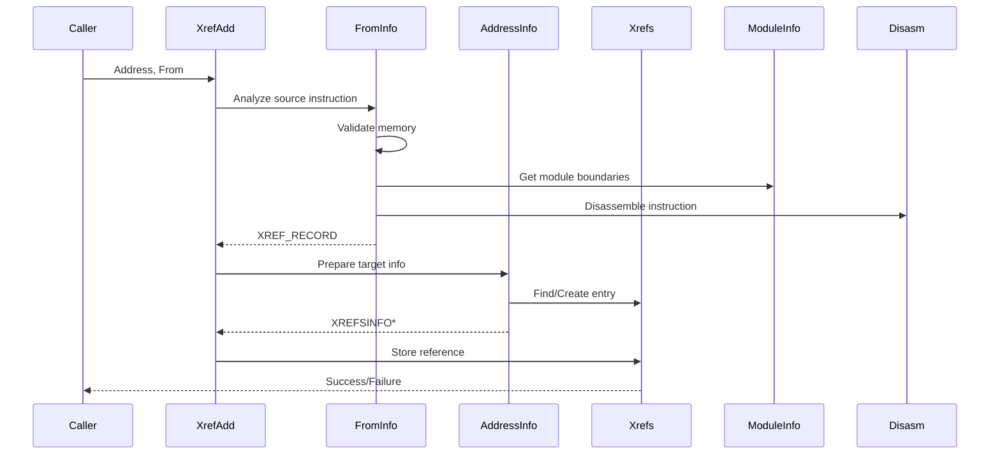
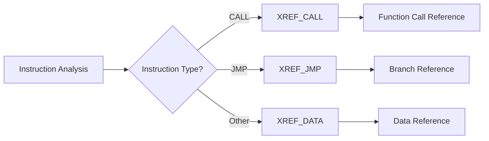
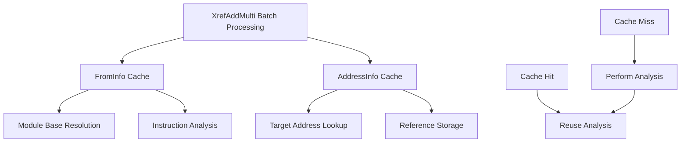
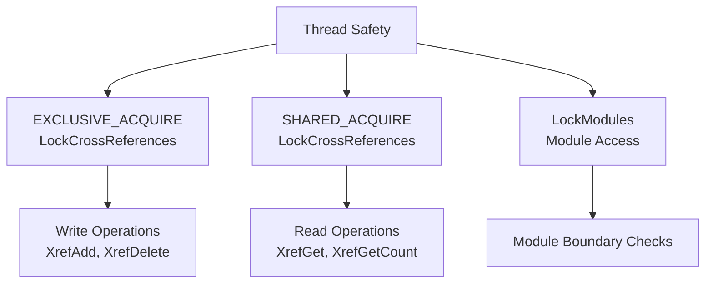
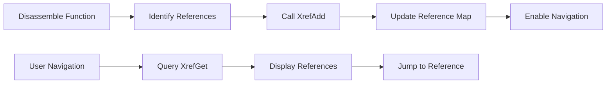
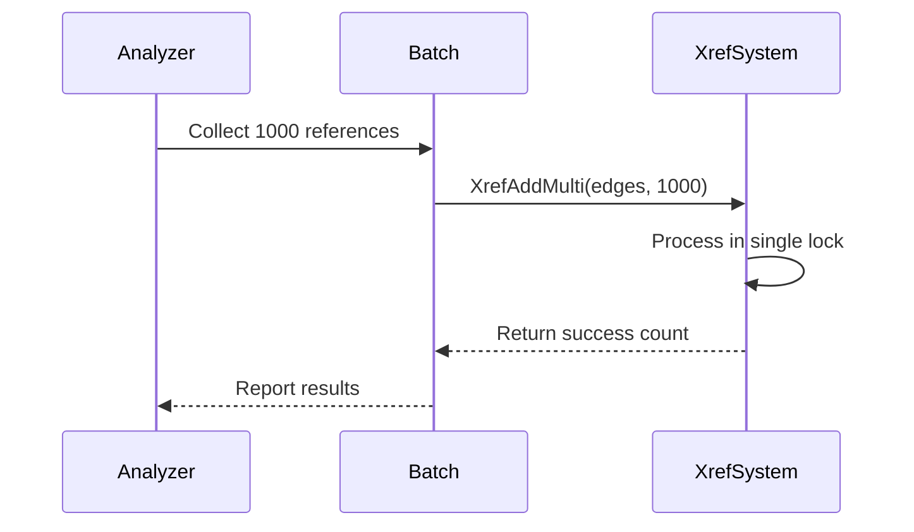

# Reference Management Module

## Introduction

The Reference Management module is a core component of the x64dbg debugging system that tracks and manages cross-references (xrefs) between different memory addresses. It provides essential functionality for understanding code relationships, tracking function calls, jumps, and data references throughout the debugging session. This module enables reverse engineers and debuggers to navigate complex codebases by maintaining a comprehensive map of how different parts of the program interact with each other.

## Architecture Overview

The Reference Management module is built around a centralized cross-reference tracking system that maintains bidirectional relationships between memory addresses. The architecture follows a hash-based storage pattern with serialization capabilities for persistence across debugging sessions.



## Core Components

### XREFSINFO Structure

The `XREFSINFO` structure is the fundamental data container for cross-reference information, extending the base `AddrInfo` class with reference-specific data.



### Xrefs Container

The `Xrefs` class serves as the main container for all cross-reference data, implementing a thread-safe hash map with serialization support.

**Key Features:**
- Thread-safe operations using `LockCrossReferences`
- Hash-based storage for O(1) lookup performance
- Integration with the address information system
- JSON-based serialization for persistence

### XrefSerializer

The `XrefSerializer` handles the persistence of cross-reference data, enabling save/load operations across debugging sessions.

**Serialization Format:**
```json
{
    "references": [
        {
            "addr": "0x401000",
            "type": "0x2"
        },
        {
            "addr": "0x401020", 
            "type": "0x1"
        }
    ]
}
```

## Data Flow Architecture



## Reference Type Classification

The module automatically classifies references into three main types based on instruction analysis:

1. **XREF_CALL** - Function calls (CALL instructions)
2. **XREF_JMP** - Unconditional jumps (JMP instructions)  
3. **XREF_DATA** - Data references (memory accesses)



## Performance Optimization

The module implements several performance optimizations:

### Caching Strategy


### Batch Processing
The `XrefAddMulti` function processes multiple references in a single operation, reducing lock contention and improving throughput for bulk operations.

## Thread Safety

The module employs a multi-level locking strategy:



## Integration with Other Modules

### Module Management Integration
The Reference Management module relies on the [Module Management](Module%20Management.md) system for:
- Module base address resolution
- Module size validation
- Cross-module reference validation

### Address Information System
Integration with the base address information system provides:
- Address validation
- Memory layout awareness
- Serialization framework

### Disassembly Engine
The disassembly engine provides instruction analysis for reference type classification.

## API Reference

### Core Functions

#### XrefAdd
```cpp
bool XrefAdd(duint Address, duint From)
```
Adds a single cross-reference from `From` address to `Address`.

#### XrefAddMulti
```cpp
duint XrefAddMulti(const XREF_EDGE* Edges, duint Count)
```
Batch addition of multiple cross-references with optimized processing.

#### XrefGet
```cpp
bool XrefGet(duint Address, XREF_INFO* List)
```
Retrieves all references pointing to the specified address.

#### XrefGetCount
```cpp
duint XrefGetCount(duint Address)
```
Returns the number of references pointing to the specified address.

#### XrefGetType
```cpp
XREFTYPE XrefGetType(duint Address)
```
Returns the highest priority reference type for the specified address.

### Management Functions

#### XrefDeleteAll
```cpp
bool XrefDeleteAll(duint Address)
```
Removes all references to the specified address.

#### XrefDelRange
```cpp
void XrefDelRange(duint Start, duint End)
```
Removes all references within the specified address range.

#### XrefClear
```cpp
void XrefClear()
```
Clears all cross-reference data.

### Persistence Functions

#### XrefCacheSave
```cpp
void XrefCacheSave(JSON Root)
```
Saves the cross-reference database to JSON format.

#### XrefCacheLoad
```cpp
void XrefCacheLoad(JSON Root)
```
Loads the cross-reference database from JSON format.

## Usage Patterns

### Code Analysis Workflow


### Batch Processing Example


## Error Handling

The module implements robust error handling for:
- Invalid memory addresses
- Cross-module boundary violations
- Memory access failures
- Module resolution failures

All operations validate addresses through the memory management system before processing.

## Performance Characteristics

- **Lookup Time**: O(1) average case via hash map
- **Insertion Time**: O(1) average case with caching
- **Memory Usage**: Linear with reference count
- **Serialization**: O(n) where n is total reference count
- **Thread Contention**: Minimized through batch operations

## Future Enhancements

Potential improvements to the Reference Management module include:
- Reference direction tracking (bidirectional xrefs)
- Reference strength/weight metrics
- Temporal reference tracking
- Advanced filtering and search capabilities
- Integration with static analysis tools