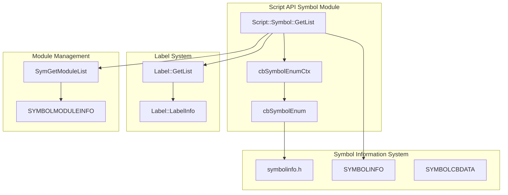
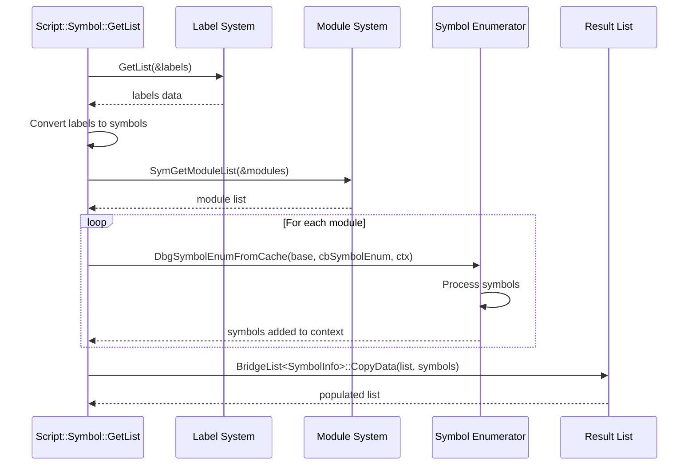
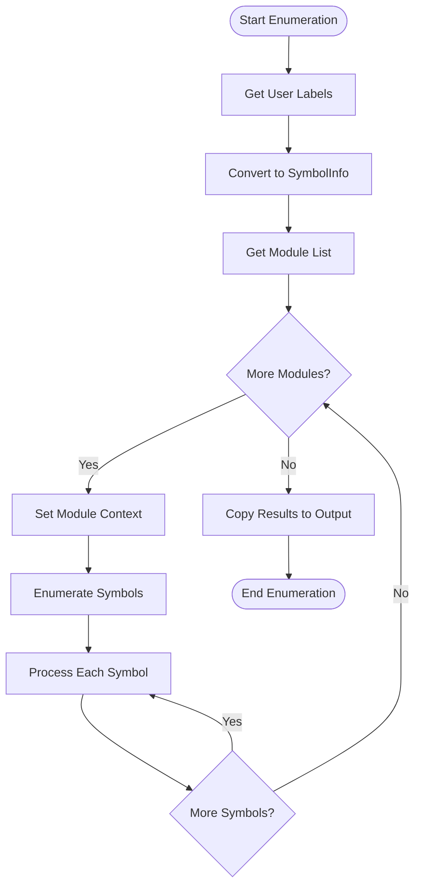

# Script API Symbol Module Documentation

## Introduction

The Script API Symbol module provides a comprehensive interface for symbol enumeration and management within the x64dbg debugging environment. This module serves as a bridge between the internal symbol information system and script-based automation, enabling users to programmatically access and manipulate symbol data during debugging sessions.

The module handles various symbol types including imports, exports, functions, and user-defined labels, providing a unified API for symbol enumeration across different modules loaded in the debugging session.

## Architecture Overview

### Core Components

The Script API Symbol module is built around a single core component that orchestrates symbol enumeration:

- **cbSymbolEnumCtx**: A context structure that manages the enumeration process by coordinating between symbol modules and the resulting symbol list

### Module Relationships



## Data Flow Architecture

### Symbol Enumeration Process



## Component Details

### cbSymbolEnumCtx Structure

The `cbSymbolEnumCtx` structure serves as the primary context carrier during symbol enumeration:

```cpp
struct cbSymbolEnumCtx
{
    const SYMBOLMODULEINFO* module;           // Current module being processed
    std::vector<Script::Symbol::SymbolInfo>* symbols;  // Accumulated symbol list
};
```

This structure maintains the state between the enumeration callback and the main processing function, ensuring that symbol information is correctly associated with its originating module.

### Symbol Processing Logic

The symbol enumeration process implements sophisticated logic for handling different symbol types and name decorations:

1. **Symbol Name Resolution**: The system prioritizes undecorated names over decorated ones when available
2. **Symbol Type Classification**: Symbols are categorized as Import, Export, or Function based on their type
3. **Memory Management**: Proper cleanup of dynamically allocated symbol names using BridgeFree
4. **Relative Address Calculation**: RVA (Relative Virtual Address) is calculated by subtracting module base from symbol address

## Integration with Other Systems

### Symbol Information System

The module heavily relies on the [Symbol Resolution](Symbol Resolution.md) system for accessing symbol data. The `DbgGetSymbolInfo` function provides detailed symbol information including:
- Decorated and undecorated symbol names
- Symbol addresses and types
- Memory management flags

### Label System Integration

User-defined labels from the [Label System](Label System.md) are seamlessly integrated into the symbol enumeration process. The module converts `Label::LabelInfo` structures to `Script::Symbol::SymbolInfo` structures, ensuring that user annotations appear alongside programmatically discovered symbols.

### Module Management

The [Module Management](Module Management.md) system provides the foundation for symbol enumeration by maintaining the list of loaded modules and their base addresses. Each module's symbols are enumerated independently, allowing for organized symbol discovery.

## API Interface

### Primary Function: GetList

```cpp
SCRIPT_EXPORT bool Script::Symbol::GetList(ListOf(SymbolInfo) list)
```

**Purpose**: Enumerates all symbols across all loaded modules and user-defined labels

**Parameters**:
- `list`: Output parameter that receives the enumerated symbols

**Returns**: `true` on success, `false` on failure

**Symbol Types**:
- **Import**: External functions imported by the module
- **Export**: Functions exported by the module for external use
- **Function**: Internal functions within the module

## Data Structures

### SymbolInfo Structure

The primary data structure returned by the enumeration:

```cpp
struct SymbolInfo {
    char mod[256];      // Module name
    duint rva;          // Relative Virtual Address
    char name[256];     // Symbol name
    bool manual;        // true for user-defined labels
    SymbolType type;    // Import, Export, or Function
};
```

## Process Flow

### Complete Enumeration Workflow



## Error Handling

The module implements several error handling mechanisms:

1. **Label System Failure**: If `Label::GetList` fails, the function returns false immediately
2. **Memory Allocation**: Uses safe string copying functions (`strncpy_s`, `strcpy_s`) to prevent buffer overflows
3. **Symbol Processing**: Includes debug assertions (`__debugbreak()`) for unexpected symbol types during development

## Performance Considerations

### Optimization Strategies

1. **Pre-allocation**: The symbol vector is pre-allocated with capacity based on label count to minimize reallocations
2. **Efficient Lookup**: Uses module base addresses for quick symbol-to-module association
3. **Memory Management**: Immediate cleanup of temporary symbol name allocations

### Scalability

The enumeration process scales linearly with:
- Number of loaded modules
- Number of symbols per module
- Number of user-defined labels

## Security Considerations

1. **Buffer Safety**: All string operations use safe functions with explicit size limits
2. **Memory Validation**: Proper validation of symbol pointers before processing
3. **Resource Cleanup**: Ensures all dynamically allocated memory is properly freed

## Future Enhancements

The code includes a TODO comment indicating planned improvements:
- Enumeration of actual symbols beyond user-defined labels
- Virtual symbols (sub_XXXXXX pattern matching)
- Enhanced import/export enumeration

This suggests the module is designed for extensibility and will incorporate additional symbol discovery mechanisms in future versions.