# Simple Script Module

## Introduction

The Simple Script module is a core component of the x64dbg debugger that provides a lightweight scripting engine for automating debugging tasks. It implements a custom scripting language with support for labels, branches, commands, breakpoints, and stack-based execution flow control. The module enables users to create automated debugging workflows, perform repetitive tasks, and extend the debugger's functionality through script execution.

## Architecture Overview

The Simple Script module operates as an embedded scripting engine within the debugger, providing a complete execution environment with its own instruction pointer, call stack, and state management system.

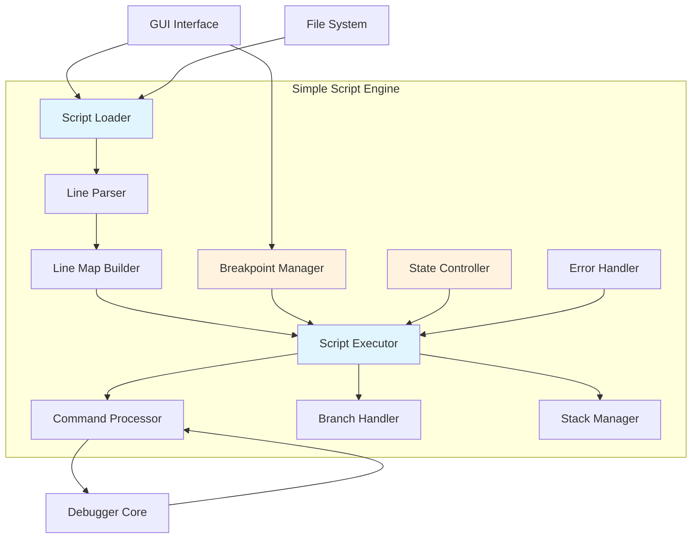

## Core Components

### SCRIPTFRAME Structure

The `SCRIPTFRAME` structure represents execution context within the script engine, maintaining the instruction pointer and execution state for proper call stack management.

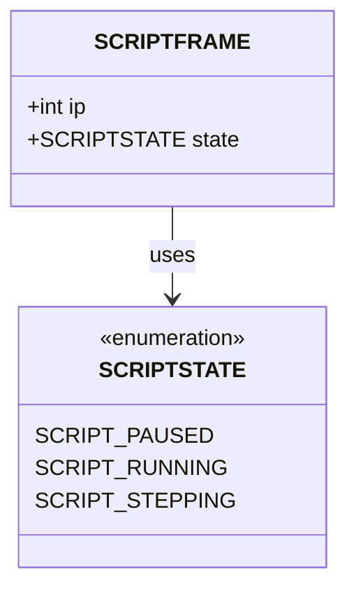

**Key Responsibilities:**
- Maintains instruction pointer for script execution flow
- Tracks execution state (paused, running, stepping)
- Enables proper call stack management for script functions
- Supports nested script execution through stack frames

### SCRIPTBP Structure

The `SCRIPTBP` structure manages script breakpoints, providing debugging capabilities within script execution.

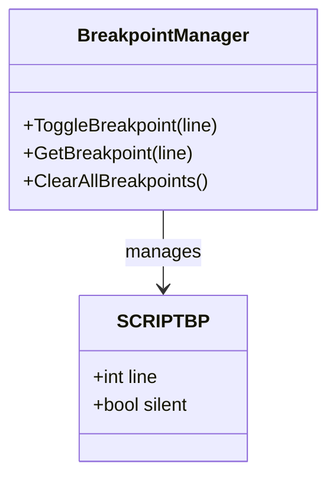

**Key Responsibilities:**
- Defines breakpoint locations within script code
- Controls breakpoint visibility in GUI
- Enables script debugging and step-through execution
- Supports both user-set and internal breakpoints

### LINEMAPENTRY Structure

The `LINEMAPENTRY` structure represents parsed script lines with type information and associated data, forming the core of the script's intermediate representation.

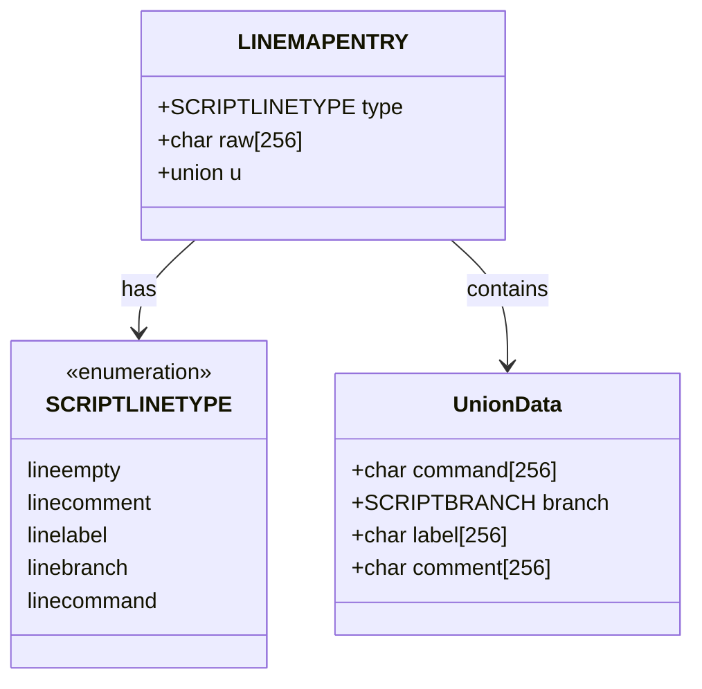

**Key Responsibilities:**
- Stores parsed script line information
- Maintains both raw and processed line data
- Handles different line types (commands, labels, branches, comments)
- Provides unified access to line-specific data through unions

## Data Flow Architecture

### Script Loading and Parsing Flow

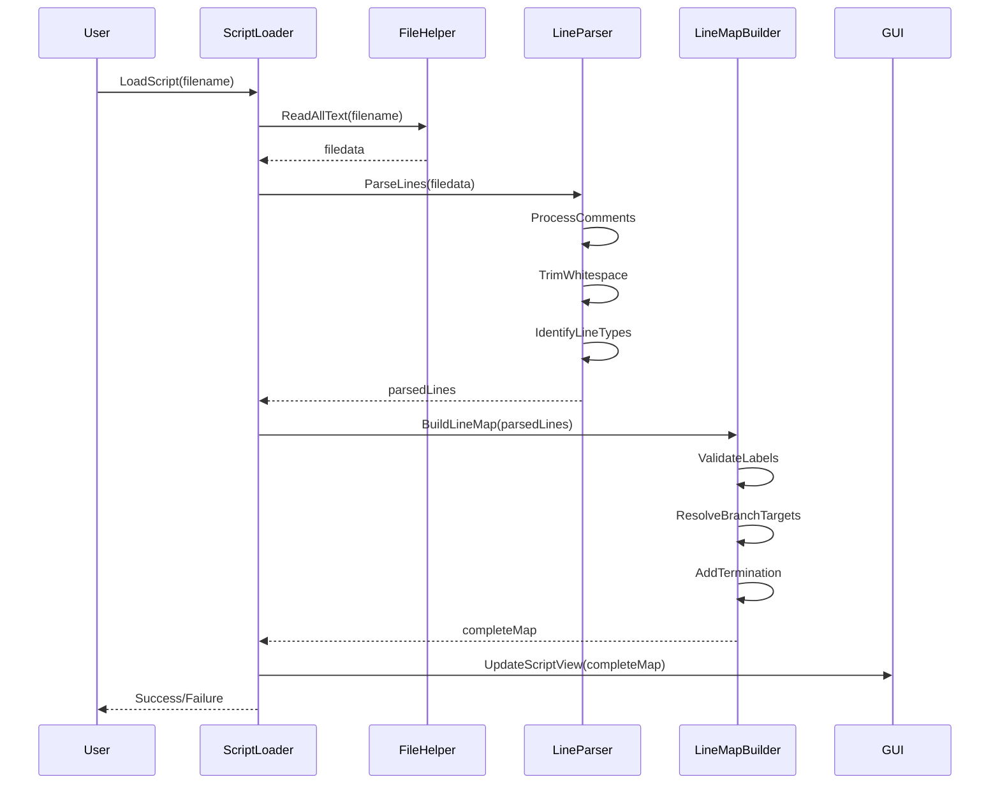

### Script Execution Flow

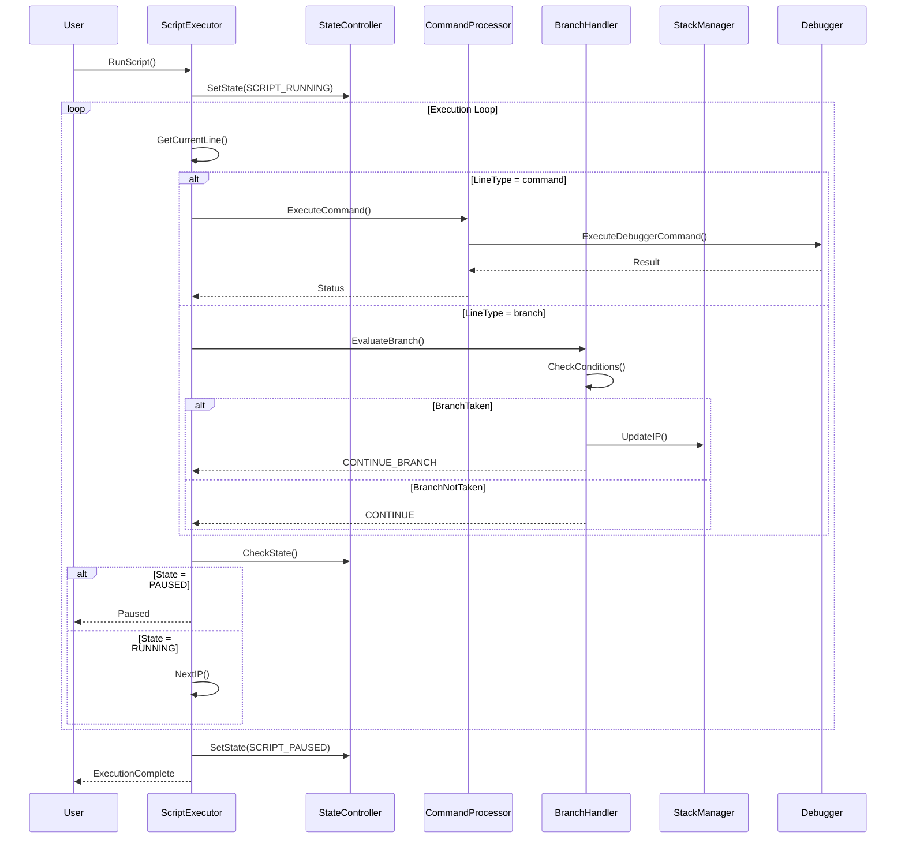

## Component Interactions

### Script State Management

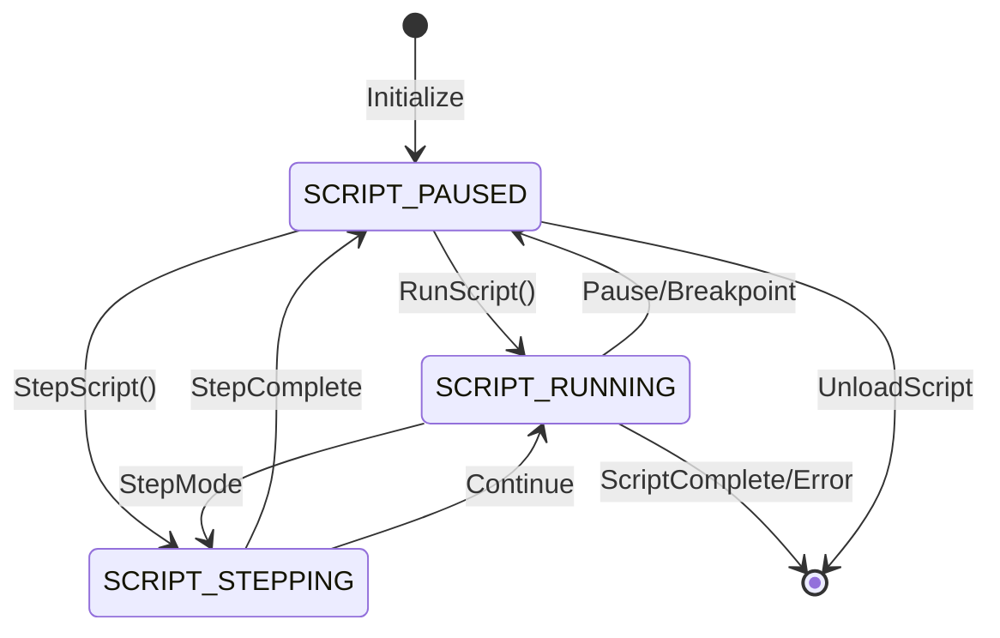

### Branch Evaluation System

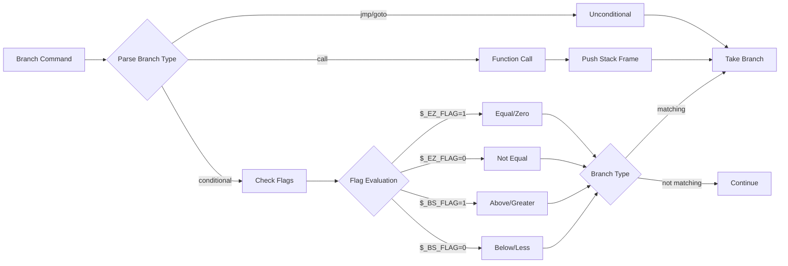

## Integration with Debugger System

### Dependency Relationships

The Simple Script module integrates with multiple debugger subsystems:

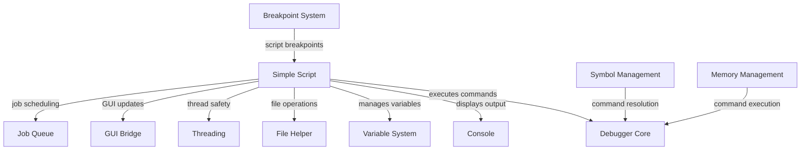

### Thread Safety Architecture

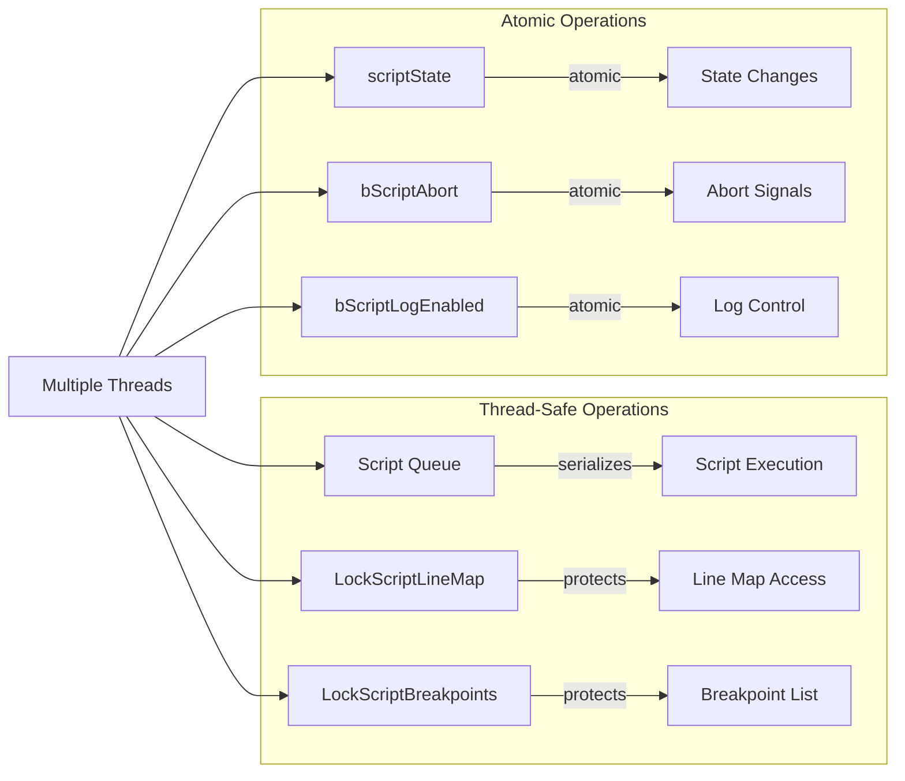

## Error Handling and Recovery

### Error Management Flow

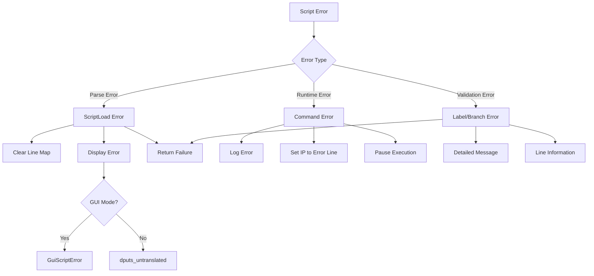

## Performance Considerations

### Execution Optimization

- **Line Map Caching**: Parsed script lines are cached to avoid re-parsing during execution
- **Branch Target Resolution**: Branch destinations are pre-calculated during script loading
- **Atomic State Management**: Script state changes use atomic operations for thread safety
- **Job Queue Serialization**: Script operations are serialized through a job queue to prevent race conditions

### Memory Management

- **Static Data Structures**: Core script data structures are statically allocated for performance
- **Shared Locks**: Read-heavy operations use shared locks for concurrent access
- **Exclusive Locks**: Write operations use exclusive locks to ensure data consistency

## API Integration

### External Interfaces

The Simple Script module provides several public interfaces for external integration:

- **ScriptLoadAwait**: Synchronous script loading with GUI feedback
- **ScriptRunAsync/ScriptRunAwait**: Asynchronous and synchronous script execution
- **ScriptStepAsync**: Single-step script execution for debugging
- **ScriptCmdExecAwait**: Direct command execution within script context
- **ScriptBpToggleLocked**: Breakpoint management with thread safety

### GUI Bridge Integration

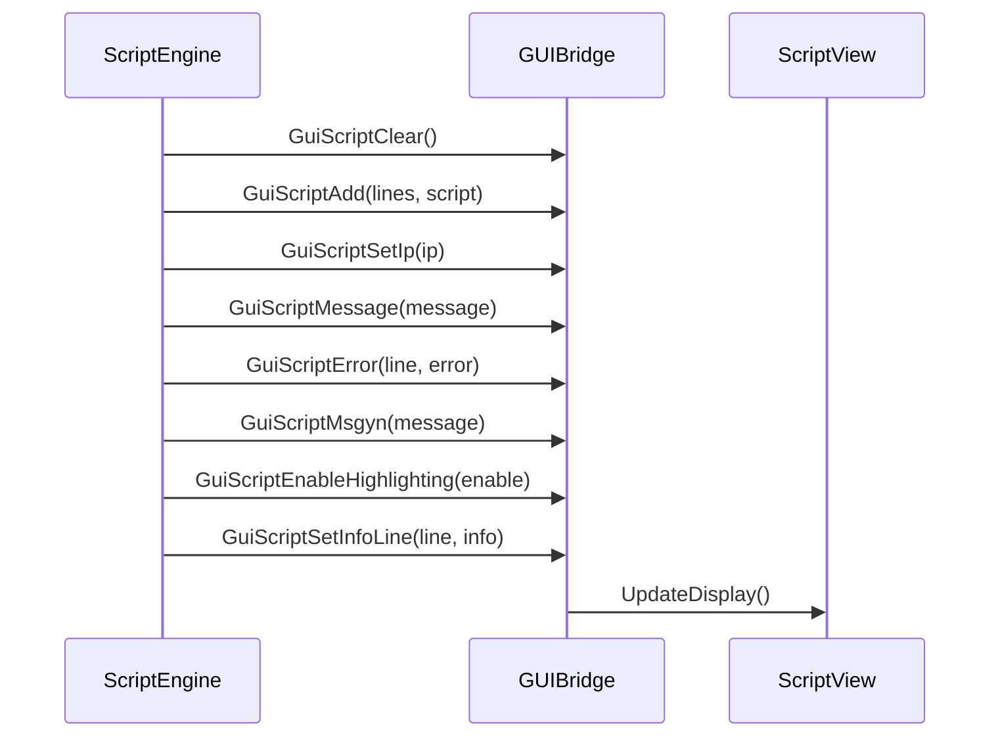

## Security Considerations

### Script Safety Features

- **Timeout Protection**: Scripts automatically timeout after 30 seconds to prevent infinite loops
- **Recursive Execution Prevention**: Scripts cannot recursively execute other scripts
- **State Validation**: Script state is validated before execution to prevent invalid operations
- **Breakpoint Safety**: Breakpoints are validated against the line map to prevent invalid access

### Command Execution Security

- **Command Validation**: All commands are validated before execution
- **Debugger State Checks**: Script execution requires the debugger to be in a valid state
- **Error Propagation**: Errors are properly propagated to prevent silent failures

## Related Modules

- [Breakpoint System](Breakpoint%20System.md) - Script breakpoint integration
- [GUI Bridge](GUI%20Bridge.md) - Script display and user interaction
- [Job Queue](Job%20Queue.md) - Script execution serialization
- [Variable System](Variable%20System.md) - Script variable access and manipulation
- [Console](Console.md) - Script output and error display
- [File Helper](File%20Helper.md) - Script file loading and management