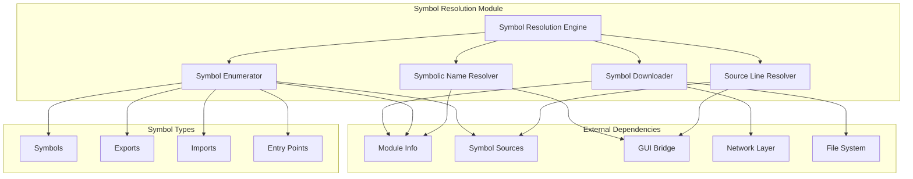
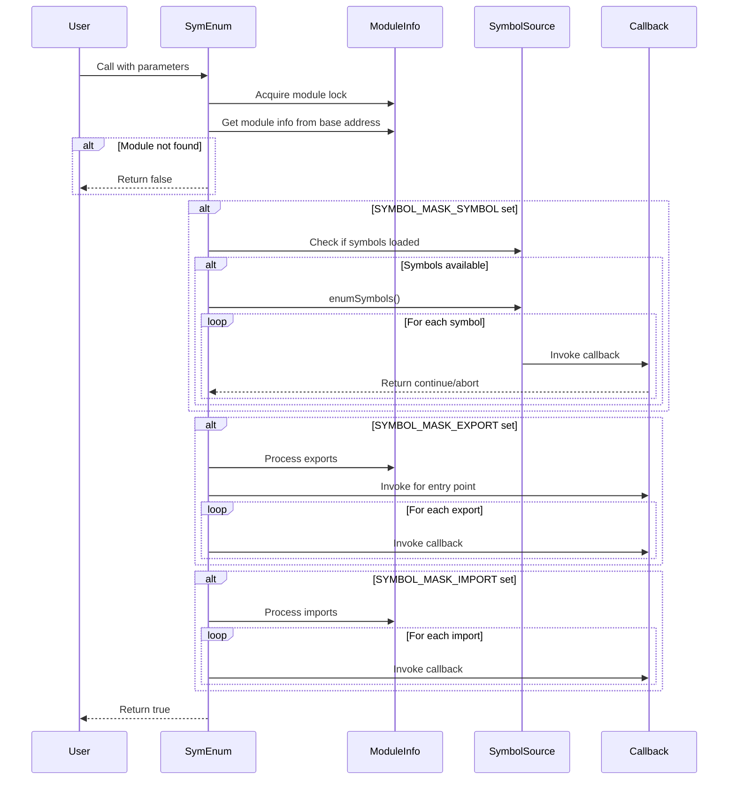
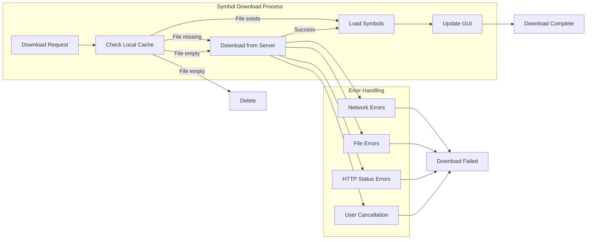
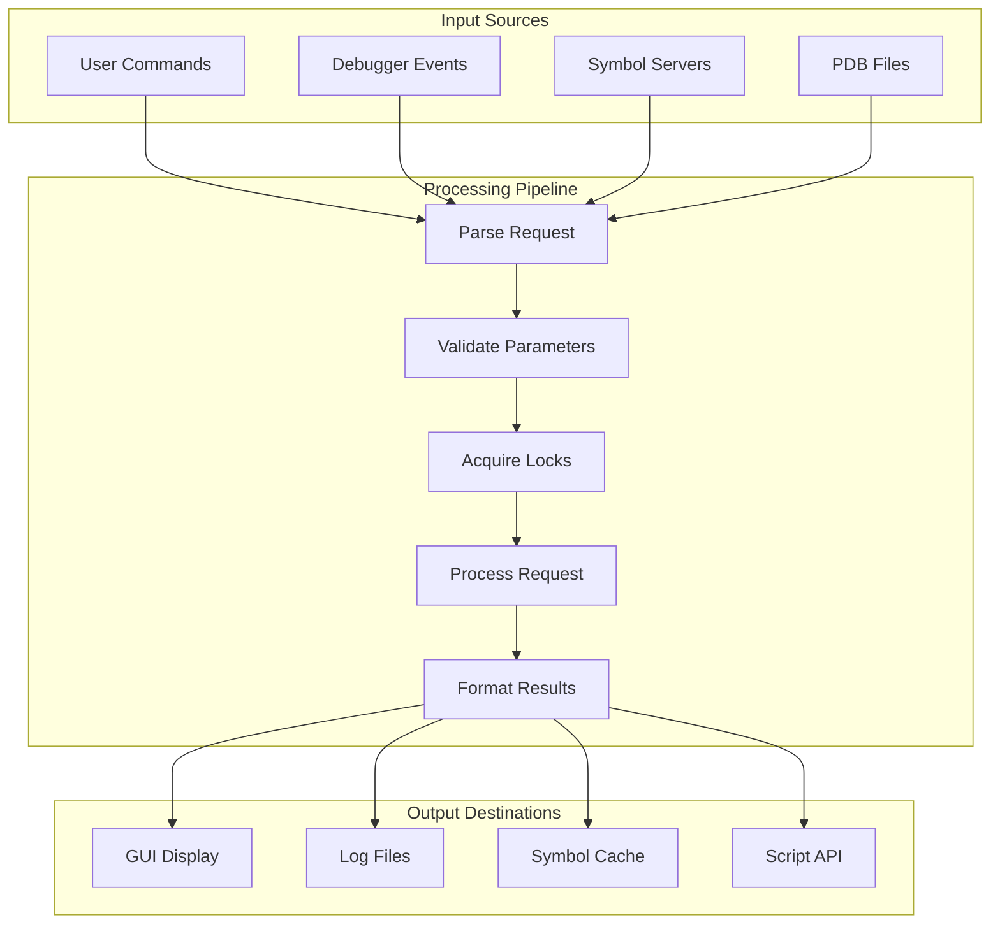

# Symbol Resolution Module

## Introduction

The Symbol Resolution module is a critical component of the x64dbg debugger that handles the loading, management, and resolution of debugging symbols. It provides functionality for downloading symbols from remote servers, enumerating symbols within modules, and resolving addresses to symbolic names. This module serves as the bridge between raw memory addresses and human-readable symbol information, enabling developers to understand program execution at a higher level.

## Architecture Overview

The Symbol Resolution module operates as a central hub for symbol management within the debugger, interfacing with multiple subsystems including module management, GUI components, and external symbol servers.



## Core Components

### DownloadBaseGuard

The `DownloadBaseGuard` is a RAII (Resource Acquisition Is Initialization) class that manages the symbol downloading state. It automatically sets the global `symbolDownloadingBase` variable when constructed and resets it when destroyed, ensuring thread-safe progress reporting during symbol downloads.

**Key Responsibilities:**
- Manages download state indicator
- Triggers GUI table repaints during downloads
- Ensures proper cleanup of download state

### SYMBOLCBDATA

The `SYMBOLCBDATA` structure encapsulates callback information for symbol enumeration operations. It provides a unified interface for passing user-defined callbacks and data through the symbol enumeration pipeline.

**Structure:**
```cpp
struct SYMBOLCBDATA
{
    CBSYMBOLENUM cbSymbolEnum;  // Callback function pointer
    void* user;                 // User data pointer
};
```

## Symbol Enumeration Process

The symbol enumeration process is orchestrated through the `SymEnum` function, which provides a unified interface for iterating through different types of symbols within a module.



## Symbol Download Architecture

The symbol download system provides automated retrieval of debugging symbols from remote symbol servers, with Microsoft Symbol Server as the default source.



## Symbol Resolution Algorithms

### Address-to-Symbol Resolution

The module implements multiple resolution strategies for converting memory addresses to symbolic information:

1. **Exact Symbol Lookup**: Searches for symbols at the exact address
2. **Nearest Symbol Lookup**: Finds the closest symbol at or below the address
3. **Multi-type Resolution**: Checks symbols, exports, imports, and entry points

### Symbol Name Resolution

The `SymAddrFromName` function implements intelligent symbol name resolution with support for:
- Module-qualified names (`module.symbol`)
- Ordinal filtering (skips `Ordinal#XXX` patterns)
- Case-insensitive matching
- Cross-module symbol search

## Integration with Other Modules

### Module Management Integration

The Symbol Resolution module heavily depends on the [Module Management](Module Management.md) system for:
- Module base address resolution
- Symbol source management
- Export/import table access
- PDB file information retrieval

### GUI Bridge Integration

Symbol information is communicated to the GUI through the [GUI Bridge](GUI Bridge.md) system:
- Module list updates
- Progress reporting during downloads
- Symbol log messages
- Table view repaints

### Reference System Integration

Symbol resolution supports the [Reference Management](Reference Management.md) system by:
- Providing symbolic names for addresses
- Enabling cross-references between symbols
- Supporting address-to-name conversions for reference display

## Data Flow Architecture



## Symbol Types and Masks

The module supports different symbol types through a bitmask system:

- `SYMBOL_MASK_SYMBOL`: Debug symbols from PDB files
- `SYMBOL_MASK_EXPORT`: Exported functions from PE export tables
- `SYMBOL_MASK_IMPORT`: Imported functions from PE import tables

## Error Handling and Recovery

The symbol resolution system implements comprehensive error handling:

1. **Network Errors**: Handles connection failures, timeouts, and HTTP errors
2. **File System Errors**: Manages permission issues, disk space, and file corruption
3. **Module State Errors**: Handles unloaded modules and invalid addresses
4. **Symbol Loading Errors**: Recovers from corrupted or incompatible symbol files

## Performance Considerations

### Caching Strategies
- Local symbol cache to avoid redundant downloads
- In-memory symbol indices for fast lookup
- Module information caching to reduce lock contention

### Search Optimization
- Binary search for export/import tables
- Sorted symbol indices
- Range-based enumeration to minimize iterations

### Thread Safety
- Shared locks for read operations
- Exclusive locks for symbol loading
- Atomic operations for global state

## Configuration and Settings

The symbol resolution system respects several configuration options:

- `szSymbolCachePath`: Local directory for cached symbols
- `bForceLoadSymbols`: Force reload of symbols even if cached
- Symbol server URLs and authentication
- Download timeout and retry settings

## API Reference

### Main Functions

- `SymEnum()`: Enumerate symbols within a range
- `SymDownloadSymbol()`: Download symbols for a specific module
- `SymAddrFromName()`: Resolve symbol name to address
- `SymGetSymbolicName()`: Get symbolic representation of address
- `SymbolFromAddressExact()`: Get exact symbol information
- `SymbolFromAddressExactOrLower()`: Get nearest symbol information
- `SymGetSourceLine()`: Resolve address to source file and line
- `SymGetSourceAddr()`: Resolve source location to address

### Callback Types

- `CBSYMBOLENUM`: Callback for symbol enumeration
- `SYMBOLPTR`: Pointer to symbol information
- `SYMBOLINFO`: Symbol information structure

## Security Considerations

The symbol resolution system implements several security measures:

1. **Path Validation**: Ensures symbol cache paths are valid and accessible
2. **Network Security**: Uses HTTPS for symbol downloads
3. **File Integrity**: Validates downloaded symbol files
4. **Access Control**: Respects file system permissions
5. **Input Sanitization**: Validates all user inputs and symbol names

## Future Enhancements

Potential improvements to the symbol resolution system include:

1. **Incremental Symbol Loading**: Load symbols on-demand to reduce memory usage
2. **Symbol Compression**: Compress cached symbols to save disk space
3. **Parallel Downloads**: Download multiple symbols concurrently
4. **Symbol Server Failover**: Support for multiple symbol servers with automatic failover
5. **Custom Symbol Providers**: Plugin interface for custom symbol sources