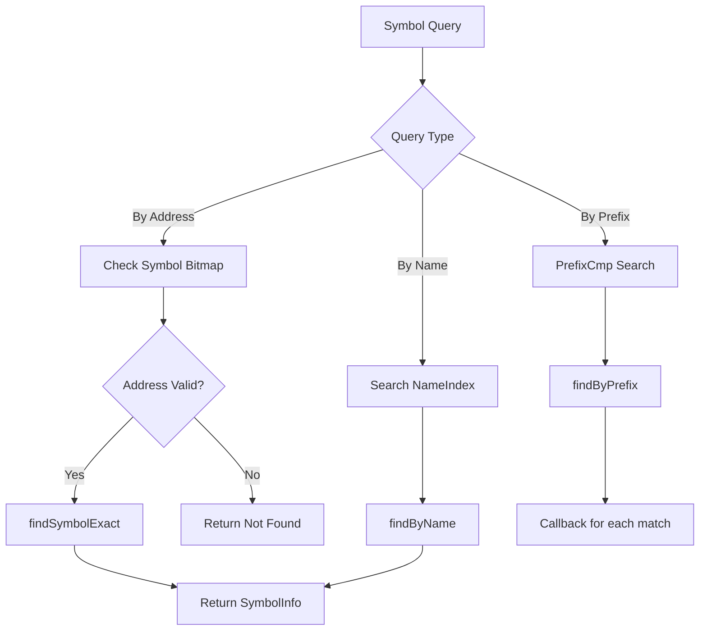
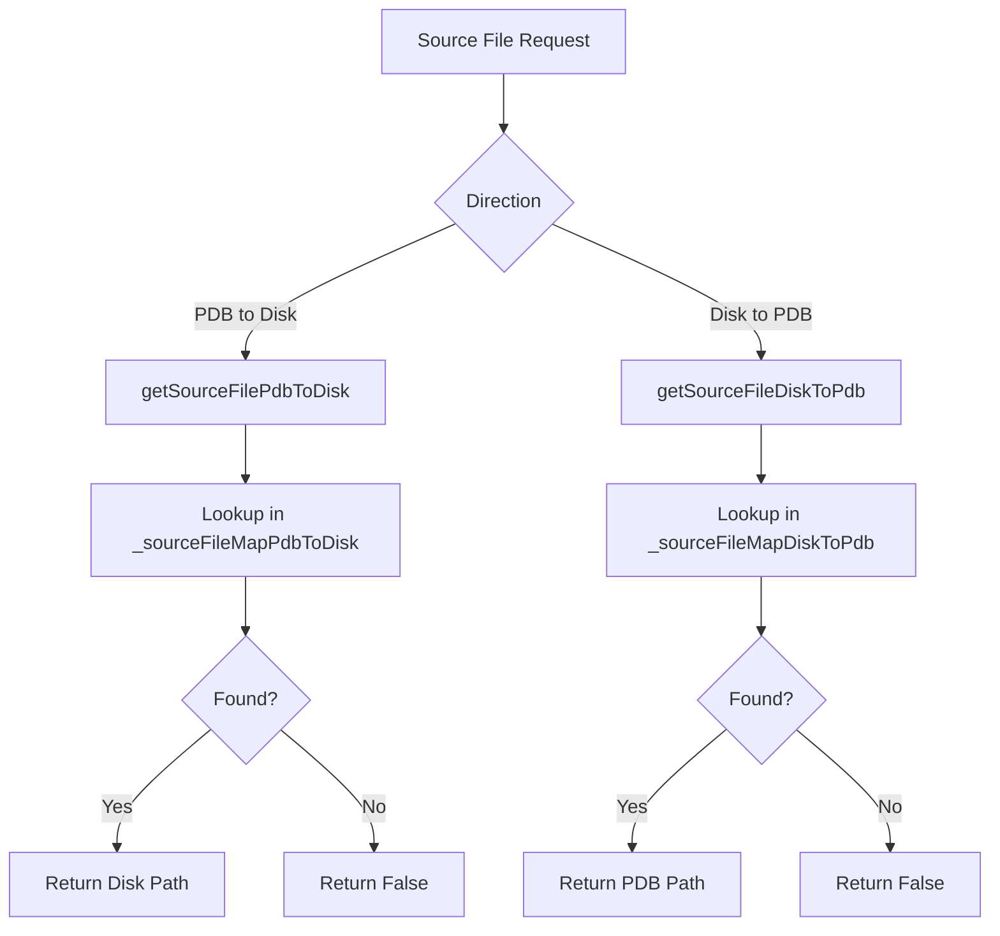
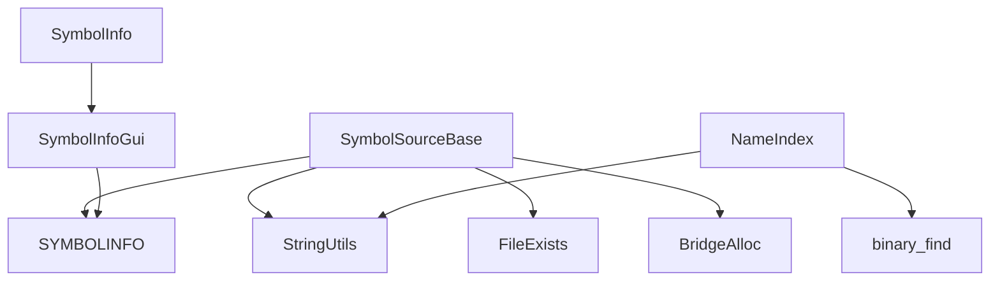

# Symbol Source Base Module

## Introduction

The Symbol Source Base module provides the foundational infrastructure for symbol management and source file mapping in the x64dbg debugger. It serves as an abstract base class that defines the interface for various symbol sources (PDB files, exports, etc.) and implements common functionality for symbol lookup, source file path mapping, and symbol bitmap management.

## Core Functionality

### Symbol Information Management
The module defines core structures for representing symbol information:
- **SymbolInfo**: Contains symbol details including RVA, size, displacement, decorated/undecorated names
- **LineInfo**: Represents source line information with RVA, line number, and source file path
- **NameIndex**: Provides efficient name-based indexing and search capabilities

### Source File Path Mapping
Implements bidirectional mapping between PDB source paths and disk source paths, enabling the debugger to locate source files when paths differ between the build environment and debugging environment.

### Symbol Search and Enumeration
Provides efficient algorithms for:
- Exact symbol lookup by address or name
- Prefix-based symbol search for auto-completion
- Symbol enumeration within address ranges
- Case-sensitive and case-insensitive searches

## Architecture

### Class Hierarchy
```
SymbolSourceBase (Abstract Base Class)
├── Symbol Info Management
├── Source File Mapping
├── Symbol Bitmap Management
└── Virtual Interface Methods
```

### Core Components

#### PrefixCmp Structure
A comparison functor used for efficient prefix-based symbol searching. It implements custom comparison logic that considers only the first `n` characters of symbol names, enabling fast prefix matching in sorted symbol collections.

#### SymbolSourceBase Class
The main abstract base class that provides:
- **Symbol Bitmap**: Tracks invalid addresses to optimize symbol lookups
- **Source File Maps**: Bidirectional PDB-to-disk path mappings
- **Virtual Interface**: Defines the contract for concrete symbol source implementations

## Data Flow

### Symbol Lookup Process


### Source File Mapping


## Component Relationships

### Dependencies


### Integration Points
- **[Symbol Resolution](Symbol%20Resolution.md)**: Provides symbol lookup capabilities for the symbol resolution system
- **[PDB Symbol Loading](PDB%20Symbol%20Loading.md)**: Serves as base class for PDB-specific symbol sources
- **[Module Management](Module%20Management.md)**: Integrates with module loading and enumeration
- **[GUI Bridge](GUI%20Bridge.md)**: Converts internal symbol representations for GUI display

## Key Algorithms

### Binary Search with Prefix Matching
The `PrefixCmp` structure enables efficient prefix-based searching by:
1. Creating a comparison functor that only considers the first `n` characters
2. Using `binary_find` to locate the first potential match
3. Iterating through subsequent entries while the prefix matches
4. Applying case sensitivity filtering as needed

### Source File Mapping Integrity
The mapping system ensures 1:1 relationships by:
1. Checking for existing mappings before creating new ones
2. Preventing duplicate destination mappings
3. Maintaining bidirectional consistency
4. Validating file existence before creating mappings

## Usage Patterns

### Symbol Enumeration
```cpp
// Enumerate symbols in a range
symbolSource->enumSymbols([](const SymbolInfo& info) {
    // Process symbol
    return true; // Continue enumeration
}, startRva, endRva);
```

### Source File Resolution
```cpp
// Map PDB path to disk path
if(symbolSource->getSourceFilePdbToDisk(pdbPath, diskPath)) {
    // Use diskPath for source display
}
```

### Symbol Search
```cpp
// Find symbols by prefix
symbolSource->findSymbolsByPrefix("CreateFile", 
    [](const SymbolInfo& info) {
        // Handle matching symbol
        return true; // Continue search
    }, false); // Case insensitive
```

## Performance Considerations

### Memory Management
- Symbol bitmap uses compact bit representation for address validity tracking
- NameIndex structures use pointers to avoid string copying
- Source file maps use sorted containers for O(log n) lookups

### Search Optimization
- Binary search algorithms provide O(log n) complexity
- PrefixCmp enables early termination in sorted collections
- Case-insensitive comparisons use optimized string functions

## Extension Points

The abstract base class design allows for various symbol source implementations:
- **PDB Symbol Sources**: Microsoft debug database files
- **Export Symbol Sources**: PE file export tables
- **Symbol Server Sources**: Remote symbol repositories
- **Custom Symbol Sources**: User-defined symbol providers

Each implementation must provide the virtual interface methods while inheriting the common functionality for source file mapping and symbol bitmap management.