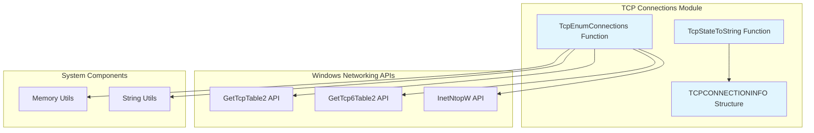
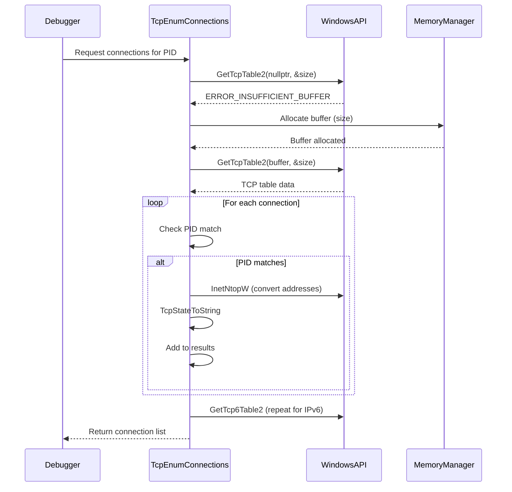

# TCP Connections Module Documentation

## Introduction

The TCP Connections module is a specialized component within the x64dbg debugging framework that provides network connection monitoring capabilities. This module enables debuggers to enumerate and analyze TCP connections associated with specific processes, supporting both IPv4 and IPv6 protocols. It serves as a bridge between low-level network stack information and high-level debugging operations, allowing developers to understand network behavior of debugged applications.

## Architecture Overview

The TCP Connections module follows a simple but effective architecture that interfaces with Windows networking APIs to retrieve connection information. The module is designed as a utility component that can be called by other parts of the debugger to obtain network connection data for specific processes.

## Core Components

### TCPCONNECTIONINFO Structure

The `TCPCONNECTIONINFO` structure is the primary data container for TCP connection information. While the complete structure definition isn't shown in the provided code, it contains the following key fields based on usage patterns:

- **State**: Numeric representation of the TCP connection state
- **StateText**: Human-readable string representation of the connection state
- **LocalAddress**: Local IP address as a string
- **LocalPort**: Local port number (host byte order)
- **RemoteAddress**: Remote IP address as a string
- **RemotePort**: Remote port number (host byte order)

### TcpStateToString Function

This utility function converts numeric TCP state values into human-readable strings based on the standard TCP state machine. It supports all standard TCP states including:

- CLOSED, LISTEN, SYN-SENT, SYN-RECEIVED
- ESTABLISHED, FIN-WAIT-1, FIN-WAIT-2
- CLOSE-WAIT, CLOSING, LAST-ACK, TIME-WAIT
- DELETE-TCB

### TcpEnumConnections Function

The core function of the module that enumerates all TCP connections for a specified process ID. Key features:

- **Dual Protocol Support**: Handles both IPv4 and IPv6 connections
- **Process Filtering**: Only returns connections owned by the specified process
- **Memory Management**: Uses the debugger's memory management utilities for safe allocation
- **String Conversion**: Converts binary addresses to human-readable format

## Data Flow

## Dependencies

The TCP Connections module has several key dependencies within the x64dbg ecosystem:

### Memory Management Module
- **Dependency**: `src.dbg.memory.*` components
- **Usage**: Utilizes the debugger's memory management utilities for safe allocation of TCP table buffers
- **Integration**: References Memory template class for automatic memory management

### String Utilities
- **Dependency**: StringUtils class (not explicitly shown in module tree)
- **Usage**: Converts between UTF-16 and UTF-8 string encodings
- **Purpose**: Handles Windows API string format requirements

### Windows Platform APIs
- **WS2tcpip.h**: Windows Sockets 2 API for network functions
- **iphlpapi.h**: IP Helper API for TCP table access
- **Core APIs**: GetTcpTable2, GetTcp6Table2, InetNtopW

## Integration with Debugger

The TCP Connections module integrates with the broader debugging framework through:

### Process Context
- Operates within the context of a specific process ID
- Filters connections based on process ownership
- Provides network visibility during debugging sessions

### Data Serialization
- Returns structured connection data that can be displayed in GUI components
- Supports integration with [Symbol Resolution](Symbol Resolution.md) for address-to-symbol conversion
- Can be extended to work with [Reference Management](Reference Management.md) for cross-referencing

## Usage Patterns

### Debugging Network Applications
- Monitor active connections during application execution
- Identify unexpected network activity
- Track connection state changes

### Security Analysis
- Detect suspicious network connections
- Analyze communication patterns
- Monitor for data exfiltration attempts

### Performance Analysis
- Identify connection bottlenecks
- Monitor connection establishment/teardown
- Analyze network resource usage

## Extension Points

The module can be extended in several ways:

### Additional Protocol Support
- UDP connection enumeration
- Raw socket monitoring
- Protocol-specific analysis

### Enhanced Filtering
- Connection state filtering
- Address range filtering
- Port-based filtering

### Real-time Monitoring
- Connection change notifications
- State transition tracking
- Connection lifecycle events

## Performance Considerations

### Memory Efficiency
- Uses automatic memory management to prevent leaks
- Allocates exact buffer sizes based on API requirements
- Minimizes memory allocations during enumeration

### API Efficiency
- Makes minimal Windows API calls
- Caches results when appropriate
- Handles both IPv4 and IPv6 in a single function call

### Scalability
- Efficiently handles large numbers of connections
- Process filtering reduces data transfer overhead
- String conversion optimized for display purposes

## Error Handling

The module implements defensive programming practices:

- **API Failure Handling**: Gracefully handles Windows API failures
- **Buffer Management**: Properly manages memory allocation failures
- **Data Validation**: Validates connection data before processing
- **Fallback Behavior**: Returns empty list on failure rather than crashing

## Security Considerations

### Information Disclosure
- Only exposes connections for specified process
- Respects process isolation boundaries
- No privileged information exposure

### API Security
- Uses documented Windows APIs only
- No direct memory access to kernel structures
- Follows Windows security model

This module provides essential network monitoring capabilities while maintaining the stability and security expected in a debugging environment.