# Type System Module Documentation

## Introduction

The Type System module is a core component of the x64dbg debugger that provides comprehensive type management capabilities for debugging applications. It serves as the central repository for managing data types, structures, unions, enumerations, and function signatures used throughout the debugging process. The module enables developers to define, store, and manipulate complex data structures that are essential for reverse engineering, memory analysis, and program understanding.

The Type System is designed to handle both primitive types (integers, floats, pointers) and complex user-defined types (structures, unions, enumerations, function prototypes). It provides a unified interface for type resolution, size calculation, and type validation, making it an indispensable tool for accurate memory interpretation and data structure analysis during debugging sessions.

## Architecture Overview

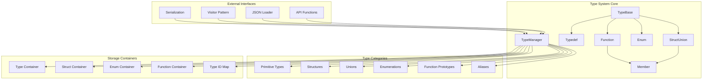

## Core Components

### TypeManager Class

The `TypeManager` class serves as the central orchestrator for all type-related operations. It maintains comprehensive registries of all defined types and provides thread-safe access to type information through a singleton pattern.

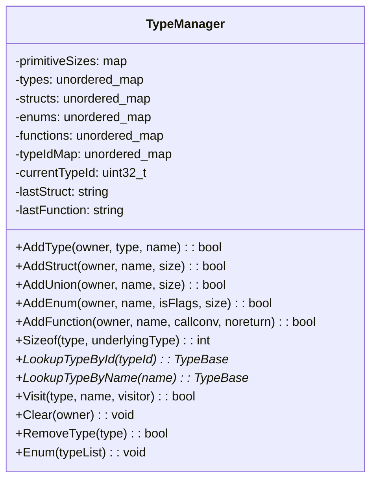

#### Key Responsibilities:
- **Type Registration**: Manages the lifecycle of all type definitions
- **Type Resolution**: Provides efficient lookup mechanisms by name and ID
- **Memory Management**: Calculates type sizes and memory layouts
- **Validation**: Ensures type consistency and prevents circular dependencies
- **Thread Safety**: Implements exclusive and shared locking mechanisms

### TypeBase Hierarchy

The `TypeBase` class serves as the abstract foundation for all type categories, providing common functionality and type identification.

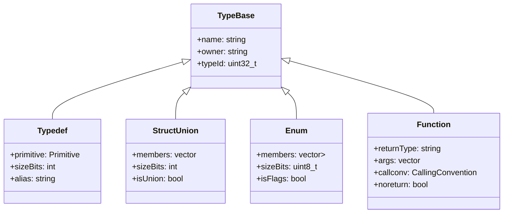

## Data Flow Architecture

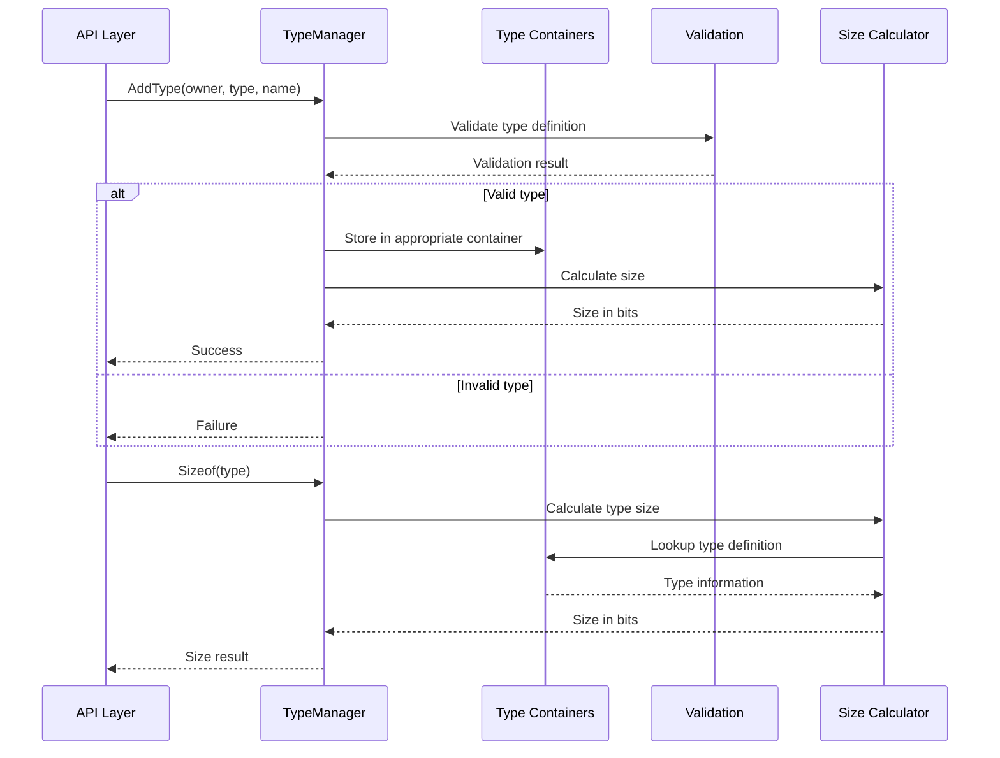

## Type Categories and Primitive Types

### Primitive Type System

The Type System maintains a comprehensive set of primitive types that serve as building blocks for complex type definitions:

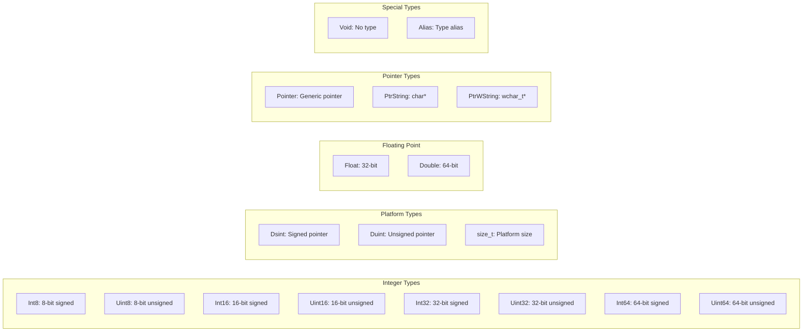

### Type Aliases and Compatibility

The system supports multiple aliases for common types, providing flexibility and compatibility with different coding conventions:

- **8-bit integers**: `int8_t`, `int8`, `char`, `byte`, `bool`, `signed char`
- **8-bit unsigned**: `uint8_t`, `uint8`, `uchar`, `unsigned char`, `ubyte`
- **16-bit integers**: `int16_t`, `int16`, `wchar_t`, `char16_t`, `short`
- **32-bit integers**: `int32_t`, `int32`, `int`, `long`
- **64-bit integers**: `int64_t`, `int64`, `long long`
- **Pointers**: `ptr`, `void*`, `char*`, `const char*`, `wchar_t*`, `const wchar_t*`

## Complex Type Construction

### Structure and Union Management

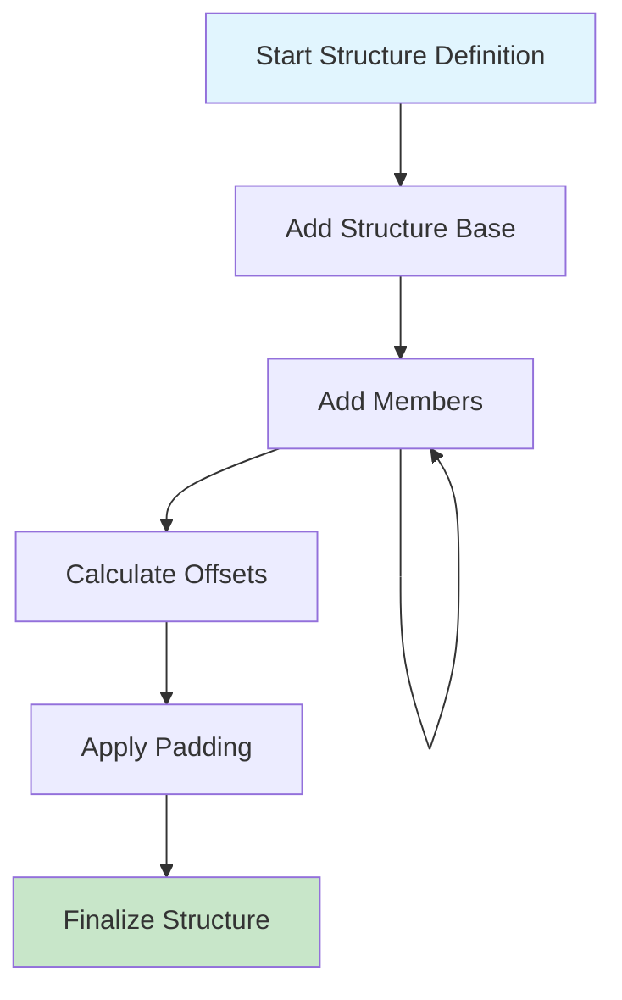

#### Structure Member Addition Process:
1. **Validation**: Verify member type exists and is valid
2. **Offset Calculation**: Compute bit offset within structure
3. **Size Determination**: Calculate member size in bits
4. **Alignment Handling**: Apply platform-specific alignment rules
5. **Padding Insertion**: Add padding members for alignment
6. **Size Update**: Update total structure size

### Enumeration Management

Enumerations are handled with support for both regular enums and flag-based enums:

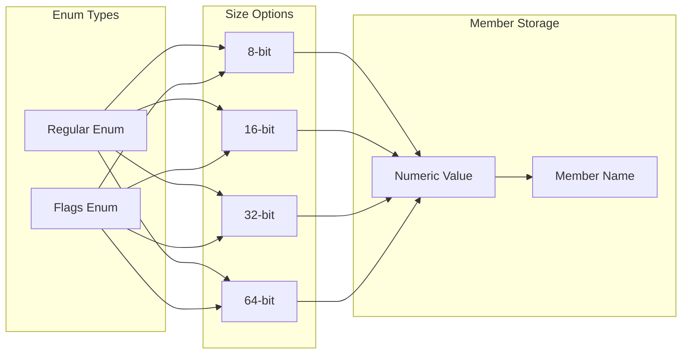

### Function Prototype Management

Function types are managed with comprehensive calling convention support:

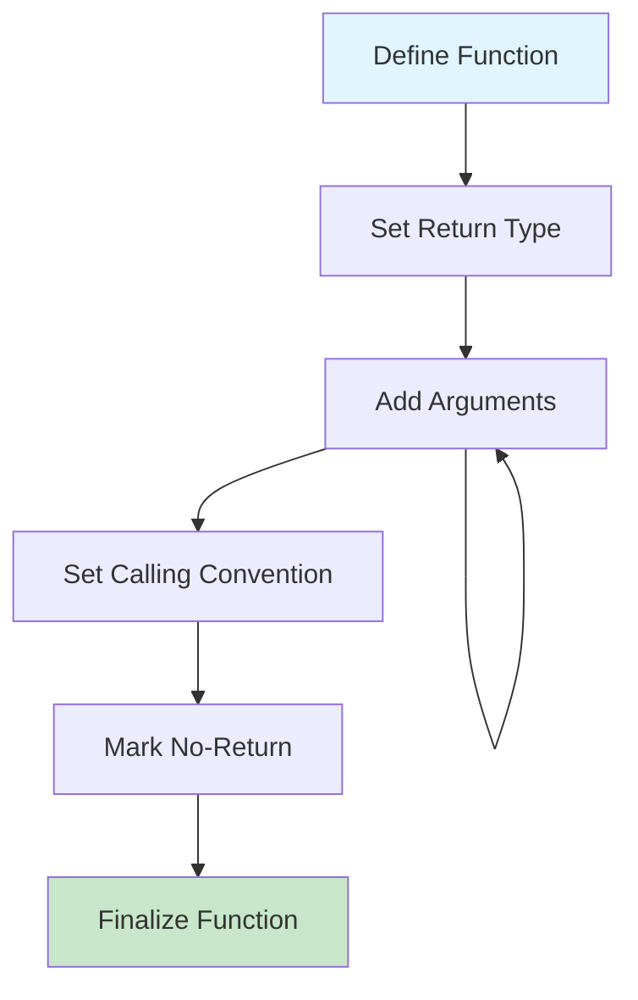

#### Supported Calling Conventions:
- **cdecl**: C declaration convention
- **stdcall**: Standard call convention
- **thiscall**: C++ member function convention
- **delphi**: Delphi/Pascal convention

## JSON Serialization and Deserialization

### Type Model Structure

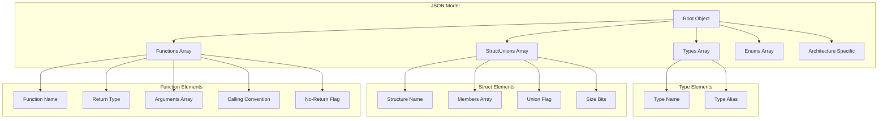

### Loading Process Flow

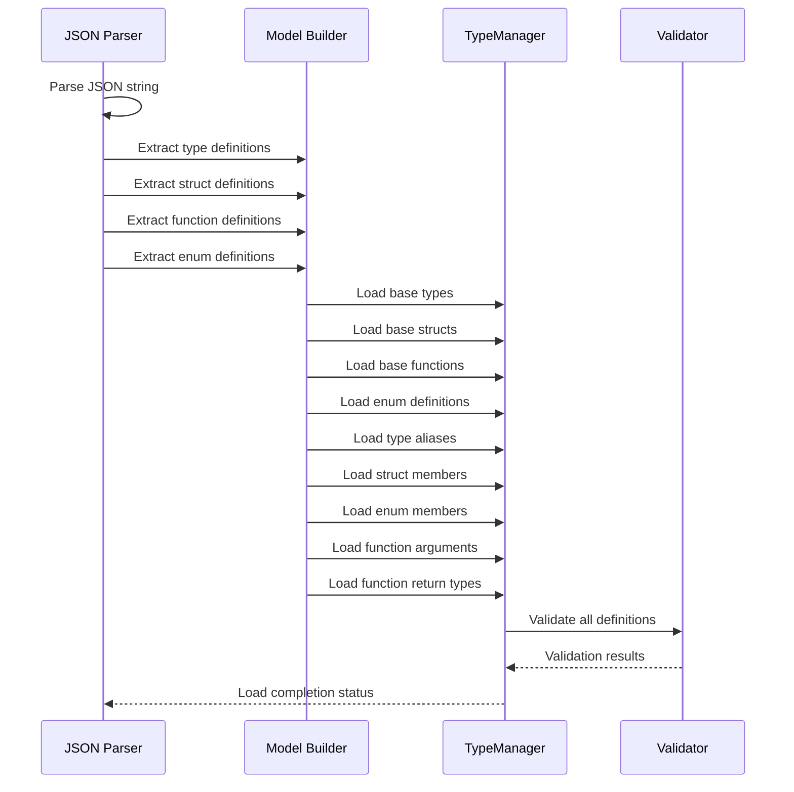

## Visitor Pattern Implementation

### Type Visitor Architecture

The Type System implements a visitor pattern to enable flexible type traversal and processing:

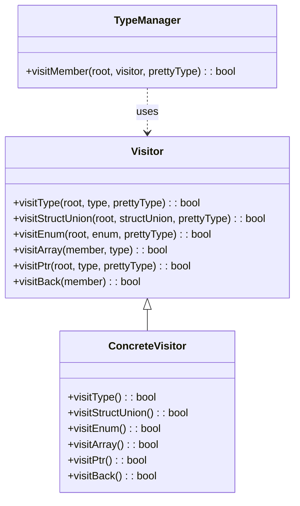

### Visitor Traversal Flow

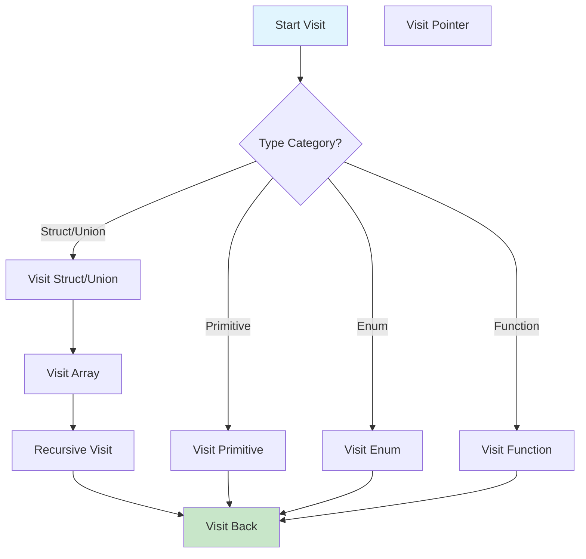

## Thread Safety and Concurrency

### Locking Strategy

The Type System implements a comprehensive locking strategy to ensure thread safety:

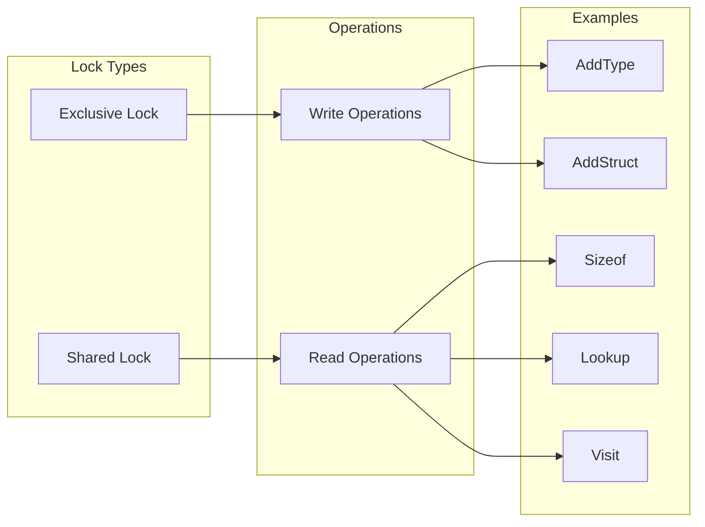

#### Exclusive Lock Operations:
- Type addition and modification
- Structure member addition
- Function argument modification
- Type removal and clearing
- JSON loading and deserialization

#### Shared Lock Operations:
- Type size calculation
- Type lookup by name or ID
- Type enumeration
- Visitor pattern traversal

## Integration with Other Modules

### Dependency Relationships

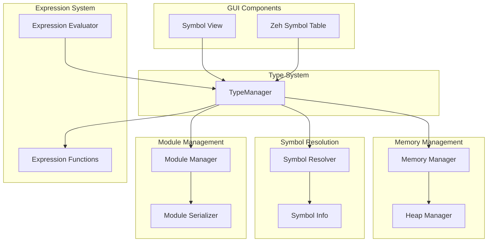

### Cross-Module Interactions

#### Memory Management Integration:
- **Type-based Memory Interpretation**: The Memory Management module uses type information to properly interpret memory contents
- **Structure Layout Calculation**: Type System provides accurate member offsets and sizes for memory structure traversal
- **Pointer Type Resolution**: Enables proper pointer dereferencing and type casting

#### Symbol Resolution Integration:
- **Symbol Type Association**: Symbol information is enhanced with type definitions from the Type System
- **Function Signature Matching**: PDB symbol loading uses Type System function prototypes for accurate symbol matching
- **Type Name Resolution**: Symbol names are resolved to type definitions for accurate representation

#### Expression System Integration:
- **Type-aware Evaluation**: Expression functions use type information for proper value interpretation
- **Structure Member Access**: Type System enables dot notation and pointer arithmetic in expressions
- **Type Casting Support**: Expression evaluation supports explicit type casting using Type System definitions

## Error Handling and Validation

### Validation Framework

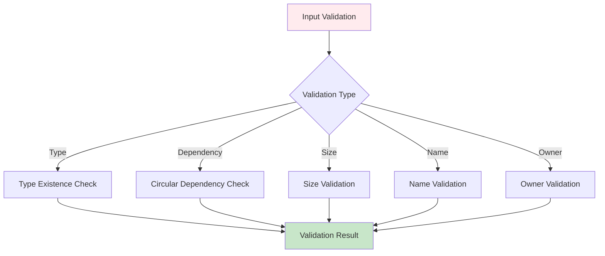

### Common Validation Rules:
- **Type Existence**: All referenced types must be defined
- **Circular Dependencies**: No circular type references allowed
- **Name Uniqueness**: Type names must be unique within the system
- **Owner Validation**: Type owners must be valid and non-empty
- **Size Constraints**: Type sizes must be positive and reasonable
- **Member Validation**: Structure members must have valid types and names

## Performance Considerations

### Optimization Strategies

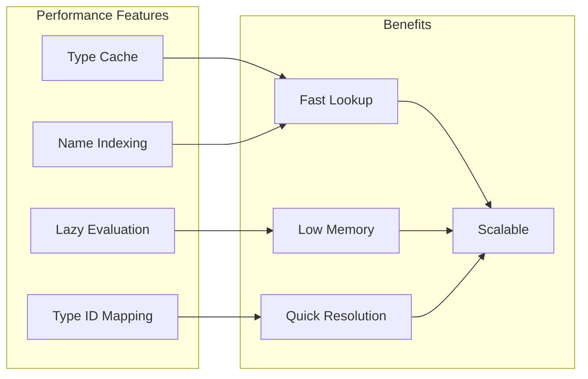

#### Key Performance Features:
- **Hash-based Lookup**: All type containers use unordered_map for O(1) lookup performance
- **Type ID Mapping**: Direct type ID to type pointer mapping for ultra-fast resolution
- **Lazy Size Calculation**: Type sizes are calculated on-demand and cached
- **Memory-efficient Storage**: Minimal overhead for type metadata storage
- **Thread-safe Caching**: Shared locks enable concurrent read access

## Usage Examples and Best Practices

### Basic Type Definition

```cpp
// Define a simple structure
TypeManager::AddStruct("myplugin", "PROCESS_INFO");
TypeManager::AddStructMember("PROCESS_INFO", "uint32_t", "processId");
TypeManager::AddStructMember("PROCESS_INFO", "char*", "processName");
TypeManager::AddStructMember("PROCESS_INFO", "uint64_t", "baseAddress");
```

### Complex Type Hierarchy

```cpp
// Define enumeration
typeManager.AddEnum("myplugin", "ERROR_CODE", false, 32);
typeManager.AddEnumMember("ERROR_CODE", "SUCCESS", 0);
typeManager.AddEnumMember("ERROR_CODE", "INVALID_PARAM", 1);
typeManager.AddEnumMember("ERROR_CODE", "ACCESS_DENIED", 2);

// Define structure with enum member
typeManager.AddStruct("myplugin", "API_RESULT");
typeManager.AddStructMember("API_RESULT", "ERROR_CODE", "errorCode");
typeManager.AddStructMember("API_RESULT", "char*", "errorMessage");
```

### Function Prototype Definition

```cpp
// Define function type
typeManager.AddFunction("myplugin", "CreateProcess", Types::Cdecl, false);
typeManager.AddFunctionReturn("CreateProcess", "bool");
typeManager.AddArg("CreateProcess", "const char*", "applicationName");
typeManager.AddArg("CreateProcess", "const char*", "commandLine");
typeManager.AddArg("CreateProcess", "PROCESS_INFO*", "processInfo");
```

## Future Enhancements and Extensibility

### Planned Features

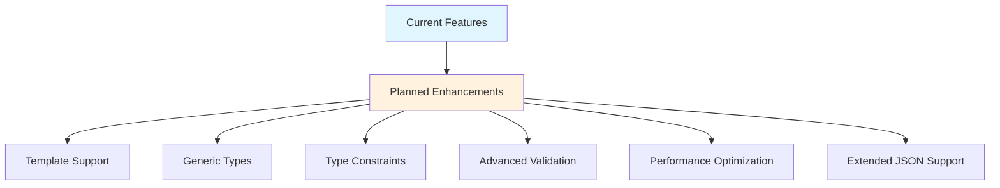

#### Potential Enhancements:
- **Template Type Support**: Generic type templates for reusable type definitions
- **Type Constraints**: Validation rules and constraints for type parameters
- **Advanced JSON Schema**: Extended JSON schema support for complex type definitions
- **Type Versioning**: Version management for type definitions and evolution
- **Import/Export**: Enhanced import/export capabilities for type libraries
- **Type Documentation**: Built-in documentation support for type definitions

## Conclusion

The Type System module represents a sophisticated and comprehensive solution for managing data types in a debugging environment. Its robust architecture, thread-safe design, and extensive feature set make it an essential component for accurate program analysis and reverse engineering. The module's flexibility and extensibility ensure it can adapt to evolving debugging requirements while maintaining high performance and reliability.

The integration with other system modules creates a cohesive debugging ecosystem where type information enhances memory interpretation, symbol resolution, and expression evaluation. This comprehensive approach to type management sets the foundation for advanced debugging capabilities and enables users to work effectively with complex data structures and program architectures.