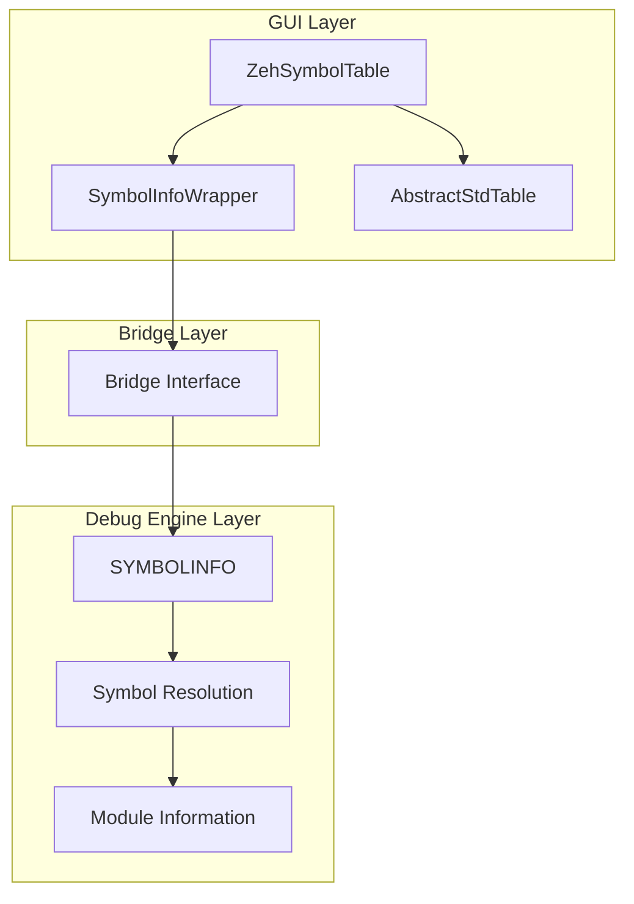
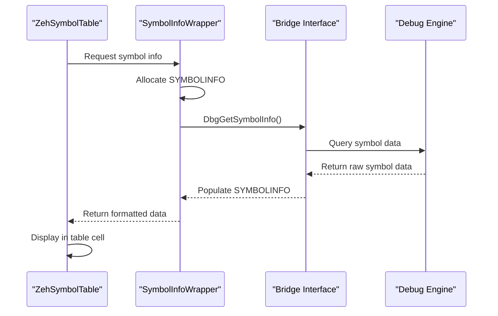
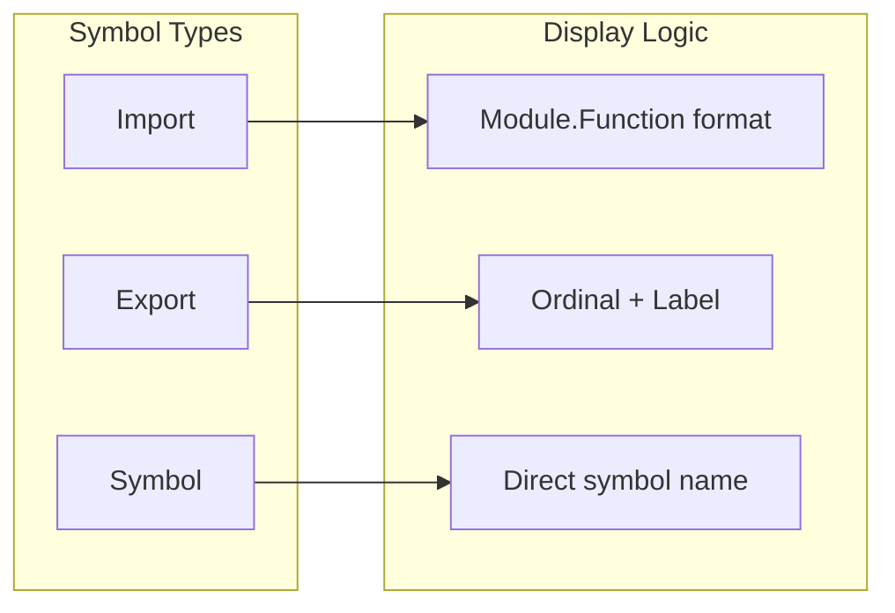
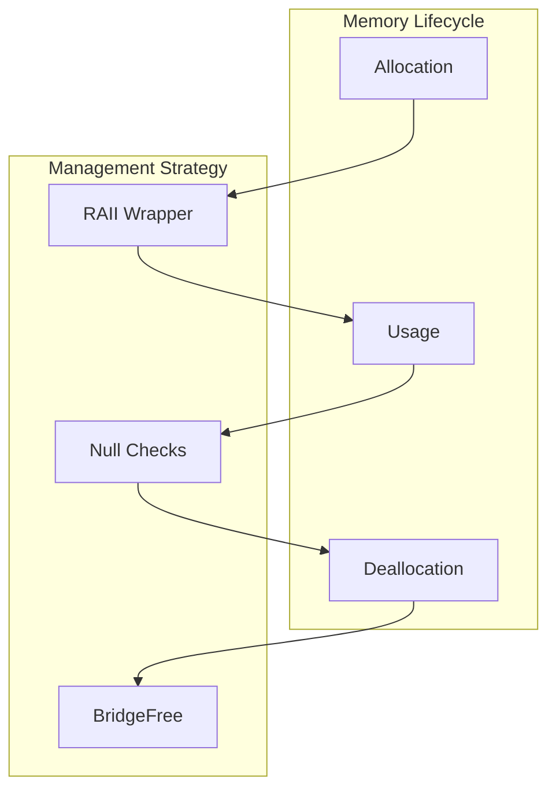

# Zeh Symbol Table Module Documentation

## Introduction

The Zeh Symbol Table module is a GUI component that provides a comprehensive view of program symbols within the x64dbg debugger environment. It serves as the primary interface for displaying and managing symbol information including imports, exports, and general symbols from loaded modules. The module implements a table-based view with advanced sorting capabilities and integrates with the debugger's symbol resolution system.

## Architecture Overview

The Zeh Symbol Table module follows a layered architecture that bridges the GUI presentation layer with the underlying debugging engine:

## Core Components

### SymbolInfoWrapper Class

The `SymbolInfoWrapper` is a RAII (Resource Acquisition Is Initialization) wrapper that manages the lifecycle of `SYMBOLINFO` structures. It provides automatic memory management for decorated and undecorated symbol strings, preventing memory leaks in the symbol handling process.

**Key Responsibilities:**
- Automatic cleanup of symbol strings via `BridgeFree()`
- Memory management for decorated and undecorated symbols
- Thread-safe access to symbol information
- Prevention of double-free errors through move semantics

### ZehSymbolTable Class

The main table widget that displays symbol information in a structured format with five primary columns:

1. **Address Column**: Displays the memory address of the symbol
2. **Type Column**: Shows symbol type (Import/Export/Symbol)
3. **Ordinal Column**: Displays ordinal numbers for export symbols
4. **Decorated Symbol Column**: Shows the mangled/decorated symbol name
5. **Undecorated Symbol Column**: Displays the human-readable symbol name

## Data Flow Architecture

## Symbol Type Management

The module handles three distinct symbol types with different display logic:

### Import Symbol Processing
- Retrieves module name from memory address
- Formats as "Module.FunctionName"
- Handles cross-module references

### Export Symbol Processing
- Prioritizes export symbols in sorting
- Displays ordinal numbers
- Falls back to label resolution for unnamed exports

### General Symbol Processing
- Direct display of decorated/undecorated names
- Handles C++ name mangling
- Provides fallback to labels for ordinal symbols

## Sorting and Filtering

The module implements sophisticated sorting logic that handles different data types:

- **Address Sorting**: Numerical comparison of memory addresses
- **Type Sorting**: Categorical sorting with export symbols prioritized
- **Ordinal Sorting**: Numerical comparison with export preference
- **String Sorting**: Lexicographical comparison for symbol names

## Thread Safety

The module employs several mechanisms for thread safety:

1. **Recursive Mutex**: `QMutex::Recursive` prevents deadlocks in nested calls
2. **RAII Locking**: `QMutexLocker` ensures automatic lock release
3. **Immutable Data**: Symbol data is read-only during display operations

## Integration Points

### Bridge Interface Integration
The module heavily relies on the Bridge interface for communication with the debugging engine:
- `DbgGetSymbolInfo()`: Retrieves symbol information
- `DbgMemRead()`: Reads memory for import resolution
- `DbgGetModuleAt()`: Resolves module names
- `DbgGetLabelAt()`: Retrieves label information

### GUI Framework Integration
- Inherits from `AbstractStdTable` for consistent table behavior
- Uses Qt's model-view architecture for efficient rendering
- Implements multi-selection capabilities
- Supports column configuration persistence

## Memory Management

The module implements careful memory management strategies:

## Error Handling

The module includes several defensive programming practices:

1. **Index Validation**: `isValidIndex()` prevents out-of-bounds access
2. **Null Pointer Checks**: Validates symbol data before processing
3. **Memory Validation**: Checks `freeDecorated`/`freeUndecorated` flags
4. **Debug Assertions**: `__debugbreak()` for unexpected symbol types

## Performance Considerations

- **Stable Sorting**: Uses `std::stable_sort` to maintain relative order
- **Lazy Loading**: Symbol information is fetched on-demand
- **String Interning**: Avoids unnecessary string copies
- **Cache-Friendly**: Local data structures for sorting operations

## Configuration Management

The module supports persistent configuration through:
- Column width storage in application settings
- Sort order preservation
- Multi-selection state management
- Custom column visibility

## Dependencies

### Direct Dependencies
- Bridge Module: Communication with debugging engine
- RichTextPainter: Text rendering utilities
- Qt Framework: GUI components and threading

### Indirect Dependencies
- Symbol Resolution: Symbol information provider
- Module Management: Module information source
- Memory Management: Memory reading capabilities

## Extension Points

The module provides several extension opportunities:

1. **Custom Column Types**: New columns can be added by extending `symbolInfoString()`
2. **Sorting Algorithms**: Custom sorting logic for new columns
3. **Symbol Filters**: Additional filtering mechanisms
4. **Export Formats**: Data export functionality
5. **Context Menus**: Right-click action extensions

## Security Considerations

- **Memory Safety**: RAII prevents memory leaks
- **Bounds Checking**: Prevents buffer overflows
- **Thread Safety**: Prevents race conditions
- **Input Validation**: Validates all indices and pointers

This module serves as a critical component in the debugging workflow, providing developers with essential symbol information in an accessible and efficient manner.