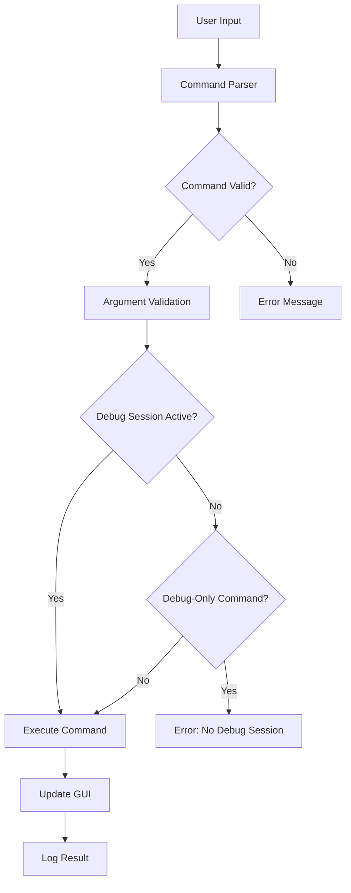

# Command System Documentation

## Overview

The command system in x64dbg provides a comprehensive interface for controlling the debugger through text-based commands. It supports a wide range of operations from basic debugging tasks to advanced analysis and automation features.

## Command Architecture

### Command Registration
Commands are registered through a centralized system that maps command names to handler functions:
- Commands can have multiple aliases (e.g., "bp", "bpx", "SetBPX")
- Each command has a handler function that processes arguments
- Commands can be marked as debug-only (require active debugging session)

### Command Categories

#### Debug Control Commands
- **Process Control**: `run`, `pause`, `stepinto`, `stepover`, `stepout`
- **Thread Management**: `createthread`, `switchthread`, `suspendthread`, `resumethread`
- **Exception Handling**: `SetExceptionBPX`, `EnableExceptionBPX`, `DisableExceptionBPX`

#### Memory Commands
- **Memory Operations**: `alloc`, `free`, `memset`, `memcpy`
- **Memory Search**: `find`, `findall`, `findasm`
- **Memory Protection**: `getpagerights`, `setpagerights`

#### Breakpoint Commands
- **Software Breakpoints**: `bp`, `bc`, `be`, `bd`
- **Hardware Breakpoints**: `bphws`, `bphwc`, `bphwe`, `bphwd`
- **Memory Breakpoints**: `bpm`, `bpmc`, `bpme`, `bpmd`
- **DLL Breakpoints**: `bpdll`, `bcdll`, `bpedll`, `bpddll`

#### Analysis Commands
- **Code Analysis**: `analyse`, `cfanal`, `analxrefs`
- **Function Analysis**: `functionadd`, `functiondel`, `functionlist`
- **Reference Analysis**: `reffind`, `refstr`, `reffunctionpointer`

#### Data Commands
- **Data Definition**: `db`, `dw`, `dd`, `dq` (byte, word, dword, qword)
- **String Data**: `da` (ASCII), `du` (Unicode)
- **Floating Point**: `df` (float), `DataDouble` (double)

## Command Processing Flow



## Advanced Features

### Conditional Commands
Many commands support conditional execution:
- Breakpoint conditions: `bp addr, condition`
- Log conditions: `bplog addr, "message", condition`
- Command conditions: `bpcommand addr, "cmd", condition`

### Expression Evaluation
Commands support complex expressions:
- Register values: `eax`, `rbx`, `rsp`
- Memory dereferencing: `[addr]`, `[[addr]]`
- Arithmetic operations: `+`, `-`, `*`, `/`, `&`, `|`, `^`
- Function calls: `mod.base(addr)`, `dis.len(addr)`

### Script Integration
Commands can be used in scripts:
- Script commands: `scriptload`, `scriptrun`, `scriptcmd`
- Variable manipulation: `varnew`, `varset`, `varget`
- Control flow: Conditional execution based on command results

## Error Handling

### Command Validation
- Syntax checking during parsing
- Argument type validation
- Range checking for addresses and sizes
- Permission checking for memory operations

### Error Reporting
- Detailed error messages with context
- Suggestions for correcting common mistakes
- Logging of failed commands for debugging

## Performance Optimization

### Command Caching
- Frequently used commands are cached
- Argument parsing results are reused when possible
- Command aliases are resolved once and stored

### Batch Operations
- Multiple commands can be executed in sequence
- Bulk operations for memory and breakpoint management
- Optimized search algorithms for large memory spaces

## Extension Mechanisms

### Plugin Commands
Plugins can register custom commands:
- Integration with existing command system
- Access to debugger internals through APIs
- Custom argument parsing and validation

### Script Commands
Scripts can define new commands:
- Dynamic command creation
- Parameter passing and return values
- Integration with script variables and control flow

## Security Considerations

### Input Sanitization
- Command strings are validated before processing
- Special characters are properly escaped
- Buffer overflow protection in argument handling

### Permission Management
- Memory access permissions are respected
- System-level operations require appropriate privileges
- Dangerous commands have confirmation prompts

## Usage Examples

### Basic Debugging Session
```
// Set breakpoint at main function
bp main

// Run program
run

// Step through code
stepinto
stepover

// Examine memory
dump esp

// Check registers
print eax
```

### Advanced Analysis
```
// Find all references to a string
refstr "error message"

// Analyze function
functionadd myfunc, start, end

// Set conditional breakpoint
bp 0x401000, eax == 5

// Search for pattern
find 0x400000, "90 90 90" // NOP sled
```

### Memory Operations
```
// Allocate memory
alloc 1000

// Set memory protection
setpagerights 0x400000, "RWX"

// Fill memory with pattern
memset 0x400000, 0xCC, 100 // INT3 instructions
```

This command system provides the foundation for all user interaction with the x64dbg debugger, offering both simple and advanced functionality for comprehensive debugging and analysis tasks.