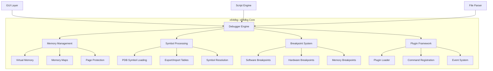
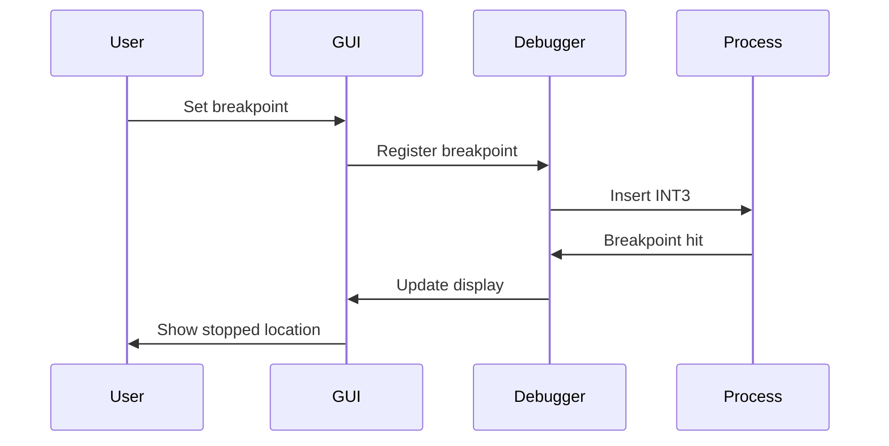

# x64dbg--x64dbg Module Documentation

## Overview

The x64dbg--x64dbg module is the core debugging engine of the x64dbg debugger suite. It provides comprehensive debugging capabilities for Windows applications, supporting both 32-bit and 64-bit architectures. This module serves as the foundation for the entire debugging system, handling low-level debugging operations, memory management, symbol processing, and user interface coordination.

## Architecture

```mermaid
graph TB
    subgraph "x64dbg--x64dbg Core"
        A[Debugger Engine] --> B[Memory Management]
        A --> C[Symbol Processing]
        A --> D[Breakpoint System]
        A --> E[Plugin Framework]
        
        B --> B1[Virtual Memory]
        B --> B2[Memory Maps]
        B --> B3[Page Protection]
        
        C --> C1[PDB Symbol Loading]
        C --> C2[Export/Import Tables]
        C --> C3[Symbol Resolution]
        
        D --> D1[Software Breakpoints]
        D --> D2[Hardware Breakpoints]
        D --> D3[Memory Breakpoints]
        
        E --> E1[Plugin Loader]
        E --> E2[Command Registration]
        E --> E3[Event System]
    end
    
    F[GUI Layer] --> A
    G[Script Engine] --> A
    H[File Parser] --> A
```

## Core Functionality

### 1. Debugger Engine
The debugger engine is the heart of the system, responsible for:
- Process attachment and detachment
- Thread management and control
- Exception handling and propagation
- Execution flow control (step into, step over, run to cursor)
- Context switching and register management

### 2. Memory Management
Comprehensive memory analysis capabilities including:
- Virtual memory space exploration
- Memory page information and protection analysis
- Memory search and pattern matching
- Memory modification and patching
- Memory dump generation and analysis

### 3. Symbol Processing
Advanced symbol handling system featuring:
- PDB symbol file loading and parsing
- Export and import table analysis
- Symbol name resolution and demangling
- Source code line mapping
- Symbol caching for performance

### 4. Breakpoint System
Multi-layered breakpoint management:
- Software breakpoints (INT3)
- Hardware breakpoints (DR0-DR3)
- Memory access breakpoints
- Conditional breakpoints with expressions
- Breakpoint hit counting and logging

### 5. Plugin Framework
Extensible architecture supporting:
- Dynamic plugin loading and unloading
- Command registration and execution
- Event callback system
- Plugin menu integration
- Custom data processing

## Key Components

### Memory Subsystem
The memory subsystem provides comprehensive memory analysis capabilities. It handles virtual memory mapping, page protection analysis, and memory content modification. The system supports both reading and writing operations with proper error handling and validation.

### Symbol Engine
The symbol engine processes debugging symbols from various sources including PDB files, export tables, and import tables. It provides symbol resolution, name demangling, and source code mapping capabilities essential for effective debugging.

### Breakpoint Manager
The breakpoint manager handles different types of breakpoints including software, hardware, and memory breakpoints. It supports conditional breakpoints, hit counting, and automatic breakpoint management during program execution.

### Command System
A comprehensive command system allows users to control the debugger through text commands. Commands range from simple operations like setting breakpoints to complex analysis tasks like function tracing and memory searching.

## Data Flow

```mermaid
sequenceDiagram
    participant User
    participant GUI
    participant Debugger
    participant Process
    
    User->>GUI: Set breakpoint
    GUI->>Debugger: Register breakpoint
    Debugger->>Process: Insert INT3
    Process->>Debugger: Breakpoint hit
    Debugger->>GUI: Update display
    GUI->>User: Show stopped location
```

## Integration Points

### GUI Integration
The module communicates with the GUI layer through a message-passing system, allowing asynchronous updates and user interaction handling.

### Script Engine Integration
Comprehensive scripting support enables automation of debugging tasks through custom scripts and command sequences.

### Plugin Integration
The plugin system allows third-party extensions to integrate seamlessly with the core debugging functionality.

## Performance Considerations

### Memory Management
- Efficient memory mapping and caching
- Lazy loading of symbol information
- Optimized search algorithms for large memory spaces

### Thread Safety
- Lock-free data structures where possible
- Proper synchronization for shared resources
- Thread-safe symbol and breakpoint management

### Optimization Strategies
- Symbol caching to avoid repeated file access
- Memory page caching for frequently accessed regions
- Efficient data structures for breakpoint and symbol lookups

## Error Handling

The module implements comprehensive error handling:
- Graceful degradation when symbols are unavailable
- Proper cleanup on process termination
- Error reporting through multiple channels
- Recovery mechanisms for common failure scenarios

## Security Features

### Process Isolation
- Safe handling of target process memory
- Proper privilege management
- Secure communication channels

### Input Validation
- Command parameter validation
- Memory access bounds checking
- Symbol file integrity verification

## Configuration and Customization

### Settings Management
- Persistent configuration storage
- Runtime parameter adjustment
- User preference management

### Extensibility
- Plugin architecture for custom functionality
- Script-based automation
- Custom command registration

## Related Documentation

- [Memory Management](Memory Management.md) - Detailed memory subsystem documentation including Windows 11 heap structures and memory page management
- [Symbol Processing](Symbol Processing.md) - Symbol engine and PDB handling with download capabilities and caching mechanisms
- [Plugin Framework](Plugin Framework.md) - Plugin development and integration with dynamic loading and command registration
- [File Parsing](File Parsing.md) - Support for PE files, minidumps, and various file formats with memory providers
- [GUI Components](GUI Components.md) - User interface elements including symbol views, breakpoints, and release notes
- [Breakpoint System](breakpoint.md) - Comprehensive breakpoint management (detailed in GUI Components)
- [Command System](commands.md) - Command parsing and execution
- [Data Instructions](datainst_helper.md) - Data type handling and instruction processing

## Technical Specifications

### Supported Architectures
- x86 (32-bit)
- x64 (64-bit)
- Mixed-mode debugging support

### Operating System Support
- Windows 7 and later
- Both 32-bit and 64-bit Windows versions
- WoW64 compatibility layer support

### Performance Metrics
- Symbol loading: < 5 seconds for typical applications
- Memory search: < 1 second for 1GB address space
- Breakpoint operations: < 100ms for complex conditions

This documentation provides a comprehensive overview of the x64dbg--x64dbg module's architecture, functionality, and integration points. For detailed implementation specifics, refer to the individual component documentation files.