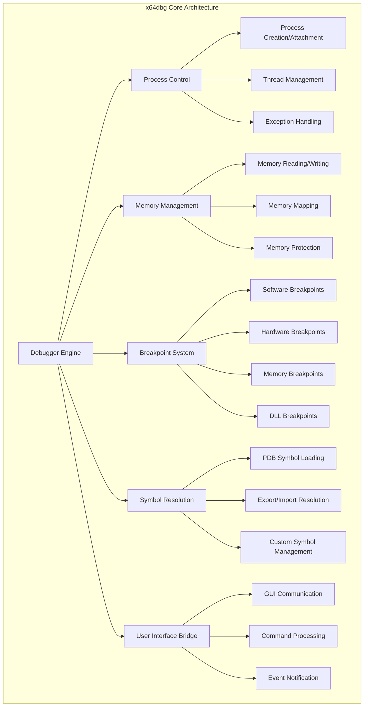

# x64dbg--x64dbg Module Documentation

## Overview

The x64dbg--x64dbg module is the core debugging engine of the x64dbg debugger suite. It provides comprehensive debugging capabilities for Windows applications, supporting both 32-bit and 64-bit architectures. This module serves as the foundation for all debugging operations, including process control, memory management, breakpoint handling, symbol resolution, and user interface communication.

## Architecture



## Key Features

### 1. Multi-Architecture Support
- Native support for both x86 (32-bit) and x64 (64-bit) applications
- Architecture-specific instruction decoding and analysis
- Automatic architecture detection and adaptation

### 2. Comprehensive Breakpoint System
- **Software Breakpoints**: INT3 instruction-based breakpoints
- **Hardware Breakpoints**: CPU debug register-based breakpoints (DR0-DR3)
- **Memory Breakpoints**: Access/Read/Write/Execute monitoring
- **DLL Breakpoints**: Module load/unload detection
- **Exception Breakpoints**: Custom exception handling

### 3. Advanced Memory Management
- Real-time memory mapping and protection analysis
- Efficient memory search and pattern matching
- Memory modification with automatic backup and restoration
- Support for both virtual and physical memory operations

### 4. Symbol Resolution Engine
- **PDB Support**: Microsoft Program Database symbol loading
- **Export/Import Analysis**: PE file export/import table parsing
- **Custom Symbol Management**: User-defined labels and comments
- **Source Code Mapping**: Line-by-line source code correlation

### 5. Plugin Architecture
- Extensible plugin system for custom functionality
- Plugin command registration and execution
- Event callback system for plugin integration
- Menu and UI integration capabilities

## Core Components

### Debugger Engine (`x64dbg.cpp`)
The main debugger engine coordinates all debugging operations. It manages:
- Process initialization and termination
- Command processing and execution
- Plugin loading and management
- System-wide configuration

### Memory Management (`memory.cpp`)
Handles all memory-related operations including:
- Memory page enumeration and mapping
- Read/write operations with safety checks
- Memory protection analysis and modification
- Heap and stack analysis

### Breakpoint System (`breakpoint.cpp`)
Manages all types of breakpoints:
- Breakpoint creation, modification, and deletion
- Hit counting and condition evaluation
- Log file management for breakpoint events
- Integration with debugging events

### Symbol Management (`symbolinfo.cpp`, `symbolsourcedia.cpp`)
Provides comprehensive symbol resolution:
- PDB file loading and parsing
- Export/import table analysis
- Symbol name resolution and demangling
- Source code line mapping

### User Interface Bridge (`Bridge.cpp`)
Facilitates communication between the debugger engine and GUI:
- Event notification system
- Command execution and result handling
- GUI update coordination
- Cross-thread communication

## Data Flow


## Module Dependencies

The x64dbg--x64dbg module integrates with several other modules:

- **[x64dbg--gui](gui.md)**: User interface components and visual representation
- **[x64dbg--bridge](bridge.md)**: Communication layer between engine and GUI
- **[x64dbg--plugins](plugins.md)**: Plugin system for extensibility
- **[x64dbg--exporter](exporter.md)**: Data export functionality

## Configuration and Settings

The module supports extensive configuration through:
- INI-based configuration files
- Runtime setting modification
- Per-project database storage
- User preference persistence

## Security Features

- **Signature Verification**: DLL signature checking for security
- **Memory Protection**: Safe memory access with validation
- **Process Isolation**: Controlled debugging environment
- **Anti-Debug Detection**: Countermeasures against debug detection

## Performance Optimizations

- **Lazy Loading**: On-demand symbol and module loading
- **Caching**: Intelligent caching of frequently accessed data
- **Threading**: Multi-threaded operations for responsiveness
- **Memory Pooling**: Efficient memory allocation strategies

## Error Handling

Comprehensive error handling includes:
- Graceful degradation on missing symbols
- Recovery from memory access violations
- Detailed error reporting and logging
- Automatic retry mechanisms for transient failures

## File Structure

```
src/dbg/
├── x64dbg.cpp              # Main debugger engine
├── memory.cpp              # Memory management
├── breakpoint.cpp          # Breakpoint system
├── symbolinfo.cpp          # Symbol resolution
├── symbolsourcedia.cpp     # PDB symbol loading
├── module.cpp              # Module management
├── thread.cpp              # Thread operations
├── exception.cpp           # Exception handling
├── plugin_loader.cpp       # Plugin system
└── [additional components]
```

## Usage Examples

### Basic Debugging Session
```cpp
// Initialize debugger
_dbg_dbginit(false);

// Set a breakpoint
_dbg_dbgcmdexec("bp 0x401000");

// Run the debuggee
_dbg_dbgcmdexec("run");

// Read memory
_dbg_dbgcmdexec("dump 0x401000");
```

### Symbol Loading
```cpp
// Load symbols for a module
_dbg_dbgcmdexec("symload kernel32.dll");

// Download symbols from Microsoft
_dbg_dbgcmdexec("symdownload");
```

### Memory Analysis
```cpp
// Search for pattern
_dbg_dbgcmdexec("find 0x401000, 0x1000, "pattern"");

// Set memory breakpoint
_dbg_dbgcmdexec("bpm 0x401000, w");
```

## API Reference

For detailed API documentation, refer to:
- [Debugger API](api-debugger.md)
- [Memory API](api-memory.md)
- [Breakpoint API](api-breakpoint.md)
- [Symbol API](api-symbol.md)

## Troubleshooting

Common issues and solutions:
- **Symbol Loading Failures**: Check symbol paths and internet connectivity
- **Breakpoint Not Triggering**: Verify address validity and breakpoint type
- **Memory Access Errors**: Ensure proper memory permissions and address ranges
- **Plugin Loading Issues**: Check plugin compatibility and dependencies

## Contributing

When contributing to the x64dbg--x64dbg module:
1. Follow the existing code style and conventions
2. Add comprehensive error handling
3. Include unit tests for new functionality
4. Update documentation for API changes
5. Consider performance implications of changes

## Sub-Module Documentation

The x64dbg--x64dbg module contains several complex sub-systems that are documented separately:

### Core Debugging Components
- [Memory Management](Memory%20Management.md) - Advanced memory management with Windows 11 heap support
- [Breakpoint System](Breakpoint%20System.md) - Comprehensive breakpoint management with logging
- [Symbol Resolution](Symbol%20Resolution.md) - Symbol loading and resolution system
- [Module Management](Module%20Management.md) - PE module analysis and management
- [Reference Management](Reference%20Management.md) - Cross-reference tracking system
- [Encoding Map](Encoding%20Map.md) - Instruction encoding and type mapping

### Expression and Scripting
- [Expression Functions](Expression%20Functions.md) - Mathematical and logical expression evaluation
- [Simple Script](Simple%20Script.md) - Built-in scripting language system
- [Type System](Type%20System.md) - Data type definition and management

### Data Management
- [Comment System](Comment%20System.md) - User comment management
- [Bookmark System](Bookmark%20System.md) - Address bookmarking functionality
- [Label System](Label%20System.md) - Symbolic labeling system
- [Argument Management](Argument%20Management.md) - Function argument tracking
- [Function Management](Function%20Management.md) - Function boundary detection

### Symbol and Debug Information
- [PDB Symbol Loading](PDB%20Symbol%20Loading.md) - Microsoft PDB symbol file processing
- [Symbol Source Base](Symbol%20Source%20Base.md) - Base symbol resolution framework
- [Exception Handler Info](Exception%20Handler%20Info.md) - Windows exception handler analysis

### User Interface Integration
- [GUI Bridge](GUI%20Bridge.md) - Communication layer with user interface
- [Symbol View](Symbol%20View.md) - Symbol browser implementation
- [Breakpoints View](Breakpoints%20View.md) - Breakpoint management interface
- [Trace File Dump](Trace%20File%20Dump.md) - Execution trace analysis
- [Patch Dialog](Patch%20Dialog.md) - Binary patching interface

### Specialized Components
- [Plugin System](Plugin%20System.md) - Extensible plugin architecture
- [TCP Connections](TCP%20Connections.md) - Network connection monitoring
- [Data Instruction Helper](Data%20Instruction%20Helper.md) - Data instruction processing
- [History Context](History%20Context.md) - Debugging state history
- [WinInet Downloader](WinInet%20Downloader.md) - Symbol file downloading
- [Reference System](Reference%20System.md) - Address reference tracking
- [Command Searching](Command%20Searching.md) - Advanced search capabilities
- [PDB DIA File](PDB%20DIA%20File.md) - DIA SDK integration

### Cross-Platform Components
- [Pattern Highlighter](Pattern%20Highlighter.md) - Syntax highlighting for pattern language
- [Pattern Language](Pattern%20Language.md) - Pattern matching language implementation
- [Hex Viewer MainWindow](Hex%20Viewer%20MainWindow.md) - Hexadecimal viewer component
- [Minidump File Parser](Minidump%20File%20Parser.md) - Crash dump analysis
- [Remote Server](Remote%20Server.md) - Remote debugging server
- [Headless Mode](Headless%20Mode.md) - Command-line debugging interface
- [Launcher](Launcher.md) - Application launcher and installer

### Scripting and Automation
- [Release Notes Dialog](Release%20Notes%20Dialog.md) - Update notification system
- [Zeh Symbol Table](Zeh%20Symbol%20Table.md) - Advanced symbol table implementation
- [Update Checker](Update%20Checker.md) - Automatic update verification
- [Common Actions](Common%20Actions.md) - Reusable UI actions
- [Script API Symbol](Script%20API%20Symbol.md) - Scripting interface for symbols

## Related Documentation

- [x64dbg--gui](gui.md) - User interface documentation
- [x64dbg--bridge](bridge.md) - Bridge layer documentation
- [x64dbg--plugins](plugins.md) - Plugin system documentation
- [Debugger Commands](commands.md) - Command reference