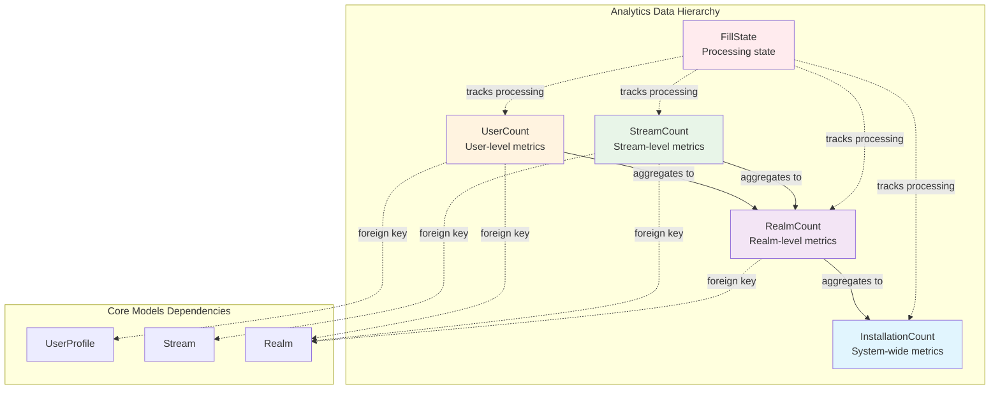
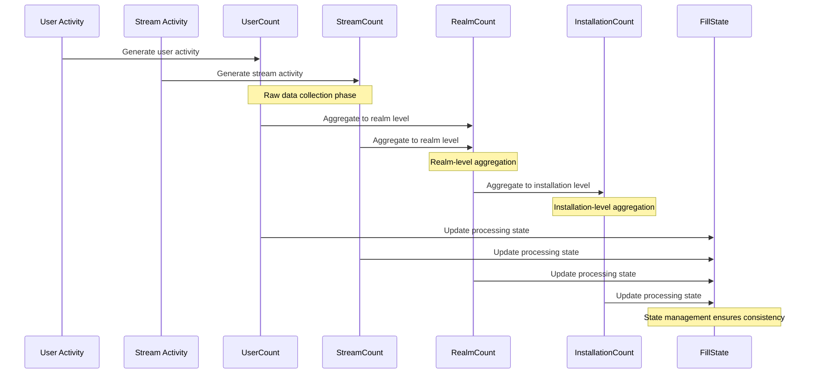
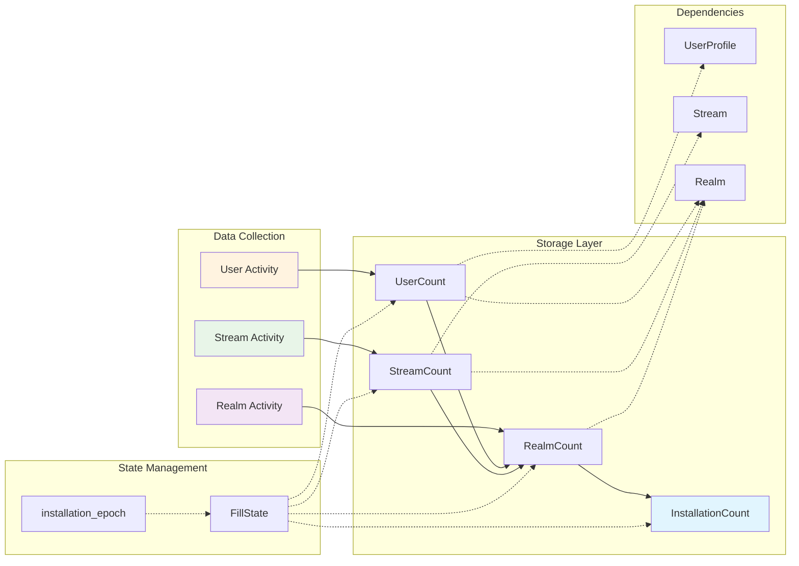
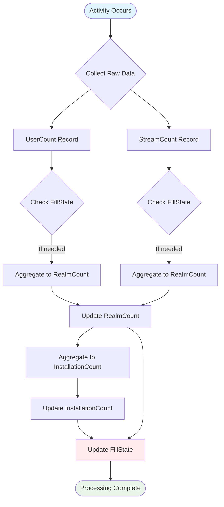

# Analytics Module Documentation

## Introduction

The Analytics module is a comprehensive data collection and aggregation system designed to track and analyze usage patterns across the Zulip platform. It provides hierarchical counting mechanisms that capture metrics at multiple levels - from individual users and streams up to realm-wide and installation-wide statistics. The module serves as the foundation for understanding platform usage, generating reports, and making data-driven decisions about system optimization and feature development.

## Architecture Overview

The Analytics module employs a multi-tiered counting architecture that aggregates data from granular user and stream levels up to realm and installation levels. This hierarchical approach enables efficient querying and reporting while maintaining data integrity through unique constraints and proper indexing strategies.

## Core Components

### BaseCount Abstract Model
The foundation of the analytics system, providing common fields and structure for all count models:
- **property**: The metric being tracked (32-character identifier)
- **subgroup**: Optional categorization within a property (16-character limit)
- **end_time**: Timestamp marking the end of the counting period
- **value**: The actual count value stored as BigInteger

### InstallationCount
Tracks system-wide metrics across all realms in the installation:
- **Purpose**: Provides high-level overview of entire Zulip instance usage
- **Constraints**: Unique combinations of property, subgroup, and end_time prevent duplicate data
- **Aggregation**: Receives aggregated data from realm-level counts

### RealmCount
Captures metrics specific to individual realms (organizations):
- **Purpose**: Enables realm administrators to understand their organization's usage patterns
- **Foreign Key**: Links to [core_models](core_models.md) Realm model
- **Indexing**: Optimized for property and end_time queries
- **Aggregation**: Serves as aggregation point for user and stream counts within a realm

### StreamCount
Records metrics for individual streams (channels) within realms:
- **Purpose**: Provides granular insights into stream activity and usage
- **Dual Foreign Keys**: References both Stream and Realm models for hierarchical organization
- **Performance**: Indexed on property, realm, and end_time for efficient aggregation queries
- **Aggregation**: Stream counts roll up to realm-level metrics

### UserCount
Tracks individual user activity and engagement metrics:
- **Purpose**: Captures user-level behavior and interaction patterns
- **Dual Foreign Keys**: Links to both UserProfile and Realm models
- **Performance**: Heavily indexed for efficient realm-level aggregation
- **Privacy**: Designed to respect user privacy while providing useful analytics

### FillState
Manages the state of analytics data processing:
- **Purpose**: Ensures data consistency and prevents duplicate processing
- **States**: Tracks whether processing is STARTED or DONE for each property
- **Epoch**: Defines the starting point for analytics data collection based on realm creation

## Data Flow Architecture

## Component Interactions

## Processing Workflow

The analytics system follows a systematic approach to data collection and aggregation:

1. **Data Collection**: Raw activity data is captured at user and stream levels
2. **State Tracking**: FillState ensures processing completeness and prevents duplicates
3. **Hierarchical Aggregation**: Data flows upward from users/streams to realms to installation
4. **Constraint Enforcement**: Unique constraints prevent data corruption and duplicates
5. **Index Optimization**: Strategic indexing ensures efficient querying and aggregation

## Integration Points

The Analytics module integrates with several other system components:

- **[core_models](core_models.md)**: Depends on Realm, Stream, and UserProfile models for hierarchical data organization
- **[message_actions](message_actions.md)**: May receive data from message-related activities for counting purposes
- **[event_system](event_system.md)**: Could process events to generate analytics data
- **[worker_queue_system](worker_queue_system.md)**: Likely uses queue workers for processing analytics data

## Performance Considerations

The module implements several performance optimizations:

1. **Strategic Indexing**: Custom indexes on frequently queried field combinations
2. **Unique Constraints**: Prevent duplicate data that could skew analytics
3. **Hierarchical Design**: Enables efficient roll-up queries from detailed to summary levels
4. **Abstract Base Model**: Reduces code duplication and ensures consistency

## Data Integrity

Multiple mechanisms ensure data quality and consistency:

- **Unique Constraints**: Prevent duplicate entries at each level of the hierarchy
- **Foreign Key Relationships**: Maintain referential integrity with core models
- **FillState Tracking**: Ensures complete processing without gaps or duplicates
- **Timestamp Flooring**: Standardizes time periods for consistent reporting

This comprehensive analytics framework provides the foundation for understanding platform usage while maintaining performance and data integrity across the entire Zulip installation.