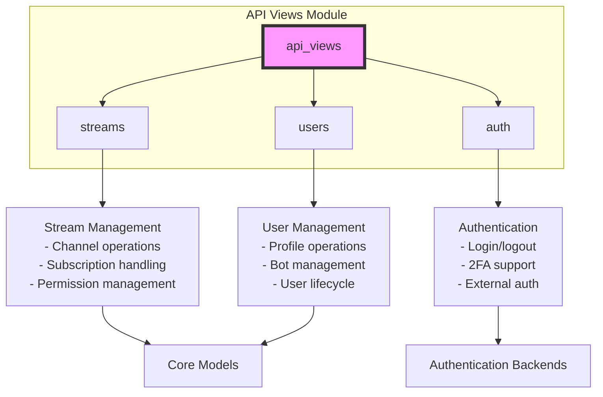
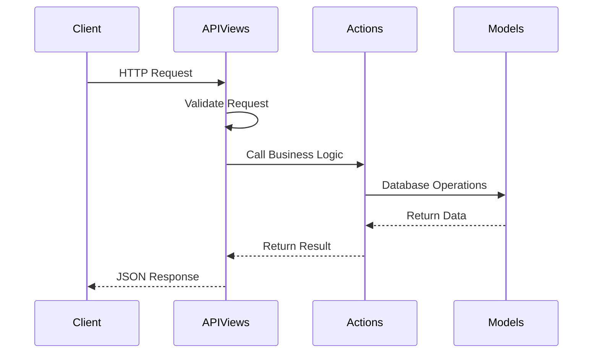

# API Views Module Documentation

## Overview

The `api_views` module serves as the primary interface layer for the Zulip API, handling HTTP requests and responses for various system functionalities. This module acts as the entry point for all API endpoints, processing client requests and coordinating with underlying business logic layers.

## Architecture

The API Views module is organized into several specialized sub-modules, each responsible for specific functional areas:

## Core Components

### 1. Stream Management Views (`zerver/views/streams.py`)

The stream management component handles all channel-related operations, providing endpoints for:

- **Channel Creation and Management**: Creating new channels with various permission settings
- **Subscription Management**: Adding/removing users from channels
- **Permission Control**: Managing who can access, post, or administer channels
- **Channel Settings**: Updating descriptions, names, and configuration options

**Key Data Structures:**
- `AddSubscriptionData`: Handles subscription request data validation
- `SubscriptionPropertyChangeRequest`: Manages subscription property updates

### 2. User Management Views (`zerver/views/users.py`)

The user management component provides comprehensive user lifecycle management:

- **User Profiles**: Managing user information, avatars, and custom profile fields
- **Bot Management**: Creating and configuring bot accounts
- **User Administration**: Deactivating, reactivating, and modifying user roles
- **Access Control**: Managing user permissions and visibility

**Key Data Structures:**
- `ProfileDataElement`: Handles custom profile field data

### 3. Authentication Views (`zerver/views/auth.py`)

The authentication component manages user authentication and session handling:

- **Login/Logout**: Standard authentication flows
- **Two-Factor Authentication**: 2FA support with backup tokens
- **External Authentication**: Integration with LDAP, SAML, OAuth providers
- **API Key Management**: Secure API key generation and validation

**Key Data Structures:**
- `TwoFactorLoginView`: Handles two-factor authentication workflow

## Data Flow Architecture

## Integration Points

The API Views module integrates with several other system modules:

- **[Core Models](core_models.md)**: Data persistence and business entity definitions
- **[Message Actions](message_actions.md)**: Message processing and delivery
- **[Authentication Backends](authentication_and_backends.md)**: External authentication providers
- **[Event System](event_system.md)**: Real-time event notifications

## Security and Validation

All API endpoints implement comprehensive security measures:

- **Authentication Checking**: Every endpoint validates user authentication
- **Permission Validation**: Role-based access control for all operations
- **Input Sanitization**: Pydantic models ensure data validation
- **Rate Limiting**: Protection against abuse and DoS attacks

## Error Handling

The module provides consistent error handling across all endpoints:

- **Standardized Error Responses**: JSON-formatted error messages
- **HTTP Status Codes**: Appropriate status codes for different error types
- **Detailed Error Messages**: Contextual information for debugging

## Performance Considerations

- **Database Query Optimization**: Efficient queries with proper indexing
- **Caching Strategies**: Strategic caching of frequently accessed data
- **Bulk Operations**: Support for batch processing to reduce overhead
- **Transaction Management**: Proper transaction boundaries for data consistency

## Sub-module Documentation

For detailed information about specific functional areas, refer to:

- [Stream Management Documentation](streams.md) - Comprehensive channel and subscription management including channel creation, subscription handling, permission management, and channel settings
- [User Management Documentation](users.md) - User lifecycle and profile management including user profiles, bot management, user administration, and access control
- [Authentication Documentation](auth.md) - Authentication flows and security features including login/logout, two-factor authentication, external authentication integration, and API key management