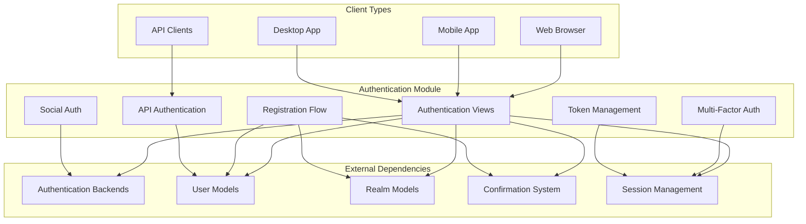
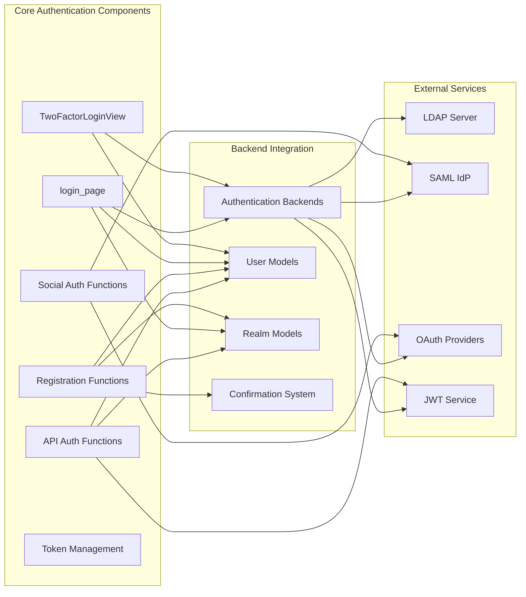
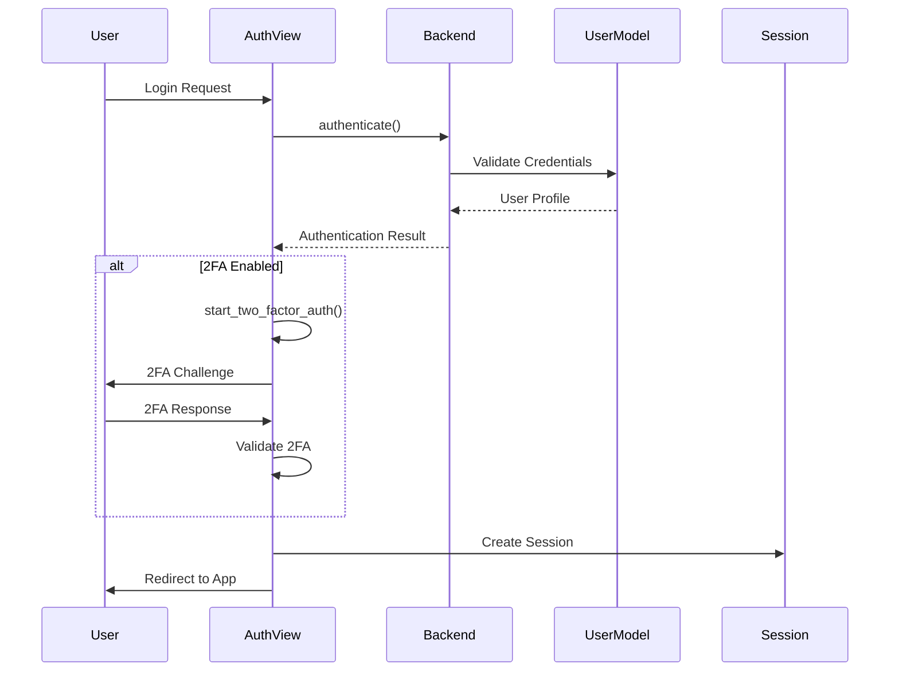
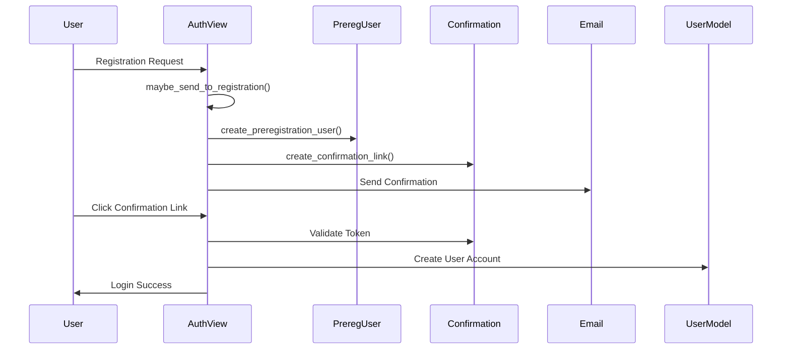
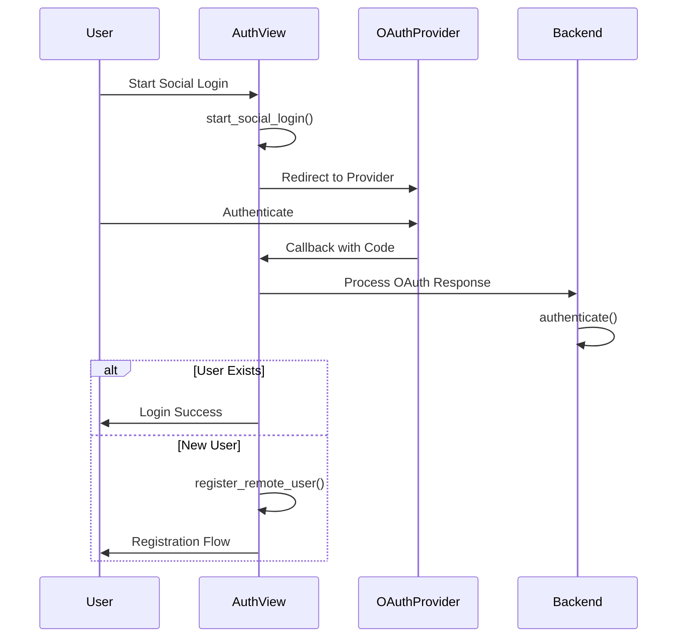

# Authentication Module Documentation

## Overview

The authentication module (`zerver.views.auth`) is a core component of the Zulip authentication system, providing comprehensive authentication and authorization functionality for the platform. It handles user login, registration, multi-factor authentication, social authentication, API key management, and various authentication backends including LDAP, SAML, OAuth, and JWT.

This module serves as the central hub for all authentication-related operations, supporting both web-based authentication flows and API-based authentication for mobile and desktop clients.

## Architecture

### High-Level Architecture



### Component Relationships



## Core Components

### Authentication Views

#### TwoFactorLoginView
A specialized login view that extends Django's two-factor authentication system to support Zulip's realm-based architecture. It handles the complete two-factor authentication flow including backup tokens and integrates with Zulip's custom authentication forms.

**Key Features:**
- Multi-step authentication process
- Backup token support
- Realm-aware redirection
- Custom form integration

#### login_page
The main entry point for web-based authentication, handling both standard login and two-factor authentication flows. It manages realm detection, subdomain handling, and redirects authenticated users appropriately.

**Key Features:**
- Realm and subdomain detection
- Preview mode support
- Social authentication subdomain handling
- Two-factor authentication initiation
- Development environment support

### Registration Flow

#### maybe_send_to_registration
Central function that handles the registration decision logic after successful email verification. It determines whether to send users directly to registration or show a confirmation page based on organization settings and invitation status.

**Key Features:**
- Email validation against realm policies
- Multiuse invite handling
- Desktop/mobile flow support
- Role assignment
- Stream and group subscription management

#### create_preregistration_user
Creates PreregistrationUser objects that store registration state between authentication and account creation. These objects preserve user data, role assignments, and subscription preferences.

#### create_preregistration_realm
Handles realm creation during the registration process, storing realm configuration data before the actual realm is created.

### Social Authentication

#### start_social_login / start_social_signup
Initiate social authentication flows for login and signup respectively. These functions handle backend configuration validation and redirect users to appropriate OAuth providers.

**Supported Providers:**
- Google OAuth
- GitHub OAuth
- GitLab OAuth
- Apple Sign In
- Azure AD
- Generic OpenID Connect
- SAML

#### oauth_redirect_to_root
Manages the redirection process for social authentication, handling subdomain preservation and flow parameter passing between the authentication subdomain and main application.

### Remote User Authentication

#### remote_user_sso
Implements SSO authentication using the REMOTE_USER header, commonly used with Apache or Nginx authentication modules. It supports both mobile and desktop flows.

#### remote_user_jwt
Handles JWT-based authentication for API access, validating JSON Web Tokens and extracting user identity information for authentication.

### API Authentication

#### api_fetch_api_key
Provides password-based API key retrieval for clients that need to authenticate via API. It validates credentials and returns API keys for subsequent API requests.

#### jwt_fetch_api_key
JWT-based API key retrieval that allows clients to obtain API keys using JSON Web Tokens instead of passwords.

#### json_fetch_api_key
Allows authenticated users to retrieve their API key by providing their password, useful for clients that need to refresh API keys.

### Token Management

#### finish_desktop_flow
Completes the desktop authentication flow by encrypting authentication tokens and rendering a special page that desktop applications can parse to complete login.

#### finish_mobile_flow
Handles mobile app authentication completion, returning encrypted API keys via custom URL schemes that mobile apps can intercept.

#### log_into_subdomain
Manages cross-subdomain authentication using secure tokens, allowing users to authenticate on one subdomain and be logged into another.

## Data Flow

### Authentication Flow



### Registration Flow



### Social Authentication Flow



## Security Features

### Authentication Security

- **Rate Limiting**: Integrated with Django's rate limiting to prevent brute force attacks
- **CSRF Protection**: All authentication endpoints use Django's CSRF protection
- **Secure Token Storage**: Authentication tokens are stored securely with expiration
- **Input Validation**: All user inputs are validated before processing
- **Safe Redirects**: URL redirection is validated to prevent open redirect vulnerabilities

### Multi-Factor Authentication

- **TOTP Support**: Time-based one-time passwords
- **Backup Tokens**: Printable backup codes for account recovery
- **Device Management**: Support for multiple authentication devices
- **Fallback Methods**: Multiple authentication methods available

### Session Management

- **Secure Session Storage**: Sessions use Django's secure session framework
- **Session Expiration**: Configurable session timeout
- **Cross-Device Support**: Support for multiple simultaneous sessions
- **Session Invalidation**: Proper cleanup on logout

## Integration Points

### Backend Integration

The authentication module integrates with various authentication backends defined in [authentication_and_backends.md](authentication_and_backends.md):

- **LDAP Authentication**: Enterprise directory integration
- **SAML Authentication**: Single sign-on for organizations
- **Social Authentication**: OAuth-based authentication
- **JWT Authentication**: Token-based authentication
- **Remote User**: Header-based authentication

### Model Integration

Integrates with core models from [core_models.md](core_models.md):

- **UserProfile**: User account information
- **Realm**: Organization/tenant information
- **PreregistrationUser**: Registration state management
- **MultiuseInvite**: Invitation system integration

### External Service Integration

- **Email Services**: Confirmation email sending
- **Push Notifications**: Mobile authentication notifications
- **Social Providers**: OAuth provider APIs
- **LDAP Servers**: Enterprise directory services

## Configuration

### Authentication Settings

Key Django settings that affect authentication behavior:

- `AUTHENTICATION_BACKENDS`: Enabled authentication backends
- `TWO_FACTOR_AUTHENTICATION_ENABLED`: Enable/disable 2FA
- `SOCIAL_AUTH_SUBDOMAIN`: Subdomain for social authentication
- `JWT_AUTH_KEYS`: JWT authentication configuration
- `ROOT_DOMAIN_LANDING_PAGE`: Root domain behavior

### Realm-Specific Settings

Authentication can be configured per-realm:

- **Password Authentication**: Enable/disable password auth
- **Social Authentication**: Configure allowed providers
- **LDAP Integration**: Realm-specific LDAP settings
- **SAML Configuration**: Organization-specific SAML setup

## Error Handling

### Authentication Errors

The module handles various authentication-related errors:

- **AuthenticationFailedError**: Invalid credentials
- **UserDeactivatedError**: Deactivated user account
- **RealmDeactivatedError**: Deactivated organization
- **PasswordAuthDisabledError**: Password authentication disabled
- **InvalidSubdomainError**: Invalid realm subdomain
- **RateLimitedError**: Too many authentication attempts

### Configuration Errors

Special error pages for configuration issues:

- **Remote User Backend Disabled**: REMOTE_USER not configured
- **SAML Configuration Error**: SAML setup issues
- **LDAP Configuration Error**: LDAP misconfiguration
- **Social Auth Configuration Error**: OAuth provider issues

## Mobile and Desktop Support

### Mobile Authentication

Special handling for mobile applications:

- **OTP Encryption**: API key encryption using one-time pads
- **Custom URL Schemes**: `zulip://` URL scheme support
- **Push Notifications**: Authentication state notifications
- **Deep Linking**: Direct app integration

### Desktop Authentication

Desktop application support:

- **Clipboard Integration**: Token transfer via clipboard
- **Encrypted Tokens**: Secure token transmission
- **Browser Integration**: Web-based authentication flow
- **Cross-Platform Support**: Windows, macOS, Linux compatibility

## API Documentation

### Authentication Endpoints

Key API endpoints provided by this module:

- `/api/v1/fetch_api_key`: Password-based API key retrieval
- `/api/v1/jwt/fetch_api_key`: JWT-based API key retrieval
- `/accounts/login/`: Web login page
- `/accounts/logout/`: Logout endpoint
- `/accounts/password/reset/`: Password reset

### Response Formats

Standardized response formats for API authentication:

```json
{
  "result": "success",
  "msg": "",
  "api_key": "user_api_key",
  "email": "user@example.com",
  "user_id": 123
}
```

## Testing and Development

### Development Authentication

Special development-only authentication features:

- **DevAuthBackend**: Development authentication backend
- **Test User Creation**: Automated test user generation
- **Mock Authentication**: Testing authentication flows
- **Configuration Bypass**: Development environment shortcuts

### Testing Utilities

Testing support features:

- **Authentication Helpers**: Test authentication utilities
- **Mock Backends**: Testing authentication backends
- **Token Generation**: Test token creation
- **Session Management**: Test session handling

## Performance Considerations

### Caching

- **Authentication Backend Caching**: Backend configuration caching
- **User Profile Caching**: User data caching for repeated authentication
- **Realm Configuration Caching**: Realm-specific authentication settings

### Database Optimization

- **Query Optimization**: Efficient user and realm lookups
- **Index Usage**: Proper database indexing for authentication queries
- **Connection Pooling**: Database connection management

## Monitoring and Logging

### Authentication Events

Key events logged for monitoring:

- **Login Attempts**: Successful and failed login attempts
- **Registration Events**: User registration activities
- **Authentication Errors**: Authentication failure details
- **Security Events**: Suspicious authentication patterns

### Metrics

Important metrics for authentication monitoring:

- **Login Success Rate**: Authentication success percentage
- **Registration Conversion**: Registration completion rates
- **Authentication Method Usage**: Backend usage statistics
- **Error Rates**: Authentication failure rates

## Future Enhancements

### Planned Features

- **WebAuthn Support**: FIDO2/WebAuthn authentication
- **Biometric Authentication**: Fingerprint/face recognition
- **Risk-Based Authentication**: Adaptive authentication based on risk factors
- **Passwordless Authentication**: Magic link and SMS authentication

### Security Enhancements

- **Advanced Threat Detection**: Machine learning-based attack detection
- **Behavioral Analysis**: User behavior-based authentication
- **Device Fingerprinting**: Device-based authentication factors
- **Geolocation Security**: Location-based authentication rules