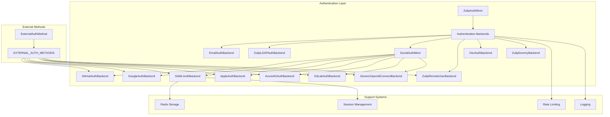
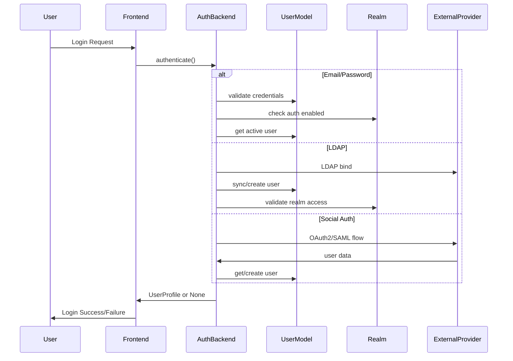

# Authentication and Backends Module

## Introduction

The authentication_and_backends module is the core authentication system for Zulip, providing a comprehensive and flexible authentication framework that supports multiple authentication methods. This module implements various authentication backends ranging from traditional email/password authentication to enterprise-grade SSO solutions like SAML, LDAP, and OAuth2 providers.

The module is designed with security, scalability, and extensibility in mind, allowing organizations to configure authentication methods that best fit their security requirements and existing infrastructure.

## Architecture Overview

### Core Architecture

### Authentication Flow

## Core Components

### Base Authentication Classes

#### ZulipAuthMixin
The foundation class for all authentication backends, providing:
- Common user retrieval functionality with caching
- Logging infrastructure
- Plan availability checking for cloud deployments
- Standardized backend naming and identification

#### ExternalAuthMethod
Abstract base class for external authentication methods, defining:
- Standardized dictionary representation for API responses
- Display ordering and icon management
- Configuration validation interfaces

### Authentication Backends

#### EmailAuthBackend
The default email/password authentication backend featuring:
- Password strength validation using zxcvbn
- Rate limiting by username
- Comprehensive logging of authentication attempts
- Integration with realm-level authentication settings

#### ZulipLDAPAuthBackend
Enterprise-grade LDAP authentication with:
- User synchronization from LDAP directory
- Group membership synchronization
- Custom profile field mapping
- Avatar synchronization
- Account status management (active/inactive)
- External authentication ID support

#### Social Authentication Backends
OAuth2-based authentication supporting major providers:
- **GitHubAuthBackend**: GitHub OAuth2 with team/organization restrictions
- **GoogleAuthBackend**: Google OAuth2 integration
- **GitLabAuthBackend**: GitLab OAuth2 support
- **AppleAuthBackend**: Sign in with Apple (web and native flows)
- **AzureADAuthBackend**: Microsoft Azure AD integration
- **GenericOpenIdConnectBackend**: Generic OIDC provider support

#### SAMLAuthBackend
Enterprise SAML 2.0 authentication featuring:
- Multiple Identity Provider (IdP) support
- SP-initiated and IdP-initiated logout
- Group synchronization via SAML attributes
- Session management with Redis storage
- Advanced realm access control

#### Development Backends
- **DevAuthBackend**: Development-only authentication for testing
- **ZulipDummyBackend**: Internal backend for pre-authenticated flows

### Support Systems

#### Rate Limiting
- Per-username rate limiting to prevent brute force attacks
- Configurable rate limiting rules
- Integration with Django's authentication flow

#### Logging and Monitoring
- Comprehensive authentication attempt logging
- Security event tracking
- Performance monitoring
- Error reporting with appropriate detail levels

#### Data Synchronization
- LDAP-to-Zulip user data synchronization
- Group membership management
- Custom profile field updates
- Avatar synchronization

## Key Features

### Multi-Realm Support
The authentication system supports multiple realms (organizations) with:
- Per-realm authentication method configuration
- Realm-specific user isolation
- Subdomain-based realm identification
- Cross-realm user detection and appropriate error handling

### Security Features
- **Rate Limiting**: Prevents brute force attacks on authentication endpoints
- **Password Strength**: Enforces strong password requirements
- **Session Management**: Secure session handling with proper logout procedures
- **Audit Logging**: Comprehensive logging of authentication events
- **Input Validation**: Thorough validation of all authentication parameters

### Enterprise Integration
- **LDAP Integration**: Full LDAP directory integration with user synchronization
- **SAML 2.0**: Complete SAML support for enterprise SSO
- **Group Synchronization**: Automatic group membership management
- **Custom Attributes**: Support for custom user attributes and profile fields

### Scalability
- **Caching**: Efficient user data caching to reduce database queries
- **Redis Storage**: Temporary data storage for authentication flows
- **Async Processing**: Support for asynchronous authentication operations

## Configuration and Settings

### Authentication Backend Configuration
Authentication backends are configured through Django's `AUTHENTICATION_BACKENDS` setting, with additional Zulip-specific settings for each backend type.

### Realm-Level Configuration
Each realm can configure:
- Enabled authentication methods
- Authentication method priorities
- Backend-specific settings
- User creation policies

### External Provider Configuration
Social authentication backends support extensive configuration including:
- OAuth2 client credentials
- SAML metadata and certificates
- LDAP connection settings
- Group mapping configurations

## Integration Points

### User Management Integration
The authentication system integrates with Zulip's user management through:
- [User models and profiles](core_models.md#users)
- [Realm management](core_models.md#realms)
- [Group membership systems](core_models.md#groups)

### Session and Security Integration
- [Session management middleware](middleware.md)
- [Rate limiting systems](middleware.md#rate-limiting)
- [Security policies and validation](middleware.md)

### API Integration
Authentication backends provide data for:
- [API authentication endpoints](api_views.md)
- [Server settings API](api_views.md)
- [User profile management](api_views.md)

## Error Handling and Security

### Authentication Failures
The system handles various authentication failure scenarios:
- Invalid credentials
- Deactivated accounts
- Realm access restrictions
- External provider errors
- Network and connectivity issues

### Security Considerations
- **Credential Protection**: Passwords are never logged or stored in plain text
- **Session Security**: Secure session management with proper expiration
- **Input Sanitization**: All user inputs are properly validated and sanitized
- **Rate Limiting**: Protection against brute force and enumeration attacks

## Testing and Development

### Development Authentication
The module includes special authentication backends for development and testing:
- DevAuthBackend for development environment authentication
- Comprehensive test coverage for all authentication flows
- Mock LDAP server for testing LDAP integration

### Configuration Validation
Each authentication backend includes configuration validation to ensure:
- Required settings are present
- Settings have valid values
- Security requirements are met

## Performance Optimization

### Caching Strategy
- User profile caching to avoid repeated database queries
- LDAP connection pooling for efficient directory access
- Redis-based temporary data storage for authentication flows

### Database Optimization
- Efficient user lookup queries
- Proper indexing for authentication-related fields
- Transaction management for user creation and updates

This authentication system provides a robust, secure, and flexible foundation for user authentication in Zulip, supporting everything from small teams to large enterprise deployments with complex authentication requirements.