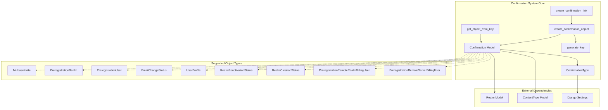
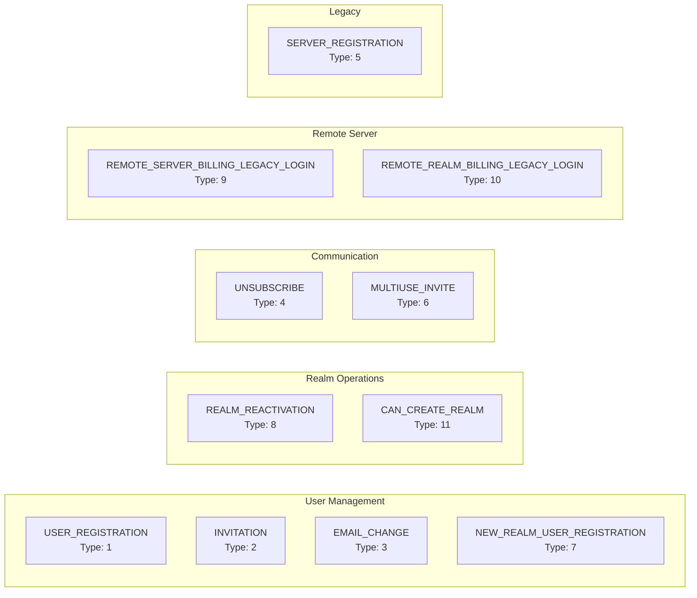
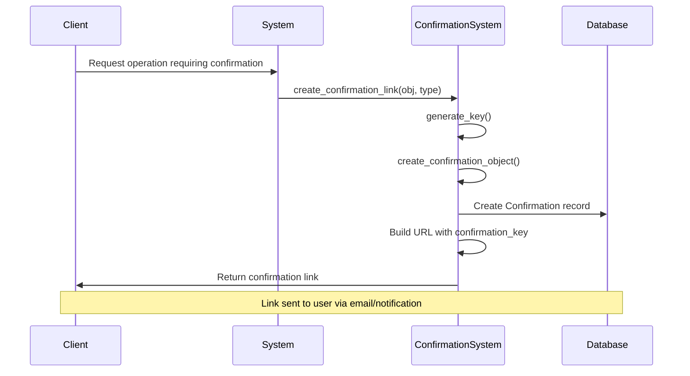
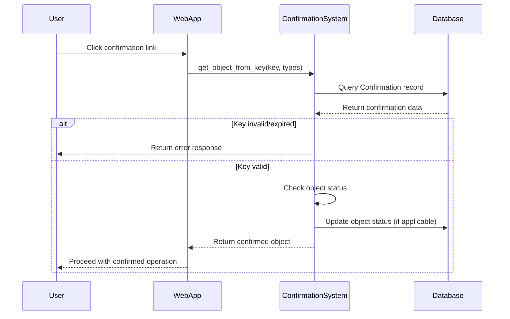

# Confirmation System Module Documentation

## Introduction

The confirmation system module is a critical security component in Zulip that manages secure confirmation links for various user actions and system operations. It provides a centralized framework for generating, validating, and managing confirmation tokens across different types of operations including user registration, email changes, invitations, realm creation, and billing operations.

## Architecture Overview

### Core Components

The confirmation system is built around two primary components:

1. **Confirmation Model** (`confirmation.models.Confirmation`): The central database model that stores confirmation records
2. **ConfirmationType** (`confirmation.models.ConfirmationType`): Configuration class that defines properties for different confirmation types

### System Architecture



## Component Details

### Confirmation Model

The `Confirmation` model serves as the central storage mechanism for all confirmation-related data:

- **Generic Foreign Key**: Uses Django's contenttypes framework to associate with any model
- **Confirmation Key**: Unique 24-character base32-encoded token (120 bits of entropy)
- **Expiry Management**: Configurable expiration dates with database indexing for efficient cleanup
- **Realm Association**: Optional link to realms for realm-specific confirmations
- **Type System**: Integer-based type system for different confirmation categories

### Confirmation Types

The system supports 11 distinct confirmation types, each with specific use cases and validity periods:



### Key Generation and Security

The system implements cryptographically secure key generation:

```python
def generate_key() -> str:
    # 24 characters * 5 bits of entropy/character = 120 bits of entropy
    return b32encode(secrets.token_bytes(15)).decode().lower()
```

Security features include:
- **High Entropy**: 120 bits of entropy using Python's `secrets` module
- **Length Validation**: Supports both 24-character (current) and 40-character (legacy) keys
- **Expiration Handling**: Configurable expiration with database-level indexing
- **Status Tracking**: Integration with object status fields for one-time use confirmations

## Data Flow

### Confirmation Creation Flow



### Confirmation Validation Flow



## Integration Points

### Core Models Integration

The confirmation system integrates with multiple core Zulip models:

- **User Management**: [core_models.md](core_models.md#users)
  - `UserProfile`: For email change confirmations and unsubscribe links
  - `PreregistrationUser`: For user registration and invitation processes
  
- **Realm Management**: [core_models.md](core_models.md#realms)
  - `Realm`: For realm reactivation confirmations
  - `PreregistrationRealm`: For new realm creation confirmations
  - `RealmReactivationStatus`: For realm reactivation status tracking

- **Message System**: [core_models.md](core_models.md#messages)
  - `EmailChangeStatus`: For email change confirmation workflows

### Authentication Integration

The system works closely with authentication components:

- **Authentication Backends**: [authentication_and_backends.md](authentication_and_backends.md)
  - Provides secure confirmation for authentication-related operations
  - Integrates with external authentication methods

### API Integration

Confirmation links are generated and validated through API endpoints:

- **User API Views**: [api_views.md](api_views.md#users)
  - User registration and profile update confirmations
  - Email change confirmations
  
- **Authentication API Views**: [api_views.md](api_views.md#auth)
  - Login and registration confirmation flows
  - Two-factor authentication confirmations

## Configuration and Settings

### Validity Periods

Different confirmation types have configurable validity periods:

- **Default Validity**: `CONFIRMATION_LINK_DEFAULT_VALIDITY_DAYS` (typically 7 days)
- **Invitation Links**: `INVITATION_LINK_VALIDITY_DAYS` (typically 14 days)
- **Realm Creation**: `CAN_CREATE_REALM_LINK_VALIDITY_DAYS` (typically 7 days)
- **Unsubscribe Links**: 1,000,000 days (effectively never expires)

### Status Management

The system uses status constants for managing confirmation lifecycle:

- **STATUS_USED**: Marked when confirmation is successfully used
- **STATUS_REVOKED**: Marked when confirmation is manually revoked

## Error Handling

The system implements comprehensive error handling through `ConfirmationKeyError`:

```python
class ConfirmationKeyError(Exception):
    WRONG_LENGTH = 1    # Invalid key format
    EXPIRED = 2         # Key has expired
    DOES_NOT_EXIST = 3  # Key not found in database
```

Each error type maps to a specific user-facing error page for clear communication.

## Security Considerations

### Key Security
- **Cryptographic Randomness**: Uses `secrets.token_bytes()` for key generation
- **Sufficient Entropy**: 120 bits of entropy prevents brute force attacks
- **Database Indexing**: Efficient key lookups prevent timing attacks

### Access Control
- **Type Validation**: Confirmation types are validated against allowed lists
- **Status Checking**: Used/revoked confirmations are properly rejected
- **Realm Isolation**: Confirmations are scoped to appropriate realms

### Expiration Management
- **Configurable Expiration**: Different confirmation types have appropriate lifetimes
- **Database Indexing**: Expired confirmations can be efficiently cleaned up
- **Graceful Degradation**: Expired confirmations provide clear error messages

## Usage Examples

### Creating a User Registration Confirmation

```python
# Create confirmation for user registration
confirmation_link = create_confirmation_link(
    prereg_user,
    Confirmation.USER_REGISTRATION
)
```

### Validating an Email Change Confirmation

```python
# Validate email change confirmation
email_change_status = get_object_from_key(
    confirmation_key,
    [Confirmation.EMAIL_CHANGE],
    mark_object_used=True
)
```

### Generating an Unsubscribe Link

```python
# Create one-click unsubscribe link
unsubscribe_link = one_click_unsubscribe_link(
    user_profile,
    "marketing_emails"
)
```

## Dependencies

The confirmation system has minimal external dependencies:

- **Django Framework**: Core ORM and contenttypes framework
- **Zerver Models**: Integration with user, realm, and message models
- **Zilencer Models**: Optional integration for remote server billing (when enabled)
- **Django Settings**: Configuration for validity periods and status constants

## Future Considerations

The system is designed to be extensible for new confirmation types and can accommodate additional security features such as:

- Rate limiting for confirmation attempts
- Additional validation layers
- Integration with external confirmation services
- Enhanced audit logging for confirmation events