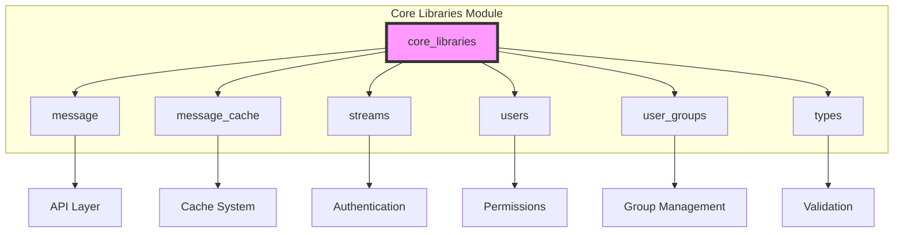
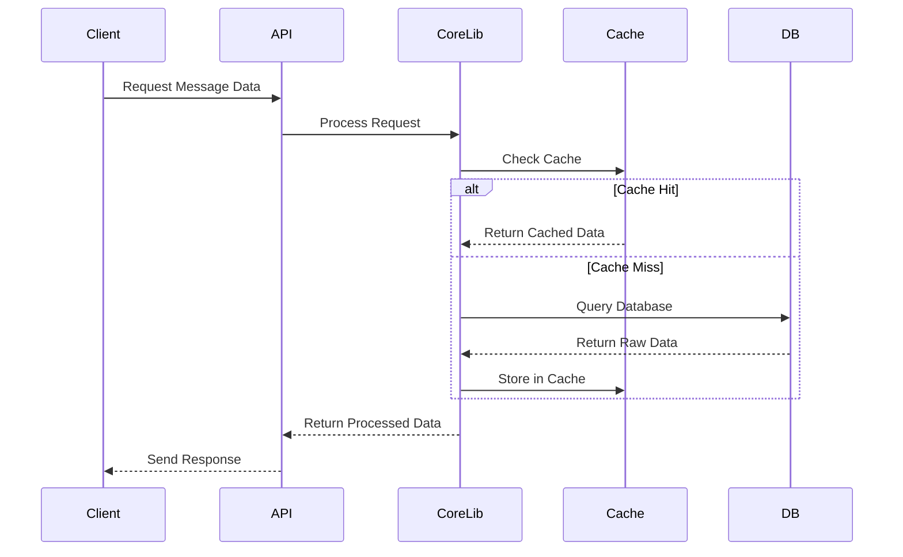

# Core Libraries Module Documentation

## Overview

The `core_libraries` module serves as the foundational data processing and utility layer for the Zulip messaging platform. This module provides essential data structures, caching mechanisms, and utility functions that support the entire system's core operations including message handling, user management, stream operations, and type definitions.

## Architecture

## Core Components

### 1. Message Processing (`zerver.lib.message`)

The message processing component handles all message-related operations including:

- **Message Access Control**: Implements security policies for message visibility and access
- **Unread Message Management**: Tracks and aggregates unread messages across different conversation types
- **Message Formatting**: Handles message content processing and rendering
- **Mention Processing**: Manages user mentions and wildcard mentions in messages

Key data structures:
- `UnreadMessagesResult`: Aggregated unread message data for API responses
- `RawUnreadMessagesResult`: Raw unread message data from database queries
- `SendMessageRequest`: Comprehensive message sending request container

### 2. Message Caching (`zerver.lib.message_cache`)

Provides high-performance caching mechanisms for message data:

- **MessageDict**: Core class for marshalling Message objects into API format
- **ReactionDict**: Handles reaction data formatting
- **Cache Optimization**: Bulk operations and efficient database queries
- **Content Rendering**: Markdown processing and content version management

### 3. Stream Management (`zerver.lib.streams`)

Comprehensive stream (channel) management functionality:

- **Stream Creation**: Permission-based stream creation with validation
- **Access Control**: Multi-layered permission system for stream operations
- **Stream Metadata**: Management of stream properties and settings
- **Permission Groups**: Integration with user group-based permissions

Key features:
- Support for public, private, and web-public streams
- Complex permission inheritance and validation
- Stream lifecycle management (creation, updates, archival)

### 4. User Management (`zerver.lib.users`)

User profile and account management utilities:

- **User Access Control**: Permission checking for user operations
- **Profile Validation**: Custom profile field validation and management
- **Cross-Realm Operations**: Support for system bots and cross-realm users
- **Email Privacy**: Handling of email address visibility settings

### 5. User Groups (`zerver.lib.user_groups`)

Advanced user group management system:

- **Group Hierarchy**: Support for nested user groups with recursive membership
- **Permission Settings**: Group-based permission management for various operations
- **System Groups**: Predefined system groups with role-based permissions
- **Group Settings**: Configurable permission settings for group management

### 6. Type Definitions (`zerver.lib.types`)

Comprehensive type system for the entire platform:

- **API Types**: TypedDict definitions for all API responses
- **Data Validation**: Type-safe data structures for internal operations
- **Profile Data**: Custom profile field type definitions
- **Stream and Subscription Types**: Comprehensive type coverage for stream operations

## Data Flow

## Integration Points

The core_libraries module integrates with several other system modules:

- **[Authentication and Backends](authentication_and_backends.md)**: User authentication and authorization
- **[Core Models](core_models.md)**: Database model definitions and relationships
- **[Message Actions](message_actions.md)**: Message modification and management operations
- **[Event System](event_system.md)**: Real-time event processing and distribution

## Performance Considerations

### Caching Strategy
- **Multi-level Caching**: Database query caching, object caching, and API response caching
- **Cache Invalidation**: Smart invalidation based on data dependencies
- **Bulk Operations**: Optimized bulk database operations to minimize query count

### Query Optimization
- **Selective Loading**: Careful use of `select_related` and `prefetch_related`
- **CTE Queries**: Advanced PostgreSQL CTE queries for recursive operations
- **Index Utilization**: Strategic use of database indexes for performance

### Memory Management
- **Lazy Loading**: Deferred loading of large data sets
- **Pagination**: Built-in support for paginated data access
- **Resource Cleanup**: Proper cleanup of temporary data structures

## Security Features

### Access Control
- **Multi-layered Permissions**: Role-based, group-based, and individual permissions
- **Content Access**: Fine-grained control over message and stream access
- **Privacy Protection**: Email address visibility and user access restrictions

### Data Validation
- **Input Sanitization**: Comprehensive input validation and sanitization
- **Type Safety**: Strong typing throughout the codebase
- **Error Handling**: Consistent error handling and reporting

## Configuration and Customization

### Permission Settings
- **Configurable Groups**: Flexible permission group configuration
- **System Groups**: Predefined system groups for common use cases
- **Custom Permissions**: Support for custom permission settings

### Realm Settings
- **Organization-level Configuration**: Per-organization customization options
- **Feature Flags**: Support for feature toggles and gradual rollouts
- **Integration Settings**: Configuration for external integrations

## Error Handling

### Exception Types
- **JsonableError**: Standard API error responses
- **Permission Errors**: Specific permission-related exceptions
- **Validation Errors**: Input validation and data integrity errors

### Error Recovery
- **Graceful Degradation**: System continues operating with reduced functionality
- **Retry Mechanisms**: Automatic retry for transient failures
- **Fallback Strategies**: Alternative approaches when primary methods fail

## Testing and Quality Assurance

### Test Coverage
- **Unit Tests**: Comprehensive unit test coverage for all components
- **Integration Tests**: End-to-end testing of module interactions
- **Performance Tests**: Load testing and performance validation

### Code Quality
- **Type Annotations**: Full type annotation coverage
- **Documentation**: Comprehensive inline documentation
- **Code Review**: Rigorous code review processes

## Future Enhancements

### Planned Improvements
- **Enhanced Caching**: More sophisticated caching strategies
- **Performance Optimization**: Continued performance improvements
- **Feature Expansion**: New functionality based on user feedback

### Scalability Considerations
- **Horizontal Scaling**: Support for distributed deployments
- **Database Sharding**: Strategies for data partitioning
- **Load Balancing**: Support for high-availability configurations

---

For detailed information about specific sub-modules, please refer to:
- [Message Processing Documentation](message.md)
- [Message Caching Documentation](message_cache.md)
- [Stream Management Documentation](streams.md)
- [User Management Documentation](users.md)
- [User Groups Documentation](user_groups.md)
- [Type Definitions Documentation](types.md)

## Related Modules

The core_libraries module works closely with:
- [Core Models](core_models.md) - Database model definitions
- [Authentication and Backends](authentication_and_backends.md) - User authentication
- [Message Actions](message_actions.md) - Message modification operations
- [Event System](event_system.md) - Real-time event processing