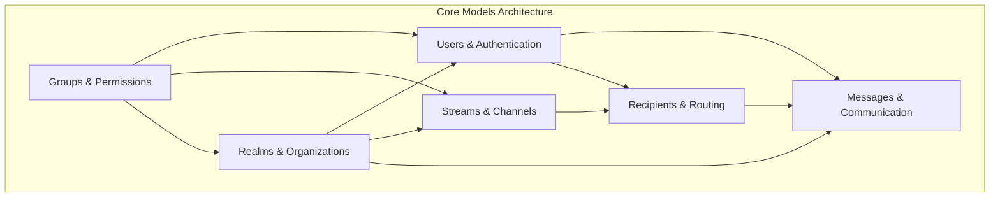
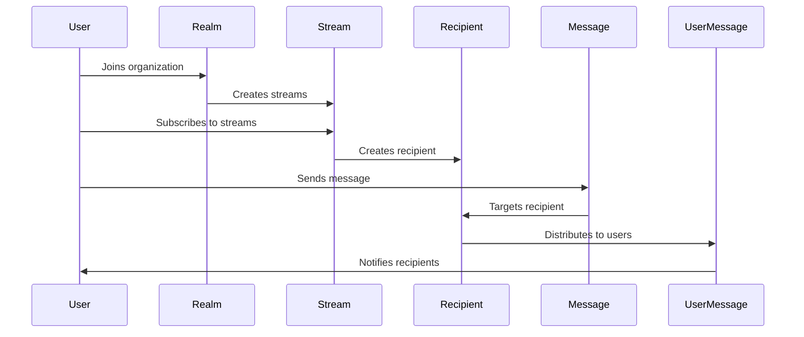

# Core Models Module Documentation

## Overview

The `core_models` module serves as the foundational data layer for the Zulip chat application, providing the essential database models and data structures that underpin the entire system. This module defines the core entities, their relationships, and business logic for managing organizations, users, messages, streams, and permissions within the Zulip ecosystem.

## Architecture

The core_models module is organized into several interconnected sub-modules, each responsible for specific aspects of the application's data model:

### Data Flow Architecture

## Sub-modules

### 1. Realms & Organizations
**File**: [realms.md](realms.md)

Manages multi-tenant organization data including realm settings, authentication methods, domain restrictions, and export functionality. The Realm model serves as the top-level container for all other entities in a Zulip organization.

**Key Components:**
- `Realm`: Main organization/tenant model
- `RealmDomain`: Domain restrictions for email authentication
- `RealmExport`: Data export tracking and management
- `RealmAuthenticationMethod`: Supported authentication backends

### 2. Users & Authentication
**File**: [users.md](users.md)

Handles user profiles, authentication, permissions, and user preferences. Provides comprehensive user management with role-based access control and extensive customization options.

**Key Components:**
- `UserProfile`: Core user model with roles and permissions
- `UserBaseSettings`: Abstract model for user preferences
- `RealmUserDefault`: Realm-level default settings
- `ExternalAuthID`: External authentication integration

### 3. Messages & Communication
**File**: [messages.md](messages.md)

Core messaging system with message storage, archiving, reactions, attachments, and user message tracking. Supports complex message lifecycle management including retention policies and search functionality.

**Key Components:**
- `Message`: Core message model with content and metadata
- `UserMessage`: Per-user message state and flags
- `ArchivedMessage`: Message archiving for retention policies
- `Reaction`: Emoji reactions to messages
- `Attachment`: File attachments and media handling

### 4. Streams & Channels
**File**: [streams.md](streams.md)

Manages channels/streams, subscriptions, permissions, and channel-specific settings. Provides flexible channel management with granular permission controls and various privacy settings.

**Key Components:**
- `Stream`: Channel/stream model with permissions
- `Subscription`: User subscription to streams
- `DefaultStreamGroup`: Default channel groups for new users
- `ChannelEmailAddress`: Email integration for channels

### 5. Recipients & Routing
**File**: [recipients.md](recipients.md)

Handles message routing and delivery targeting for different types of conversations (direct messages, streams, group messages). Provides the abstraction layer for message delivery.

**Key Components:**
- `Recipient`: Message routing abstraction
- `DirectMessageGroup`: Group direct message management

### 6. Groups & Permissions
**File**: [groups.md](groups.md)

User group management, system groups, and permission settings. Provides flexible role-based access control with system-defined and custom user groups.

**Key Components:**
- `UserGroup`: Base user group model
- `NamedUserGroup`: Named user groups with permissions
- `SystemGroups`: System-defined group constants

## Key Features

### Multi-tenancy
The module implements robust multi-tenant architecture through the Realm model, ensuring complete data isolation between organizations while sharing the same database infrastructure.

### Permission System
Comprehensive permission system using user groups and role-based access control, with granular permissions for streams, messages, and administrative functions.

### Message Archiving
Sophisticated message retention and archiving system that supports automated cleanup policies while preserving important data and maintaining audit trails.

### Scalability Design
Optimized for high-scale deployments with careful indexing, caching strategies, and database design that supports millions of messages and users.

## Integration Points

The core_models module integrates with other system modules:

- **[authentication_and_backends](../authentication_and_backends.md)**: User authentication and external auth integration
- **[message_actions](../message_actions.md)**: Message processing and delivery workflows
- **[event_system](../event_system.md)**: Real-time event generation for model changes
- **[analytics](../analytics.md)**: Data collection for analytics and reporting

## Database Design

The module uses Django's ORM with PostgreSQL-specific features for optimal performance:

- **Partial Indexes**: For efficient querying of specific message states
- **GIN Indexes**: For full-text search capabilities
- **Composite Indexes**: For complex query patterns
- **BitField**: For efficient flag storage in UserMessage

## Security Considerations

- **Email Privacy**: Configurable email visibility settings
- **Permission Boundaries**: Strict role-based access controls
- **Data Isolation**: Complete realm-based data separation
- **Audit Trail**: Comprehensive logging of administrative actions

## Performance Optimizations

- **Caching Strategy**: Extensive use of Redis caching for frequently accessed data
- **Query Optimization**: Careful index design and query patterns
- **Batch Operations**: Bulk operations for large-scale data processing
- **Soft Deletion**: Soft delete patterns to maintain referential integrity

This documentation provides a comprehensive overview of the core_models module. For detailed information about specific sub-modules, refer to their individual documentation files linked above.