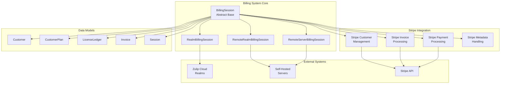
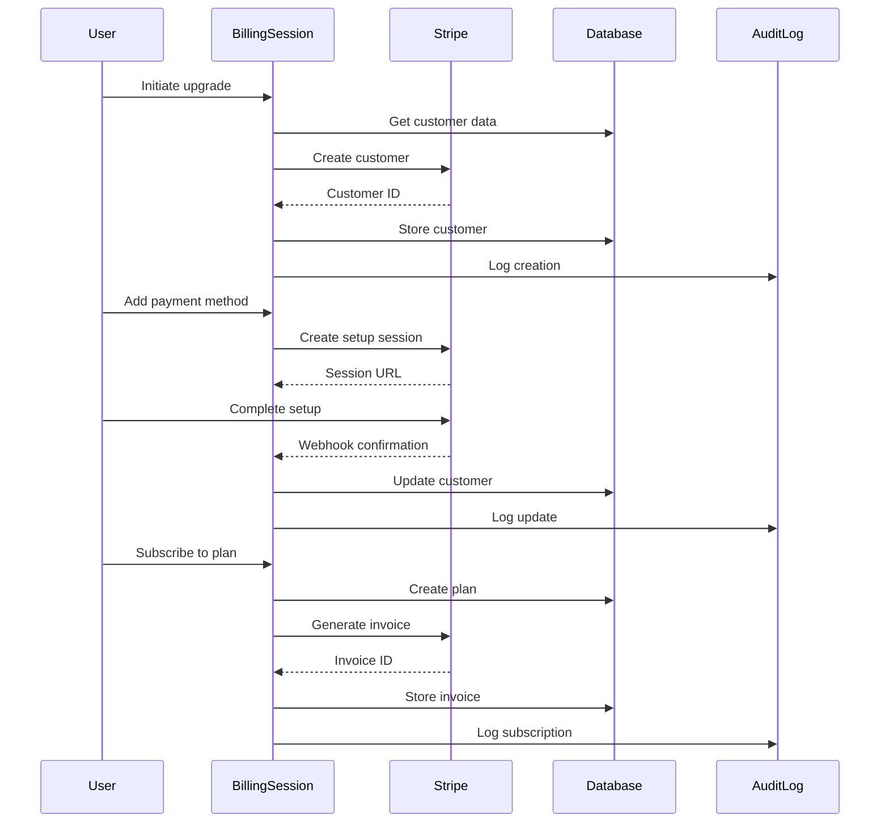
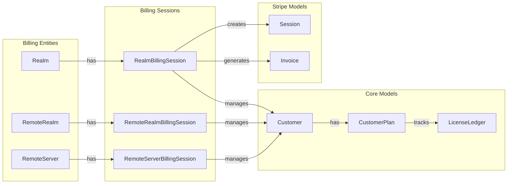
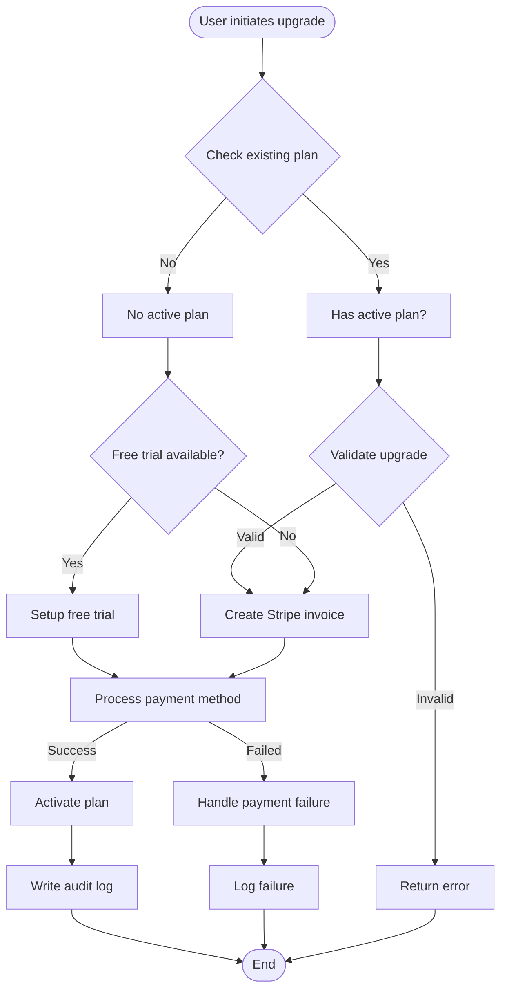
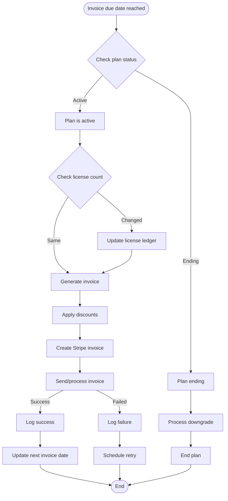

# corporate.lib.stripe Module Documentation

## Overview

The `corporate.lib.stripe` module is the core billing and payment processing system for Zulip's commercial offerings. It provides a comprehensive Stripe integration that handles subscription management, invoicing, payment processing, and billing operations for both Zulip Cloud (SaaS) and self-hosted deployments.

This module serves as the central hub for all billing-related functionality, managing customer subscriptions, processing payments, handling plan upgrades/downgrades, and coordinating with Stripe's payment infrastructure.

## Architecture

### Core Components

The module is built around several key architectural components:

#### 1. BillingSession Abstract Base Class
The `BillingSession` class provides a unified interface for billing operations across different entity types (realms, remote realms, and remote servers). It defines the contract for all billing-related operations and ensures consistent behavior across different deployment models.

#### 2. Concrete BillingSession Implementations
- **RealmBillingSession**: Handles billing for Zulip Cloud organizations (realms)
- **RemoteRealmBillingSession**: Manages billing for self-hosted Zulip servers with realm-level billing
- **RemoteServerBillingSession**: Handles server-level billing for legacy self-hosted deployments

#### 3. Stripe Integration Layer
The module provides comprehensive Stripe integration through:
- Customer management and payment method handling
- Invoice generation and processing
- Payment processing and error handling
- Webhook processing capabilities

#### 4. Plan Management System
Handles different subscription tiers and billing models:
- Cloud plans (Standard, Plus)
- Self-hosted plans (Basic, Business, Community, Legacy)
- Fixed-price plans and custom arrangements
- Complimentary access plans

## System Architecture

## Data Flow Architecture

## Component Relationships

## Key Features

### 1. Multi-Entity Billing Support
The module supports three distinct billing models:
- **Zulip Cloud Realms**: Traditional SaaS billing with per-seat pricing
- **Remote Realms**: Self-hosted deployments with realm-level billing
- **Remote Servers**: Legacy server-level billing for pre-8.0 installations

### 2. Flexible Plan Management
- Multiple subscription tiers (Standard, Plus, Basic, Business, Community)
- Annual and monthly billing cycles
- Automatic and manual license management
- Fixed-price plans and custom arrangements
- Complimentary access and sponsorship programs

### 3. Comprehensive Payment Processing
- Stripe payment method management
- Automatic and invoice-based billing
- Prorated charges and credits
- Discount and coupon support
- Failed payment handling and retry logic

### 4. License Management
- Automatic license tracking based on user counts
- Manual license adjustment capabilities
- Guest user pricing calculations
- License ledger maintenance and auditing

### 5. Audit and Compliance
- Comprehensive audit logging for all billing events
- Support for both local and remote audit logs
- Transaction history and change tracking
- Compliance reporting capabilities

## Process Flows

### Upgrade Process Flow

### Invoice Processing Flow

## Integration Points

### Dependencies
- **corporate.models**: Customer, CustomerPlan, LicenseLedger, Invoice, Session models
- **zilencer.models**: RemoteRealm, RemoteZulipServer, RemoteRealmAuditLog, RemoteZulipServerAuditLog
- **zerver.models**: Realm, UserProfile, RealmAuditLog
- **stripe**: Official Stripe Python SDK for payment processing

### Related Modules
- **[corporate.models.customers](corporate.models.customers.md)**: Customer data management
- **[corporate.models.plans](corporate.models.plans.md)**: Plan and subscription models
- **[zilencer.models](zilencer.models.md)**: Remote server and realm management
- **[zerver.models.realms](zerver.models.realms.md)**: Zulip Cloud realm management

## Error Handling

The module implements comprehensive error handling with specific exception types:

- **BillingError**: General billing operation failures
- **StripeCardError**: Payment method issues
- **StripeConnectionError**: Stripe API connectivity problems
- **LicenseLimitError**: License count violations
- **UpgradeWithExistingPlanError**: Conflicting upgrade attempts
- **InvalidPlanUpgradeError**: Invalid plan transitions

All Stripe operations are wrapped with the `@catch_stripe_errors` decorator to ensure consistent error handling and logging.

## Security Considerations

### Payment Security
- All payment processing is handled through Stripe's PCI-compliant infrastructure
- No credit card data is stored locally
- Payment method updates use Stripe's secure tokenization

### Access Control
- Billing operations require appropriate user permissions
- Support staff actions are logged with acting user information
- Session-based authentication for billing operations

### Data Protection
- Customer data is encrypted in transit and at rest
- Audit logs maintain comprehensive change tracking
- Sensitive billing information is properly redacted in logs

## Performance Optimization

### Caching Strategy
- License counts are cached with 24-hour TTL to reduce database queries
- Stripe customer data is retrieved with minimal API calls
- Plan parameters are computed efficiently with proper date handling

### Database Optimization
- Transactions are used to ensure data consistency
- Selective field updates minimize database writes
- Proper indexing on billing-related models

### Background Processing
- Invoice generation can be processed asynchronously
- License ledger updates are batched when possible
- Audit log writes are optimized for bulk operations

## Monitoring and Observability

### Logging
- Comprehensive billing event logging to dedicated billing.log
- Stripe API interactions are logged for debugging
- Error conditions are logged with full context

### Metrics
- Plan upgrade/downgrade success rates
- Payment processing success/failure rates
- Invoice generation and payment timing
- License usage patterns and trends

### Alerting
- Failed payment notifications
- Billing system errors
- Unusual billing pattern detection
- Audit log anomalies

This module serves as the financial backbone of Zulip's commercial operations, providing a robust, scalable, and secure billing platform that supports the diverse needs of both cloud and self-hosted deployments.