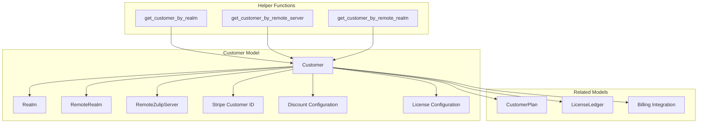
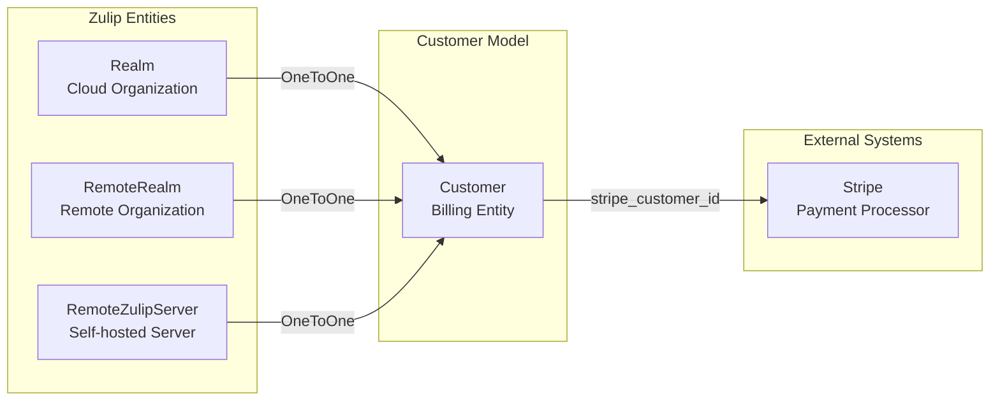
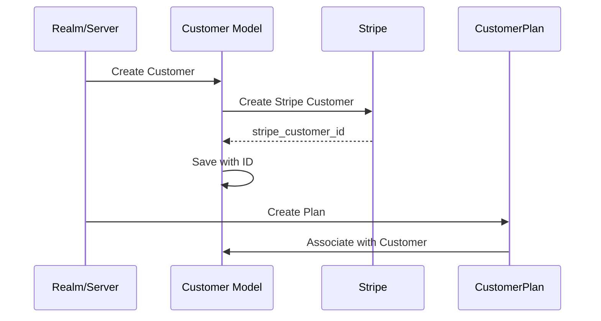
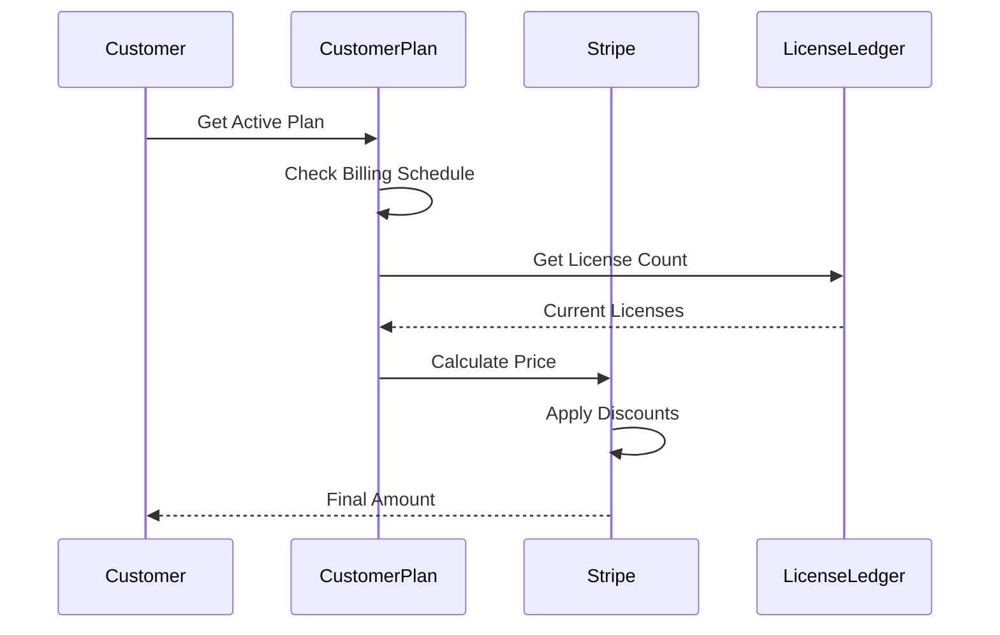

# Corporate Models - Customers Module

## Introduction

The `corporate.models.customers` module serves as the central component for managing customer billing relationships in Zulip's corporate billing system. It provides the foundational data model that connects Zulip organizations (realms) and remote servers with their corresponding Stripe customer objects and billing configurations.

## Core Purpose

This module primarily handles:
- **Customer Identity Management**: Links Zulip organizations and remote servers to Stripe customer records
- **Billing Configuration**: Manages pricing, discounts, and licensing parameters
- **Payment Integration**: Provides the bridge between Zulip's internal models and Stripe's payment system
- **Multi-Entity Support**: Handles billing for both cloud-hosted realms and self-hosted servers

## Architecture Overview

### Core Components



### Entity Relationships



## Detailed Component Analysis

### Customer Model

The `Customer` model is the central entity that manages billing relationships for all types of Zulip deployments:

#### Key Fields

- **Entity Association**: Exactly one of `realm`, `remote_realm`, or `remote_server` must be set
- **Stripe Integration**: `stripe_customer_id` links to Stripe's customer object
- **Pricing Configuration**: 
  - `monthly_discounted_price` and `annual_discounted_price` for custom pricing
  - `required_plan_tier` to limit discounts to specific plans
  - `minimum_licenses` for license management
- **Discount Management**:
  - `flat_discount` for promotional discounts
  - `flat_discounted_months` for time-limited promotions
- **License Control**:
  - `exempt_from_license_number_check` for special cases
  - `sponsorship_pending` for sponsorship workflow

#### Database Constraints

The model enforces a critical constraint ensuring that exactly one entity association exists:

```python
constraints = [
    models.CheckConstraint(
        condition=Q(realm__isnull=False)
        | Q(remote_server__isnull=False)
        | Q(remote_realm__isnull=False),
        name="has_associated_model_object",
    )
]
```

### Helper Functions

Three utility functions provide convenient access to customer records:

- **`get_customer_by_realm(realm)`**: Retrieves customer for cloud organizations
- **`get_customer_by_remote_server(remote_server)`**: Retrieves customer for self-hosted servers
- **`get_customer_by_remote_realm(remote_realm)`**: Retrieves customer for remote realms

## Data Flow Architecture

### Customer Creation Flow



### Billing Process Flow



## Integration Points

### With Corporate Billing Module

The Customer model integrates closely with other corporate billing components:

- **[corporate.models.plans](corporate.models.plans.md)**: Customer plans reference the Customer model
- **[corporate.lib.stripe](corporate.lib.stripe.md)**: Stripe integration utilities work with Customer objects
- **[corporate.models.licenses](corporate.models.licenses.md)**: License management builds on Customer relationships

### With Core Zulip Models

Customer relationships extend core Zulip functionality:

- **[zerver.models.realms](zerver.models.realms.md)**: Cloud organizations link to Customer for billing
- **[zilencer.models](zilencer.models.md)**: Remote servers and realms connect to Customer for self-hosted billing

## Business Logic

### Pricing Strategy

The Customer model supports multiple pricing strategies:

1. **Standard Pricing**: Uses plan-defined pricing without custom discounts
2. **Discounted Pricing**: Custom monthly/annual prices for specific plan tiers
3. **Flat Discounts**: Promotional discounts applied across billing periods
4. **Sponsorship Pricing**: Special handling for sponsored organizations

### License Management

License management features include:

- **Minimum License Enforcement**: `minimum_licenses` ensures baseline revenue
- **License Exemptions**: `exempt_from_license_number_check` for special cases
- **Manual License Management**: Support for organizations with complex licensing needs

### Multi-Entity Support

The model accommodates different deployment types:

- **Cloud Realms**: Standard Zulip Cloud organizations
- **Remote Realms**: Individual realms on self-hosted servers
- **Remote Servers**: Entire self-hosted Zulip installations

## Security Considerations

### Data Isolation

- Customer data is isolated by entity type (realm vs remote server)
- Stripe customer IDs are unique and not shared between entities
- Billing information is segregated from core messaging data

### Access Control

- Customer records are accessed through controlled helper functions
- Billing operations require appropriate permissions
- Stripe integration uses secure API keys and tokens

## Usage Examples

### Creating a Customer for a New Realm

```python
from corporate.models.customers import Customer
from zerver.models import Realm

# Create customer for a realm
realm = Realm.objects.get(string_id="example")
customer = Customer.objects.create(
    realm=realm,
    stripe_customer_id="cus_1234567890",
    monthly_discounted_price=500,  # $5.00 in cents
    annual_discounted_price=5000,  # $50.00 in cents
    required_plan_tier=CustomerPlan.TIER_CLOUD_STANDARD
)
```

### Retrieving Customer Information

```python
from corporate.models.customers import get_customer_by_realm

# Get customer for billing operations
customer = get_customer_by_realm(realm)
if customer:
    discounted_price = customer.get_discounted_price_for_plan(
        plan_tier=CustomerPlan.TIER_CLOUD_STANDARD,
        schedule=CustomerPlan.BILLING_SCHEDULE_ANNUAL
    )
```

## Testing and Development

### Mock Customer Creation

For testing billing functionality without Stripe integration:

```python
# Create test customer without Stripe ID
customer = Customer.objects.create(
    realm=test_realm,
    sponsorship_pending=True,
    monthly_discounted_price=0,
    annual_discounted_price=0
)
```

### Customer State Validation

The model's constraint ensures data integrity:

```python
# This will raise IntegrityError
try:
    Customer.objects.create(
        monthly_discounted_price=1000
        # Missing realm, remote_realm, or remote_server
    )
except IntegrityError:
    print("Customer must be associated with exactly one entity")
```

## Future Considerations

### Scalability

- The model supports high cardinality with unique Stripe customer IDs
- Indexing on entity fields ensures efficient lookups
- Constraint validation prevents data corruption

### Extensibility

- Additional entity types can be added to the constraint
- New pricing models can extend the discount structure
- Billing modalities can be enhanced without breaking existing integrations

## Related Documentation

- [Corporate Models - Plans](corporate.models.plans.md) - Customer plan management
- [Corporate Libraries - Stripe](corporate.lib.stripe.md) - Stripe integration details
- [Zerver Models - Realms](zerver.models.realms.md) - Realm model documentation
- [Zilencer Models](zilencer.models.md) - Remote server management