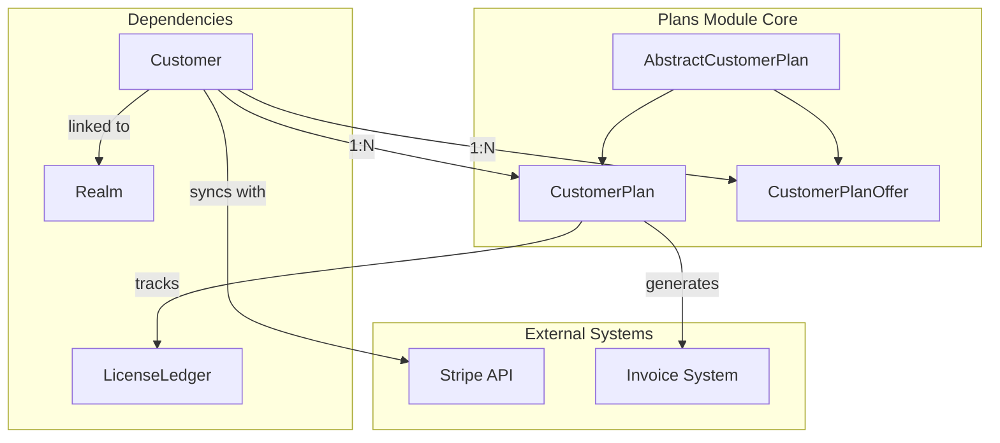
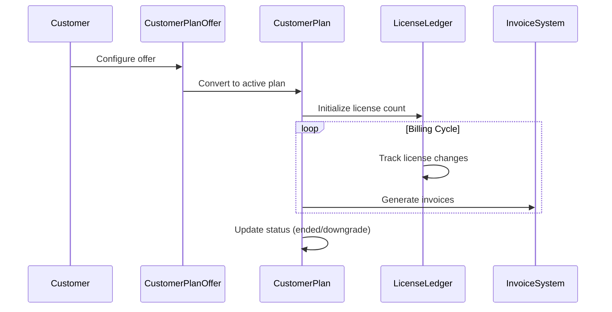
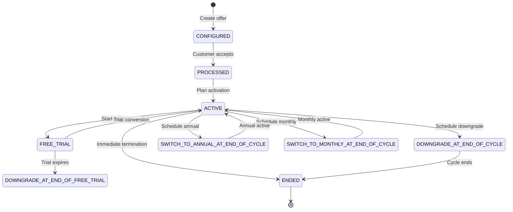

# Corporate Models: Plans Module

## Introduction

The `corporate.models.plans` module is the core component of Zulip's billing and subscription management system. It defines the data models and business logic for managing customer plans, pricing tiers, billing cycles, and plan lifecycle states. This module serves as the foundation for Zulip's monetization strategy, handling both cloud-hosted and self-hosted deployment billing scenarios.

## Architecture Overview

The plans module implements a comprehensive billing system that supports multiple pricing tiers, billing schedules, and plan statuses. It provides the data layer for subscription management, license tracking, and invoicing workflows.

## Core Components

### AbstractCustomerPlan

The base abstract model that provides common functionality for both active plans and plan offers. It establishes the relationship with the Customer model and supports fixed-price configurations.

**Key Attributes:**
- `customer`: Foreign key to the Customer model
- `fixed_price`: Optional fixed price in cents for custom pricing arrangements

### CustomerPlan

The primary model representing active customer subscriptions. It encapsulates all billing-related configuration including pricing, billing cycles, and plan status management.

**Key Features:**
- **Pricing Models**: Supports both per-license and fixed-price billing
- **Billing Schedules**: Annual and monthly billing cycles
- **Plan Tiers**: Multiple pricing tiers for different feature sets
- **Status Management**: Comprehensive lifecycle state tracking
- **License Management**: Integration with license ledger system

**Plan Tiers:**
- **Cloud Plans**: Standard, Plus, Enterprise
- **Self-Hosted Plans**: Community, Basic, Business, Enterprise
- **Special Tiers**: Legacy (complimentary access)

**Plan Statuses:**
- `ACTIVE`: Currently active subscription
- `FREE_TRIAL`: Trial period
- `DOWNGRADE_AT_END_OF_CYCLE`: Scheduled downgrade
- `SWITCH_TO_ANNUAL_AT_END_OF_CYCLE`: Annual upgrade pending
- `ENDED`: Terminated subscription
- `NEVER_STARTED`: Configured but not activated

### CustomerPlanOffer

Manages promotional offers and custom pricing configurations created through the support interface. These offers exist independently of active plans and serve as templates for customer purchases.

**Use Cases:**
- Custom pricing negotiations
- Promotional offers
- Support-configured discounts
- Invoice-based billing arrangements

## Data Flow Architecture

## Plan Lifecycle Management

## Integration Points

### Customer Model Integration
The plans module integrates tightly with the [corporate.models.customers](corporate.models.customers.md) module. Each plan is associated with a Customer record, which links to either a Realm (for cloud customers), RemoteRealm, or RemoteZulipServer (for self-hosted deployments).

### License Management
Plans work in conjunction with the LicenseLedger system to track seat allocations and usage. The `licenses()` and `licenses_at_next_renewal()` methods provide current and future license counts for billing calculations.

### Invoicing System
The module supports complex invoicing scenarios including:
- Automatic license adjustments
- Fixed-price arrangements
- Discount applications
- Billing schedule transitions

## Business Logic

### Pricing Strategy
The system supports multiple pricing models:
- **Per-license billing**: Standard seat-based pricing
- **Fixed-price**: Custom arrangements for enterprise customers
- **Discounted pricing**: Support-configured discounts for specific tiers

### Billing Cycle Management
- **Annual billing**: 12-month cycles with discounts
- **Monthly billing**: Flexible monthly cycles
- **Proration**: Support for mid-cycle changes
- **Auto-renewal**: Automated renewal processing

### Plan Tier Strategy
The tier system accommodates different deployment models and feature requirements:
- **Cloud tiers**: Standard, Plus, Enterprise with increasing features
- **Self-hosted tiers**: Community (free), Basic, Business, Enterprise
- **Legacy support**: Complimentary access for qualifying organizations

## Security and Compliance

### Data Protection
- Customer payment data is stored in Stripe, not in the application database
- Plan configurations are audit-logged for compliance
- Sensitive billing information is encrypted at rest

### Access Control
- Plan modifications require administrative privileges
- Support interface provides controlled access to pricing configuration
- API endpoints enforce proper authorization

## Performance Considerations

### Database Optimization
- Indexed fields for common queries (`next_invoice_date`, `status`)
- Efficient status filtering for active plan retrieval
- Optimized license count calculations

### Caching Strategy
- Plan information is cached to reduce database queries
- License counts are calculated on-demand to ensure accuracy
- Billing cycle calculations are optimized for cron job processing

## Error Handling

### Invoicing Safety
The `invoicing_status` field prevents concurrent invoicing operations and ensures system consistency in case of failures.

### Plan State Validation
Constraints ensure that customers have at most one active plan and prevent invalid state transitions.

## Future Extensibility

The module is designed to accommodate:
- New pricing tiers and billing models
- Additional deployment types
- Enhanced discount and promotional features
- Integration with external billing systems

## Related Documentation

- [Corporate Models: Customers](corporate.models.customers.md) - Customer management and Stripe integration
- [Corporate Models: Licenses](corporate.models.licenses.md) - License tracking and management
- [Corporate Lib: Stripe](corporate.lib.stripe.md) - Stripe payment processing integration
- [Zerver Models: Realms](zerver.models.realms.md) - Realm model and organization management