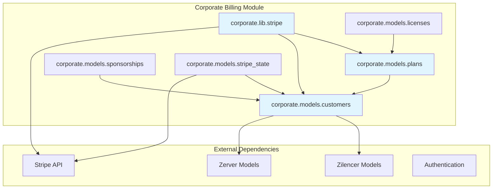
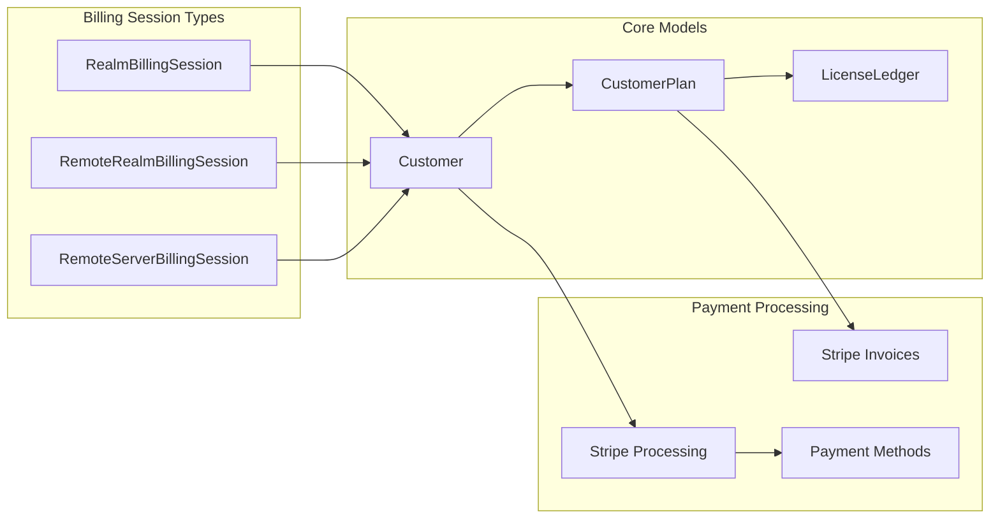
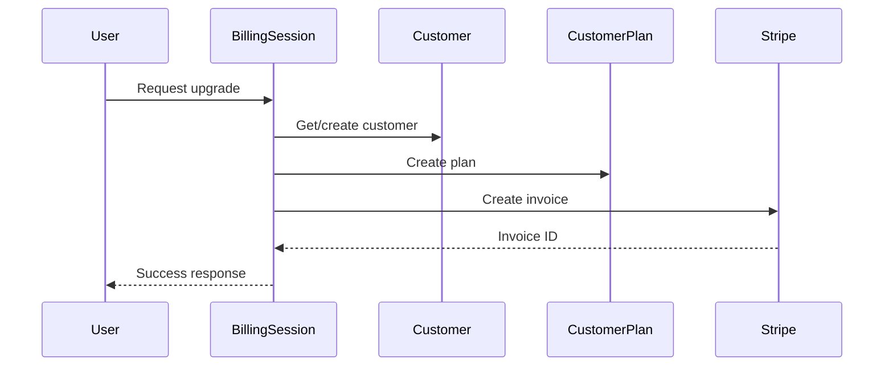
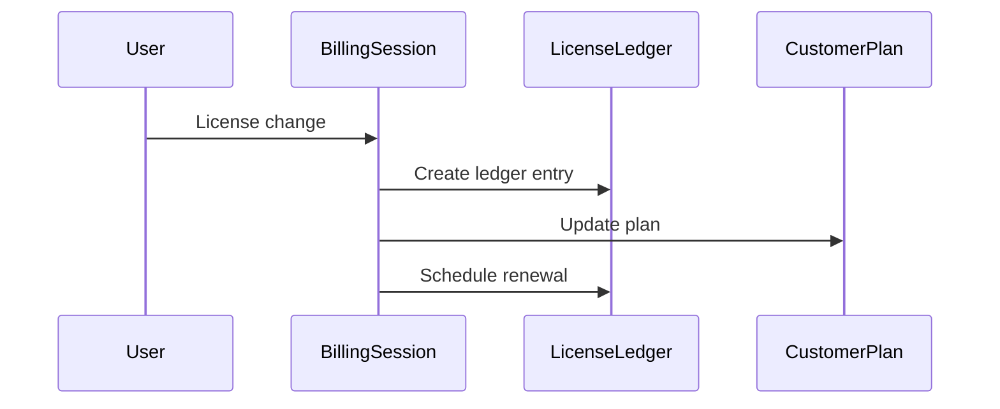

# Corporate Billing Module Documentation

## Overview

The corporate_billing module is a comprehensive billing and subscription management system for Zulip's cloud and self-hosted offerings. It handles customer management, plan subscriptions, payment processing through Stripe, license management, and sponsorship requests. The module supports both Zulip Cloud organizations and self-hosted deployments with flexible billing models including automatic and manual license management.

## Architecture

### High-Level Architecture

### Core Components Architecture

## Module Structure

The corporate_billing module is organized into several key sub-modules:

### 1. Customer Management (`corporate.models.customers`)
Manages customer entities that link Zulip organizations (realms, remote realms, or remote servers) with their Stripe customer records and billing information.

**Key Components:**
- `Customer` model - Core customer entity with Stripe integration
- `get_customer_by_*` functions - Customer lookup utilities
- Discount and pricing management
- License exemption handling

### 2. Plan Management (`corporate.models.plans`)
Handles subscription plans, plan offers, and plan lifecycle management.

**Key Components:**
- `CustomerPlan` model - Active subscription plans
- `CustomerPlanOffer` model - Configured plan offers
- Plan tier definitions and pricing
- Plan status management and transitions

### 3. Stripe Integration (`corporate.lib.stripe`)
Comprehensive Stripe integration for payment processing, invoice generation, and billing management.

**Key Components:**
- `BillingSession` abstract class - Unified billing interface
- Payment method management
- Invoice generation and processing
- Plan upgrades and downgrades
- Free trial management
- Sponsorship processing

## Key Features

### Multi-Entity Support
The module supports three types of billing entities:
- **RealmBillingSession**: Zulip Cloud organizations
- **RemoteRealmBillingSession**: Self-hosted realms with remote billing
- **RemoteServerBillingSession**: Legacy self-hosted servers

### Flexible Billing Models
- **Automatic License Management**: Licenses automatically adjust based on user count
- **Manual License Management**: Customers manually specify license counts
- **Fixed Price Plans**: Custom pricing for enterprise customers
- **Complimentary Access**: Free access plans for qualifying organizations

### Payment Processing
- **Stripe Integration**: Full Stripe API integration for payments
- **Multiple Payment Methods**: Credit card and invoice payments
- **Automatic Invoicing**: Scheduled invoice generation and processing
- **Prorated Billing**: Fair billing for mid-cycle changes

### Plan Management
- **Multiple Tiers**: Standard, Plus, Basic, Business, Enterprise plans
- **Plan Transitions**: Smooth upgrades and downgrades
- **Free Trials**: Time-limited trial periods
- **Sponsorship Program**: Discounted or free plans for qualifying organizations

## Data Flow

### Plan Upgrade Flow

### License Management Flow

## Integration Points

### Core Models Integration
- **Realm**: Links customers to Zulip Cloud organizations
- **RemoteRealm**: Links customers to self-hosted realms
- **RemoteZulipServer**: Links customers to legacy self-hosted servers
- **UserProfile**: Billing access and permissions

### Audit Logging
- **RealmAuditLog**: Cloud organization audit events
- **RemoteRealmAuditLog**: Self-hosted realm audit events
- **RemoteZulipServerAuditLog**: Legacy server audit events

### External Services
- **Stripe API**: Payment processing and customer management
- **Email System**: Billing notifications and receipts
- **Support System**: Internal billing notifications

## Configuration

### Environment Variables
- `stripe_secret_key`: Stripe API secret key
- `STAFF_SUBDOMAIN`: Support staff realm subdomain
- `SELF_HOSTING_MANAGEMENT_SUBDOMAIN`: Self-hosting billing subdomain
- `BILLING_SUPPORT_EMAIL`: Support contact email

### Plan Pricing
Pricing is configured in `get_price_per_license()` with different rates for:
- Cloud Standard/Plus plans
- Self-hosted Basic/Business plans
- Annual vs monthly billing schedules

## Security Considerations

### Payment Security
- Stripe handles all payment data
- No credit card information stored locally
- Secure webhook processing for payment events

### Access Control
- Billing access permissions required
- Support staff authentication for administrative actions
- Audit logging for all billing events

### Data Protection
- Customer data encrypted in transit and at rest
- Minimal personal data collection
- GDPR compliance for customer data handling

## Error Handling

### Billing Errors
- `BillingError`: General billing operation failures
- `StripeCardError`: Payment method issues
- `StripeConnectionError`: Stripe API connectivity issues
- `LicenseLimitError`: License count violations

### Plan Errors
- `UpgradeWithExistingPlanError`: Conflicting active plans
- `InvalidPlanUpgradeError`: Invalid plan transitions
- `SupportRequestError`: Administrative action failures

## Monitoring and Maintenance

### Logging
- Comprehensive billing event logging
- Stripe API interaction logging
- Error tracking and alerting

### Background Processing
- Automated invoice generation
- License count synchronization
- Plan status updates
- Stale data cleanup

### Health Checks
- Stripe API connectivity monitoring
- Payment method validation
- License count consistency checks
- Plan status validation

## Related Documentation

For detailed information about specific sub-modules, see:
- [corporate.models.customers](corporate.models.customers.md) - Customer entity management and Stripe customer integration
- [corporate.models.plans](corporate.models.plans.md) - Subscription plan management, plan offers, and plan lifecycle
- [corporate.lib.stripe](corporate.lib.stripe.md) - Comprehensive Stripe integration, payment processing, and billing session management

For integration with other Zulip systems, see:
- [core_models](core_models.md) - Core data models including Realm, UserProfile, and related entities
- [authentication_and_backends](authentication_and_backends.md) - Authentication systems and user management
- [remote_server_management](remote_server_management.md) - Remote server administration and management