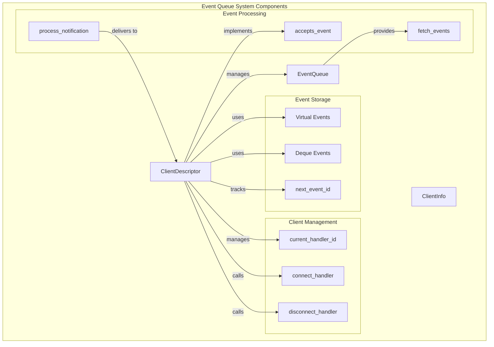
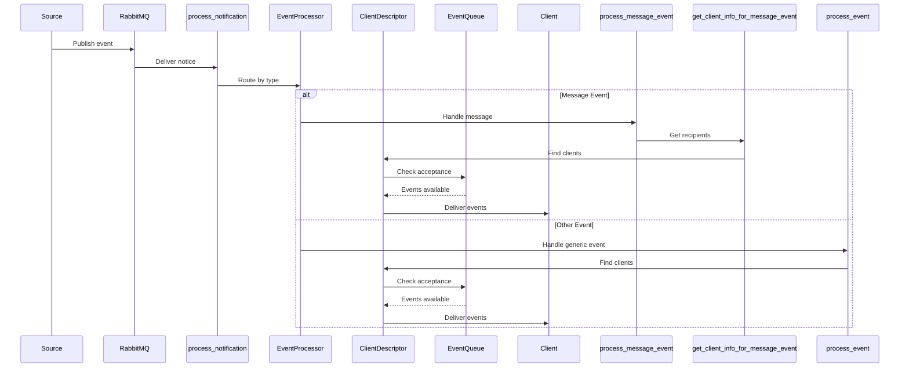
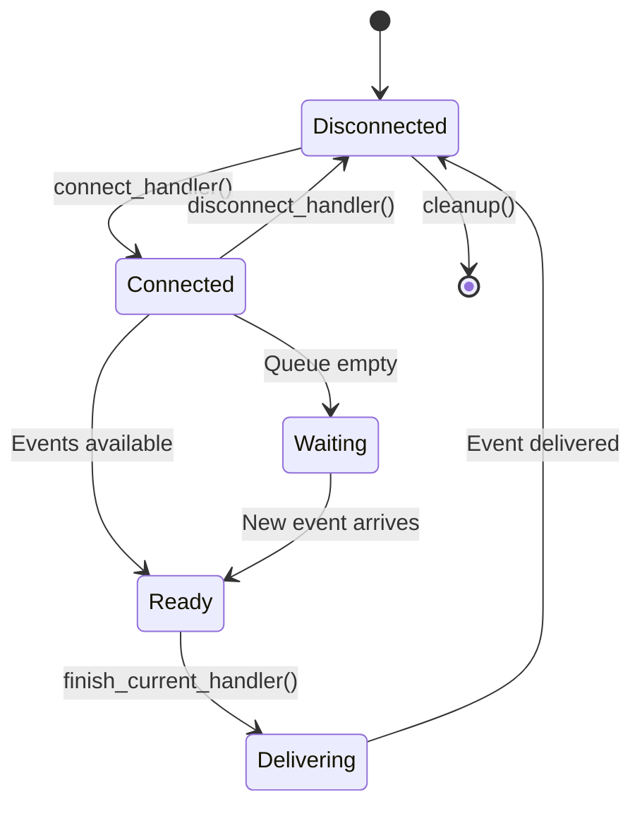

# Event Queue System Technical Reference

## Overview

The Event Queue System is the core component of the tornado_realtime module, responsible for managing client connections, event storage, and real-time event delivery. It implements a sophisticated long-polling mechanism with support for event filtering, virtual events, and cross-shard scalability.

## Architecture



## Core Components

### ClientDescriptor

The `ClientDescriptor` class represents a connected client and manages all aspects of the client's event queue and connection state.

#### Key Responsibilities:
- **Event Queue Management**: Manages the client's EventQueue instance
- **Connection State**: Tracks current handler ID and connection status
- **Event Filtering**: Determines which events the client should receive
- **Capability Negotiation**: Handles client-specific feature flags
- **Lifecycle Management**: Handles connection, disconnection, and cleanup

#### Important Attributes:

```python
user_profile_id: int                    # User ID
realm_id: int                           # Realm ID
event_queue: EventQueue                 # Event queue instance
event_types: Sequence[str] | None       # Filtered event types
narrow: Collection[Sequence[str]]       # Message filtering narrow
narrow_predicate: Callable              # Compiled narrow filter
current_handler_id: int | None          # Active handler ID
queue_timeout: int                      # Queue expiration time
```

#### Client Capabilities:

The system supports numerous client capabilities that affect event delivery:

- `apply_markdown`: Whether to apply markdown formatting to messages
- `client_gravatar`: Whether to use gravatar for user avatars
- `slim_presence`: Whether to receive slim presence events
- `all_public_streams`: Whether to receive all public stream messages
- `bulk_message_deletion`: Whether to support bulk message deletion events
- `stream_typing_notifications`: Whether to receive stream typing notifications
- `user_settings_object`: Whether to receive user settings as objects
- `pronouns_field_type_supported`: Whether client supports pronouns field type
- `linkifier_url_template`: Whether client supports URL templates
- `user_list_incomplete`: Whether client can handle incomplete user lists
- `include_deactivated_groups`: Whether to receive deactivated group events
- `archived_channels`: Whether to receive archived channel events
- `empty_topic_name`: Whether to support empty topic names
- `simplified_presence_events`: Whether to receive simplified presence events

### EventQueue

The `EventQueue` class manages the actual event storage and delivery for a client.

#### Key Features:
- **Event Storage**: Maintains a deque of events with sequential IDs
- **Virtual Events**: Compresses similar events for efficiency
- **Event Pruning**: Removes processed events to manage memory
- **Serialization**: Supports persistence across server restarts

#### Event Storage Structure:

```python
queue: deque[dict[str, Any]]            # Main event storage
next_event_id: int                      # Next event ID to assign
newest_pruned_id: int | None            # Last pruned event ID
virtual_events: dict[str, dict[str, Any]] # Compressed events
id: str                                 # Queue identifier
```

#### Virtual Events System:

Virtual events are an optimization that compresses similar events:

```python
# Example: Multiple read receipts are combined
virtual_events = {
    "flags/add/read": {
        "type": "update_message_flags",
        "op": "add", 
        "flag": "read",
        "messages": [1, 2, 3, 4, 5],  # Combined message IDs
        "all": False,
        "id": 123
    }
}
```

## Event Processing Pipeline

### Event Flow



### Event Acceptance Logic

The `accepts_event` method implements sophisticated filtering logic:

```python
def accepts_event(self, event: Mapping[str, Any]) -> bool:
    # Event type filtering
    if self.event_types is not None:
        if event["type"] not in self.event_types:
            return False
    
    # Message-specific filtering
    if event["type"] == "message":
        return self.narrow_predicate(message=event["message"], flags=event["flags"])
    
    # Capability-based filtering
    if self.user_settings_object and event["type"] in [
        "update_display_settings",
        "update_global_notifications",
    ]:
        return False
    
    # Additional capability checks...
    return True
```

## Client Management

### Connection Lifecycle



### Handler Management

The system maintains a mapping between Tornado handlers and client descriptors:

```python
# Global handler tracking
handlers: dict[int, AsyncDjangoHandler] = {}

# Handler lifecycle
handler_id = allocate_handler_id(handler)
# ... use handler ...
clear_handler_by_id(handler_id)
```

## Event Types and Processing

### Message Events

Message events undergo the most complex processing:

```python
def process_message_event(event_template: Mapping[str, Any], users: Collection[Mapping[str, Any]]) -> None:
    # 1. Determine recipients
    send_to_clients = get_client_info_for_message_event(event_template, users)
    
    # 2. Process notification settings
    user_notifications_data = UserMessageNotificationsData.from_user_id_sets(...)
    
    # 3. Generate client-specific payloads
    message_dict = get_client_payload(
        apply_markdown=client.apply_markdown,
        client_gravatar=client.client_gravatar,
        # ... other capabilities
    )
    
    # 4. Deliver to clients
    for client_data in send_to_clients.values():
        client.add_event(user_event)
```

### Special Event Processing

Different event types have specialized processing:

- **Presence Events**: Support multiple formats (legacy, slim, modern)
- **Update Message Events**: Handle content and topic changes
- **Delete Message Events**: Support bulk and individual deletion
- **User Group Events**: Handle deactivated group filtering
- **Stream Events**: Support archived channel handling

## Scalability Features

### Cross-Shard Support

The system supports horizontal scaling across multiple Tornado processes:

```python
# Shard determination
user_port = get_user_tornado_port(user_profile)
if not is_current_port(user_port):
    # Redirect to correct shard
    return HttpResponse(
        "", 
        headers={"X-Accel-Redirect": f"/internal/tornado/{user_port}{request.get_full_path()}"}
    )
```

### Memory Management

- **Garbage Collection**: Periodic cleanup of expired queues
- **Event Pruning**: Automatic removal of processed events
- **Virtual Event Resolution**: Periodic consolidation of virtual events
- **Handler Cleanup**: Automatic cleanup of disconnected handlers

## Performance Optimizations

### Event Batching

Events are batched when possible to reduce HTTP overhead:

```python
# Multiple events returned in single response
response = {
    "events": [event1, event2, event3, ...],
    "queue_id": queue_id
}
```

### Virtual Event Compression

Similar events are compressed to reduce processing overhead:

```python
# Before: Multiple individual events
{"type": "update_message_flags", "op": "add", "flag": "read", "messages": [1]}
{"type": "update_message_flags", "op": "add", "flag": "read", "messages": [2]}

# After: Single compressed event  
{"type": "update_message_flags", "op": "add", "flag": "read", "messages": [1, 2]}
```

### Client-Side Filtering

Events are filtered server-side to reduce network traffic:

```python
# Only send events client can handle
if not client.accepts_event(event):
    continue
```

## Error Handling

### Queue Access Errors

```python
def access_client_descriptor(user_id: int, queue_id: str) -> ClientDescriptor:
    client = clients.get(queue_id)
    if client is not None:
        if user_id == client.user_profile_id:
            return client
        logging.warning("User %d is not authorized for queue %s", user_id, queue_id)
    raise BadEventQueueIdError(queue_id)
```

### Event Processing Errors

The system includes comprehensive error handling:

- **Queue ID validation**: Ensures users can only access their own queues
- **Event ID validation**: Prevents access to pruned events
- **Handler cleanup**: Automatic cleanup of failed handlers
- **Logging**: Detailed logging for debugging and monitoring

## Persistence

### Queue Serialization

Client descriptors are serialized to disk for persistence:

```python
def dump_event_queues(port: int) -> None:
    with open(persistent_queue_filename(port), "wb") as stored_queues:
        stored_queues.write(
            orjson.dumps([(qid, client.to_dict()) for (qid, client) in clients.items()])
        )
```

### Migration Support

The system supports migration of serialized data:

```python
@classmethod
def from_dict(cls, d: MutableMapping[str, Any]) -> "ClientDescriptor":
    if "client_type" in d:
        # Temporary migration for the rename of client_type to client_type_name
        d["client_type_name"] = d["client_type"]
    # ... additional migrations
```

## Monitoring and Debugging

### Performance Metrics

The system tracks various performance metrics:

- Event processing time per type
- Queue creation/destruction rates
- Handler lifecycle statistics
- Memory usage patterns

### Logging

Comprehensive logging is provided for:

- Queue operations (creation, destruction, access)
- Event processing (acceptance, delivery, errors)
- Handler lifecycle (allocation, cleanup, errors)
- Performance metrics (processing time, queue sizes)

## Integration with Main Documentation

This technical reference complements the main [tornado_realtime.md](tornado_realtime.md) documentation by providing detailed implementation specifics. For architectural overview and system context, refer to the main documentation.