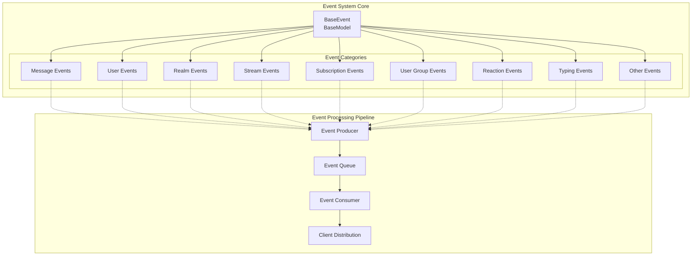
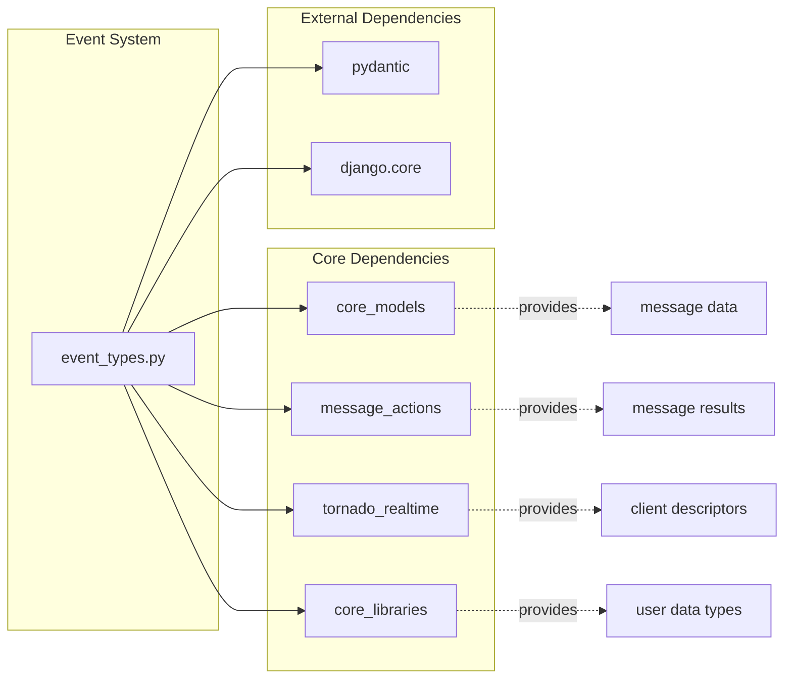
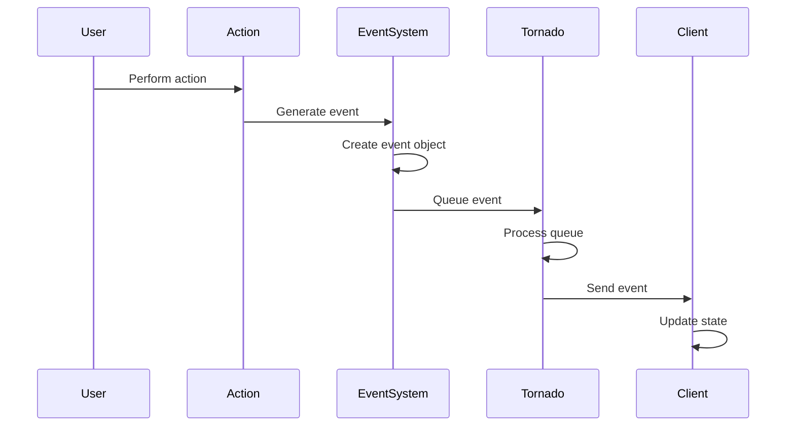
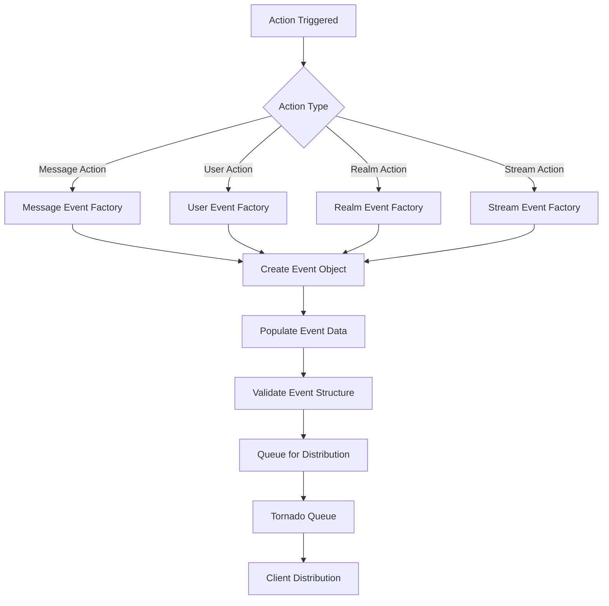
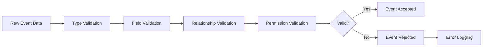

# Event System Module Documentation

## Introduction

The event system module is the backbone of real-time communication in Zulip, providing a comprehensive framework for handling and distributing events across the platform. This module defines the complete set of event types that can occur within the system, from message operations to user management, realm configuration, and real-time presence updates.

The event system serves as the central nervous system of Zulip, ensuring that all clients stay synchronized with the server state through a well-defined event protocol. Each event type represents a specific change or action within the system, carrying the necessary data to update client state accordingly.

## Architecture Overview

### Core Event Architecture

### Event Type Hierarchy

```mermaid
classDiagram
    class BaseEvent {
        +int id
    }
    
    class EventMessage {
        +Literal["message"] type
        +list flags
        +MessageFieldForEventMessage message
    }
    
    class EventUpdateMessage {
        +Literal["update_message"] type
        +int user_id
        +int edit_timestamp
        +int message_id
        +list message_ids
        +list flags
        +bool rendering_only
    }
    
    class EventDeleteMessage {
        +Literal["delete_message"] type
        +Literal["private", "stream"] message_type
        +int message_id
        +list message_ids
        +int stream_id
        +str topic
    }
    
    class EventReactionAdd {
        +Literal["reaction"] type
        +Literal["add"] op
        +int message_id
        +str emoji_name
        +str emoji_code
        +Literal["realm_emoji", "unicode_emoji", "zulip_extra_emoji"] reaction_type
        +int user_id
        +ReactionLegacyUserType user
    }
    
    class EventSubscriptionAdd {
        +Literal["subscription"] type
        +Literal["add"] op
        +list subscriptions
    }
    
    class EventUserGroupAdd {
        +Literal["user_group"] type
        +Literal["add"] op
        +Group group
    }
    
    class EventRealmUpdate {
        +Literal["realm"] type
        +Literal["update"] op
        +str property
        +bool|int|str|None value
    }
    
    BaseEvent <|-- EventMessage
    BaseEvent <|-- EventUpdateMessage
    BaseEvent <|-- EventDeleteMessage
    BaseEvent <|-- EventReactionAdd
    BaseEvent <|-- EventSubscriptionAdd
    BaseEvent <|-- EventUserGroupAdd
    BaseEvent <|-- EventRealmUpdate
```

## Component Relationships

### Event System Dependencies

### Event Flow Integration

## Event Categories

### Message Events

Message events handle all operations related to messages within the system:

- **EventMessage**: New message creation and delivery
- **EventUpdateMessage**: Message content and metadata updates
- **EventDeleteMessage**: Message deletion operations
- **EventDirectMessage**: Direct message handling

These events ensure that all clients receive real-time updates about message activities, maintaining conversation synchronization across the platform.

### User Events

User events manage user-related operations and state changes:

- **EventRealmUserAdd**: New user addition to realm
- **EventRealmUserRemove**: User removal from realm
- **EventRealmUserUpdate**: User profile and settings updates
- **EventUserStatus**: User presence and status changes
- **EventUserSettingsUpdate**: Individual user settings modifications

### Realm Events

Realm events handle organization-level configuration and management:

- **EventRealmUpdate**: General realm property updates
- **EventRealmUpdateDict**: Complex realm configuration changes
- **EventRealmBotAdd/Update/Delete**: Bot management operations
- **EventRealmEmojiUpdate**: Custom emoji updates
- **EventRealmExport**: Data export operations

### Stream Events

Stream events manage channel and stream operations:

- **EventStreamCreate/Delete**: Stream lifecycle management
- **EventStreamUpdate**: Stream property modifications
- **EventDefaultStreams**: Default stream configuration

### Subscription Events

Subscription events handle user-stream relationships:

- **EventSubscriptionAdd/Remove**: Subscription management
- **EventSubscriptionPeerAdd/Remove**: Bulk subscription operations
- **EventSubscriptionUpdate**: Subscription property changes

### User Group Events

User group events manage group operations:

- **EventUserGroupAdd/Remove**: Group lifecycle management
- **EventUserGroupAddMembers/RemoveMembers**: Member management
- **EventUserGroupUpdate**: Group property modifications

### Reaction Events

Reaction events handle emoji reactions to messages:

- **EventReactionAdd**: Reaction addition
- **EventReactionRemove**: Reaction removal

### Typing Events

Typing events provide real-time typing indicators:

- **EventTypingStart/Stop**: Standard typing indicators
- **EventTypingEditMessageStart/Stop**: Message editing indicators

## Data Flow Architecture

### Event Creation Flow

### Event Validation Process

## Integration Points

### Message Actions Integration

The event system integrates closely with [message_actions](message_actions.md) to handle message-related events. When messages are created, updated, or deleted, the corresponding action modules generate appropriate events that are then distributed to relevant clients.

### Tornado Realtime Integration

Events are distributed through the [tornado_realtime](tornado_realtime.md) system, which manages WebSocket connections and ensures reliable event delivery to connected clients. The event system provides the structured data that Tornado queues and distributes.

### Core Models Integration

Event types are defined based on the [core_models](core_models.md) structure, ensuring that events accurately represent changes to the underlying data models. This integration maintains consistency between server state and client representations.

## Event Distribution Strategy

### Targeted Distribution

Events are distributed based on:
- User subscriptions and permissions
- Stream membership and visibility
- Realm settings and configuration
- Message visibility and access rights

### Event Ordering

The system maintains event ordering through:
- Sequential event IDs
- Timestamp-based ordering
- Queue-based delivery
- Client-side event processing

### Reliability Mechanisms

Event delivery reliability is ensured through:
- Event acknowledgment systems
- Retry mechanisms for failed deliveries
- Event persistence and recovery
- Client state synchronization

## Security Considerations

### Event Access Control

Events are filtered based on:
- User permissions and roles
- Stream visibility settings
- Message access rights
- Realm configuration restrictions

### Data Sanitization

Event data is sanitized to prevent:
- Information leakage
- Cross-realm data exposure
- Unauthorized access to private content
- Injection attacks through event content

## Performance Optimization

### Event Batching

Multiple events can be batched for:
- Reduced network overhead
- Improved client processing efficiency
- Better user experience during high-activity periods

### Event Filtering

Clients can subscribe to specific event types:
- Reduces unnecessary data transfer
- Improves client performance
- Enables focused functionality

### Caching Strategies

Event-related data is cached to:
- Reduce database queries
- Improve event generation speed
- Minimize server resource usage

## Error Handling

### Event Processing Errors

Errors during event processing are handled through:
- Graceful degradation
- Error logging and monitoring
- Client notification mechanisms
- Recovery procedures

### Invalid Event Handling

Invalid events are managed by:
- Validation at generation time
- Rejection with appropriate error codes
- Client-side error handling
- System monitoring and alerting

## Future Considerations

### Scalability Enhancements

The event system is designed to support:
- Horizontal scaling through event partitioning
- Efficient event storage and retrieval
- Optimized client synchronization
- Reduced server resource consumption

### Feature Extensibility

New event types can be easily added by:
- Extending the BaseEvent model
- Implementing appropriate validation
- Integrating with existing distribution mechanisms
- Maintaining backward compatibility

This comprehensive event system provides the foundation for Zulip's real-time collaboration features, ensuring that all users stay synchronized with the latest state of their conversations, streams, and organizational settings.