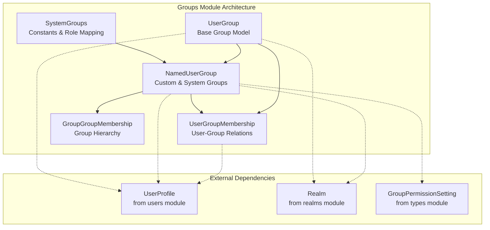
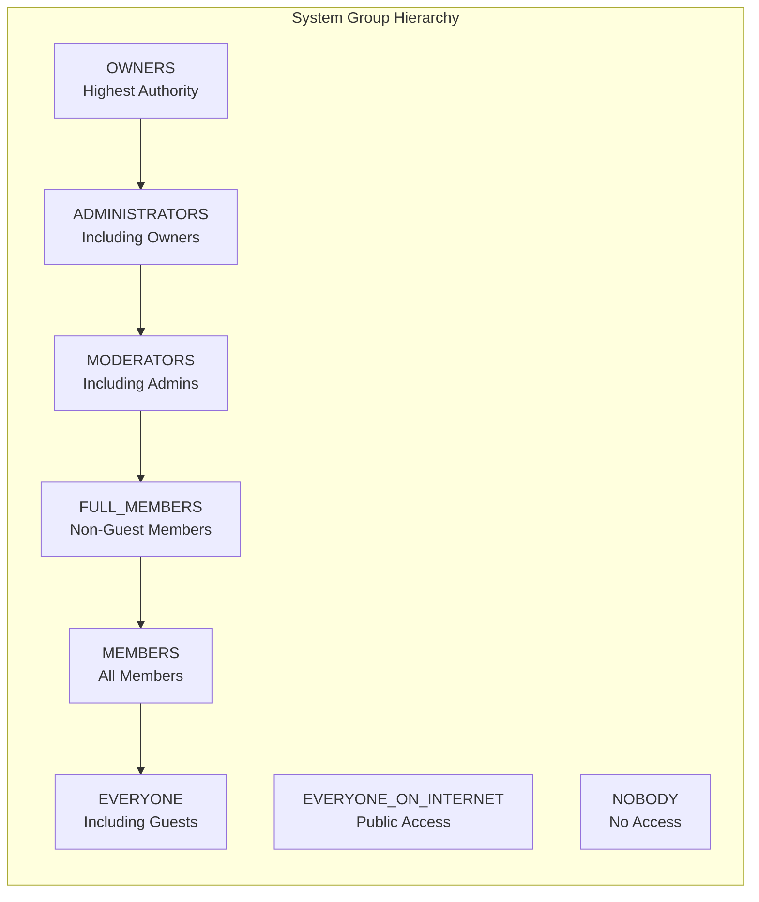
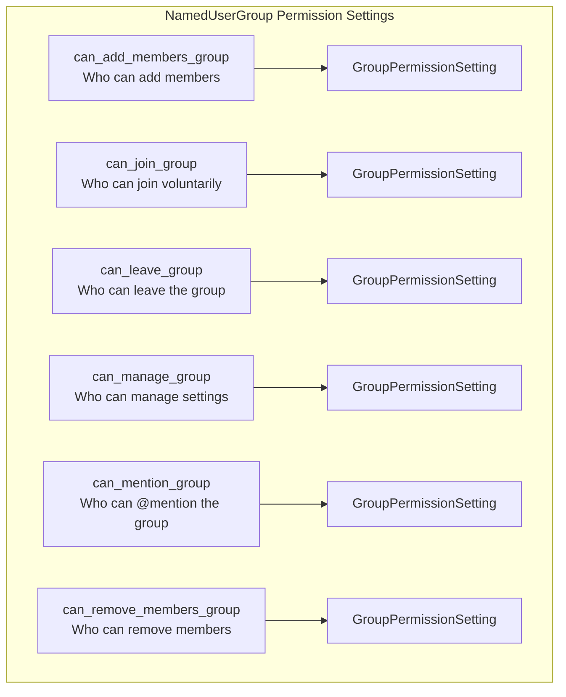
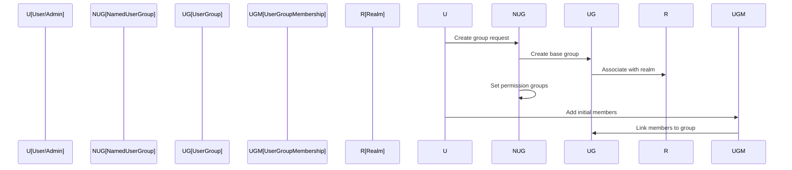
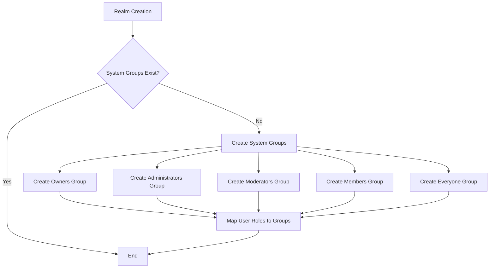
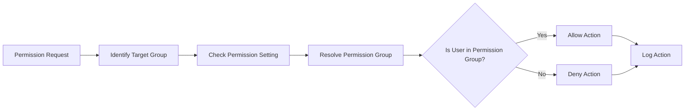
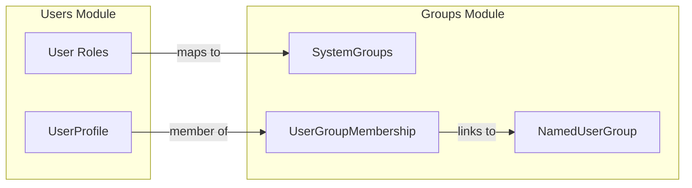

# Groups Module Documentation

## Introduction

The groups module is a core component of the Zulip messaging platform that manages user group functionality, including system-defined groups, custom user groups, and group-based permissions. This module provides the foundation for role-based access control, user management, and permission delegation within organizations.

## Architecture Overview

The groups module implements a hierarchical group system with two main types of groups: system groups (automatically created based on user roles) and named user groups (custom groups created by administrators). The module supports complex permission settings, group nesting, and membership management.



## Core Components

### SystemGroups

The `SystemGroups` class defines constants for system-managed groups that correspond to user roles within an organization. These groups are automatically created and managed by the system.



**Key Features:**
- Role-based group constants (OWNERS, ADMINISTRATORS, MODERATORS, etc.)
- Display name mapping for internationalization
- Hierarchical permission structure
- Special groups for public access and complete restriction

### UserGroup (Base Model)

The `UserGroup` model serves as the foundation for all group types, providing core functionality for membership and realm association.

**Attributes:**
- `direct_members`: Many-to-many relationship with UserProfile
- `direct_subgroups`: Hierarchical relationship with NamedUserGroup
- `realm`: Foreign key to the organization (Realm)

### NamedUserGroup

The `NamedUserGroup` extends UserGroup to provide named groups with comprehensive permission settings. This model supports both system groups and custom user-created groups.



**Permission Settings:**
- **can_add_members_group**: Controls who can add new members to the group
- **can_join_group**: Determines if users can join the group voluntarily
- **can_leave_group**: Specifies who can leave the group
- **can_manage_group**: Defines management permissions for group settings
- **can_mention_group**: Controls who can @mention the entire group
- **can_remove_members_group**: Specifies who can remove members from the group

### Membership Models

#### UserGroupMembership

Manages the many-to-many relationship between users and groups, ensuring unique user-group pairs.

#### GroupGroupMembership

Handles hierarchical group relationships, allowing groups to contain other groups as subgroups with proper constraint enforcement.

## Data Flow and Processes

### Group Creation Flow



### System Group Initialization



### Permission Checking Process



## Integration with Other Modules

### Relationship with Users Module

The groups module heavily depends on the [users module](users.md) through the UserProfile model. Groups are meaningless without users, and user roles directly map to system groups.



### Relationship with Realms Module

Groups are organization-specific, requiring integration with the [realms module](realms.md). Each group belongs to exactly one realm, and system groups are created per-realm.

### Relationship with Event System

Group changes trigger events processed by the [event system](event_system.md), particularly for:
- User group additions/removals
- Group permission changes
- Group membership updates

## Caching Strategy

The module implements caching for system groups to improve performance:

```python
@cache_with_key(get_realm_system_groups_cache_key, timeout=3600 * 24 * 7)
def get_realm_system_groups_name_dict(realm_id: int) -> dict[int, str]:
    system_groups = NamedUserGroup.objects.filter(
        realm_id=realm_id, is_system_group=True
    ).values_list("id", "name")
    return dict(system_groups)
```

**Cache Key Strategy:**
- Realm-specific system group cache
- 7-day timeout for system groups
- Cache invalidation on system group changes

## Security Considerations

### Permission Validation

All permission settings are validated against predefined rules:
- Some groups cannot be used for certain permissions (e.g., "everyone" group)
- System groups have specific default permissions
- Permission groups must be restricted groups (not "everyone" or "internet")

### Name Validation

Group names are validated to prevent conflicts:
- Maximum length enforcement (100 characters)
- Invalid prefix checking ("@", "role:", "user:", "stream:", "channel:")
- Realm-scoped uniqueness

### Deactivation Support

Groups support soft deletion through the `deactivated` field, allowing for:
- Graceful removal without data loss
- Historical reference preservation
- Potential reactivation

## Best Practices

### Group Creation
1. Use descriptive names that clearly indicate the group's purpose
2. Set appropriate permission groups during creation
3. Consider the principle of least privilege when setting permissions
4. Document the group's intended use and membership criteria

### Permission Management
1. Regularly audit group permissions
2. Use system groups for role-based permissions when possible
3. Avoid using "nobody" group unless absolutely necessary
4. Test permission changes in a development environment first

### Performance Optimization
1. Leverage system groups for common permission patterns
2. Use caching for frequently accessed group information
3. Minimize nested group hierarchies to reduce query complexity
4. Consider the impact of large group memberships on permission checks

## API Integration

The groups module provides the foundation for group-related APIs, including:
- Group creation and management endpoints
- Membership management operations
- Permission checking utilities
- Group hierarchy navigation

For detailed API documentation, refer to the [API views module](api_views.md) which implements the RESTful endpoints for group management.

## Future Considerations

### Scalability
- Monitor performance with large group memberships
- Consider database indexing strategies for group queries
- Evaluate caching strategies for complex group hierarchies

### Feature Extensions
- Dynamic group creation based on user attributes
- Time-based group memberships
- Group templates for common use cases
- Advanced permission inheritance models

### Integration Opportunities
- Enhanced integration with the [message actions module](message_actions.md) for group-based message permissions
- Deeper integration with [analytics](analytics.md) for group usage statistics
- Integration with [corporate billing](corporate_billing.md) for group-based feature access