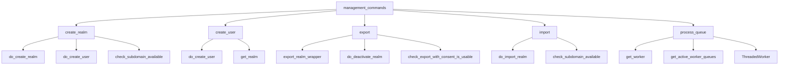
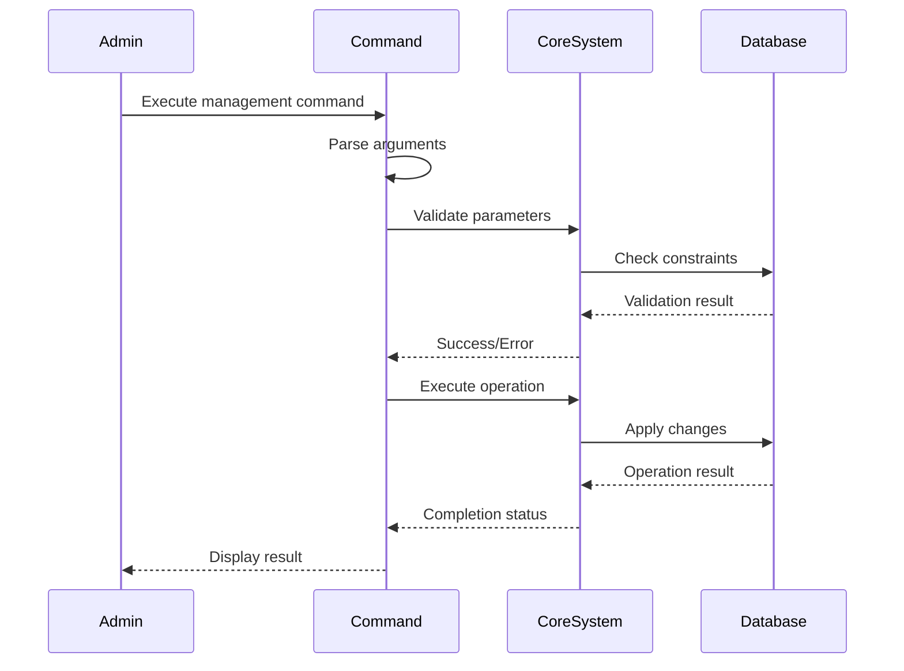

# Management Commands Module

## Overview

The `management_commands` module provides Django management commands for administrative operations in the Zulip system. These commands offer command-line interfaces for critical system operations including realm creation, user management, data export/import, and queue processing.

## Architecture



## Core Components

### 1. Realm Management Commands

Detailed documentation: [Realm Management](realm_management.md)

#### create_realm Command
- **Purpose**: Creates a new Zulip organization (realm) via command line
- **Key Features**:
  - Creates both realm and initial owner user
  - Validates subdomain availability
  - Supports reserved subdomain usage
  - Integrates with user creation workflow
- **Dependencies**: [`create_realm`](core_models.md#realm-creation), [`create_user`](core_models.md#user-creation)

#### create_user Command  
- **Purpose**: Creates new Zulip users via command line
- **Key Features**:
  - Interactive parameter prompting
  - Realm validation and assignment
  - Terms of Service handling
  - Duplicate user prevention
- **Dependencies**: [`create_user`](core_models.md#user-creation)

### 2. Data Management Commands

Detailed documentation: [Data Operations](data_operations.md)

#### export Command
- **Purpose**: Exports all data from a Zulip realm for migration/backup
- **Key Features**:
  - Complete realm data export (messages, streams, users, etc.)
  - Multiple export modes (public-only, full with consent, full without consent)
  - Parallel processing support
  - Optional realm deactivation
  - S3 upload capability
- **Export Types**:
  - Public-only: Exports only public stream messages
  - Full with consent: Includes private data from consenting users
  - Full without consent: Complete export excluding private user data
- **Dependencies**: [`export_realm_wrapper`](core_libraries.md#export-functionality), [`RealmExport`](core_models.md#export-models)

#### import Command
- **Purpose**: Imports exported Zulip data into a fresh instance
- **Key Features**:
  - Database reconstruction from exports
  - Multiple export directory support
  - Subdomain validation and assignment
  - Parallel processing for avatar uploads
  - Database destruction/rebuild option
- **Dependencies**: [`do_import_realm`](core_libraries.md#import-functionality)

### 3. Queue Processing Command

Detailed documentation: [Queue Processing](queue_processing.md)

#### process_queue Command
- **Purpose**: Runs queue processing workers for asynchronous task handling
- **Key Features**:
  - Single queue processing mode
  - Multi-threaded queue processing
  - Auto-reload functionality
  - Signal handling for graceful shutdown
  - Sentry integration for error tracking
- **Worker Types**:
  - Single worker: Processes one specified queue
  - All workers: Processes all active queues
  - Multi-threaded: Processes specified queues concurrently
- **Dependencies**: [`get_worker`](worker_queue_system.md#worker-management), [`queue_processors`](worker_queue_system.md#queue-processors)

## Data Flow



## Integration Points

### With Core Models
- **Realm Operations**: Integrates with realm creation and validation
- **User Management**: Coordinates with user profile and authentication systems
- **Export/Import**: Works with message, stream, and user data models

### With Worker Queue System
- **Queue Processing**: Direct interface to queue worker infrastructure
- **Task Distribution**: Manages worker lifecycle and task assignment
- **Error Handling**: Coordinates error reporting and recovery

### With Authentication System
- **User Creation**: Integrates with authentication backends
- **Password Management**: Handles password setting and validation
- **External Auth**: Supports various authentication methods

## Usage Patterns

### Administrative Operations
```bash
# Create new realm with owner
./manage.py create_realm "My Organization" --string-id myorg --email admin@example.com

# Create new user
./manage.py create_user --realm myorg --email user@example.com

# Export realm data
./manage.py export --realm myorg --output /tmp/export --deactivate-realm

# Import realm data
./manage.py import myorg /tmp/export

# Process queue
./manage.py process_queue --queue_name email_senders
```

### Migration Scenarios
1. **Server Migration**: Export → Transfer → Import
2. **Backup/Restore**: Periodic exports for disaster recovery
3. **Realm Consolidation**: Multiple exports into single instance

## Error Handling

- **Validation Errors**: Subdomain availability, user existence
- **Integrity Errors**: Database constraint violations
- **File System Errors**: Export/import directory issues
- **Network Errors**: S3 upload failures
- **Signal Handling**: Graceful worker shutdown

## Security Considerations

- **Access Control**: Management commands require server access
- **Data Privacy**: Export commands respect user consent settings
- **Password Security**: Passwords not included in exports
- **Subdomain Validation**: Prevents reserved subdomain usage
- **Realm Deactivation**: Optional deactivation during export

## Performance Characteristics

- **Export Performance**: Scales with message count and user activity
- **Import Performance**: Generally faster than export operations
- **Queue Processing**: Real-time processing with configurable workers
- **Memory Usage**: Varies by operation type and data volume

## Related Documentation

- [Core Models](core_models.md) - Data models used by management commands
- [Worker Queue System](worker_queue_system.md) - Queue processing infrastructure
- [Authentication and Backends](authentication_and_backends.md) - User authentication systems
- [Core Libraries](core_libraries.md) - Utility functions for export/import operations