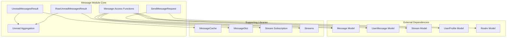
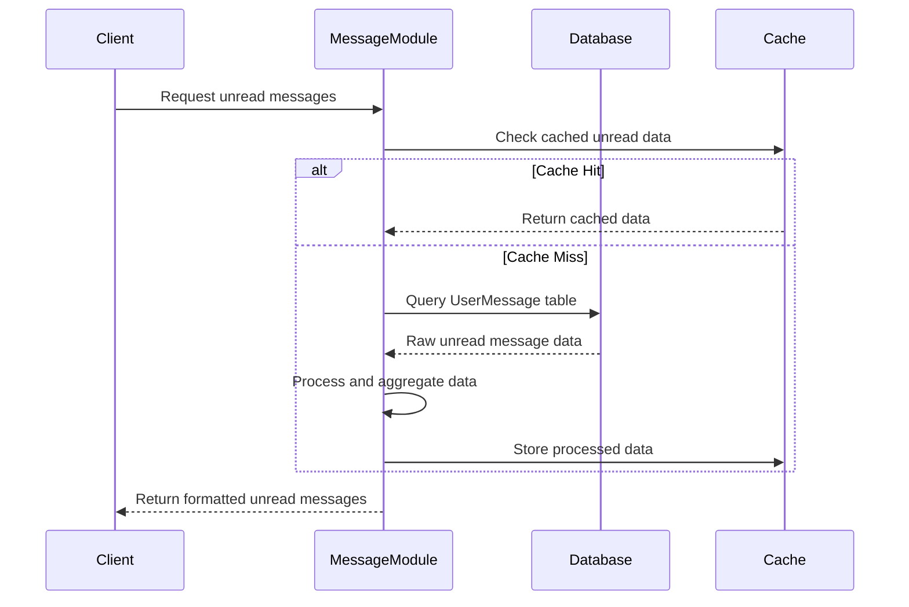
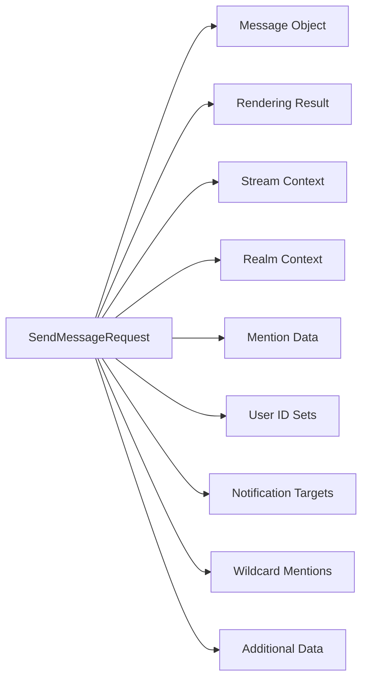
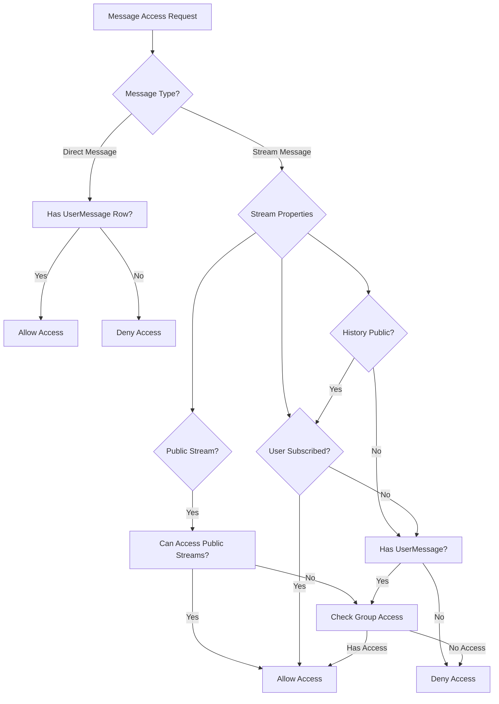
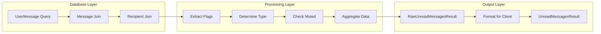
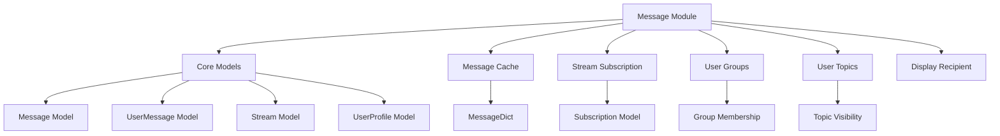

# Message Module Documentation

## Overview

The message module is a core component of the Zulip messaging system that provides essential functionality for message handling, access control, and unread message management. It serves as the central hub for message-related operations, bridging the gap between the database models and the application logic.

## Purpose and Core Functionality

The message module handles three primary areas of functionality:

1. **Message Access Control**: Implements security policies determining which users can access specific messages based on stream permissions, user roles, and message visibility settings.

2. **Unread Message Management**: Provides comprehensive systems for tracking, aggregating, and managing unread messages across different conversation types (streams, direct messages, and group messages).

3. **Message Processing**: Handles message formatting, validation, and preparation for client consumption, including edit history visibility and content normalization.

## Architecture

### Core Components



### Data Flow Architecture



## Key Data Structures

### RawUnreadMessagesResult
The foundational data structure for unread message tracking:

```python
class RawUnreadMessagesResult(TypedDict):
    pm_dict: dict[int, RawUnreadDirectMessageDict]      # Direct messages
    stream_dict: dict[int, RawUnreadStreamDict]        # Stream messages
    huddle_dict: dict[int, RawUnreadDirectMessageGroupDict]  # Group messages
    mentions: set[int]                                 # Mentioned message IDs
    muted_stream_ids: set[int]                         # Muted stream IDs
    unmuted_stream_msgs: set[int]                      # Unmuted stream messages
    old_unreads_missing: bool                          # Truncation indicator
```

### UnreadMessagesResult
The client-facing aggregated format:

```python
class UnreadMessagesResult(TypedDict):
    pms: list[UnreadDirectMessageInfo]                 # Aggregated DMs
    streams: list[UnreadStreamInfo]                    # Aggregated streams
    huddles: list[UnreadDirectMessageGroupInfo]        # Aggregated groups
    mentions: list[int]                                # Mentioned messages
    count: int                                         # Total unread count
    old_unreads_missing: bool                          # Truncation warning
```

### SendMessageRequest
Comprehensive message sending context:



## Message Access Control System

### Access Control Flow



### Security Model

The access control system implements a multi-layered security model:

1. **Direct Messages**: Users can only access DMs they received
2. **Public Streams**: Accessible to all users who can access public streams
3. **Private Streams**: Limited to subscribers with appropriate group memberships
4. **Protected History**: Requires both subscription and UserMessage row
5. **Web Public**: Special access for unauthenticated web users

## Unread Message Management

### Unread Data Processing Pipeline



### Message Type Classification

The system handles three distinct message types:

1. **Stream Messages**: Public and private channel messages with topic-based organization
2. **Direct Messages**: One-on-one private conversations
3. **Group Messages**: Multi-user private conversations (huddles)

### Muted Content Handling

The unread system respects user preferences for muted content:

- **Muted Streams**: Messages don't count toward unread totals unless topic is unmuted/followed
- **Muted Topics**: Messages in unmuted streams don't count if topic is muted
- **User Mutes**: Messages from muted users are never unread
- **Wildcard Mentions**: Only count if message isn't muted

## Integration Points

### Dependencies on Other Modules



### Event System Integration

The message module integrates with the event system through:

- **Message Events**: Triggers events for message creation, updates, and deletion
- **Unread Count Updates**: Notifies clients of unread count changes
- **Mention Notifications**: Handles mention-based notifications
- **Stream Events**: Coordinates with stream subscription changes

## Performance Considerations

### Database Optimization

- **Indexed Queries**: Uses optimized database indexes for unread message queries
- **Bulk Operations**: Implements bulk fetching and processing for efficiency
- **CTE Usage**: Employs Common Table Expressions for complex unread queries
- **Query Planning**: Disables bitmap scans to optimize query execution plans

### Caching Strategy

- **Message Dict Cache**: Caches processed message dictionaries
- **Unread Data Cache**: Caches aggregated unread message data
- **Subscription Cache**: Leverages subscription data caching
- **User Group Cache**: Caches user group membership information

### Limits and Thresholds

- **MAX_UNREAD_MESSAGES**: 50,000 message limit for unread tracking
- **Message Length**: Configurable maximum message length
- **Topic Length**: Maximum topic name length with truncation
- **Wildcard Threshold**: Configurable threshold for wildcard mention restrictions

## Error Handling

### Access Control Errors

The module provides consistent error messaging to prevent information leakage:

- **Invalid Message**: Generic error for inaccessible messages
- **Missing Authentication**: Special error for web-public access attempts
- **Permission Denied**: Consistent messaging across all access control paths

### Data Validation

- **Message Content**: Validates message content for null bytes and length
- **Topic Names**: Normalizes and truncates topic names
- **User Input**: Validates user-provided parameters and settings

## Usage Examples

### Accessing Messages

```python
# Check if user can access a specific message
message = access_message(user_profile, message_id, is_modifying_message=False)

# Bulk access check for multiple messages
accessible_messages = bulk_access_messages(
    user_profile, 
    messages, 
    is_modifying_message=False
)
```

### Managing Unread Messages

```python
# Get raw unread data for a user
raw_unread = get_raw_unread_data(user_profile)

# Aggregate for client consumption
unread_result = aggregate_unread_data(raw_unread, allow_empty_topic_name=True)
```

### Message Processing

```python
# Process messages for client display
message_list = messages_for_ids(
    message_ids,
    user_message_flags,
    search_fields,
    apply_markdown=True,
    client_gravatar=True,
    allow_empty_topic_name=False,
    message_edit_history_visibility_policy,
    user_profile,
    realm
)
```

## Future Considerations

### Scalability Improvements

- **Sharding**: Consider message table sharding for large deployments
- **Async Processing**: Implement asynchronous unread count updates
- **Incremental Updates**: Optimize for incremental rather than full refreshes

### Feature Enhancements

- **Advanced Filtering**: Enhanced unread message filtering capabilities
- **Cross-Realm Access**: Support for cross-realm message access
- **Message Threading**: Integration with future threading features

### Security Enhancements

- **Audit Logging**: Enhanced audit logging for message access
- **Rate Limiting**: Implement rate limiting for message access operations
- **Encryption**: Support for end-to-end encrypted messages

## Related Documentation

- [Core Models Documentation](core_models.md) - Database model definitions
- [Message Actions Documentation](message_actions.md) - Message modification operations
- [Event System Documentation](event_system.md) - Real-time event handling
- [Stream Management Documentation](api_views_streams.md) - Stream subscription and access
- [User Management Documentation](api_views_users.md) - User profile and permissions