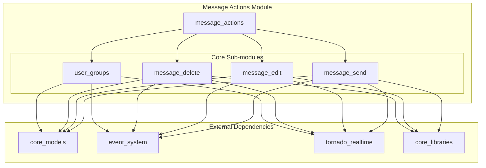
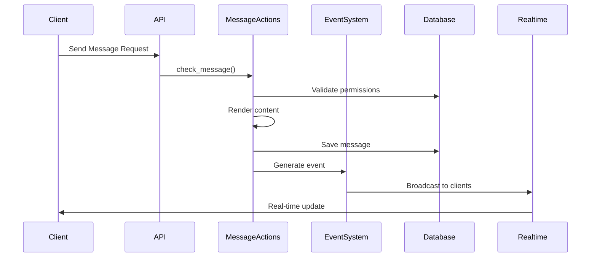

# Message Actions Module

## Overview

The `message_actions` module is a core component of the Zulip messaging system that handles all message-related operations including sending, editing, and deleting messages. This module serves as the central hub for message lifecycle management, providing the business logic and data persistence layer for message operations.

## Purpose and Scope

The message_actions module is responsible for:
- **Message Creation**: Processing and sending new messages to channels and direct messages
- **Message Editing**: Handling content, topic, and stream changes to existing messages
- **Message Deletion**: Managing the removal and archival of messages
- **User Group Operations**: Managing user group memberships and permissions
- **Notification Management**: Coordinating real-time notifications and events
- **Permission Validation**: Ensuring users have appropriate permissions for message operations

## Architecture Overview



## Data Flow Architecture



## Sub-modules

### 1. Message Send (`message_send`)
Handles the creation and sending of new messages to channels and direct messages.

**Key Components:**
- `check_message()`: Main entry point for message validation and preparation
- `do_send_messages()`: Core function for persisting messages and triggering notifications
- `get_recipient_info()`: Determines message recipients and notification settings
- `build_message_send_dict()`: Constructs message data structures for processing

**Features:**
- Stream and direct message support
- Mention processing (@user, @stream, @topic)
- Attachment handling and claiming
- Notification routing (push, email, in-app)
- Bot message processing
- Widget content support

### 2. Message Edit (`message_edit`)
Manages editing of existing messages including content, topic, and stream changes.

**Key Components:**
- `check_update_message()`: Main entry point for message editing
- `do_update_message()`: Core editing logic with transaction management
- `validate_message_edit_payload()`: Validates edit requests
- `build_message_edit_request()`: Constructs edit request objects

**Features:**
- Content editing with permission validation
- Topic editing with propagation modes
- Stream moving with access control
- Resolve/unresolve topic functionality
- Edit history tracking
- Bulk message operations

[Detailed Documentation](message_edit.md)

### 3. Message Delete (`message_delete`)
Handles message deletion and archival operations.

**Key Components:**
- `do_delete_messages()`: Main deletion function
- `do_delete_messages_by_sender()`: Bulk deletion by sender
- `_process_grouped_messages_deletion()`: Internal deletion processing

**Features:**
- Individual and bulk message deletion
- Message archival to history tables
- Stream first message ID updates
- Permission-based deletion
- Event generation for real-time updates

[Detailed Documentation](message_delete.md)

### 4. User Groups (`user_groups`)
Manages user group operations and membership.

**Key Components:**
- `create_user_group_in_database()`: Group creation with validation
- `bulk_add_members_to_user_groups()`: Mass membership updates
- `update_users_in_full_members_system_group()`: System group management

**Features:**
- User group creation and management
- Bulk membership operations
- System group automation
- Permission-based group settings
- Audit logging for compliance

[Detailed Documentation](user_groups.md)

## Integration Points

### Event System Integration
The module integrates with the [event_system](event_system.md) to generate real-time events for:
- Message creation, editing, and deletion
- User group updates
- Notification delivery

### Core Models Integration
Leverages [core_models](core_models.md) for:
- Message persistence and relationships
- User and stream validation
- Permission checking
- Recipient management

### Real-time System Integration
Works with [tornado_realtime](tornado_realtime.md) for:
- Live message delivery
- Presence tracking
- Push notification coordination

## Security and Permissions

The module implements comprehensive security measures:

- **Stream Access Control**: Validates user permissions for stream operations
- **Message Editing Restrictions**: Enforces time limits and permission requirements
- **Direct Message Permissions**: Controls who can initiate and receive DMs
- **User Group Security**: Manages group-based permissions and access
- **Bot Security**: Handles bot-specific restrictions and validations

## Performance Considerations

- **Bulk Operations**: Optimized for batch message processing
- **Lazy Loading**: Defers UserMessage creation for inactive users
- **Caching**: Leverages caching for user data and permissions
- **Database Optimization**: Uses efficient queries and bulk operations
- **Event Batching**: Groups events for efficient real-time delivery

## Error Handling

The module provides comprehensive error handling:
- Validation errors for malformed requests
- Permission errors for unauthorized operations
- Time limit errors for editing restrictions
- Stream/topic policy violations
- Database constraint violations

## Usage Examples

### Sending a Stream Message
```python
from zerver.actions.message_send import check_send_stream_message

message_id = check_send_stream_message(
    sender=user_profile,
    client=client,
    stream_name="general",
    topic_name="Welcome",
    body="Hello, world!"
)
```

### Editing a Message
```python
from zerver.actions.message_edit import check_update_message

result = check_update_message(
    user_profile=user_profile,
    message_id=message_id,
    content="Updated message content",
    propagate_mode="change_one"
)
```

### Deleting Messages
```python
from zerver.actions.message_delete import do_delete_messages

do_delete_messages(
    realm=realm,
    messages=messages_to_delete,
    acting_user=user_profile
)
```

## Related Documentation

- [Core Models](core_models.md) - Data models and relationships
- [Event System](event_system.md) - Real-time event handling
- [Tornado Realtime](tornado_realtime.md) - Live message delivery
- [Core Libraries](core_libraries.md) - Shared utilities and helpers