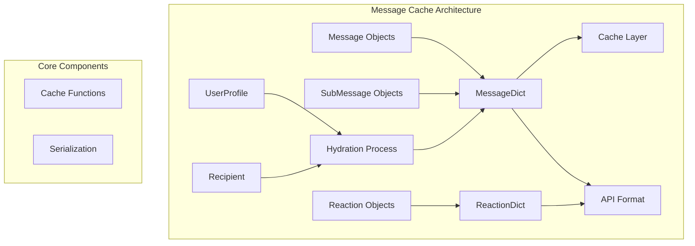
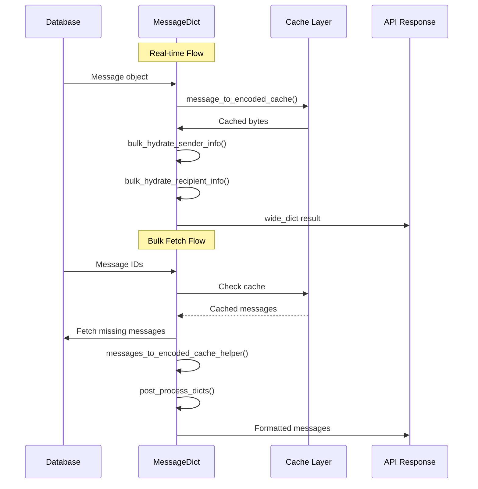
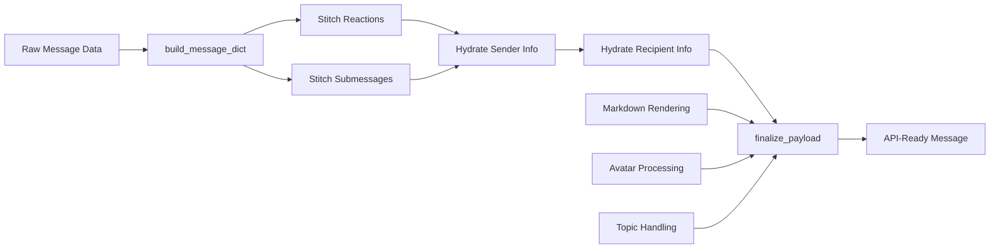

# Message Cache Module Documentation

## Introduction

The `message_cache` module is a critical performance optimization component in Zulip's messaging system. It provides efficient message serialization, caching, and API formatting capabilities that enable Zulip to handle high-volume message operations while maintaining fast response times. The module transforms database Message objects into client-ready API format through a sophisticated caching and hydration system.

## Core Purpose

The primary purpose of the message_cache module is to:
- **Serialize** Message objects into cacheable, API-ready formats
- **Cache** message data to reduce database queries and improve performance
- **Hydrate** messages with related user and recipient information
- **Format** messages according to client requirements and API specifications

## Architecture Overview



## Core Components

### MessageDict Class

The `MessageDict` class is the central component responsible for converting Message database objects into API-ready dictionaries. It provides two main processing flows:

#### 1. Real-time Message Processing (wide_dict flow)
For just-sent messages, creates a comprehensive `wide_dict` containing all message data and related UserProfile information. This format is optimized for storage in queues and caches.

#### 2. Bulk Message Processing (messages_for_ids flow)
For fetching messages from the database, provides optimized bulk operations that skip the Django ORM and utilize caching for high-performance retrieval of hundreds of thousands of messages.

### ReactionDict Class

The `ReactionDict` class handles the serialization of message reactions, converting database reaction rows into client-ready API format.

## Data Flow Architecture



## Key Functions and Methods

### Caching Functions

#### `message_to_encoded_cache()`
- **Purpose**: Converts a single Message object to cached format
- **Caching**: Uses 24-hour cache timeout with message-specific cache keys
- **Returns**: Serialized message data as bytes

#### `update_message_cache()`
- **Purpose**: Updates cached messages after modifications
- **Usage**: Called when messages are edited or their content changes
- **Process**: Bulk updates cache entries for changed messages

### Message Processing Methods

#### `wide_dict()`
- **Input**: Single Message object
- **Process**: Fetches from cache, hydrates sender/recipient info
- **Output**: Complete message dictionary with all related data

#### `messages_to_encoded_cache_helper()`
- **Input**: Iterable of Message objects
- **Process**: Bulk conversion with reaction and submessage stitching
- **Output**: Dictionary mapping message IDs to serialized data

#### `post_process_dicts()`
- **Input**: List of message dictionaries
- **Process**: Applies markdown rendering, avatar handling, final formatting
- **Output**: Client-ready message dictionaries

### Hydration Methods

#### `bulk_hydrate_sender_info()`
- **Purpose**: Adds sender user information to messages
- **Optimization**: Bulk database query for all sender profiles
- **Adds**: Full name, email, avatar info, realm details

#### `bulk_hydrate_recipient_info()`
- **Purpose**: Adds recipient information to messages
- **Process**: Handles stream, private, and group message recipients
- **Adds**: Display recipient data, stream IDs, recipient types

## Message Formatting Pipeline



## Integration with Other Modules

### Dependencies

#### [core_models](core_models.md)
- **Message Model**: Core message data structure
- **UserProfile Model**: Sender information
- **Recipient Model**: Message recipient details
- **Reaction Model**: Message reactions

#### [message](message.md)
- **UnreadMessagesResult**: Related to message status tracking
- **RawUnreadMessagesResult**: Raw message data processing

#### [event_system](event_system.md)
- **EventMessage**: Message-related events
- **EventUpdateMessage**: Message update events
- **EventReactionAdd/Remove**: Reaction events

### Dependent Modules

#### [api_views](api_views.md)
- Message API endpoints rely on MessageDict for formatting
- User profile endpoints use similar hydration patterns

#### [tornado_realtime](tornado_realtime.md)
- Real-time message delivery uses MessageDict formatting
- Event queue processing utilizes cached message data

## Performance Optimizations

### Caching Strategy
- **24-hour cache timeout** for message content
- **Message-specific cache keys** using `to_dict_cache_key`
- **Bulk cache operations** with `cache_set_many`

### Database Optimization
- **Bulk queries** instead of individual object fetches
- **Values-based queries** skipping Django ORM overhead
- **Query optimization** with proper indexing

### Memory Management
- **Shallow copying** where safe to avoid memory overhead
- **In-place mutations** for performance-critical paths
- **Efficient data structures** using dictionaries for lookups

## Security and Privacy

### Email Visibility Handling
- **Respects user email visibility settings**
- **Forces client_gravatar=False** when email is restricted
- **Generates fake email addresses** for inaccessible users

### User Access Control
- **Can access sender** checks for user availability
- **Inaccessible user handling** with fallback information
- **Realm-based access controls**

## Error Handling and Edge Cases

### Content Rendering
- **Markdown version compatibility** checks
- **Fallback content** for rendering failures
- **Content validation** before caching

### Data Consistency
- **Reaction stitching** handles missing messages gracefully
- **Submessage processing** validates message existence
- **Cache invalidation** on message updates

## Usage Examples

### Fetching Messages for API
```python
# Bulk fetch messages
message_dicts = MessageDict.ids_to_dict(message_ids)

# Process for API response
MessageDict.post_process_dicts(
    message_dicts,
    apply_markdown=True,
    client_gravatar=True,
    allow_empty_topic_name=False,
    realm=user_profile.realm,
    user_recipient_id=user_profile.recipient_id
)
```

### Real-time Message Processing
```python
# For newly sent messages
wide_dict = MessageDict.wide_dict(message, realm_id)
# Store in queue/event system
```

## Configuration and Customization

### Markdown Processing
- **Version tracking** for markdown rendering
- **Realm-specific rendering** for cross-realm messages
- **Content type determination** (HTML vs Markdown)

### Avatar Handling
- **Client gravatar support** with fallback options
- **Avatar source tracking** for different avatar types
- **Version-based cache busting** for avatar updates

## Monitoring and Debugging

### Cache Performance
- **Cache hit rates** for message lookups
- **Cache key patterns** for debugging
- **Update frequency** tracking

### Message Processing Metrics
- **Processing time** for bulk operations
- **Memory usage** during large fetches
- **Error rates** for content rendering

## Future Considerations

### Scalability Improvements
- **Distributed caching** for multi-server deployments
- **Message sharding** for very large message volumes
- **Background processing** for heavy rendering tasks

### API Evolution
- **Client-side hydration** to reduce server load
- **Selective field inclusion** for bandwidth optimization
- **Real-time delta updates** instead of full message refetching

This documentation provides a comprehensive overview of the message_cache module's architecture, functionality, and integration within the Zulip system. The module's sophisticated caching and formatting capabilities are essential for maintaining Zulip's performance and responsiveness at scale.