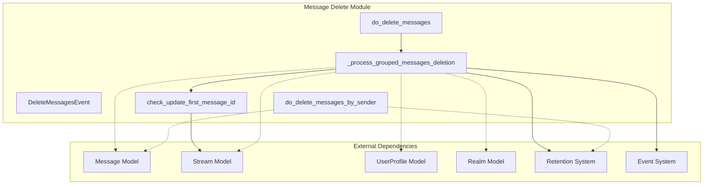
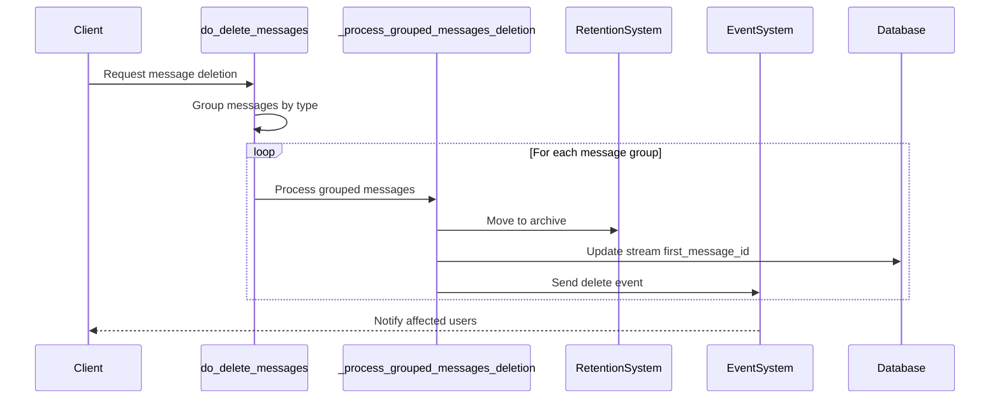
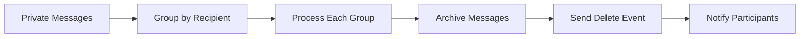

# Message Delete Module Documentation

## Introduction

The message_delete module is a critical component of the Zulip messaging system responsible for handling the deletion of messages from both private conversations and stream channels. This module provides the core functionality to safely remove messages while maintaining data integrity, updating stream metadata, and notifying relevant users through the real-time event system.

## Core Functionality

The module implements a comprehensive message deletion system that:
- Handles deletion of both private messages and stream messages
- Archives deleted messages for potential recovery
- Updates stream metadata when the first message is deleted
- Notifies affected users through the event system
- Supports batch processing for performance optimization

## Architecture Overview

### Component Structure



### Data Flow Architecture



## Core Components

### DeleteMessagesEvent

The `DeleteMessagesEvent` is a TypedDict that defines the structure of the event sent to clients when messages are deleted. It contains:

- `type`: Always set to "delete_message"
- `message_ids`: List of deleted message IDs
- `message_type`: Either "private" or "stream"
- `topic`: Topic name (for stream messages only)
- `stream_id`: Stream ID (for stream messages only)

### Key Functions

#### do_delete_messages(realm, messages, acting_user)

The main entry point for message deletion. This function:
1. Groups messages by recipient and topic (for stream messages)
2. Processes each group separately to maintain consistency
3. Handles both private and stream message deletions

**Parameters:**
- `realm`: The realm containing the messages
- `messages`: Iterable of Message objects to delete
- `acting_user`: The user performing the deletion (optional)

#### _process_grouped_messages_deletion(realm, grouped_messages, stream, topic, acting_user)

Internal helper function that handles the actual deletion process for a group of messages:

1. **Archival**: Moves messages to archive using the retention system
2. **Stream Updates**: Updates first_message_id if necessary
3. **Event Generation**: Creates and sends deletion events to affected users
4. **User Notification**: Determines which users should be notified

#### check_update_first_message_id(realm, stream, message_ids, users_to_notify)

Updates the `first_message_id` field of a stream when the current first message is deleted. This ensures stream metadata remains accurate.

#### do_delete_messages_by_sender(user)

Specialized function for deleting all messages sent by a specific user. This is typically used in user account deletion scenarios.

## Dependencies and Integration

### Internal Dependencies

The message_delete module integrates with several core systems:

1. **[Message Model](core_models.md#messages)**: Accesses message data and properties
2. **[Stream Model](core_models.md#streams)**: Updates stream metadata
3. **[UserProfile Model](core_models.md#users)**: Identifies message senders and recipients
4. **[Realm Model](core_models.md#realms)**: Provides realm context

### External System Integration

1. **[Retention System](core_libraries.md#retention)**: Archives deleted messages
   - `move_messages_to_archive()`: Moves messages to archive storage
   - Batch size configuration for performance

2. **[Event System](event_system.md)**: Notifies clients of deletions
   - `send_event_on_commit()`: Sends real-time events to clients
   - Event filtering to exclude long-term idle users

3. **[Message Utilities](core_libraries.md#message)**: 
   - `event_recipient_ids_for_action_on_messages()`: Determines notification recipients

## Message Processing Flow

### Private Message Deletion



### Stream Message Deletion


## Performance Considerations

### Batch Processing

The module implements batch processing to handle large-scale deletions efficiently:

- **Private Messages**: Uses `retention.MESSAGE_BATCH_SIZE`
- **Stream Messages**: Uses `retention.STREAM_MESSAGE_BATCH_SIZE`

### Database Optimization

- Leverages database indexes for efficient message lookups
- Uses `values_list()` for lightweight ID retrieval
- Implements chunked processing to avoid memory issues

## Error Handling and Edge Cases

### Stream Metadata Consistency

The module ensures stream metadata remains consistent by:
- Checking if deleted messages include the stream's first message
- Recalculating the first message ID from remaining messages
- Updating all affected clients with the new metadata

### User Notification Logic

- Excludes long-term idle users from notifications to reduce load
- Always notifies the acting user who performed the deletion
- Handles both channel subscribers and private message participants

## Security and Permissions

The module relies on the calling code to ensure proper permissions. It does not implement its own permission checks, assuming that:
- The acting user has permission to delete the specified messages
- Message access has been verified before deletion
- Realm-level permissions are enforced by the caller

## Usage Examples

### Basic Message Deletion

```python
from zerver.actions.message_delete import do_delete_messages
from zerver.models import Message, UserProfile

# Get messages to delete
messages = Message.objects.filter(id__in=[1, 2, 3])
acting_user = UserProfile.objects.get(id=123)

# Delete messages
do_delete_messages(realm, messages, acting_user=acting_user)
```

### User Account Cleanup

```python
from zerver.actions.message_delete import do_delete_messages_by_sender

# Delete all messages from a user
user = UserProfile.objects.get(id=123)
do_delete_messages_by_sender(user)
```

## Related Documentation

- [Core Models](core_models.md) - Message, Stream, and User models
- [Event System](event_system.md) - Real-time event handling
- [Core Libraries](core_libraries.md) - Retention and message utilities
- [Message Actions](message_actions.md) - Other message-related operations

## Future Considerations

The module includes a TODO comment indicating that the restriction on grouping direct messages by conversation will be removed when `Recipient.PERSONAL` is no longer used. This suggests ongoing evolution of the messaging architecture to better handle complex conversation scenarios.