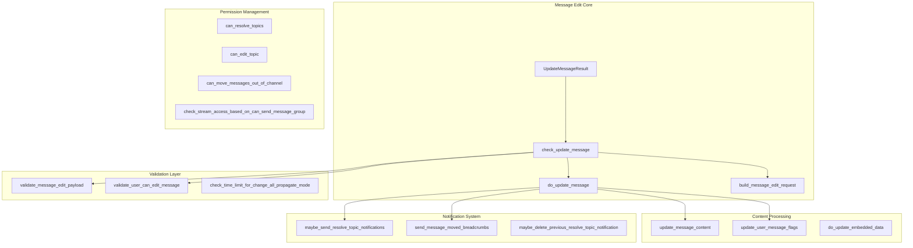
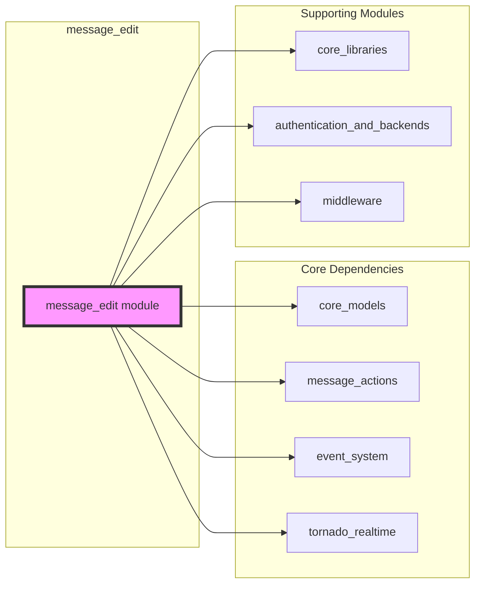
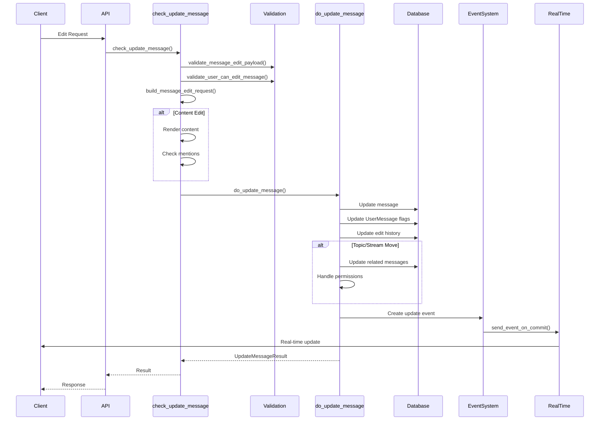
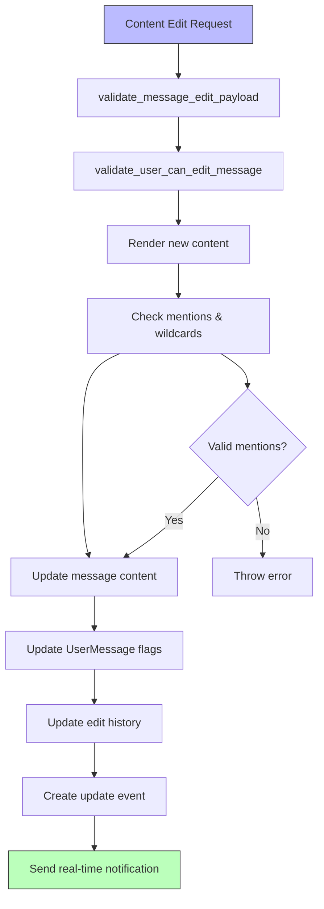
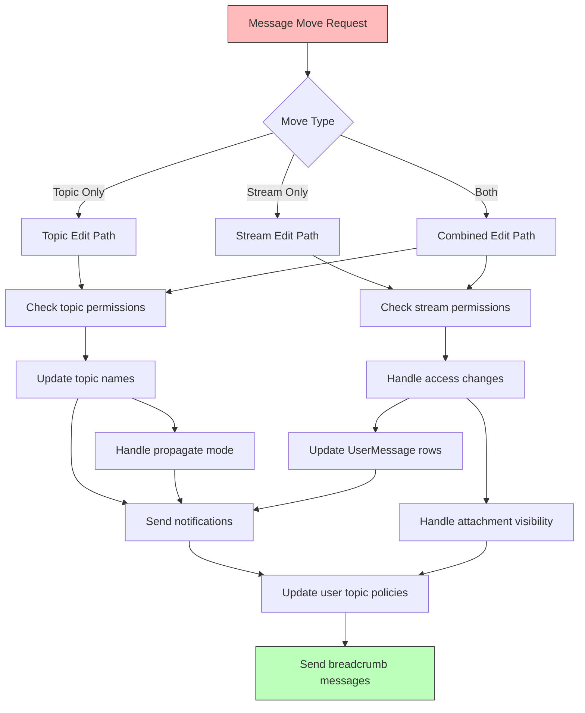
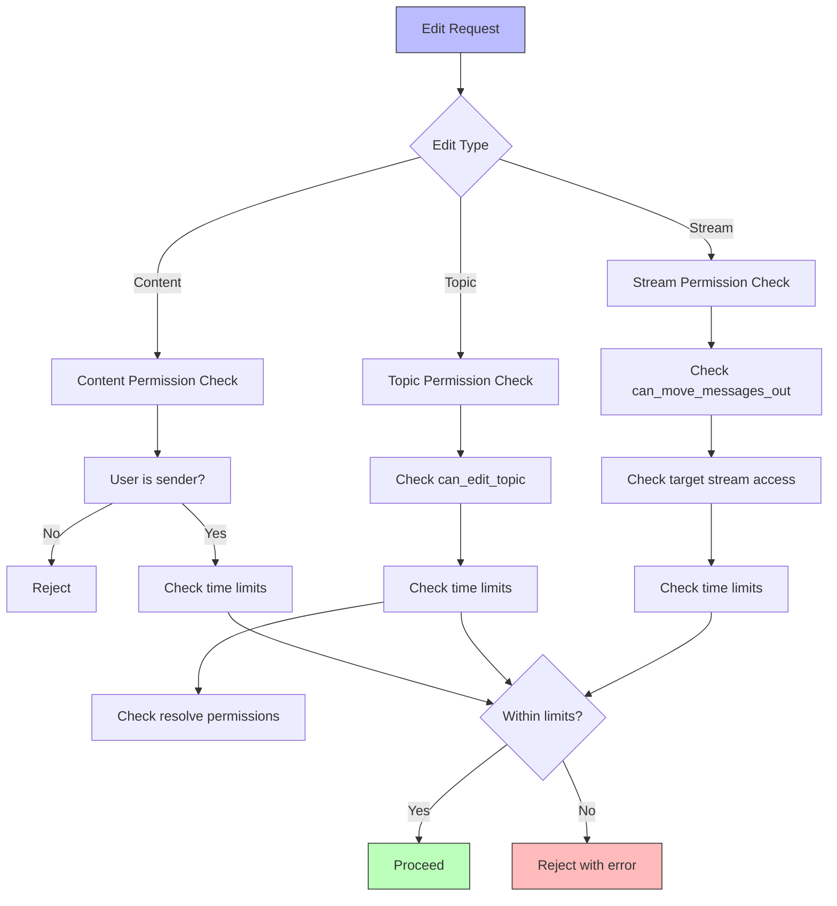
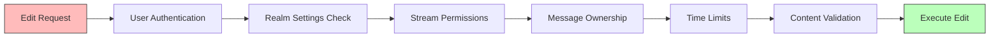

# Message Edit Module Documentation

## Introduction

The message_edit module is a core component of the Zulip messaging system that handles all aspects of message editing functionality. This module provides comprehensive capabilities for editing message content, moving messages between streams and topics, resolving/unresolving topics, and managing the complex permission and notification systems that ensure message edits are handled securely and efficiently across the platform.

The module serves as the central orchestrator for message modifications, coordinating between database operations, real-time event propagation, user permissions, and notification systems to provide a seamless editing experience while maintaining data integrity and security constraints.

## Architecture Overview

### Core Components

The message_edit module is built around several key architectural components:

### Module Dependencies

The message_edit module integrates with multiple system components:

## Data Flow Architecture

### Message Edit Request Flow

### Content Edit Processing

## Component Interactions

### Message Movement Operations

The module handles complex message movement scenarios with sophisticated permission and notification logic:

### Permission Validation System

## Key Functions and Processes

### Main Entry Point: `check_update_message`

This function serves as the primary entry point for all message editing operations. It orchestrates the entire edit process through several phases:

1. **Validation Phase**: Validates the edit request payload and user permissions
2. **Preparation Phase**: Builds the message edit request object and performs content rendering
3. **Execution Phase**: Calls `do_update_message` to perform the actual database operations
4. **Post-processing Phase**: Handles link embedding and stream activity updates

### Core Update Logic: `do_update_message`

This function handles the actual message modification with sophisticated logic for different edit types:

- **Content Edits**: Updates message content, re-renders markdown, updates mentions and flags
- **Topic Edits**: Updates topic names with proper propagation based on mode
- **Stream Edits**: Handles complex stream-to-stream moves with access control
- **Combined Edits**: Coordinates multiple edit types in a single operation

### Permission System

The module implements a comprehensive permission system that checks:

- **Content Editing**: User must be the original sender (with time limits)
- **Topic Editing**: Based on stream settings and user roles
- **Stream Moving**: Requires specific permissions and handles access changes
- **Topic Resolving**: Separate permission check for resolve/unresolve operations

## Integration with Other Modules

### Event System Integration

The module works closely with the [event_system](event_system.md) to propagate changes:

- Creates `update_message` events for real-time updates
- Handles `delete_message` events for users losing access
- Coordinates with notification systems for topic resolves

### Message Actions Coordination

Integrates with [message_actions](message_actions.md) for related operations:

- Uses message deletion functionality for access control
- Coordinates with message sending for notifications
- Shares recipient information and user data structures

### Core Models Dependency

Relies on [core_models](core_models.md) for data structures:

- Message and UserMessage models for message data
- Stream and Subscription models for permission checks
- UserProfile for user permissions and settings
- Realm for organization-level settings

## Security and Access Control

### Permission Validation

The module implements multiple layers of security checks:

### Access Control for Stream Moves

When moving messages between streams, the module carefully handles:

- **UserMessage Row Management**: Creates/deletes rows based on new access permissions
- **Attachment Visibility**: Updates public/private status of attachments
- **Guest User Handling**: Special logic for users with limited access
- **History Access**: Respects stream history visibility settings

## Error Handling

The module provides comprehensive error handling for various scenarios:

- **Permission Errors**: Clear messages when users lack required permissions
- **Time Limit Errors**: Specific error types for expired edit windows
- **Content Errors**: Validation errors for invalid content or formatting
- **Stream/Topic Errors**: Errors for invalid stream moves or topic names

## Performance Considerations

### Database Optimization

- Uses database transactions for atomic operations
- Implements efficient bulk updates for multiple messages
- Leverages database indexes for message queries
- Minimizes lock contention with strategic locking

### Real-time Performance

- Batches event notifications for efficiency
- Uses commit-time event queuing to reduce latency
- Implements selective notification to reduce client load
- Optimizes cache updates for message changes

## Notification and User Experience

### Breadcrumb Messages

The module generates contextual notification messages when topics are moved:

- **Old Thread**: Notifies users that messages were moved away
- **New Thread**: Informs users about newly arrived messages
- **Resolve Notifications**: Special handling for topic resolution

### User Topic Policy Management

Automatically manages user topic visibility policies during moves:

- **Policy Merging**: Intelligently combines policies when topics merge
- **Access-based Updates**: Removes policies for users losing stream access
- **Automatic Following**: Applies user preferences for new topics

This comprehensive approach ensures that message editing operations maintain consistency across the entire Zulip system while providing users with powerful and intuitive editing capabilities.