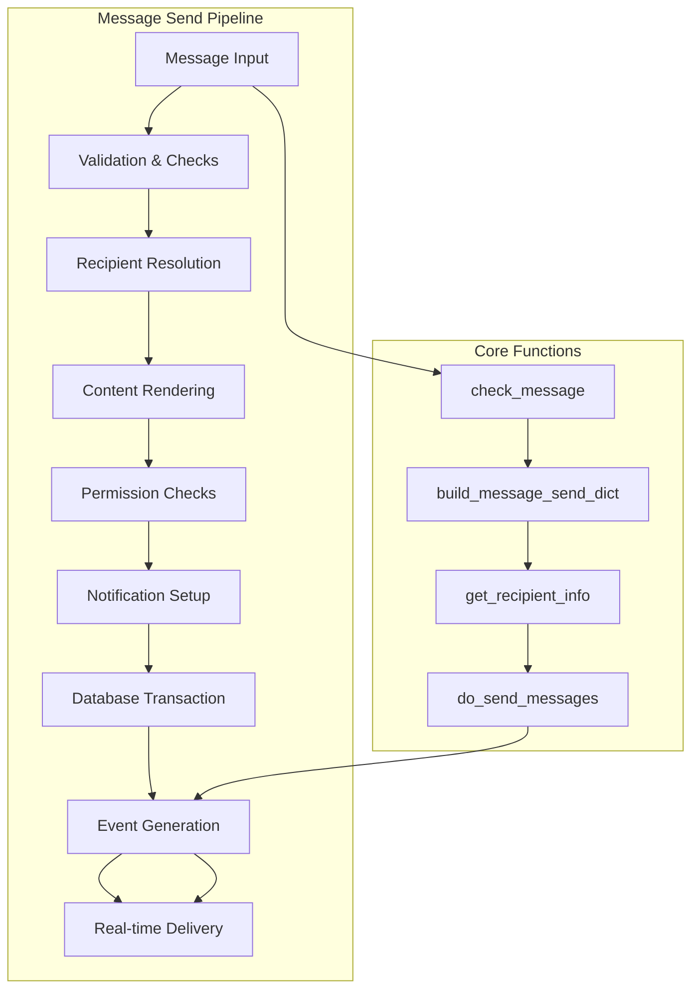
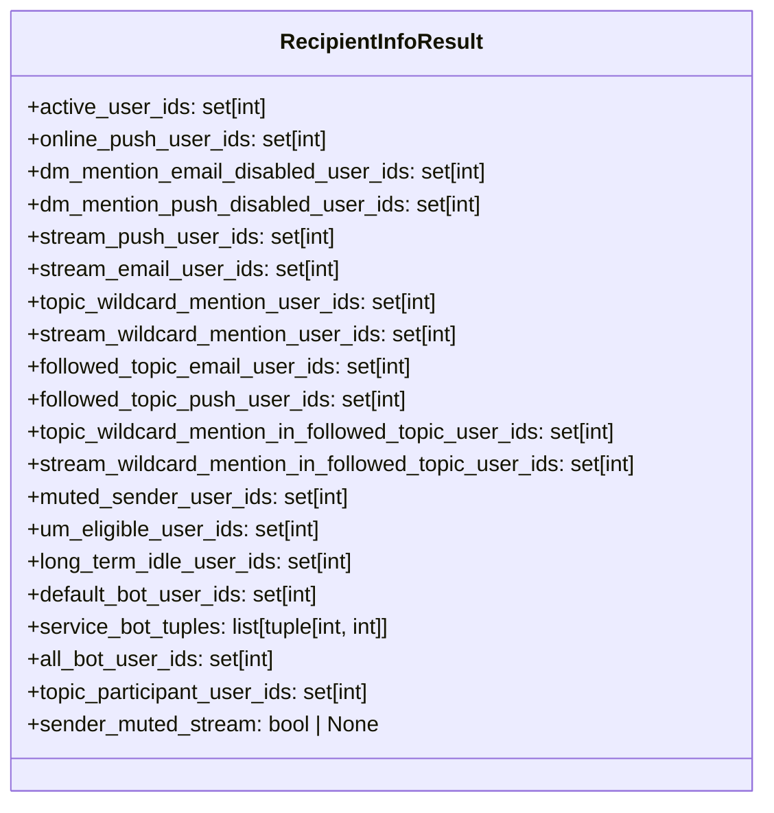
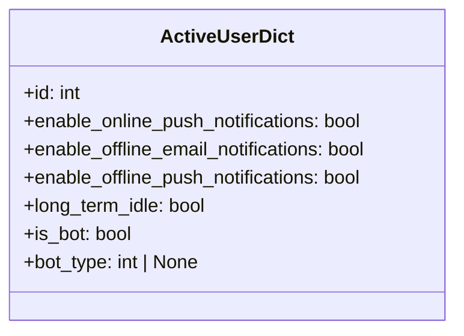
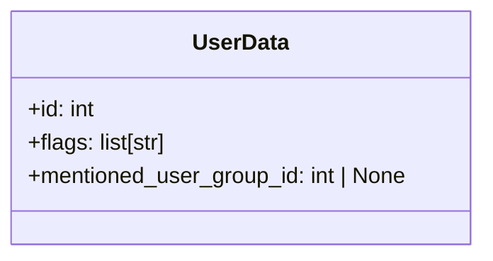
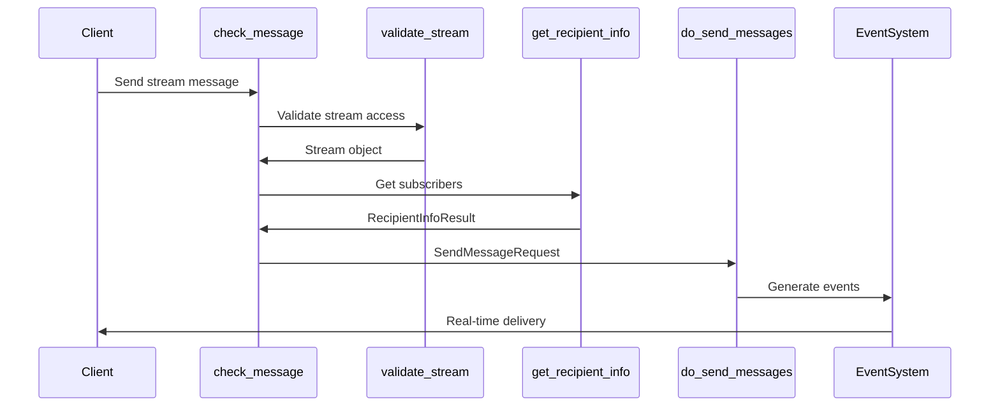
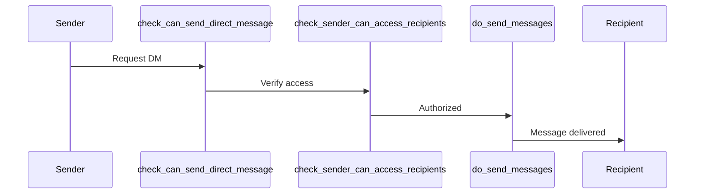
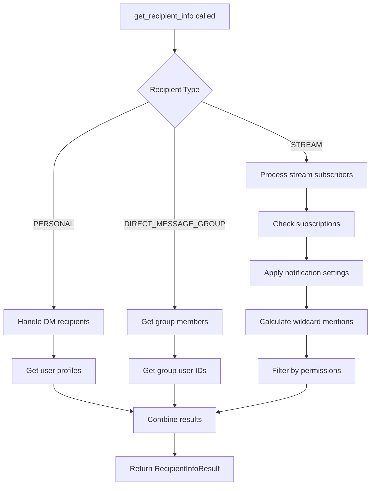
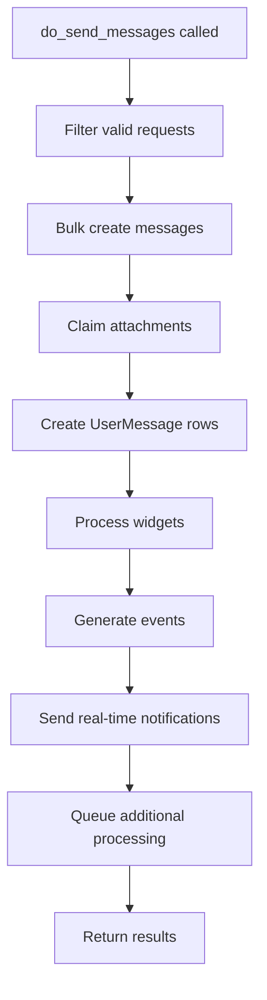
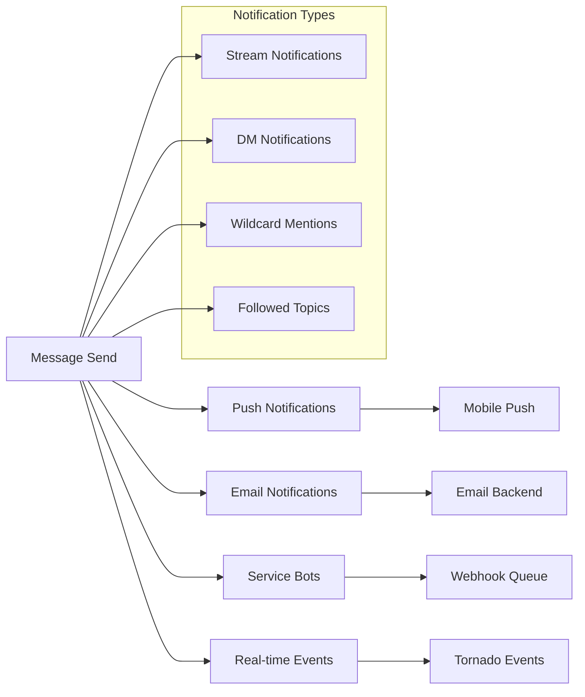
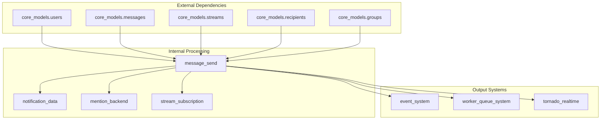

# Message Send Module Documentation

## Introduction

The `message_send` module is a core component of the Zulip messaging system responsible for handling the complete lifecycle of message sending. This module orchestrates the complex process of validating, processing, and delivering messages to recipients while managing notifications, mentions, permissions, and various message types including stream messages, direct messages, and group direct messages.

## Architecture Overview

The message sending system follows a multi-stage pipeline architecture that ensures reliable message delivery while maintaining data consistency and providing real-time notifications.

## Core Components

### RecipientInfoResult
A comprehensive data structure that encapsulates all recipient-related information for message delivery and notifications.

### ActiveUserDict
A lightweight representation of active user data for efficient processing.

### UserData
User-specific data structure for event delivery containing flags and mention information.

## Message Types and Flows

### Stream Messages
Stream messages are sent to channels/topics and involve complex subscription and permission checks.

### Direct Messages
Private messages between users with permission and access control checks.

### Group Direct Messages
Messages sent to multiple users in a private group conversation.

## Key Functions

### get_recipient_info()
The core function for determining message recipients and their notification preferences.

### do_send_messages()
The main function that handles the actual message sending process.

### check_message()
Validates and prepares messages for sending, handling all permission and content checks.

## Notification System Integration

The message send module integrates with multiple notification systems:

## Permission and Security

### Stream Access Control
- Validates user permissions for stream access
- Handles archived channel notices
- Enforces stream-specific policies (empty topic restrictions)

### Direct Message Permissions
- Checks direct message permission groups
- Validates message initiation rights
- Enforces user access restrictions

### Mention Controls
- Validates stream wildcard mention permissions
- Checks topic wildcard mention rights
- Verifies user group mention access

## Data Flow and Dependencies

## Error Handling

The module implements comprehensive error handling for various scenarios:

- **StreamDoesNotExistError**: When attempting to send to non-existent streams
- **DirectMessagePermissionError**: When users lack DM permissions
- **StreamWildcardMentionNotAllowedError**: For unauthorized wildcard mentions
- **TopicWildcardMentionNotAllowedError**: For unauthorized topic mentions
- **MessagesNotAllowedInEmptyTopicError**: When empty topic messages are restricted
- **TopicsNotAllowedError**: When topic messages are not allowed

## Performance Optimizations

### Database Efficiency
- Uses bulk operations for message creation
- Implements query optimization for large recipient sets
- Leverages caching for user data and permissions

### Soft Deactivation Handling
- Optimizes UserMessage creation for inactive users
- Lazy creation of UserMessage rows for long-term idle users
- Special handling for notification-eligible users

### Mention Processing
- Efficient wildcard mention detection
- Optimized user group mention resolution
- Smart filtering of actual vs. potential mentions

## Integration Points

### Event System
Generates events for real-time message delivery through the [event_system](event_system.md) module.

### Worker Queue System
Integrates with [worker_queue_system](worker_queue_system.md) for background processing of notifications and webhooks.

### Tornado Real-time
Sends real-time updates through the [tornado_realtime](tornado_realtime.md) system for immediate client delivery.

### Core Models
Depends on [core_models](core_models.md) for user, message, stream, and recipient data management.

## Configuration and Settings

The module respects various user and realm settings:

- Notification preferences (push, email, online)
- Stream subscription settings
- Topic visibility policies
- Bot configuration and permissions
- Realm-level message policies

## Testing and Validation

The module includes comprehensive validation:

- Input sanitization and normalization
- Permission verification at multiple levels
- Content validation (widgets, attachments)
- Recipient access validation
- Rate limiting for bot notifications

This documentation provides a complete overview of the message sending subsystem, which is fundamental to Zulip's real-time communication capabilities.