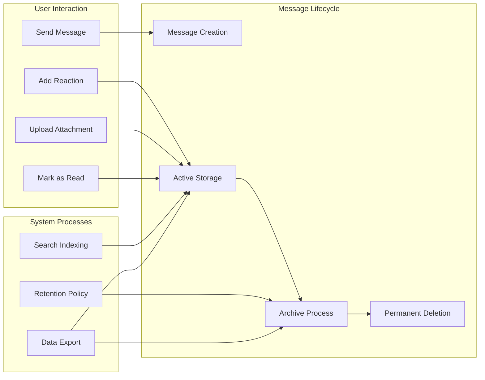
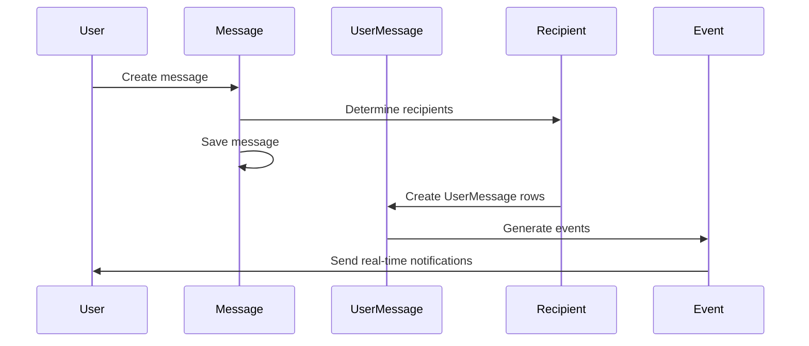
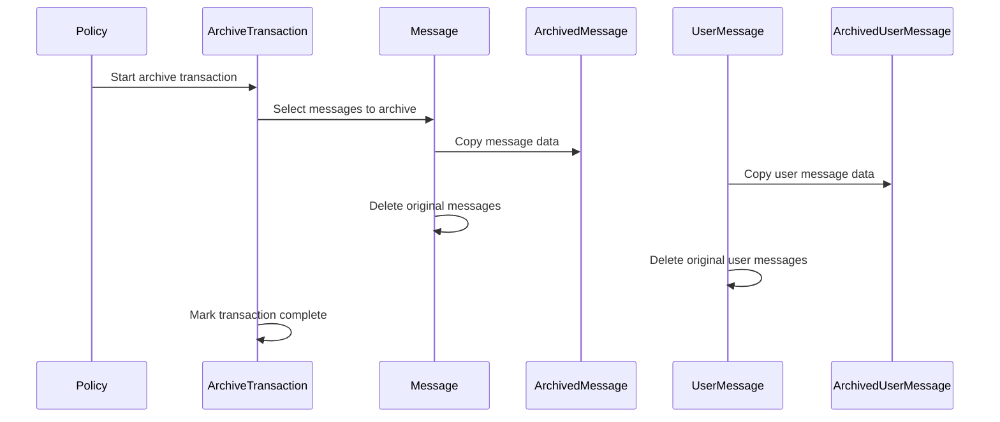

# Messages Module Documentation

## Introduction

The messages module is the core component of Zulip's messaging system, providing the fundamental data models and structures for storing, managing, and archiving messages within the platform. This module defines the primary message entities, their relationships, and the archival system that supports Zulip's robust message retention policies.

## Architecture Overview

The messages module implements a sophisticated message storage and archival system with the following key architectural components:

### Core Message Architecture

```mermaid
graph TB
    subgraph "Message Storage Layer"
        Message[Message<br/>Active Messages]
        ArchivedMessage[ArchivedMessage<br/>Archived Messages]
        ArchiveTransaction[ArchiveTransaction<br/>Archive Metadata]
    end

    subgraph "User Message Layer"
        UserMessage[UserMessage<br/>User-Message Relationships]
        ArchivedUserMessage[ArchivedUserMessage<br/>Archived User-Message]
    end

    subgraph "Message Enhancement Layer"
        SubMessage[SubMessage<br/>Message Extensions]
        ArchivedSubMessage[ArchivedSubMessage<br/>Archived Extensions]
        Reaction[Reaction<br/>Emoji Reactions]
        ArchivedReaction[ArchivedReaction<br/>Archived Reactions]
    end

    subgraph "Attachment Layer"
        Attachment[Attachment<br/>File Attachments]
        ArchivedAttachment[ArchivedAttachment<br/>Archived Attachments]
        ImageAttachment[ImageAttachment<br/>Image Metadata]
    end

    Message --> UserMessage
    Message --> SubMessage
    Message --> Reaction
    Message --> Attachment
    
    ArchivedMessage --> ArchivedUserMessage
    ArchivedMessage --> ArchivedSubMessage
    ArchivedMessage --> ArchivedReaction
    ArchivedMessage --> ArchivedAttachment
    
    ArchivedMessage -.-> ArchiveTransaction
```



### Data Flow Architecture



## Core Components

### Message Models

#### Message (Active Messages)
The primary message entity that stores all active messages in the system. Key features:

- **Content Management**: Stores both raw Markdown content and rendered HTML
- **Search Optimization**: Full-text search capabilities with PostgreSQL GIN indexes
- **Performance Indexing**: Multiple database indexes optimized for common query patterns
- **Message Types**: Supports normal messages and special notification types
- **Topic Management**: Handles both channel topics and direct message organization

**Key Fields:**
- `sender`: Foreign key to UserProfile
- `recipient`: Foreign key to Recipient (determines message visibility)
- `realm`: Organization context for multi-tenancy
- `subject`: Topic name for channel messages
- `content`/`rendered_content`: Raw and processed message content
- `date_sent`: Timestamp for message ordering
- `type`: Message type (normal, resolve topic notification)

#### ArchivedMessage
Temporary storage for deleted messages before permanent deletion. Supports Zulip's message retention policies by:

- Preserving message history during retention policy execution
- Enabling message restoration if needed
- Maintaining referential integrity with archive transactions

### User Message Management

#### UserMessage
Critical junction table that tracks which users received which messages. This is typically the largest table in Zulip installations:

**Core Functionality:**
- **Message Delivery Tracking**: Records which users received each message
- **User State Management**: Tracks read/unread status, stars, mentions, and other flags
- **Performance Optimization**: Partial indexes on flags for efficient querying
- **Notification Management**: Handles mobile push notification tracking

**Flag System:**
- `read`: Message read status
- `starred`: User-starred messages
- `mentioned`: User was mentioned in message
- `historical`: Messages added to user history post-delivery
- `is_private`: Direct message denormalization
- `active_mobile_push_notification`: Mobile notification tracking

#### Database Optimization
The module implements sophisticated indexing strategies:

```sql
-- Example indexes for common queries
CREATE INDEX zerver_usermessage_unread_message_id 
ON zerver_usermessage(user_profile, message) 
WHERE (flags & 1 = 0); -- Unread messages

CREATE INDEX zerver_usermessage_starred_message_id 
ON zerver_usermessage(user_profile, message) 
WHERE (flags & 2 <> 0); -- Starred messages
```

### Message Extensions

#### SubMessage
Supports experimental features like embedded widgets, mini-threads, and interactive content:

- Generic message extension system
- Associated with parent messages
- Supports various message types for different use cases

#### Reaction System
Comprehensive emoji reaction system supporting:

- **Unicode Emoji**: Standard emoji characters
- **Custom Emoji**: Organization-specific emoji uploads
- **Zulip Extra Emoji**: Special Zulip-specific emoji
- **Reaction Types**: Different emoji categories with proper encoding

### Attachment Management

#### Attachment
Manages file uploads with security and permission features:

- **Permission Caching**: Pre-computed visibility flags for efficient access control
- **Public/Private Distinction**: Handles both realm-public and web-public attachments
- **Usage Tracking**: Links attachments to messages and scheduled messages
- **Storage Management**: Path-based storage with metadata tracking

#### ImageAttachment
Specialized handling for image attachments with:

- Dimension tracking for display optimization
- Frame count for animated images
- Thumbnail metadata for responsive display

### Archival System

#### ArchiveTransaction
Coordinates the archival process with:

- **Transaction Metadata**: Tracks when and why archiving occurred
- **Restoration Support**: Enables message restoration from archives
- **Retention Policy Integration**: Automated archiving based on organization policies
- **Manual Archive Support**: Administrative message archiving capabilities

## Integration with Other Modules

### Realm Management ([realms.md](realms.md))
- Messages are scoped to specific realms for multi-tenancy
- Realm-specific retention policies affect message archiving
- Cross-realm bot messages are supported

### User Management ([users.md](users.md))
- User profiles are linked to messages via sender relationships
- UserMessage table tracks per-user message state
- Soft deactivation optimization for large organizations

### Recipient System ([recipients.md](recipients.md))
- Recipient objects determine message visibility
- Support for channels, direct messages, and group messages
- Recipient type affects message delivery and UserMessage creation

### Stream Management ([streams.md](streams.md))
- Channel messages are organized by topic
- Stream-based message queries are optimized with specific indexes
- Default stream groups affect message delivery

### Event System ([event_system.md](event_system.md))
- Message events trigger real-time notifications
- Reaction events update message state
- Edit and delete events maintain message consistency

## Performance Considerations

### Database Optimization
The module implements several performance optimizations:

1. **Strategic Indexing**: Multiple composite indexes for common query patterns
2. **Partial Indexes**: Indexes on specific flag combinations for efficiency
3. **Query Optimization**: Optimized queries for message retrieval and user state
4. **Archival Strategy**: Archival system prevents unbounded table growth

### Scalability Features
- **Soft Deactivation**: Reduces UserMessage rows for inactive users
- **Message Archiving**: Automated retention policies manage data growth
- **Efficient Flag System**: Bitfield-based flags for compact storage
- **Search Optimization**: Full-text search with PostgreSQL GIN indexes

## Security and Permissions

### Access Control
- **Realm Isolation**: Messages are strictly scoped to their realm
- **Recipient-Based Visibility**: Messages visible only to appropriate recipients
- **Attachment Permissions**: Cached permission flags for file access
- **UserMessage Validation**: Ensures users only access their own messages

### Data Retention
- **Configurable Retention**: Organization-specific message retention policies
- **Secure Archival**: Archived messages maintain security boundaries
- **Permanent Deletion**: Final deletion after archival period

## Usage Patterns

### Message Creation Flow


### Message Archival Flow


## API Integration

The messages module provides the foundation for Zulip's messaging APIs:

- **Message Sending**: Core message creation and delivery
- **Message Fetching**: Efficient message retrieval with proper authorization
- **Message Updates**: Edit history tracking and content updates
- **Message Deletion**: Soft deletion with archival support
- **Reaction Management**: Emoji reaction system
- **Attachment Handling**: File upload and permission management

## Future Considerations

### Planned Enhancements
- **Topic Table Migration**: Moving from subject strings to dedicated topic entities
- **Enhanced Search**: Improved full-text search capabilities
- **Message Threading**: Potential support for threaded conversations
- **Advanced Archival**: More sophisticated retention and archival policies

### Scalability Roadmap
- **Sharding Strategy**: Potential message table sharding for very large deployments
- **Cache Optimization**: Enhanced caching strategies for message data
- **Search Performance**: Continued optimization of search capabilities
- **Storage Efficiency**: Improved storage utilization for attachments and message content