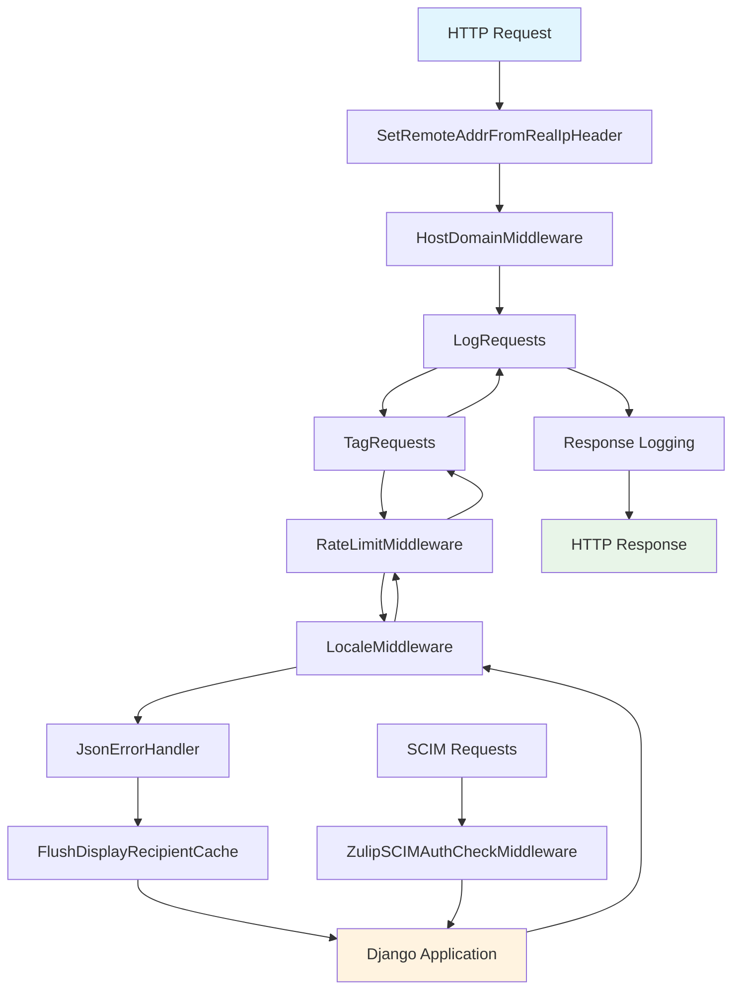
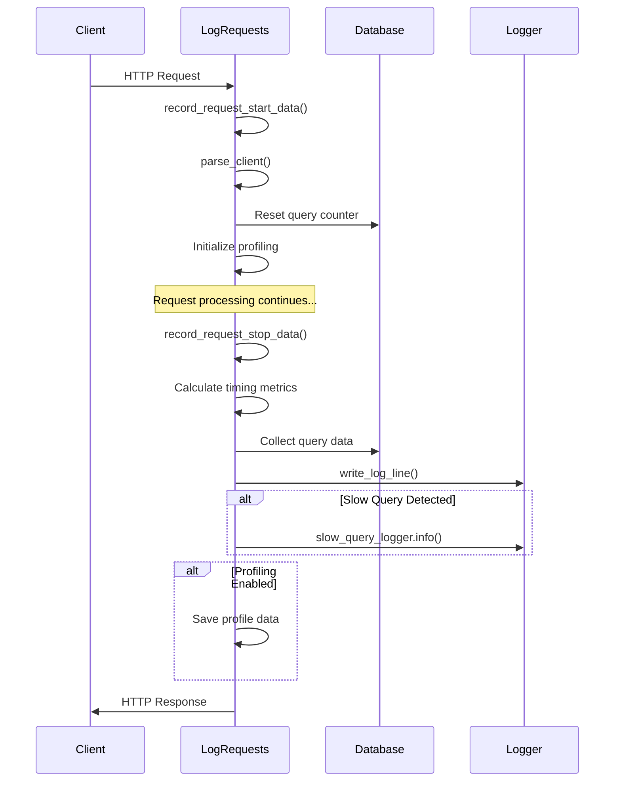
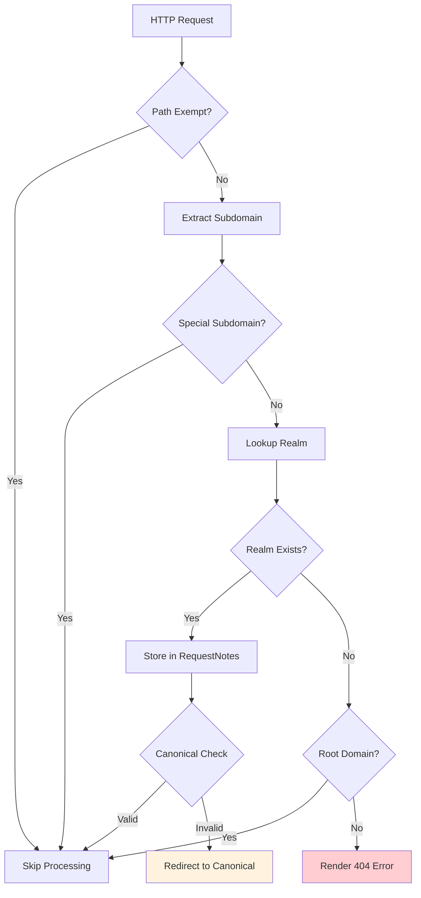
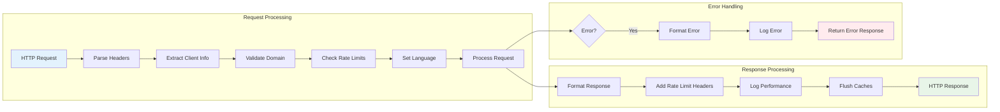
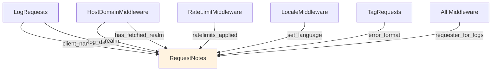

# Middleware Module Documentation

## Introduction

The middleware module in Zulip serves as the critical request/response processing layer that sits between the web server and the Django application. It provides essential cross-cutting concerns including request logging, rate limiting, internationalization, domain validation, error handling, and security features. This module ensures that every HTTP request passes through a standardized set of processing steps before reaching the application logic and that every response is properly formatted and secured before being sent back to clients.

## Architecture Overview

The middleware module implements Django's middleware framework to provide a pipeline of request/response processing components. Each middleware class handles specific aspects of request processing and can modify, log, or reject requests based on various criteria.

## Core Components

### 1. LogRequests Middleware

The `LogRequests` middleware is the primary request logging component that provides comprehensive request/response tracking and performance monitoring.

**Key Features:**
- Request timing and performance analysis
- Client identification and user agent parsing
- Database query performance tracking
- Memory cache usage monitoring
- Markdown processing time tracking
- AI service usage tracking
- Profiling data collection
- Slow query detection

**Process Flow:**

**Dependencies:**
- [core_libraries.md](core_libraries.md) - Uses `RequestNotes` for request metadata storage
- [core_models.md](core_models.md) - Accesses Realm and User models for requester identification

### 2. RateLimitMiddleware

The `RateLimitMiddleware` implements API rate limiting to prevent abuse and ensure fair resource usage across the platform.

**Key Features:**
- Dynamic rate limit header injection
- Multiple rate limit rule support
- Per-user and per-realm rate limiting
- Rate limit result aggregation

**Rate Limit Headers:**
- `X-RateLimit-Limit`: Maximum API calls allowed
- `X-RateLimit-Remaining`: Remaining API calls
- `X-RateLimit-Reset`: Reset time for rate limits

**Dependencies:**
- [core_libraries.md](core_libraries.md) - Uses rate limiting utilities and `RequestNotes`

### 3. LocaleMiddleware

The `LocaleMiddleware` extends Django's locale middleware to provide internationalization support with Zulip-specific enhancements.

**Key Features:**
- Language preference cookie management
- User language preference persistence
- Content-Language header setting
- Vary header management for caching

**Enhancements over Django's LocaleMiddleware:**
- Removes problematic 404 redirect logic
- Adds language cookie persistence
- Improved caching headers for multi-language support

### 4. HostDomainMiddleware

The `HostDomainMiddleware` validates request domains and ensures proper realm resolution for multi-tenant operation.

**Key Features:**
- Subdomain validation and realm lookup
- Realm existence verification
- Canonical domain enforcement
- Special subdomain handling (SCIM, self-hosting)
- Invalid realm error page rendering

**Process Flow:**

**Dependencies:**
- [core_models.md](core_models.md) - Uses Realm model for domain validation

### 5. JsonErrorHandler

The `JsonErrorHandler` provides consistent error handling for both API and web requests, ensuring appropriate error responses based on request type.

**Key Features:**
- Authentication error handling
- JSON vs HTML error response formatting
- CSRF failure handling
- Exception logging and reporting
- Sentry integration for error tracking

**Error Response Types:**
- API requests: JSON error responses with appropriate HTTP status codes
- Web requests: HTML error pages or redirects
- Authentication failures: Custom handling based on request type

### 6. Security Middleware Components

#### SetRemoteAddrFromRealIpHeader
Sets the client's real IP address based on the `X-Real-IP` header, ensuring accurate IP tracking behind reverse proxies.

#### DetectProxyMisconfiguration
Validates reverse proxy configuration and detects potential security issues:
- HTTP vs HTTPS enforcement
- Proxy header validation
- Trusted proxy verification
- Configuration error detection

#### CsrfFailureError & csrf_failure
Provides CSRF protection with appropriate error responses for both API and web requests.

### 7. SCIM Authentication Middleware

#### ZulipSCIMAuthCheckMiddleware
Handles authentication for SCIM (System for Cross-domain Identity Management) endpoints with bearer token validation.

**Key Features:**
- Bearer token authentication
- Per-subdomain SCIM configuration
- Request/response logging for SCIM operations
- Integration with django-scim2 library

**Dependencies:**
- [authentication_and_backends.md](authentication_and_backends.md) - Uses authentication utilities

### 8. Support Middleware

#### TagRequests
Determines error response format (JSON vs HTML) based on request path and sets appropriate flags in `RequestNotes`.

#### FlushDisplayRecipientCache
Ensures per-request caches are flushed after each request to prevent data leakage between requests.

## Data Flow Architecture

## Integration Points

### RequestNotes Integration
The middleware heavily relies on the `RequestNotes` system for storing request-specific data:

### Performance Monitoring Integration
The middleware integrates with various performance monitoring systems:

- **Sentry**: Error tracking and performance monitoring
- **Database Query Tracking**: Django database connection monitoring
- **Cache Performance**: Remote cache usage tracking
- **Markdown Processing**: Markdown rendering time monitoring
- **AI Services**: AI request processing time tracking

## Configuration and Settings

The middleware behavior is controlled through Django settings:

- `RATE_LIMITING`: Enable/disable rate limiting
- `PROFILE_ALL_REQUESTS`: Enable request profiling
- `SCIM_CONFIG`: SCIM authentication configuration
- `ALLOWED_HOSTS`: Domain validation settings
- `REALM_HOSTS`: Realm-specific host configurations

## Error Handling Strategy

The middleware implements a comprehensive error handling strategy:

1. **Early Validation**: Domain and authentication checks happen early
2. **Graceful Degradation**: Non-critical failures don't block request processing
3. **Appropriate Formatting**: Errors match the request type (JSON vs HTML)
4. **Detailed Logging**: All errors are logged with appropriate context
5. **User-Friendly Messages**: Error messages are localized and user-appropriate

## Security Considerations

The middleware provides several security layers:

- **IP Address Validation**: Real IP extraction behind proxies
- **Domain Validation**: Prevents subdomain hijacking
- **Rate Limiting**: Prevents API abuse
- **CSRF Protection**: Cross-site request forgery prevention
- **Proxy Configuration**: Detects reverse proxy misconfigurations
- **Authentication**: Multiple authentication methods for different endpoints

## Performance Optimization

The middleware includes several performance optimizations:

- **Asynchronous Request Handling**: Special handling for long-polling requests
- **Profiling Support**: Optional request profiling for performance analysis
- **Cache Management**: Per-request cache isolation
- **Query Optimization**: Database query tracking and optimization hints
- **Static Content Optimization**: Reduced logging for static assets

## Monitoring and Observability

The middleware provides extensive monitoring capabilities:

- **Request Timing**: Detailed timing for all request phases
- **Resource Usage**: Database, cache, and processing time tracking
- **Error Rates**: Comprehensive error tracking and categorization
- **Client Analytics**: Client identification and usage patterns
- **Performance Metrics**: Slow query detection and alerting

This comprehensive monitoring enables proactive performance management and quick issue resolution.